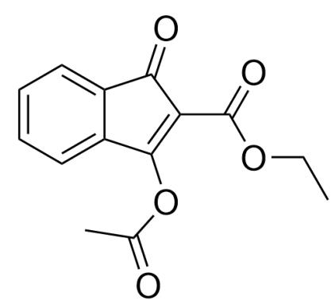
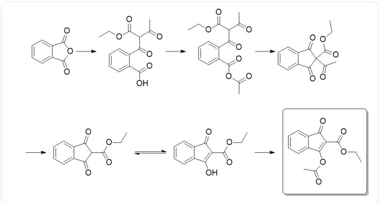

# Question

A student performed the following experiment.  $3.00\mathrm{g}$  of phthalic anhydride was taken, added to a flask, and the reaction atmosphere was replaced with nitrogen. Under positive nitrogen pressure,  $20~\mathrm{mL}$  of acetic anhydride and  $10~\mathrm{mL}$  of triethylamine mixture dried with KOH solid were added. After stirring until dissolved, ethyl acetoacetate was added. Shortly after, a pale yellow solid precipitated in the system, and the mixture was stirred at room temperature overnight. The next day, the solution was added to a mixture of  $24~\mathrm{mL}$  concentrated hydrochloric acid and  $24~\mathrm{mL}$  water, stirred at room temperature for 30 minutes, and filtered to obtain a pale yellow solid. After washing with water and air-drying,  $\mathbf{M}$  was obtained with a yield of  $63\%$ .

The NMR data of M are as follows:

${}^{1}\mathrm{H}-$  NMR  $\delta 8.19(\mathrm{dt},\mathrm{J} = 7.9,0.9\mathrm{Hz},1\mathrm{H}),8.02(\mathrm{dt},\mathrm{J} = 7.5,1.0\mathrm{Hz},1\mathrm{H}),7.80(\mathrm{td},\mathrm{J} = 7.7,1.2\mathrm{Hz},1\mathrm{H}),7.73(\mathrm{td},\mathrm{J} = 7.5,1.0\mathrm{Hz},1\mathrm{H}),4.42(\mathrm{q},\mathrm{J} = 7.1\mathrm{Hz},2\mathrm{H})$

$^{13}\mathrm{C}-$  NMR  $\delta$  195.5, 164.3, 164.2, 152.8, 136.4, 135.5, 133.0, 126.2, 126.0, 125.4, 116.4, 62.3, 31.8, 14.0

Two peaks at  $\mathrm{m/z} = 283.05789$  and 261.07593 were observed in the Orbitrap mass spectrum, corresponding to the  $\mathrm{Na^{+}}$ and  $\mathrm{H^{+}}$ adducts of  $\mathbf{M}$  in the mass spectrum, respectively.

Based on the above information, analyze the structure of  $\mathbf{M}$  and assign the chemical shifts of protons and carbon atoms to answer the following questions: If the two types of protons with chemical shifts of 2.64 and 1.38 in  $\mathbf{M}$  are connected along chemical bonds, let the number of chemical bonds passed be  $a$ ; the number of chemical bonds passed when the carbon atom with a chemical shift of 195.5 and the proton with a chemical shift of 4.42 are connected along chemical bonds is  $b$ ; if there are multiple possible connection methods, select the one with the fewest chemical bonds passed to calculate  $a$  and  $b$ ; the maximum number of heavy atoms (i.e., non-hydrogen atoms) in the same plane of each molecule is  $c$ ;

Please give the values of  $a$ ,  $b$ , and  $c$ .

A.  $a = 10, b = 5, c = 19$

B.  $a = 10, b = 8, c = 19$

C.  $a = 8, b = 5, c = 11$

D.  $a = 9, b = 8, c = 11$

E.  $a = 9, b = 8, c = 17$

F.  $a = 12, b = 5, c = 9$

G.  $a = 12, b = 6, c = 19$

H. All other options are not completely correct.

1.  $a = 8,b = 5,c = 19$

J.  $a = 7, b = 5, c = 19$

K.  $a = 7, b = 8, c = 19$

L.  $a = 7,b = 8,c = 18$  
M.  $a = 7, b = 5, c = 18$  
N.  $a = 10,b = 5,c = 18$  
0.  $a = 10,b = 8,c = 18$  
P.  $a = 10, b = 6, c = 18$  
Q.  $a = 8, b = 5, c = 18$  
R.  $a = 7, b = 5, c = 17$

# Answer

Correct Answer: A

# Detailed Explanation

Through mass spectrometry, it is known that  $\mathbf{M}$  has 14 carbons, at least 12 hydrogens, and a relative molecular mass of approximately 195; thus, it can be deduced that the chemical formula of  $\mathbf{M}$  is  $\mathrm{C_{14}H_{12}O_5}$ .

# CHECKPOINT

1 PTS

M化学式为  $\mathrm{C_{14}H_{12}O_5}$

Subsequently, the NMR spectrum was analyzed. From the coupling constant of the proton spectrum, it can be seen that the 3 hydrogens with a chemical shift of 1.38 and the 2 hydrogens with a chemical shift of 4.42 are adjacent, producing an ethyl structure;

# CHECKPOINT

1 PTS

化学位移为1.38的3个氢和4.42的两个氢相邻，产生乙基的结构

and the relatively low-field chemical shift of 4.42 indicates that the methylene group is connected to an oxygen atom.

# CHECKPOINT

1 PTS

4.42的这一较为低场的化学位移暗示该亚甲基连接了氧原子

The singlet at 2.64 should correspond to the methyl part of the acetyl group.

# CHECKPOINT

1 PTS

2.64的单峰应当对应乙酰基的甲基部分

The remaining four protons at 8.19, 8.02, 7.80, and 7.73 should correspond to the four hydrogens on the benzene ring, indicating that the benzene ring of phthalic anhydride did not participate in the reaction;

# CHECKPOINT

1 PTS

8.19、8.02、7.80、7.73的四个质子应当对应于苯环上的四个氢

# CHECKPOINT

1 PTS

邻苯二甲酸酐的苯环没有参与反应

At the same time, its splitting into four peaks (instead of two peaks) indicates that the symmetry of the benzene ring has been broken, and the originally symmetrical two carbonyl carbon atoms have become asymmetrical.

# CHECKPOINT

1 PTS

苯环的对称性被破坏了，原本对称的两个羰基碳原子变得不对称了

Observing the carbon spectrum, there are three low-field peaks at 195.5, 164.3, and 164.2, corresponding to one ketone carbonyl and two ester carbonyls, respectively.

# CHECKPOINT

1 PTS

195.5、164.3、164.2三个低场峰分别对应于一个酮羰基和两个酯羰基

Observing the substrate structure, it can be seen that only ethyl acetoacetate contains the ethyl moiety, so the ethyl ester group is likely retained in the product, and its molecular formula is  $\mathrm{C_3H_5O_2}$ ; the molecular formula of the acetyl group is  $\mathrm{C_2H_3O}$ ; the molecular formula of the 1,2-phenylene group is  $\mathrm{C_6H_4}$ ; after removing these parts,  $\mathrm{C_3O_2}$  remains in the compound, which should be connected to the benzene ring in some way, and make the four protons of the benzene ring inequivalent.

# CHECKPOINT

1 PTS

除去酯基、乙氧基和苯环部分，化合物还剩  $C_3O_2$  碎片

# CHECKPOINT

1 PTS

$\mathrm{C_3O_2}$  碎片应当以某种方式连接到苯环上，且使得苯环的四个质子不等价

Since the carbon-carbon bond between the benzene ring and the carbonyl group of the original phthalic anhydride is not easily broken under the above reaction conditions, occupying two carbon atoms, the last carbon atom must form a ring with the two original carbonyl carbon atoms.

# CHECKPOINT

1 PTS

最后一个碳原子必然与两个原先的羰基碳原子成环

Since the original two carbonyl carbons are electrophilic, the carbon atom used for this ring formation must be nucleophilic, and is very likely derived from the methylene group of ethyl acetoacetate, so this carbon atom is likely to be connected to the ethoxycarbonyl group.

# CHECKPOINT

1 PTS

由于原先的两个羰基碳都是亲电性的，因此中间这一成环所用的碳原子必然是亲核性的

# CHECKPOINT

1 PTS

该亲核性碳原子极有可能来源于乙酰乙酸乙酯的亚甲基

# CHECKPOINT

1 PTS

这个碳原子很可能和乙氧羰基连在一起

The acetyl group can then be attached to one of the oxygen atoms, so that one oxygen atom of the C3O2 fragment is a ketone carbonyl, and the other oxygen atom is an enol ester oxygen atom, making the benzene ring asymmetrical, thus inferring that the structure of  $\mathbf{M}$  is  $O = C1C(C(OCC) = O) = C(OC(C) = O)C2 = CC = CC = C21$ .

本图为\*\*M\*\*的结构式，O=C1C(C(OCC)=O)=C(OC(C)=O)C2=CC=CC=C21

# CHECKPOINT

1 PTS

乙酰基则可以结合在  $C_3O_2$  片段中一个氧原子上

# CHECKPOINT

1 PTS

$C_3O_2$  碎片的一个氧原子为酮羰基，另一个氧原子为烯醇酯的氧原子，使苯环变得不对称

# CHECKPOINT

5 PTS

M的结构为O=C1C(C(OCC)=O)=C(OC(C)=O)C2=CC=CC=C21

To judge whether this structure is reasonable, we can briefly judge from the perspective of the reaction mechanism. First, triethylamine, as a base, removes the active proton of ethyl acetoacetate, and the generated anion acts as a nucleophile to react with the electrophilic anhydride carbonyl to form the intermediate  $\mathrm{O = C(C1 = CC = CC = C1C(O) = O)C(C(C) = O)C(OCC) = O}$ ;

# CHECKPOINT

2 PTS

中间体  $\mathrm{O = C(C1 = CC = CC = C1C(O) = O)C(C(C) = O)C(OCC) = O}$

Subsequently, since acetic anhydride is the reaction medium, the carboxyl group is further activated into a new anhydride  $\mathrm{O} = \mathrm{C}(\mathrm{C}1 = \mathrm{CC} = \mathrm{CC} = \mathrm{C}1\mathrm{C}(\mathrm{OC}(\mathrm{C}) = \mathrm{O}) = \mathrm{O})\mathrm{C}(\mathrm{C}(\mathrm{C}) = \mathrm{O})\mathrm{C}(\mathrm{OCC}) = \mathrm{O}$  through anhydride exchange.

# CHECKPOINT

2 PTS

通过酸酐交换的方式进一步活化为一个新的酸酐  $\mathrm{O} = \mathrm{C}(\mathrm{C}1 = \mathrm{CC} = \mathrm{CC} = \mathrm{C}1\mathrm{C}(\mathrm{OC}(\mathrm{C}) = 0) = 0)\mathrm{C}(\mathrm{C}(\mathrm{C}) = 0)\mathrm{C}(\mathrm{OCC}) = 0$

Since the methine carbon atom after the condensation of ethyl acetoacetate still has an active proton, it is removed under the action of triethylamine, and the generated anion undergoes intramolecular cyclization again to obtain the intermediate  $\mathrm{O = C(C1 = CC = CC = C1C2 = O)C2(C(C) = O)C(OCC) = O}$  with a quaternary carbon atom.

# CHECKPOINT

1 PTS

负离子再一次进行分子内关环

# CHECKPOINT

2 PTS

中间体  $O = C(C1 = CC = CC = C1C2 = 0)C2(C(C) = O)C(OCC) = O$

This intermediate's quaternary carbon atom is connected to four carbonyl groups, and has a strong tendency to remove one carbonyl group and form a larger conjugated system.

# CHECKPOINT

1 PTS

季碳原子连接了四个羰基，有很强的脱除一个羰基并形成更大共轭体系的倾向

Therefore, a molecule of acetic acid in the system attacks the acetyl group portion of the original ethyl acetoacetate of the intermediate, removing a molecule of acetic anhydride to obtain 2-ethoxycarbonyl-1,3-indanedione  $\mathrm{O} = \mathrm{C}(\mathrm{C}1 = \mathrm{CC} = \mathrm{CC} = \mathrm{C}1\mathrm{C}2 = \mathrm{O})\mathrm{C}2\mathrm{C}(\mathrm{OCC}) = \mathrm{O}$ , which has an enol tautomer  $\mathrm{O} = \mathrm{C}1\mathrm{C}(\mathrm{C}(\mathrm{OCC}) = \mathrm{O}) = \mathrm{C}(\mathrm{O})\mathrm{C}2 = \mathrm{CC} = \mathrm{CC} = \mathrm{C}21$ .

# CHECKPOINT

1 PTS

生成2-乙氧基1,3-茚二酮O=C(C1=CC=CC=C1C2=O)C2C(OCC)=O

# CHECKPOINT

1 PTS

2-乙氧羰基1,3-茚二酮存在烯醇式的互变异构体O=C1C(C(OCC)=O)=C(O)C2=CC=CC=C21

This enol intermediate can be captured by excess acetic anhydride in the system to obtain the product  $\mathrm{O = C1C(C(OCC) = O) = C(OC(C) = O)C2 = CC = CC = C21}$ , which is  $\mathbf{M}$ . This shows that our inference is reasonable.

# CHECKPOINT

1 PTS

烯醇式中间体被体系中过量的乙酸酐捕获就能得到产物M

After deducing the target product, since the methyl group at 2.64 comes from the acetyl group, and the proton at 1.38 comes from the terminal methyl group of the ethyl group, the connection method between them is H-C-C-O-C-C-C-O-C-C-H, so  $a = 10$ .

# CHECKPOINT

2 PTS

连接方式为H-C-C-O-C-C-C-O-C-C-H，于是  $a = 10$

The carbon at 195.5 corresponds to the ketone carbonyl carbon on the five-membered ring, and the proton at 4.42 comes from the methylene portion of the ethyl group, so the connection method between them is C-C-C-O-C-H, so  $b = 5$ .

# CHECKPOINT

2 PTS

连接方式为C-C-C-O-C-H，于是  $b = 5$

Since  $\mathbf{M}$  can be regarded as an acetyl indandione derivative, the benzene ring and the  $\mathrm{C_3O_2}$  fragment should be coplanar;

# CHECKPOINT

1 PTS

苯环和  $\mathrm{C_3O_2}$  片段应当共平面

Since the oxygen atom of the alcohol part of the ester group is still conjugated with the ester carbonyl group, the alcohol part of the ester can also be conjugated with the carbonyl group. Thus, the heavy atoms of the enol ester portion can be coplanar;

# CHECKPOINT

1 PTS

烯醇酯部分的重原子可以共平面

All heavy atoms of the ethyl ester group can also be coplanar.

# CHECKPOINT

1 PTS

乙酯基团的所有重原子也可以共平面

Thus, all heavy atoms in the system can be coplanar, making  $c = 19$ . Therefore, the only correct option is A.

# CHECKPOINT

1 PTS

体系中所有重原子都可以共平面

# CHECKPOINT

1 PTS

$$
c = 1 9
$$

  
本图为本题合成\*\*M\*\*的详细机理涉及到的中间体，供审核所看，不写图片描述