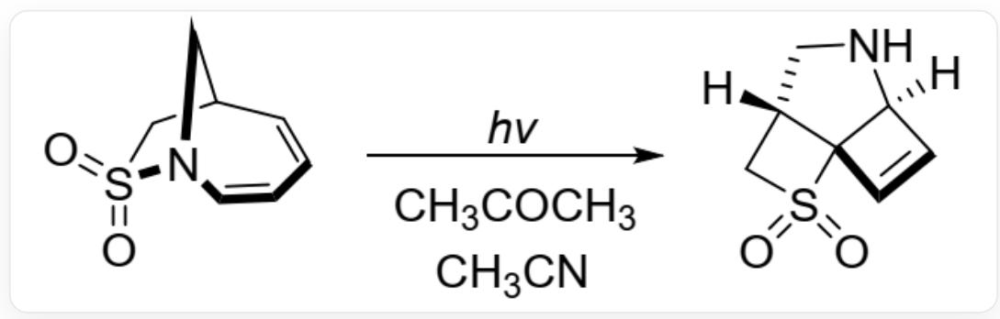
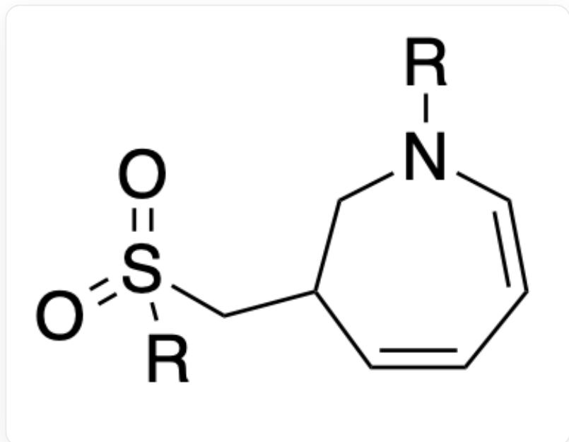
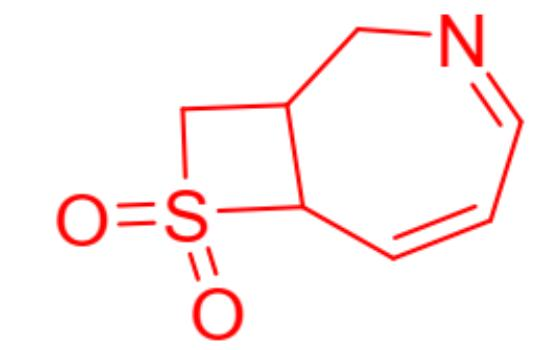
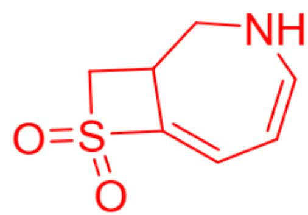

# Question

Figure 1 shows that the reaction proceeds via a free radical mechanism and undergoes an electrocyclic ring-closure process in the reaction.

Deduce the structural formulas of all key intermediates in the reaction.

  
Fig. 1, the reaction in the figure is represented by SMILES as: O=S(N1CC2C=CC=C1)(C2)=O> [CC(C)=O.CC#N]>[H][C@]34NC[C@H](CS5(=O)=O)[C@]35C=C4, where the reaction conditions also include hv, indicating ultraviolet irradiation

The following statements are made:

1. An intermediate containing a five-membered ring is generated during the reaction (intermediates do not include the reactants and products in Figure 1).  
2. An intermediate containing a four-membered ring is generated during the reaction (intermediates do not include the reactants and products in Figure 1).  
3. The reaction involves the breaking of carbon-carbon single bonds.  
4. The total number of carbon-carbon single bonds formed in the reaction is 2.

The option containing all correct statements and the most correct statements is:

A. All other options are incorrect

B. 1  
C. 2  
D. 3  
E. 4  
F. 1,2  
G. 1,3  
H. 1,4  
1. 2,3  
J. 2,4  
K. 3,4  
L. 1,2,3  
M. 1,2,4  
N. 1,3,4  
O. 2,3,4

P. 1,2,3,4

# Answer

Correct Answer: C

# Detailed Explanation

Observing the product, it can be found in the reactants. The reaction follows a free radical mechanism, and the S - N bond is most likely to break first under light irradiation, forming the intermediate shown in Figure 2 (where R represents a free radical).

  
Fig. 2, the molecule is represented by SMILES as: O=S(CC1CN([R])C=CC=C1)([R])=O, where R represents a free radical

# CHECKPOINT

1 PTS

S - N bond cleavage occurs under light irradiation, forming an intermediate represented by SMILES as: O=S(CC1CN([R])C=CC=C1)([R])=O, where R represents a free radical

Since the free radical on the seven-membered ring is conjugated with two double bonds, the free radical can re-couple with the sulfur free radical at the other end to form a four-membered ring. The structure of this intermediate is shown in Figure 3. Statement 2 is correct.

  
Fig. 3, the molecule is represented by SMILES as: C1=CC2C(CN=C1)CS2(=O)=O

# CHECKPOINT

1 PTS

The free radical is coupled to the sulfur atom at the other end through conjugation, forming an intermediate represented by SMILES as: C1=CC2C(CN=C1)CS2(=O)=O

This intermediate undergoes a one-step hydrogen migration to obtain the intermediate in Figure 4.

  
Fig. 4, the molecule is represented by SMILES as: O=S1(CC2CNC=CC=C12)=O

# CHECKPOINT

1 PTS

This intermediate undergoes a one-step hydrogen migration to obtain an intermediate, represented by SMILES as:  $\mathrm{O = S1(CC2CNC = CC = C12) = O}$

The two conjugated double bonds of this intermediate are excited under ultraviolet irradiation, and a symmetry-allowed four-membered ring electrocyclic reaction occurs, yielding the product.

# CHECKPOINT

1 PTS

Electrocyclization forms a four-membered ring

Based on the above reaction process, it can be judged that statements 1 and 3 are incorrect. Only a carbon-carbon single bond is formed in the electrocyclic reaction, so statement 4 is incorrect.