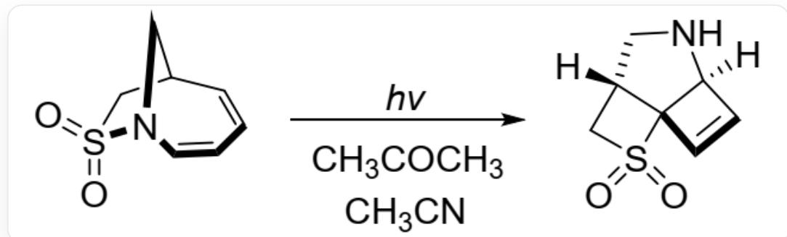
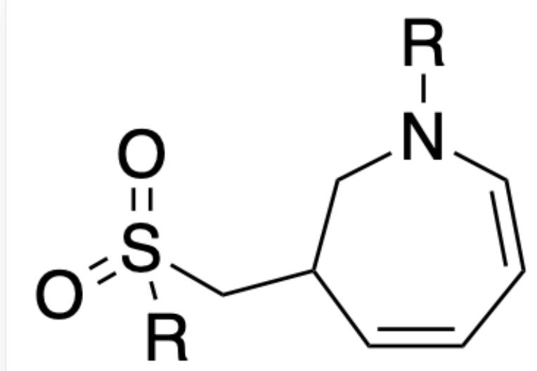
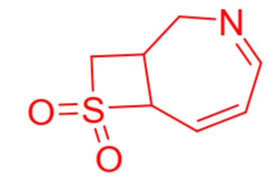
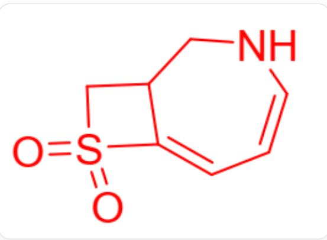

# 题目

图1反应通过自由基机理进行，并且反应过程中经历了一步电环化过程。

推断该反应所有关键中间体的结构简式。

  
Fig. 1, 图中反应以SMILES表示为:  $O = S(N1CC2C = CC = C1)(C2) = O > [CC(C) = O.$  CC#N]  $\left\lbrack  {H}\right\rbrack$  [C@]34NC[C@H](CS5(=O)=O)[C@]35C=C4, 其中反应条件还有hv, 表示紫外光照

# 有以下说法：

1. 反应过程中产生了包含五元环的中间体(中间体不包括图1中的反应物与产物)  
2. 反应过程中产生了包含四元环的中间体(中间体不包括图1中的反应物与产物)  
3. 反应过程涉及了碳碳单键的断裂  
4. 反应中总共形成的碳碳单键数量为2

选项中说法全部正确且有最多正确说法的选项为：

A. 其他选项均不正确  
B. 1  
C. 2

D. 3  
E. 4  
F. 1,2  
G. 1,3  
H. 1,4  
1. 2,3  
J. 2,4  
K. 3,4  
L. 1,2,3  
M. 1,2,4  
N. 1,3,4  
O. 2,3,4  
P. 1,2,3,4

# 答案

正确答案: C

# 详细解析

观察产物，可以发现反应物中的。反应为自由基机理，光照下最可能先发生S-N键断裂，形成图2中间体（其中R表示自由基）。

  
Fig. 2, 该分子以SMILES表示为:  $O = S(CC1CN([R])C = CC = C1)([R]) = O$ , 其中  $R$  表示自由基

# CHECKPOINT

1 PTS

光照下发生S-N键断裂，形成中间体以SMILES表示为：  $\mathrm{O = S(CC1CN([R])C = CC = C1)([R]) = O}$ ，其中R表示自由基

由于七元环上的自由基与两个双键共轭，因此该自由基可以与硫自由基在另一端重新偶联，形成一个四元环，该中间体结构如图3。说法2正确。

  
Fig. 3, 该分子以SMILES表示为: C1=CC2C(CN=C1)CS2(=O)=O

# CHECKPOINT

1 PTS

自由基通过共轭在另一端与硫原子偶联，形成中间体以SMILES表示为：C1=CC2C(CN=C1)CS2(=O)=O

该中间体经一步氢迁移得到图4中间体。

  
Fig. 4, 该分子以SMILES表示为:  $O = S1(CC2CNC = CC = C12) = O$

# CHECKPOINT

1 PTS

该中间体经一步氢迁移得到中间体，以SMILES表示为：O=S1(CC2CNC=CC=C12)=O

该中间体两个共轭双键在紫外照射下激发，发生符合对称性的四元环电环化，得到产物。

# CHECKPOINT

1 PTS

电环化形成四元环

根据以上反应过程可以判断，说法1,3错误。反应中仅在电环化反应形成碳碳单键，说法4错误。