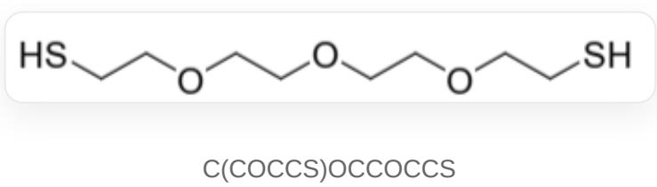

# Question

Hydrogels are polymeric materials formed by cross-linking water-soluble or hydrophilic polymers, exhibiting water absorption and retention capabilities, and are widely used in daily life. Polyacrylic acid (pAAc) and polyacrylamide (pAAm) are both important hydrogel-forming materials. Experiments on these two types of hydrogels revealed the following phenomena:

1: When a pAAc-based hydrogel is immersed in solutions of varying pH, its volume changes.  
2: When the surfaces of two pAAm-based hydrogels are brought into contact and immersed in a mixed aqueous solution of acrylamide and ammonium persulfate, the two hydrogels adhere to each other upon heating.  
3: When two pAAm-based hydrogels are immersed in an aqueous solution of compound A for a period, then treated with an aqueous solution of compound B, and their surfaces are brought into contact for some time, the two hydrogels also adhere to each other. However, if they are subsequently immersed in an aqueous solution of compound C, the hydrogels separate again. The structure of A is shown below.

The following discussions are provided regarding the above phenomena:

a: For phenomenon 1, when immersed in an alkaline solution, the gel volume shrinks.  
b: For phenomenon 2, the adhesion of the two hydrogels is due to the formation of covalent bonds between the pAAm of the two hydrogels and acrylamide via a free radical mechanism under the action of ammonium persulfate, thereby cross-linking the two hydrogels.  
c: For phenomenon 2, if tetramethylethylenediamine is added instead of heating, the adhesion of the two hydrogels can also be observed.

d: For phenomenon 2, if sodium borohydride is added instead of heating, the adhesion of the two hydrogels can also be observed.  
e: For phenomenon 3, if the hydrogel type is changed to pAAc, the hydrogels cannot adhere to each other in principle.  
f: For phenomenon 3, to achieve sequential adhesion and separation of the hydrogels, substances B and C can be sodium hydroxide and acetic acid, respectively.

Among the above discussions a-f, how many are correct?

A. 0  
B. 1  
C. 2  
D. 3  
E. 4  
F. 5  
G. 6

# Answer

Correct Answer: B

# Detailed Explanation

The increase in hydrogel volume is due to its absorption of more water. Under alkaline conditions, the carboxyl groups of pAAc hydrogel are converted into carboxylate anions, which have stronger solvation capacity. The resulting hydrogel can absorb more water, leading to an increase in volume, thus a is incorrect.

# CHECKPOINT

1 PTS

Carboxylate anions have stronger solvation capacity

# CHECKPOINT

0.5 PTS

The resulting hydrogel can absorb more water and increase in volume, thus a is incorrect

Acrylamide and ammonium persulfate can polymerize via a free radical mechanism to form polyacrylamide chains. However, pAAm gels lack groups with strong reactivity toward free radicals and do not form covalent bonds with newly formed polyacrylamide chains. Even if a small number of covalent connections could form, according to the free radical polymerization mechanism, one polyacrylamide chain would only connect to one pAAm gel and could not cross-link two gels. Therefore,  $\mathbf{b}$  is incorrect.

In fact, the water absorption of hydrogels reflects the presence of numerous voids in their network structure. Acrylamide can diffuse into these voids and participate in polymerization. The resulting polyacrylamide will intertwine within the three-dimensional skeletons of the two hydrogels, mechanically adhering them together.

# CHECKPOINT

0.5 PTS

Acrylamide and ammonium persulfate can polymerize via a free radical mechanism

# CHECKPOINT

0.5 PTS

pAAm gels lack groups with strong reactivity toward free radicals, thus  $\mathbf{b}$  is incorrect

# CHECKPOINT

2 PTS

In reality, the adhesion mechanism involves polyacrylamide intertwining within the three-dimensional skeletons of the two hydrogels

Other methods can replace heating to generate free radicals from ammonium persulfate. For example, tetramethylethylenediamine (TEMED) can be oxidized by ammonium persulfate to produce relatively stable  $\alpha$ -aminoalkyl radicals, which can initiate acrylamide polymerization more rapidly, thus c is correct. However, the oxidation of sodium borohydride by ammonium persulfate cannot produce stable free radicals to initiate polymerization, so d is incorrect.

# CHECKPOINT

1 PTS

Tetramethylethylenediamine can be oxidized by ammonium persulfate to produce stable free radicals, thus c is correct

# CHECKPOINT

1 PTS

Sodium borohydride cannot be oxidized by ammonium persulfate to produce stable free radicals, thus  $\mathbf{d}$  is incorrect

Substance A adheres two hydrogels in a manner similar to acrylamide-ammonium persulfate, both by forming linear polymers that intertwine within the three-dimensional skeletons of the two hydrogels, causing them to adhere. However, here the polymerization of A is achieved through oxidation to form disulfide bonds. Replacing the hydrogel with pAAc would not prevent A from entering the voids in the skeletons, so it would not prevent the two hydrogels from adhering, thus e is incorrect.

# CHECKPOINT

1 PTS

A polymerizes through oxidation to form disulfide bonds

# CHECKPOINT

1 PTS

The polymerized A similarly intertwines within the three-dimensional skeletons of the two hydrogels, and pAAc cannot prevent this process, thus e is incorrect

A requires oxidant B (e.g., hydrogen peroxide) to polymerize and adhere the hydrogels, while reductant C (e.g., sodium borohydride) can break disulfide bonds and separate the hydrogels. Sodium hydroxide and acetic acid cannot act as oxidants or reductants to react with A, thus f is incorrect.

# CHECKPOINT

1 PTS

Sodium hydroxide and acetic acid cannot act as oxidants or reductants to react with A, thus f is incorrect

In summary, among the six statements  $\mathbf{a} - \mathbf{f}$ , only  $\mathbf{c}$  is correct, and option B should be selected.