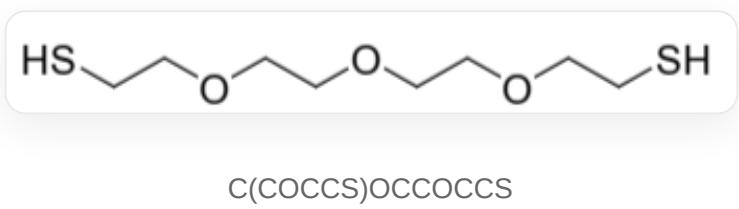

# 题目

水凝胶是具有水溶性或亲水性的高分子通过一定交联形成的具有吸水保水功能的高分子材料，在日常生活中有广泛应用。聚丙烯酸(pAAc)与聚丙烯酰胺(pAAm)都是重要的水凝胶构成材料。对这两类水凝胶的实验发现了下面的现象：

1: 将以pAAc为主体的水凝胶浸入不同pH的溶液时, 其会发生体积的改变。  
2: 将两块以pAAm为主体的水凝胶的表面互相接触, 浸入丙烯酰胺与过二硫酸铵的混合水溶液中, 在加热下, 两块水凝胶会粘连在一起。  
3：将两块以pAAm为主体的水凝胶浸入化合物A的水溶液一段时间，随后用化合物B的水溶液处理，并使两块水凝胶表面互相接触一段时间，两块水凝胶也会互相粘连。但若将其再浸入化合物C的水溶液，又会发现水凝胶分离开来。其中A的结构见下图。

针对上述现象给出了以下讨论：

a: 对于现象1，在浸入碱性溶液时，凝胶体积会缩小。  
b: 对于现象2, 两块水凝胶粘连的原因为, 在过二硫酸铵作用下, 丙烯酰胺通过自由基机理与构成两块水凝胶的pAAm间形成了共价键, 将两块水凝胶交联在了一起。  
c：对于现象2，如果用加入四甲基乙二胺替代加热，也可以观察到两块水凝胶的粘连。  
d: 对于现象2, 如果用加入硼氢化钠替代加热, 也可以观察到两块水凝胶的粘连。  
e: 对于现象3, 如果更换水凝胶种类为pAAc, 则原理上水凝胶无法相互粘连。  
f: 对于现象3, 为使水凝胶先后发生粘连与分离, 物质B与C分别可以为氢氧化钠与醋酸。

上述讨论a-f中，正确的有几条？

A. 0  
B. 1  
C. 2  
D. 3  
E. 4  
F. 5  
G. 6

# 答案

正确答案: B

# 详细解析

水凝胶体积的增大是因为其吸收了更多水。在碱性下pAAc水凝胶的羧基转化为羧基负离子，其溶剂化能力更强，形成的水凝胶可以吸收更多水分而体积增大，因此a错误。

# CHECKPOINT

1 PTS

羧基负离子的溶剂化能力更强

# CHECKPOINT

0.5 PTS

形成的水凝胶可以吸收更多水分而体积增大, 因此a错误

丙烯酰胺与过二硫酸铵可以通过自由基机理发生聚合，形成聚丙烯酰胺链。而pAAm凝胶中缺少与自由基反应能力强的基团，并不会与新形成的聚丙烯酰胺链间形成共价键。即使能够形成少量共价连接，根据自由基聚合机理，一条聚丙烯酰胺链也只会与一个pAAm凝胶相互连接，而无法把两块凝胶交联起来。因此b错误。

事实上，水凝胶的吸水性体现了其网状结构中有很多空隙，丙烯酰胺可以扩散到这些空隙中并参与聚合，最终形成的聚丙烯酰胺会穿插在两块水凝胶的三维骨架间，从而通过机械力将两块水凝胶粘连。

# CHECKPOINT

0.5 PTS

丙烯酰胺与过二硫酸铵可以通过自由基机理发生聚合

# CHECKPOINT

0.5 PTS

pAAm凝胶中缺少与自由基反应能力强的基团，因此b错误

# CHECKPOINT

2 PTS

实际上，粘连原理为聚丙烯酰胺穿插在两块水凝胶的三维骨架间

可以用其他方法替代加热使得过二硫酸铵产生自由基。如四甲基乙二胺(TEMED)可被过二硫酸铵氧化产生较稳定的α-氨基烷基自由基，其可更快启动丙烯酰胺的聚合，因此c正确。而过二硫酸铵氧化硼氢化钠无法产生稳定自由基以启动聚合反应，因此d错误。

# CHECKPOINT

1 PTS

四甲基乙二胺可被过二硫酸铵氧化并产生稳定自由基，因此c正确

# CHECKPOINT

1 PTS

硼氢化钠无法被过二硫酸铵氧化并产生稳定自由基，因此d错误

物质A将两块水凝胶粘连的方式与丙烯酰胺-过二硫酸铵相似，都是通过形成链状聚合物穿插在两块水凝胶的三维骨架间，使其相互粘连。只不过这里是通过氧化形成二硫键实现A的聚合。将水凝胶换做pAAc不会阻止A进入骨架空隙中，因此并不会使两块水凝胶无法粘连，因此e错误。

# CHECKPOINT

1 PTS

A被氧化形成二硫键而发生聚合

# CHECKPOINT

1 PTS

聚合后的A同样会穿插在两块水凝胶的三维骨架间，pAAc无法阻止该过程，因此e错误

A需要氧化剂B（如过氧化氢）实现聚合与粘连水凝胶，而还原剂C（如硼氢化钠）可以破坏二硫键，并使水凝胶分开。氢氧化钠与醋酸无法作为氧化剂与还原剂和A反应，因此f错误。

# CHECKPOINT

1 PTS

氢氧化钠与醋酸无法作为氧化剂与还原剂和A反应，因此f错误

综上，a-f六条说明中只有c正确，应选择B选项。