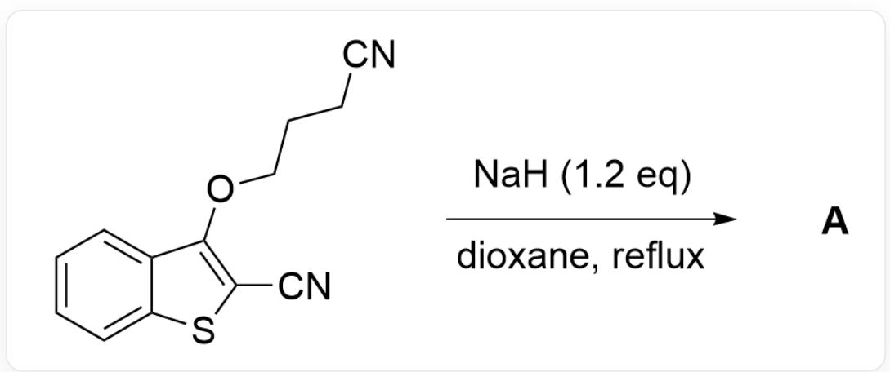
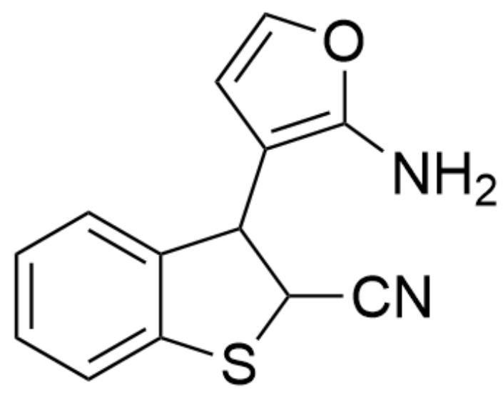
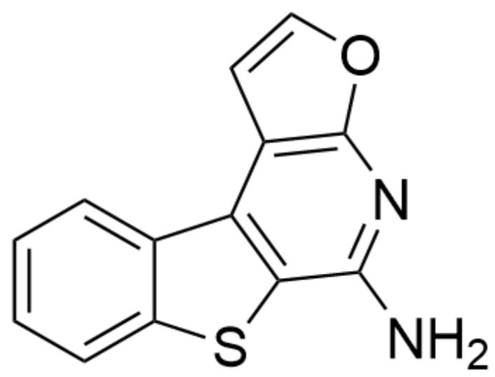
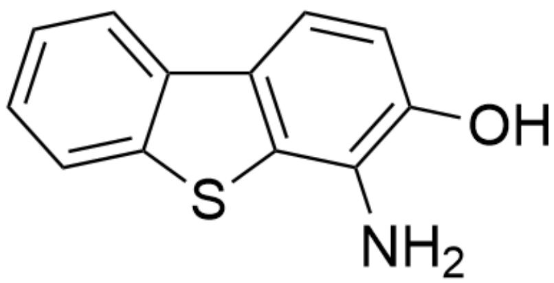
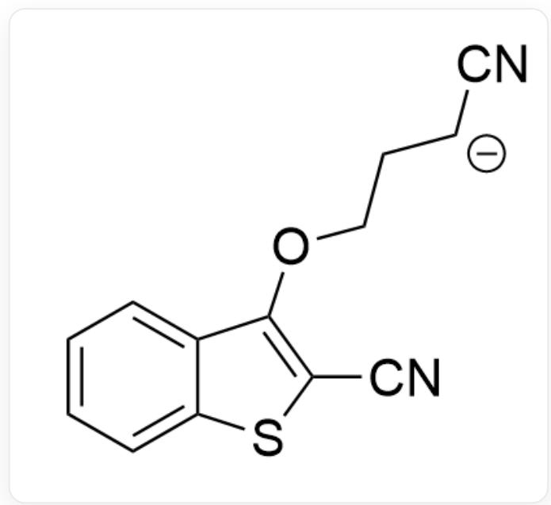
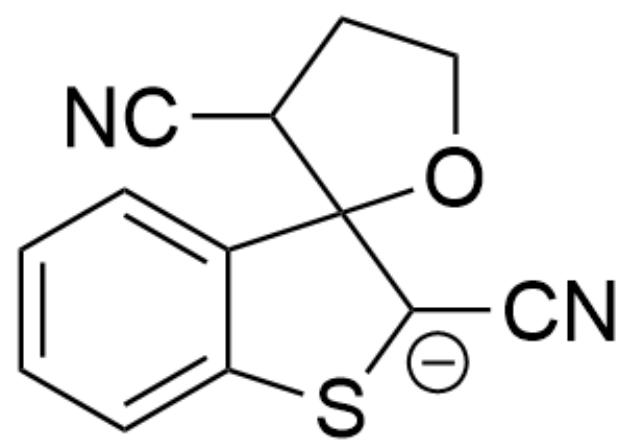
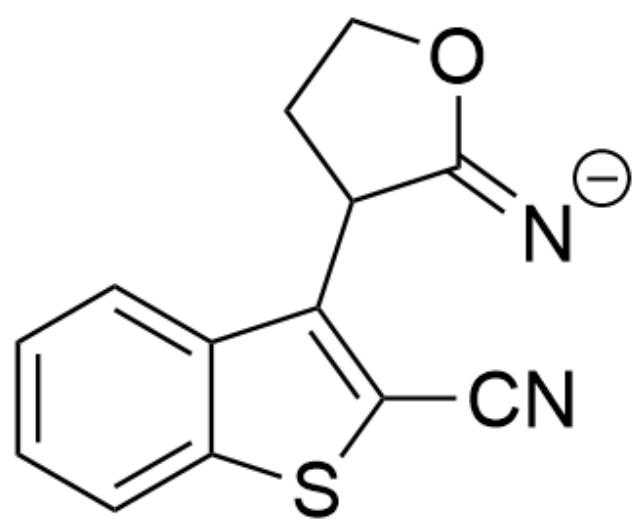
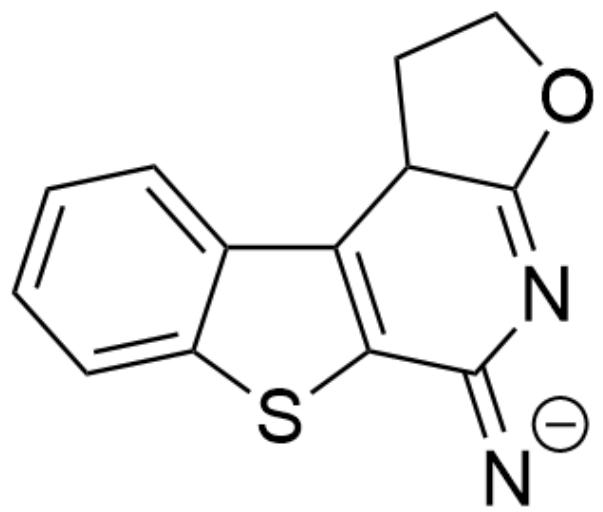
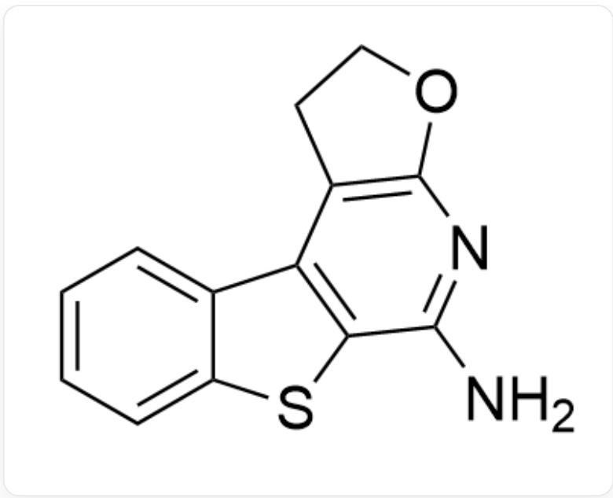

# Question

N#CC1=C(OCCCC#N)C2=CC=CC=C2S1>NaH(1.2equiv),dioxane,reflux>[A],A is the reaction product

Given that a new aromatic ring is formed in the reaction product  $\mathbf{A}$ , provide the structural formula of  $\mathbf{A}$ .

A. All other options are incorrect  
B.

N#CC1SC2=CC=CC=C2C13OCCC3C#N

C.

NC1=C(C2C(C#N)SC3=CC=CC=C32)C=CO1

D.

NC1=NC(OC=C2)=C2C3=C1SC4=CC=CC=C43

E.

NC1=C2SC3=CC=CC=C3C2=C(C#N)CC01

F.

NC1=C2SC3=CC=CC=C3C2=CC=CO1

G.

OC(C=C1)=C(N)C2=C1C3=CC=CC=C3S2

H.

NC1=NC(OCC2)=C2C3=C1SC4=CC=CC=C43

# Answer

Correct Answer: H

# Detailed Explanation

Based on the prompt, a new aromatic ring is formed in the reaction product A, excluding options B, E, and F.

First, the substrate is deprotonated by NaH at the position adjacent to the cyano group, yielding intermediate 1.

  
Intermediate 1: N#CC1=C(OCC[CH-]C#N)C2=CC=CC=C2S1

CHECKPOINT

1 PTS

Intermediate 1: N#CC1=C(OCC[CH-]C#N)C2=CC=CC=C2S1

Then, the formed carbanion undergoes Michael addition to the  $\alpha -\beta$  unsaturated system to obtain intermediate 2.

Intermediate 2: N#C[C-]1SC2=CC=CC=C2C13OCCC3C#N

CHECKPOINT

1 PTS

Intermediate 2: N#C[C-]1SC2=CC=CC=C2C13OCCC3C#N

Then, rearomatization occurs, and the oxyanion departs, yielding intermediate 3.

Intermediate 3: [O-]CCC(C1=C(C#N)SC2=CC=CC=C21)C#N

# CHECKPOINT

1 PTS

Intermediate 3: [O-]CCC(C1=C(C#N)SC2=CC=CC=C21)C#N

The oxyanion attacks the cyano group to form a ring, yielding intermediate 4.

Intermediate 4: [N-]=C1C(C2=C(C#N)SC3=CC=CC=C32)CC01

# CHECKPOINT

1 PTS

Intermediate 4: [N-]=-C1C(C2=C(C#N)SC3=CC=CC=C32)CC01

The imine anion further attacks the cyano group to form a ring, yielding intermediate 5.

Intermediate 5: [N-] = C1C2 = C(C3CCOC3 = N1) C4 = CC = CC = C4S2

# CHECKPOINT

1 PTS

Intermediate 5: [N-]=-C1C2=C(C3CCOC3=N1)C4=CC=CC=C4S2

Since the imine is unstable, and according to the prompt, a new aromatic ring is formed in the reaction product A, intermediate 5 further aromatizes to obtain product A.

Product A: NC1=NC(OCC2)=C2C3=C1SC4=CC=CC=C43