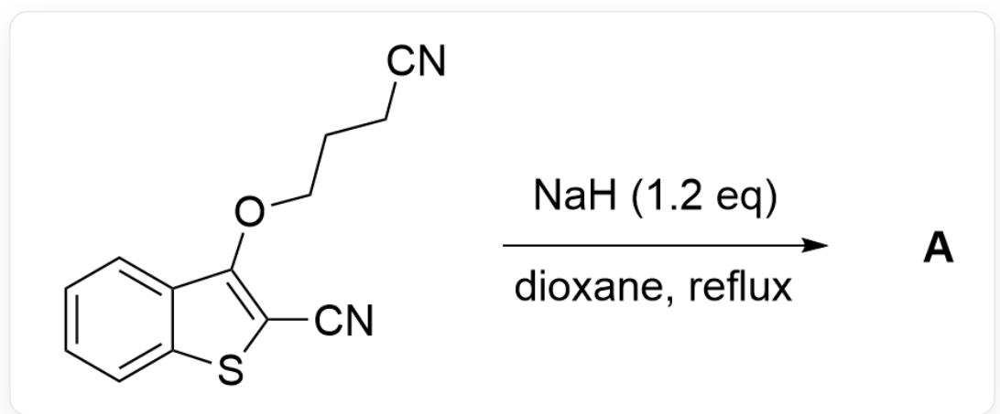
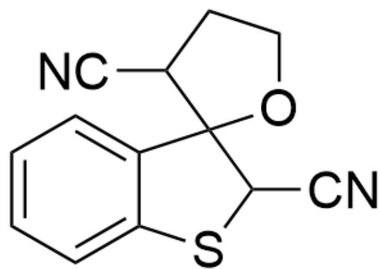
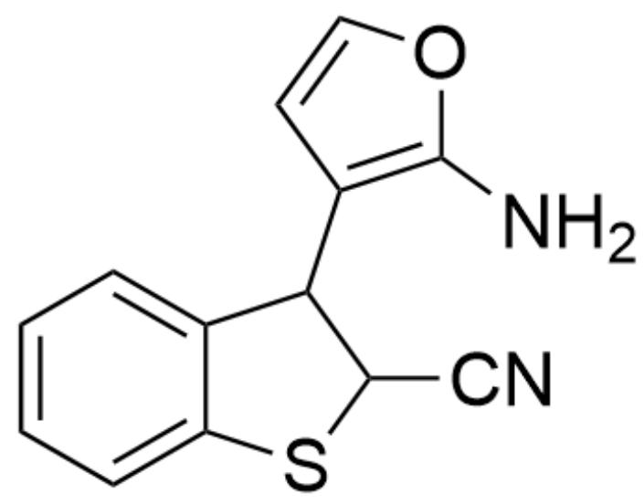
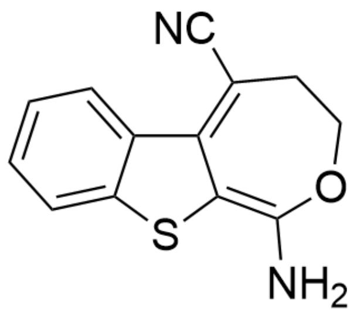
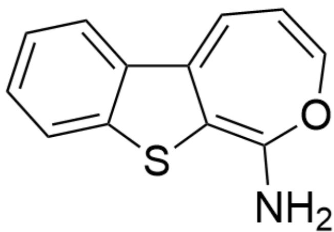
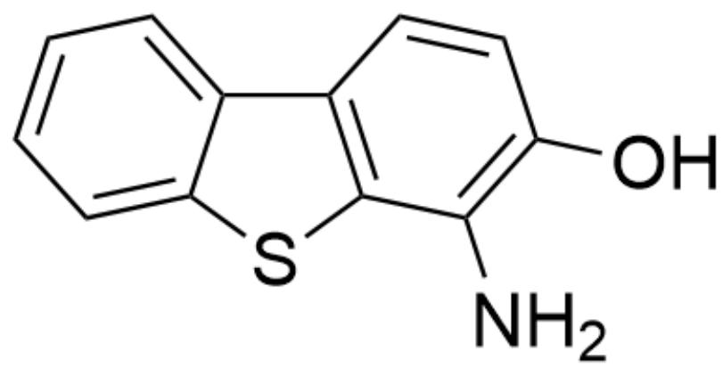
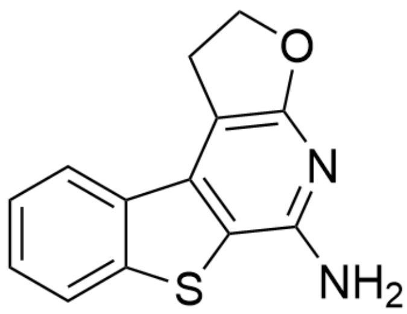
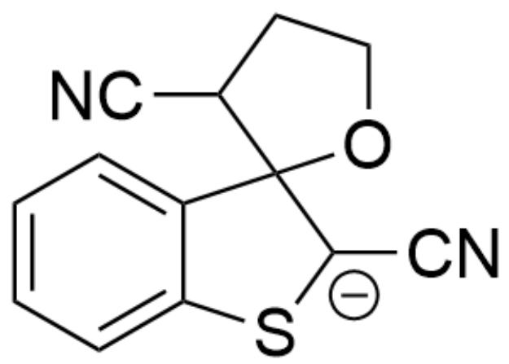
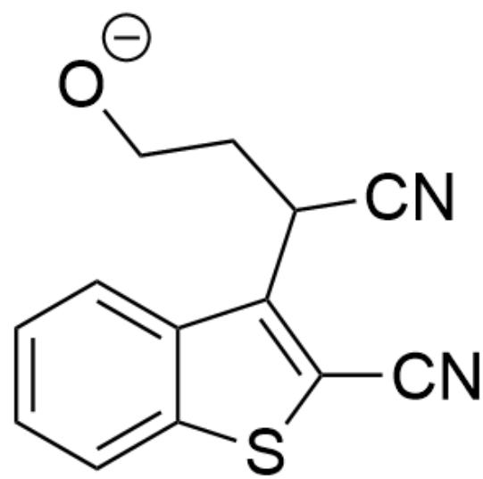
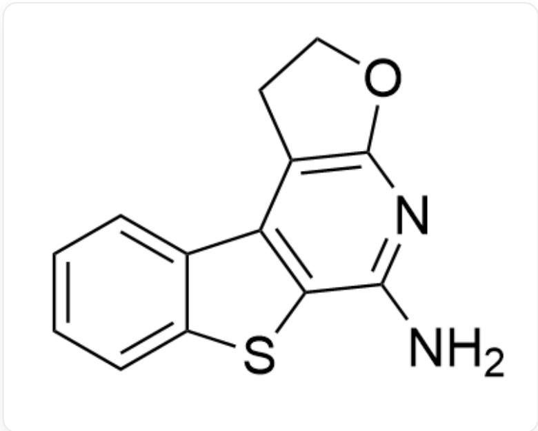

# 题目

N#CC1=C(OCCCC#N)C2=CC=CC=C2S1>NaH(1.2equiv),dioxane,reflux>[A],A是反应产物

已知反应产物A中形成了新的芳香环，试给出A的结构式

A. 其他选项均不正确  
B.

N#CC1SC2=CC=CC=C2C13OCCC3C#N

C.

NC1=C(C2C(C#N)SC3=CC=CC=C32)C=CO1

D.

NC1=NC(OC=C2)=C2C3=C1SC4=CC=CC=C43

E.

NC1=C2SC3=CC=CC=C3C2=C(C#N)CC01

F.

NC1=C2SC3=CC=CC=C3C2=CC=CO1

G.

OC(C=C1)=C(N)C2=C1C3=CC=CC=C3S2

H.

NC1=NC(OCC2)=C2C3=C1SC4=CC=CC=C43

# 答案

正确答案: H

# 详细解析

根据提示，反应产物A中形成了新的芳香环，排除选项B、E、F。

首先，底物被  $\mathrm{NaH}$  夺去氰基邻位的质子得到中间体1

  
中间体1：N#CC1=C(OCC[CH-]C#N)C2=CC=CC=C2S1

CHECKPOINT

1 PTS

中间体1：N#CC1=C(OCC[CH-]C#N)C2=CC=CC=C2S1

接着形成的碳负离子对  $\alpha -\beta$  不饱和体系进行micheal加成得到中间体2

中间体2：N#C[C-]1SC2=CC=CC=C2C13OCCC3C#N

CHECKPOINT

1 PTS

中间体2：N#C[C-]1SC2=CC=CC=C2C13OCCC3C#N

接着重新芳构化，氧负离子离去，得到中间体3

  
中间体3：[O-]CCC(C1=C(C#N)SC2=CC=CC=C21)C#N

# CHECKPOINT

1 PTS

中间体3：[O-]CCC(C1=C(C#N)SC2=CC=CC=C21)C#N

氧负离子进攻氰基成环，得到中间体4

中间体4：[N-] = C1C(C2 = C(C#N)SC3 = CC = CC = C32)CC01

# CHECKPOINT

1 PTS

中间体4：[N-]=C1C(C2=C(C#N)SC3=CC=CC=C32)CC01

亚胺负离子进一步进攻氰基成环，得到中间体5

中间体5：[N-] = C1C2 = C(C3CCOC3 = N1) C4 = CC = CC = C4S2

# CHECKPOINT

1 PTS

中间体5：[N-]=C1C2=C(C3CCOC3=N1)C4=CC=CC=C4S2

由于亚胺不稳定, 且根据题干提示反应产物  $\mathrm{A}$  中形成了新的芳香环, 因此中间体 5 进一步芳构化得到产物  $\mathrm{A}$

  
产物A：NC1=NC(OCC2)=C2C3=C1SC4=CC=CC=C43