# Question

Rearrangement reactions are quite common in synthesis:

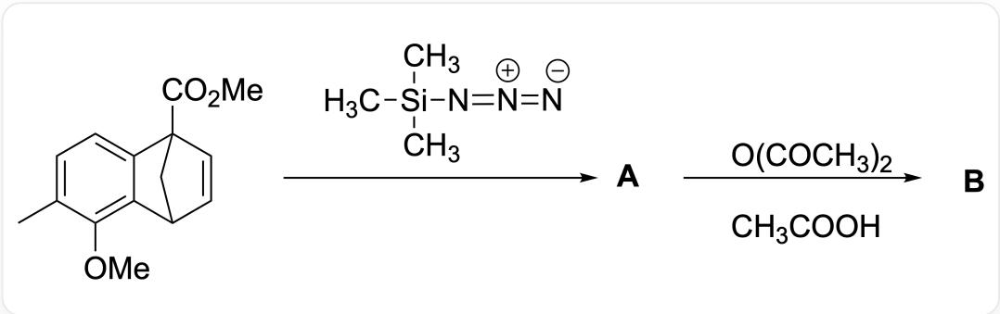  
The image shows a multi-step reaction: CC1=CC=C2C(C3C=CC2(C(OC)=O)C3)=C1OC>C[Si](C)(N=[N+]=[N-])C> [A] > O = C(OC(C) = O) C. CC(O) = O > [B], where A and B are compound codes

From A to B, the reaction proceeds through one neutral intermediate X and three positively charged intermediates, sequentially denoted as  $\mathrm{Y}_1$ ,  $\mathrm{Y}_2$ , and  $\mathrm{Y}_3$ . Based on the above information, select the correct answer.

A. The structure of A is

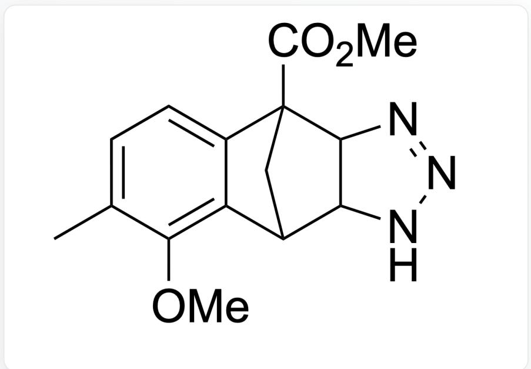  
CC1=CC=C2C(C3C(NN=N4)C4C2(C(OC)=O)C3)=C1OC

B. During the reaction, no carbon-carbon single bond cleavage occurs.  
C. The structure of X is

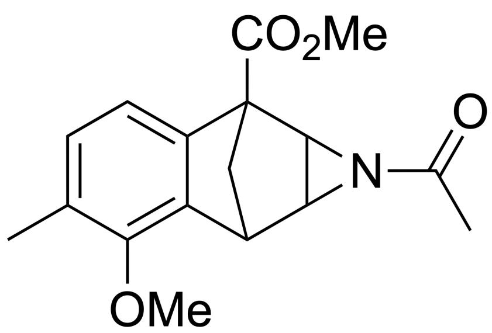

CC1=CC=C2C(C3C4C(N4C(C)=O)C2(C(OC)=O)C3)=C1OC

D. The structure of B is

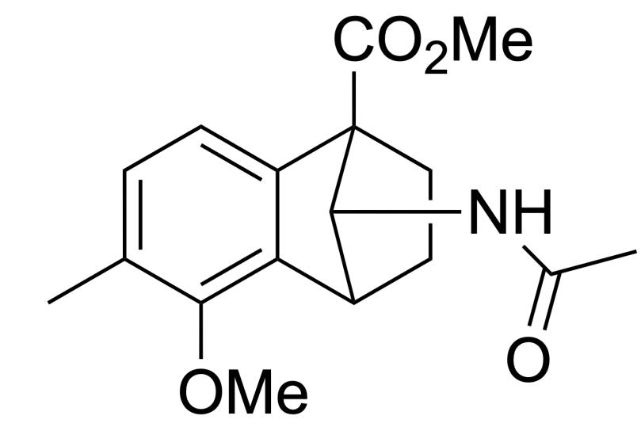

CC1=CC=C2C(C3CCC2(C(OC)=O)C3NC(C)=O)=C1OC

E.

CH3COOH

CC(O)=O

only acted as an acid catalyst during the reaction.

F. The structure of the intermediate  $\mathbf{Y}_1$  is

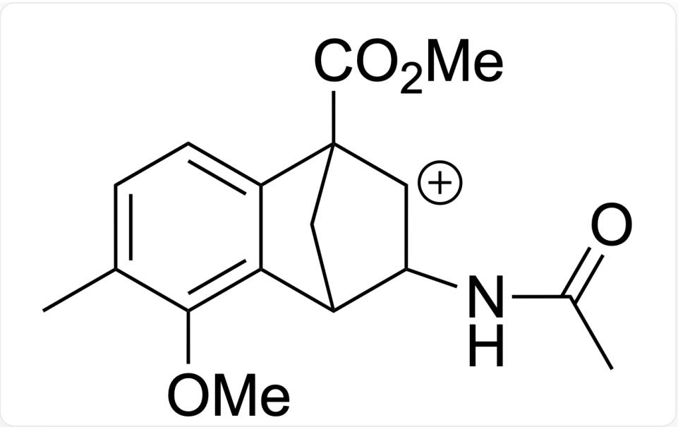

CC1=CC=C2C(C3C(NC(C)=O)[CH+]C2(C(OC)=O)C3)=C1OC

# Answer

Correct Answer: C

# Detailed Explanation

$$
\begin{array}{c} \mathrm {C H} _ {3} \\ \mathrm {H} _ {3} \mathrm {C} - \mathrm {S i} - \mathrm {N} = \mathrm {N} = \mathrm {N} \\ \mathrm {C H} _ {3} \end{array}
$$

$$
C [ S i ] (C) (N = [ N + ] = [ N - ]) C
$$

The main reactivity characteristics are: serving as a source of the azido group (nucleophilic azidation), acting as a 1,3-dipole for  $[3 + 2]$  cycloaddition to form triazoles, decomposing under specific conditions to generate nitrenes for insertion or addition reactions, and having a nitrogen-silicon bond that is prone to hydrolysis or acidolysis, facilitating desilylation.

CHECKPOINT

1 PTS

$$
\begin{array}{c} \mathrm {C H} _ {3} \\ \mathrm {H} _ {3} \mathrm {C} - \mathrm {S i} - \mathrm {N} = \mathrm {N} = \mathrm {N} \\ \mathrm {C H} _ {3} \end{array}
$$

$$
C [ S i ] (C) (N = [ N + ] = [ N - ]) C
$$

may exhibit reactivity characteristics leading to aziridine formation

Reaction type: This is a  $[3 + 2]$  cycloaddition reaction (also known as Huisgen cycloaddition) between a 1,3-dipole and an alkene. Trimethylsilyl azide acts as the 1,3-dipole, while the non-aromatic double bond in the starting material serves as the dipolarophile. Reaction regioselectivity: The reaction will occur at the non-aromatic double bond in the starting material.

CHECKPOINT

1 PTS

The reaction will occur at the non-aromatic double bond in the starting material

Aromatic double bonds (in the benzene ring moiety) exhibit high stability and typically do not participate in such cycloaddition reactions.

The formed N-H triazole, especially when fused within a highly strained polycyclic system, is highly prone to decomposition through nitrogen elimination.

# CHECKPOINT

1 PTS

The formed N-H triazole, especially when fused within a highly strained polycyclic system, is highly prone to decomposition through nitrogen elimination.

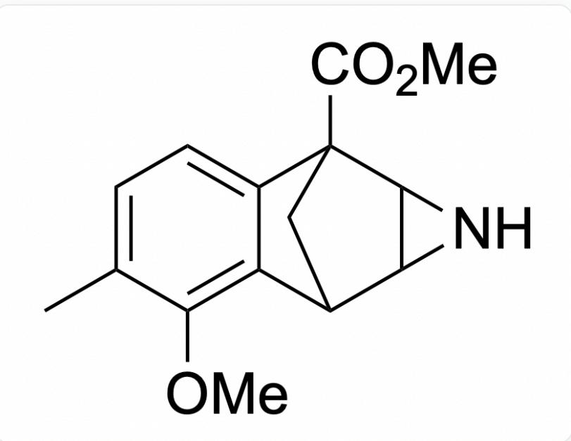  
CC1=CC=C2C(=C1OC)C3CC2(C4C3N4)C(=O)OC

This process usually generates highly reactive intermediates (such as nitrenes or through concerted processes), followed by skeletal rearrangement. For such fused bicyclic triazoles, common rearrangement outcomes include ring contraction to form a smaller ring (e.g., a cyclopropane ring) or more complex skeletal rearrangements to release ring strain. This corresponds to product A.

After nitrogen elimination and rearrangement, an amino group is generated, which is immediately acetylated by acetic anhydride (a strong acetylating agent) to form an amide structure.

# CHECKPOINT

1 PTS

An amino group is generated, which is immediately acetylated by acetic anhydride (a strong acetylating agent) to form an amide structure.

Considering the ring-opening and rearrangement tendencies of aziridines and the acetylating effect of acetic anhydride, product B will be a ring-opened and rearranged compound containing an acetamido group (derived from the nitrogen of the aziridine). The specific rearrangement pathway depends on the direction of ring strain release and electronic effects.

Possible ring-opening modes: Aziridine ring-opening can occur along either the N-C bond or the C-C bond.

If ring-opening occurs along the N-C bond, it may form an alkene and an imine.

If C-C bond cleavage is involved, more complex rearrangements may occur. The N-C bond has greater polarity and is more prone to ring-opening under acidic conditions, thus forming intermediate  $\mathrm{Y}_1$ .

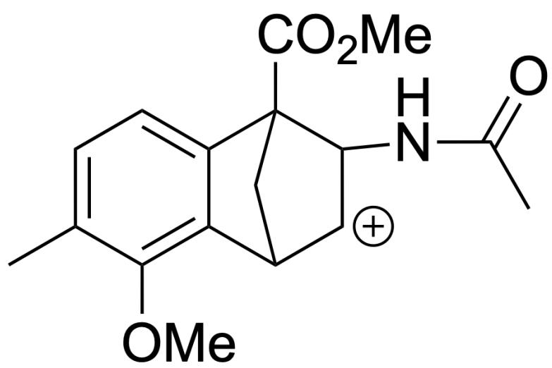

CC1=CC=C2C(C3[CH+]C(NC(C)=O)C2(C(OC)=O)C3)=C1OC

# CHECKPOINT

1 PTS

The N-C bond has greater polarity and is more prone to ring-opening under acidic conditions, thus forming intermediate  $\mathrm{Y}_1$

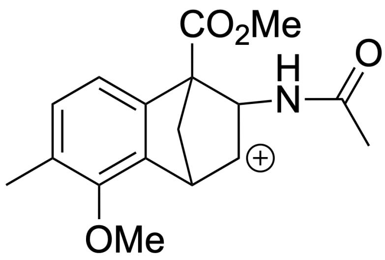

CC1=CC=C2C(C3[CH+]C(NC(C)=O)C2(C(OC)=O)C3)=C1OC

Subsequently, the strong electron-donating methoxy group can stabilize the carbocation, forming intermediate  $\mathrm{Y}_2$  containing a three-membered ring.

CC1=CC=C2C3(C4C3C(NC(C)=O)C2(C(OC)=O)C4)C1=[O+]C

# CHECKPOINT

1 PTS

The strong electron-donating methoxy group can stabilize the carbocation, forming intermediate  $\mathrm{Y}_2$  containing a three-membered ring

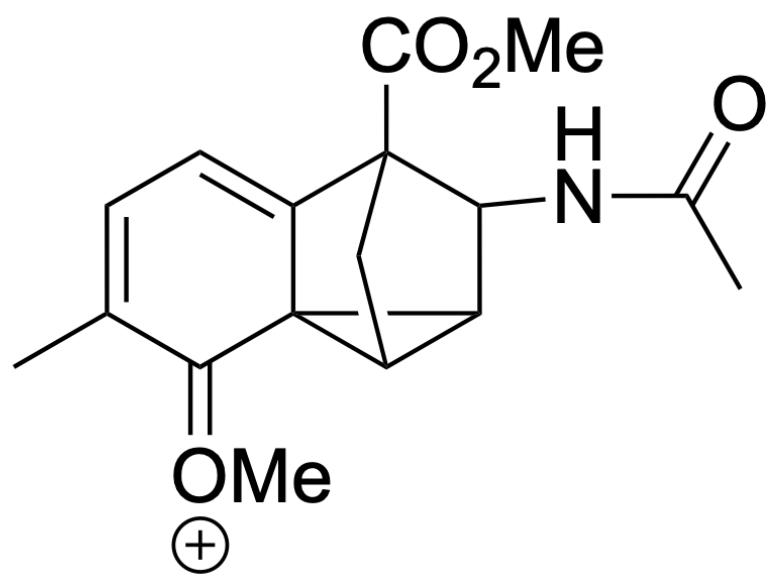

CC1=CC=C2C3(C4C3C(NC(C)=O)C2(C(OC)=O)C4)C1=[O+]C

This non-aromatic structure is unstable and undergoes further C-C bond cleavage to restore aromaticity.

# CHECKPOINT

1 PTS

This non-aromatic structure is unstable and undergoes further C-C bond cleavage to restore aromaticity

The system now tends to form intermediate  $\mathrm{Y}_3$ , which is not destabilized by the electron-withdrawing inductive effect of the nitrogen atom.

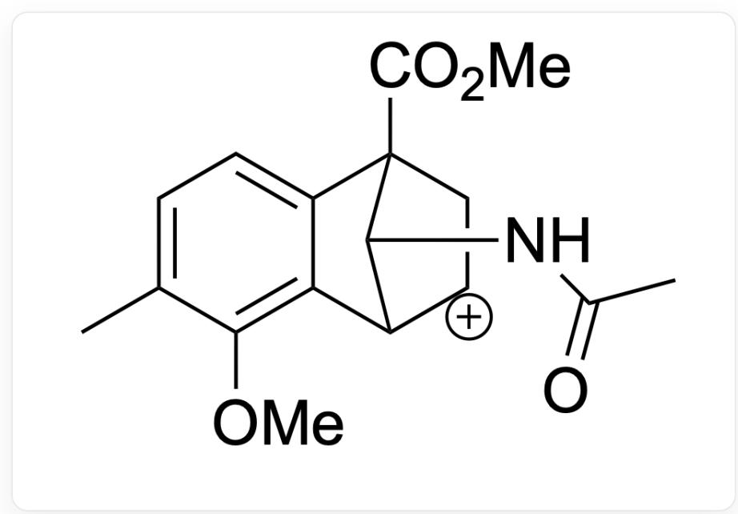

$$
C C 1 = C C = C 2 C (C 3 [ C H + ] C C 2 (C (O C) = O) C 3 N C (C) = O) = C 1 O C
$$

# CHECKPOINT

1 PTS

Intermediate  $\mathbf{Y}_3$

$$
C C 1 = C C = C 2 C (C 3 [ C H + ] C C 2 (C (O C) = O) C 3 N C (C) = O) = C 1 O C
$$

Finally, the carbocation is attacked by the nucleophilic acetate anion in the system to yield stable product B.

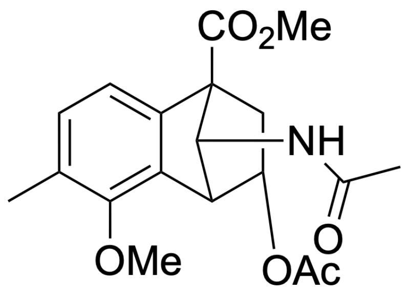

CC1=CC=C2C(C3C(OC(C)=O)CC2(C(OC)=O)C3NC(C)=O)=C1OC

# CHECKPOINT

1 PTS

The carbocation is attacked by the nucleophilic acetate anion in the system to yield stable product B

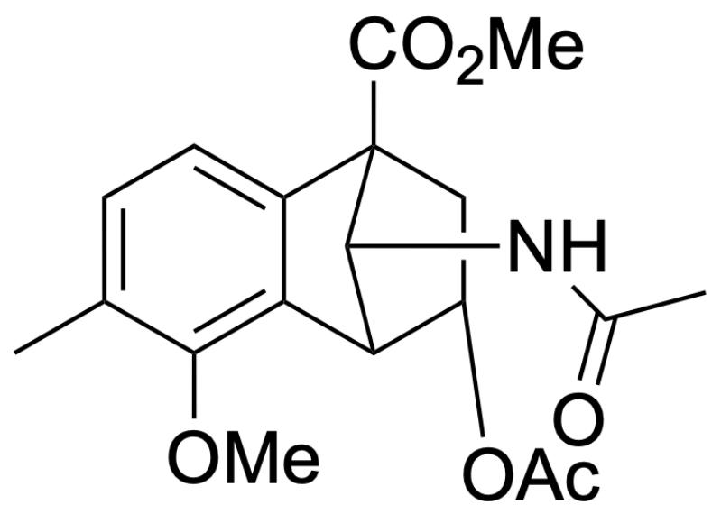

CC1=CC=C2C(C3C(OC(C)=O)CC2(C(OC)=O)C3NC(C)=O)=C1OC