# 题目

合成中的重排反应十分常见：

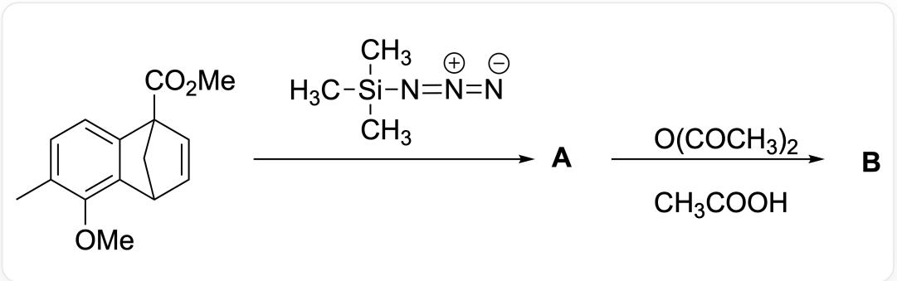  
图片中为多步反应：CC1=CC=C2C(C3C=CC2(C(OC)=O)C3)=C1OC>C[Si](C)(N=[N+]=[N-])C> [A]>O=C(OC(C)=O)C.CC(O)=O>[B]，其中A和B均为化合物代号

从A到B一共经历了一个不带电荷的中间体X，和3个带一个正电荷的中间体，依次为  $\mathrm{Y}_1$  、  $\mathrm{Y}_2$  、  $\mathrm{Y}_3$  。根据以上信息，选出正确答案。

A. A的结构为

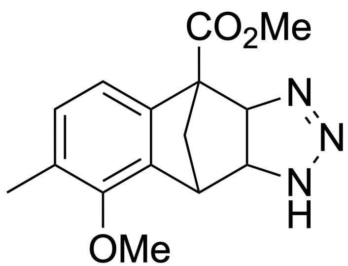

CC1=CC=C2C(C3C(NN=N4)C4C2(C(OC)=O)C3)=C1OC

B. 反应过程中没有发生碳-碳单键断裂  
C. X的结构为

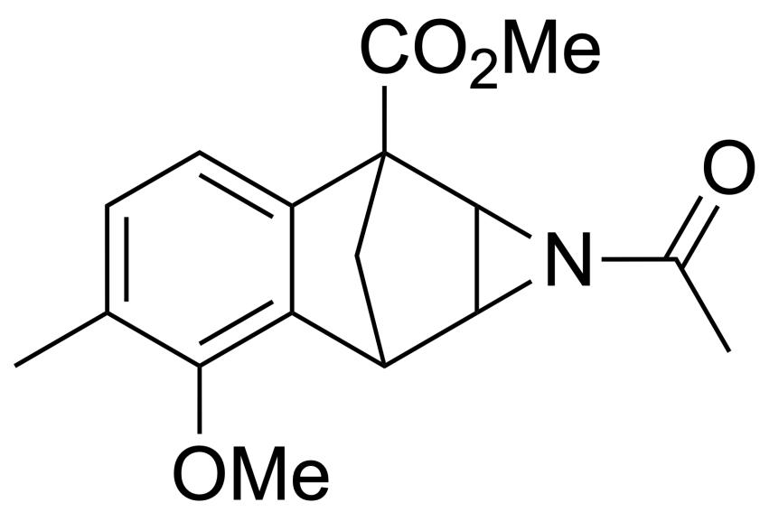

CC1=CC=C2C(C3C4C(N4C(C)=O)C2(C(OC)=O)C3)=C1OC

D. B的结构为

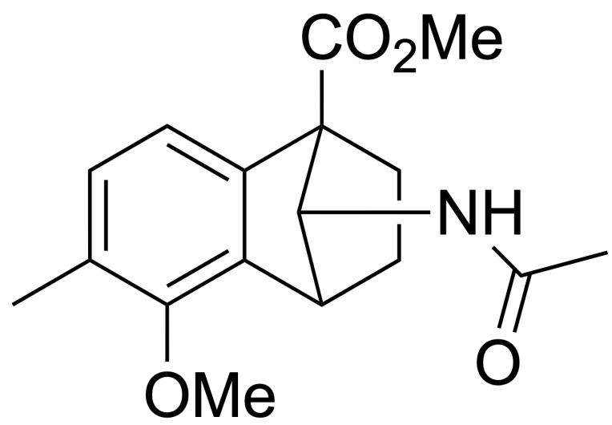

CC1=CC=C2C(C3CCC2(C(OC)=O)C3NC(C)=O)=C1OC

# E.

# CH3COOH

CC(O)=O

在反应过程中仅起到了酸催化的作用

# F. 中间体  $\mathrm{Y}_{1}$  的结构为

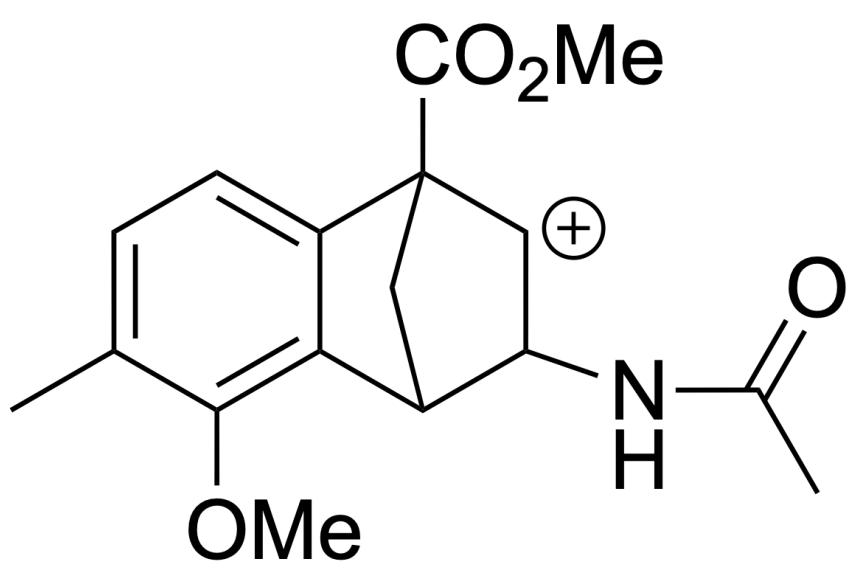

CC1=CC=C2C(C3C(NC(C)=O)[CH+]C2(C(OC)=O)C3)=C1OC

# 答案

正确答案: C

# 详细解析

$$
\begin{array}{c} \mathrm {C H} _ {3} \\ \mathrm {H} _ {3} \mathrm {C} - \mathrm {S i} - \mathrm {N} = \mathrm {N} = \mathrm {N} \\ \mathrm {C H} _ {3} \end{array}
$$

$$
C [ S i ] (C) (N = [ N + ] = [ N - ]) C
$$

的主要反应性特点是：作为叠氮基团的来源（亲核叠氮化）。作为1,3-偶极体进行  $[3 + 2]$  环加成形成三唑。在特定条件下分解生成氮烯，进行插入或加成反应，其氮-硅键易于水解或酸解，方便脱硅。

CHECKPOINT

1 PTS

$$
\begin{array}{c} \mathrm {C H} _ {3} \\ \mathrm {H} _ {3} \mathrm {C} - \mathrm {S i} - \mathrm {N} = \mathrm {N} = \mathrm {N} \\ \mathrm {C H} _ {3} \end{array}
$$

$$
C [ S i ] (C) (N = [ N + ] = [ N - ]) C
$$

的主要反应性特点是可能形成氮杂环丙烷

反应类型：这是1,3-偶极体与烯烃之间的  $[3 + 2]$  环加成反应（也称为Huisgen环加成）。叠氮三甲基硅烷作为1,3-偶极体，起始物中的非芳香性双键作为亲偶极体。反应区域选择性：反应将发生在起始物中的非芳香性双键上。

CHECKPOINT

1 PTS

反应将发生在起始物中的非芳香性双键上

芳香性双键（苯环部分）具有高度的稳定性，通常不参与此类环加成反应。

形成的N-H三唑，尤其是当它稠合在一个张力较大的多环体系中时，非常容易通过脱除氮气而分解。

# CHECKPOINT

1 PTS

形成的 N-H 三唑，尤其是当它稠合在一个张力较大的多环体系中时，非常容易通过脱除氮气而分解，得到产物 A

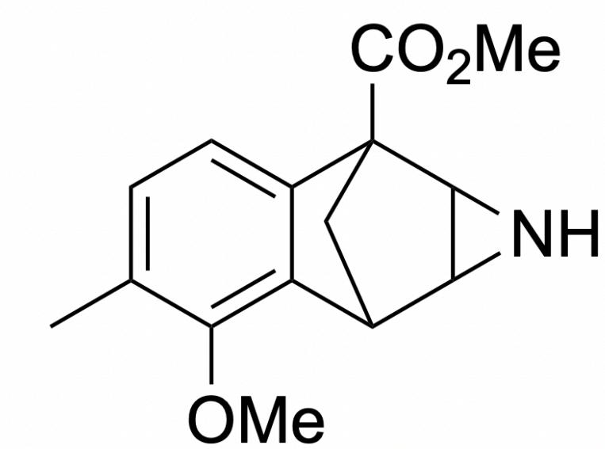  
CC1=CC=C2C(=C1OC)C3CC2(C4C3N4)C(=O)OC

这个过程通常会形成高度活泼的中间体（如氮烯或通过协同过程），继而发生骨架重排。对于这种稠合的双环三唑，常见的重排结果是环收缩，形成一个更小的环（例如环丙烷环），或者发生更复杂的骨架重排，以释放体系的张力。这对应产物A

在氮气脱除和重排后，生成了氨基，乙酸酐（强乙酰化剂）会立刻对其进行乙酰化，生成酰胺结构。

# CHECKPOINT

1 PTS

生成了氨基，乙酸酐（强乙酰化剂）会立刻对其进行乙酰化，生成酰胺结构。

考虑到氮杂环丙烷的开环和重排倾向，以及乙酸酐的乙酰化作用，产物B将是一个开环并重排的化合物，其中包含一个乙酰胺基团（来自氮杂环丙烷的氮）。具体的重排途径取决于环张力释放的方向和电子效应。

可能的开环模式：氮杂环丙烷的开环可以沿着N-C键或C-C键进行。

如果沿着N-C键开环，可能形成烯烃和亚胺。

如果涉及到C-C键断裂，则可能会有更复杂的重排。N-C键极性更大，在酸作用下更容易开环，因此形成中间体  $\mathrm{Y}_{1}$

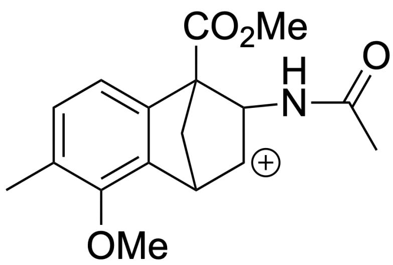

CC1=CC=C2C(C3[CH+]C(NC(C)=O)C2(C(OC)=O)C3)=C1OC

# CHECKPOINT

1 PTS

N-C键极性更大，在酸作用下更容易开环，因此形成中间体  $\mathrm{Y}_{1}$

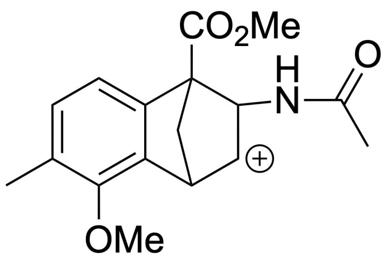

CC1=CC=C2C(C3[CH+]C(NC(C)=O)C2(C(OC)=O)C3)=C1OC

随后，强给电子基团甲氧基可以稳定碳正离子，形成含有三元环的中间体  $\mathrm{Y}_{2}$

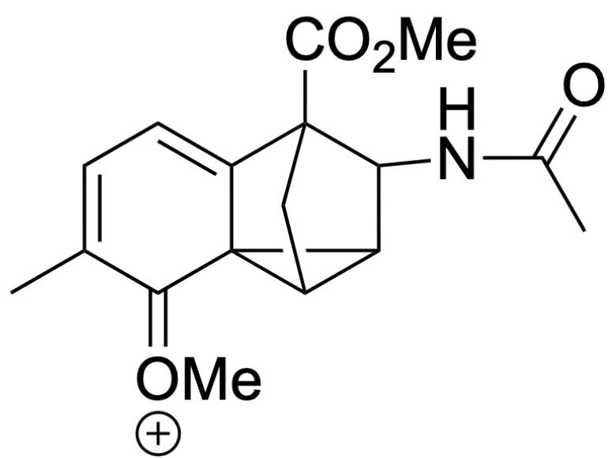

CC1=CC=C2C3(C4C3C(NC(C)=O)C2(C(OC)=O)C4)C1=[O+]C

# CHECKPOINT

1 PTS

强给电子基团甲氧基可以稳定碳正离子，形成含有三元环的中间体  $\mathrm{Y}_{2}$

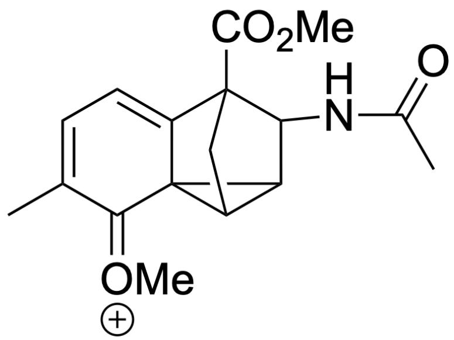

CC1=CC=C2C3(C4C3C(NC(C)=O)C2(C(OC)=O)C4)C1=[O+]C

该非芳香性的结构并不稳定，继续发生C-C键断裂，恢复芳香性，

# CHECKPOINT

1 PTS

该非芳香性的结构并不稳定，继续发生C-C键断裂，恢复芳香性

但此时倾向于形成不被氮原子吸电子诱导效应去稳定化的中间体  $\mathrm{Y}_3$

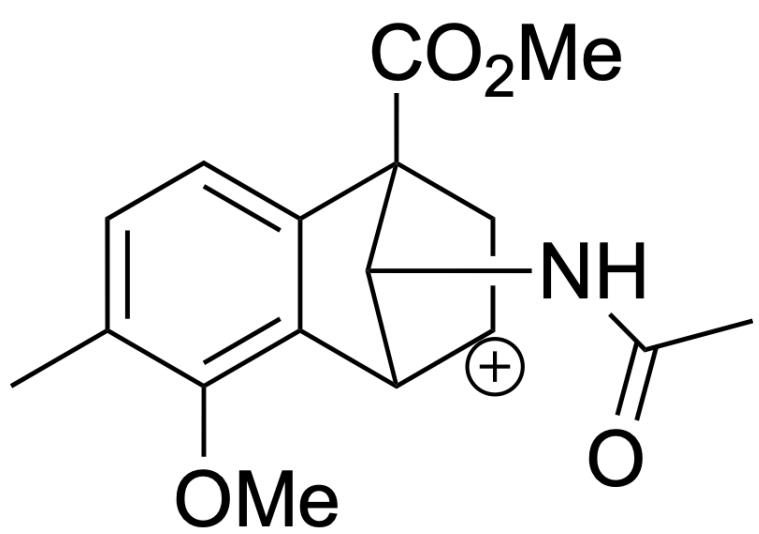

CC1=CC=C2C(C3[CH+]CC2(C(OC)=O)C3NC(C)=O=C1OC

# CHECKPOINT

1 PTS

中间体  $\mathrm{Y}_3$

CC1=CC=C2C(C3[CH+]CC2(C(OC)=O)C3NC(C)=O=C1OC

最后，碳正离子被体系中的亲核试剂乙酰负离子进攻，得到稳定产物B

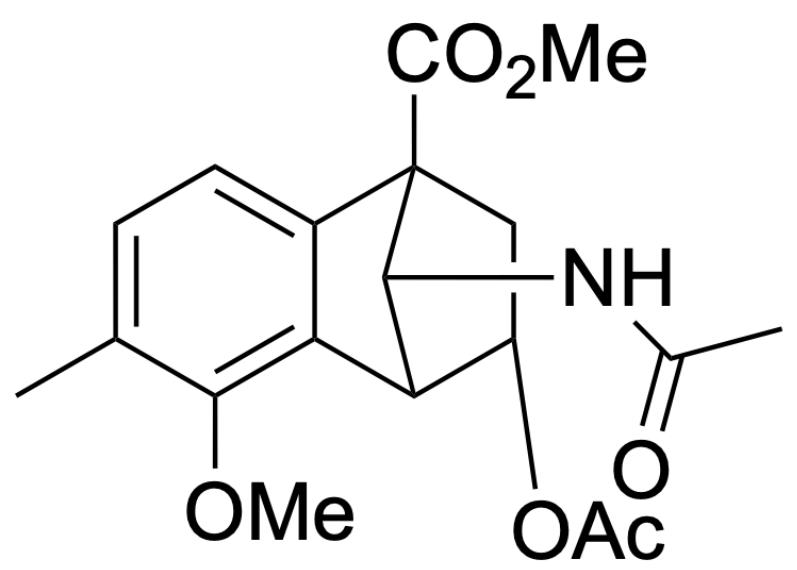

CC1=CC=C2C(C3C(OC(C)=O)CC2(C(OC)=O)C3NC(C)=O)=C1OC

# CHECKPOINT

1 PTS

碳正离子被体系中的亲核试剂乙酰负离子进攻，得到稳定产物B

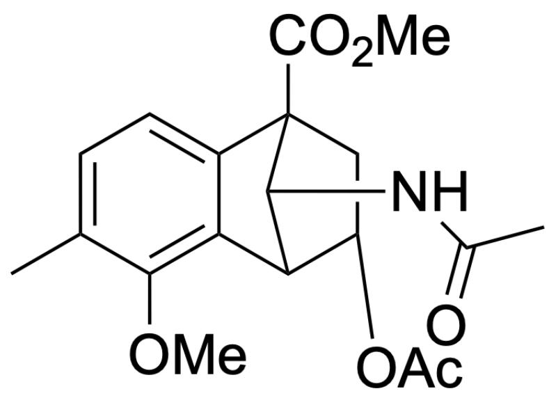

CC1=CC=C2C(C3C(OC(C)=O)CC2(C(OC)=O)C3NC(C)=O)=C1OC