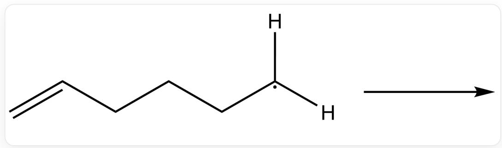
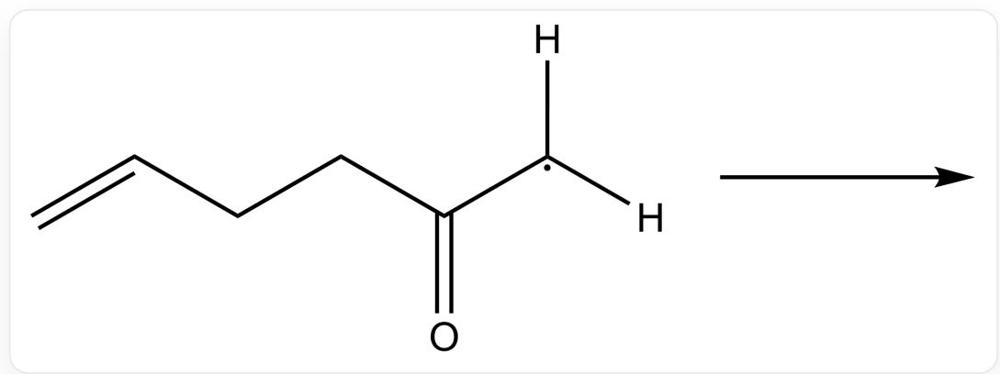
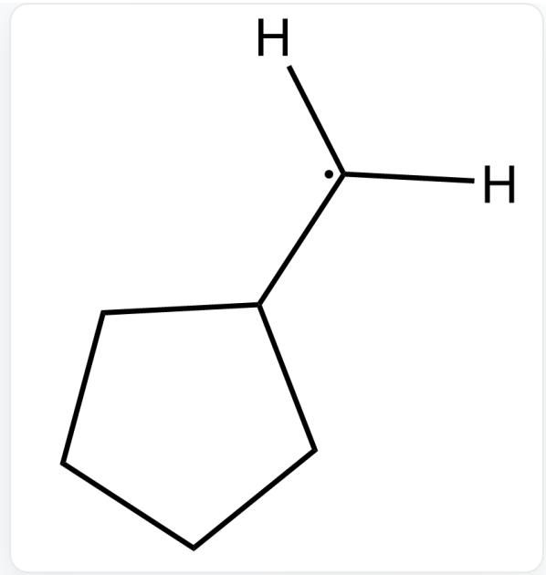
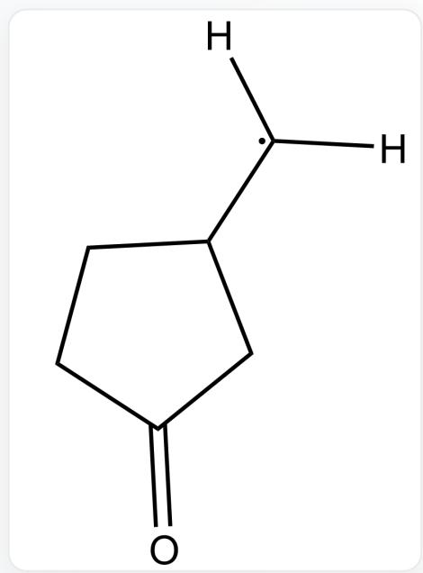
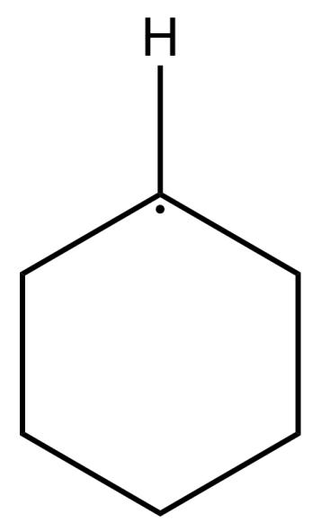
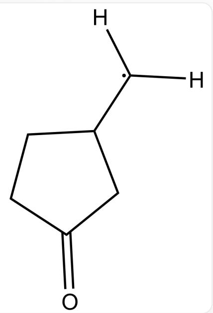
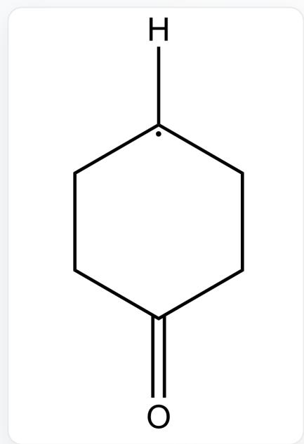
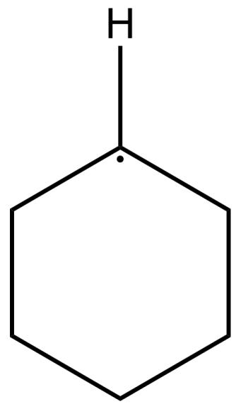

# Question

Radical cyclization usually exhibits certain regioselectivity.

  
C=CCCC[C]([H])[H], This carbon radical will spontaneously form a cyclic structure; attempt to predict the product

  
C=CCCC([C]([H])[H])=O, This carbon radical will spontaneously form a cyclic structure; attempt to predict the product

Please attempt to predict the products of the above two radical cyclization reactions, respectively, and provide a reasonable explanation.

A.

  
[H][C]([H])C1CCCC1

  
[H][C]([H])C(CC1)CC1=O

Forming five-membered ring and five-membered ring products respectively

B.

  
[H][C]1CCCCC1

  
[H][C]([H])C(CC1)CC1=O

Six-membered ring and five-membered ring products were formed respectively.

C.

  
[H][C]([H])C1CCCC1

  
[H][C]1CCC(CC1)=O

Five-membered ring and six-membered ring products were formed respectively.

D.

  
[H][C]1CCCCC1

  
[H][C]1CCC(CC1)=O

Six-membered ring and six-membered ring products are formed respectively.

# Answer

Correct Answer: C

# Detailed Explanation

Generally, the formation of five-membered rings via radicals is faster than six-membered rings, so the first molecule will yield a five-membered ring product.

# CHECKPOINT

1 PTS

Generally, the formation of five-membered rings via radicals is faster than six-membered rings, so the first molecule will yield a five-membered ring product

The presence of a carbonyl group stabilizes the radical, improves the reversibility of ring closure, and facilitates the formation of the more stable six-membered ring.

# CHECKPOINT

1 PTS

The presence of a carbonyl group stabilizes the radical, improves the reversibility of ring closure, and facilitates the formation of the more stable six-membered ring

The presence of a carbonyl group causes the two carbon atoms to adopt an  $\mathbf{sp}^2$  hybridization state, resulting in increased rigidity and making orbital overlap in the five-membered ring transition state more difficult.

# CHECKPOINT

1 PTS

The presence of a carbonyl group causes the two carbon atoms to adopt an  $\mathbf{sp}^2$  hybridization state, resulting in increased rigidity and making orbital overlap in the five-membered ring transition state more difficult