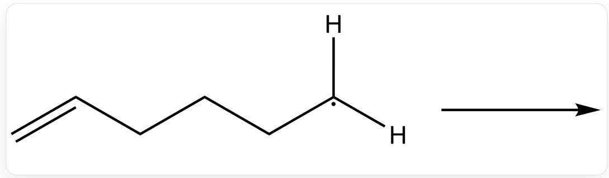
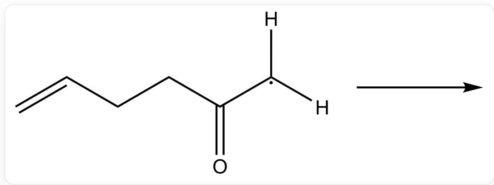
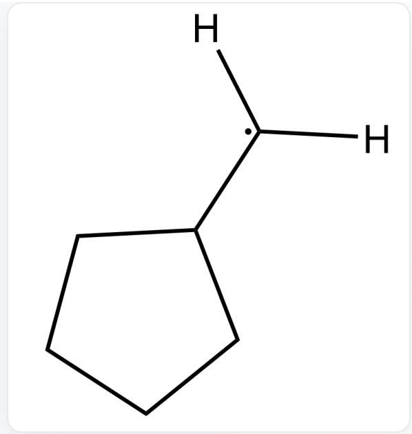
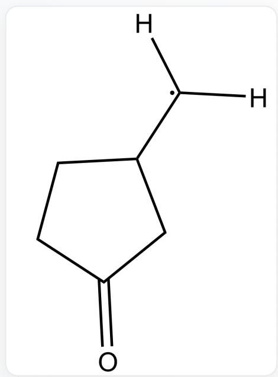
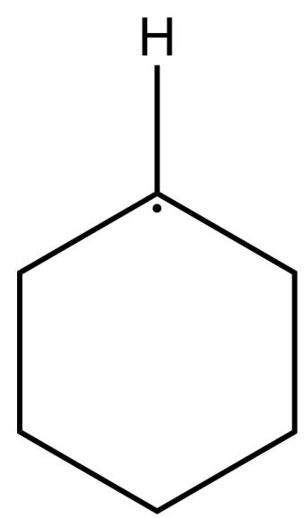
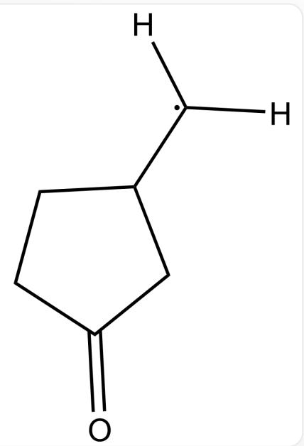
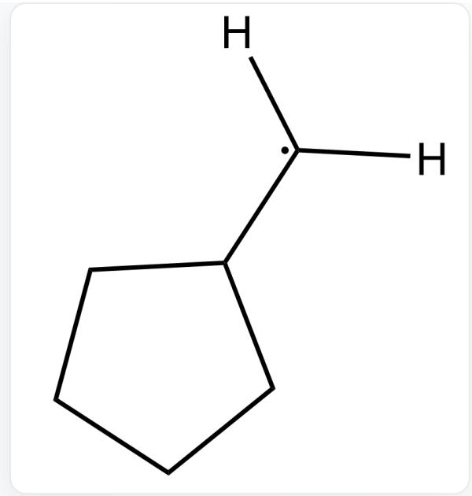
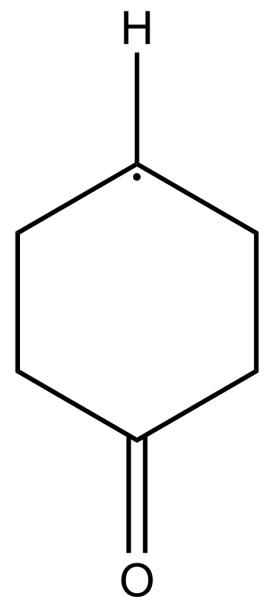

# 题目

自由基关环通常会具有一定的区域选择性。

C=CCCC[C]([H])[H],该碳自由基会自发形成环状结构，尝试对产物进行预测

C=CCCC([C][[H]][H])=O,该碳自由基会自发形成环状结构，尝试对产物进行预测

请尝试分别预测以上两个自由基成环反应的产物，并给出合理的解释。

A.

  
[H][C]([H])C1CCCC1

  
[H][C]([H])C(CC1)CC1=O

分别形成了五元环和五元环产物

B.

  
[H][C]1CCCCC1

  
[H][C]([H])C(CC1)CC1=O

分别形成了六元环和五元环产物

C.

  
[H][C]([H])C1CCCC1

  
[H][C]1CCC(CC1)=O

分别形成了五元环和六元环产物

D.

  
[H][C]1CCCCC1

  
[H][C]1CCC(CC1)=O

分别形成了六元环和六元环产物

# 答案

正确答案: C

# 详细解析

一般自由基成五元环比六元环快，因此第一个分子将形成五元环产物

# CHECKPOINT

1 PTS

一般自由基成五元环比六元环快，因此第一个分子将形成五元环产物

羰基的存在使自由基更加稳定，关环可逆性更好，容易得到更稳定的六元环

# CHECKPOINT

1 PTS

羰基的存在使自由基更加稳定，关环可逆性更好，容易得到更稳定的六元环

羰基的存在导致两个C原子变为  $\mathbf{sp}^2$  杂化形式，刚性更加显著，五元环过渡态的轨道重叠较为困难

# CHECKPOINT

1 PTS

羰基的存在导致两个C原子变为  $\mathbf{sp}^2$  杂化形式，刚性更加显著，五元环过渡态的轨道重叠较为困难