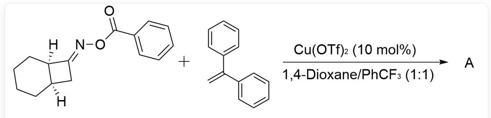
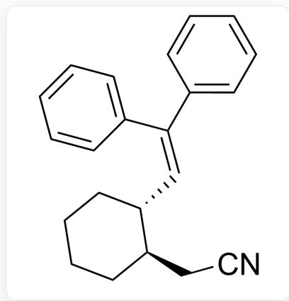
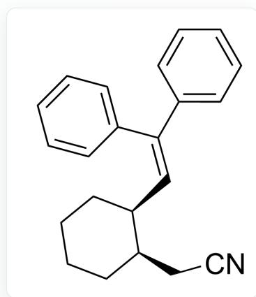
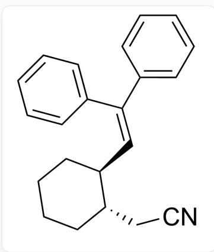
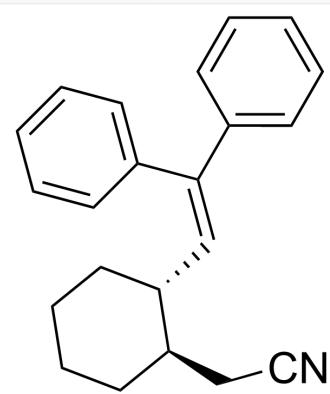
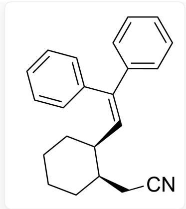
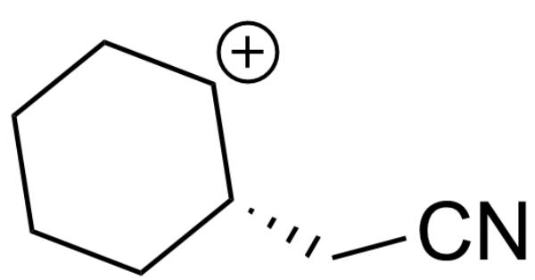
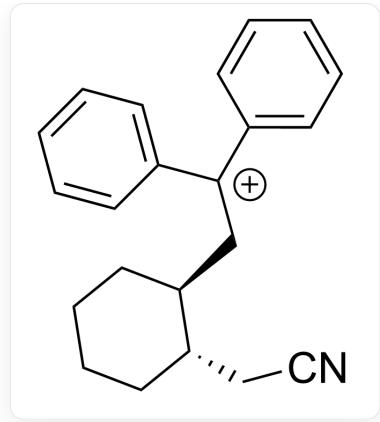

# Question

A.  
  
[H][C@@]1(CCCC2)[C@@]2([H])C/C1=N\OC(C3=CC=CC=C3)=O.C=C(C1=CC=CC=C1)C2=CC=CC=C2>Cu(OTf)2 (10 mol%),

Please select the most suitable product A and predict whether the Z/E configuration of the carbon-nitrogen double bond will affect the reaction selectivity.

B.  
  
1,4-Dioxane/PhCF3(1:1)>[A]  
N#CC[C@@H]1[C@H](CCCCC1)/C=C(C2=CC=CC=C2)/C3=CC=CC=C3

C.  
  
No  
N#CC[C@@H]1[C@@H](CCCCC1)/C=C(C2=CC=CC=C2)/C3=CC=CC=C3  
No

N#CC[C@H]1[C@H](CCCCC1)/C=C(C2=CC=CC=C2)/C3=CC=CC=C3

Yes

D.

N#CC[C@H]1[C@@H](CCCCC1)/C=C(C2=CC=CC=C2)/C3=CC=CC=C3

Yes

E.

N#CC[C@@H]1[C@H](CCCCC1)/C=C(C2=CC=CC=C2)/C3=CC=CC=C3

Yes

F.

N#CC[C@@H]1[C@@H](CCCCC1)/C=C(C2=CC=CC=C2)/C3=CC=CC=C3

Yes

# Answer

Correct Answer: A

# Detailed Explanation

This reaction is a free radical reaction

# CHECKPOINT

1 PTS

This reaction is a free radical reaction

Cu in the reaction system is a catalyst

# CHECKPOINT

1 PTS

Cu in the reaction system is a catalyst

$\mathrm{Cu(I)}$

first

donates

a

single

electron,

causing

the

weaker

\mathbf{mathrm{[N - O]}}

bondtocleave, forming a freeradicalintermediateThecleavageofthenitrogen - oxygeninginglebondisnotthesourceofstereoselectivity, sotheZ/Econfiguratic \mathbf{\mu}_{\mathrm{mathrm}}\{\mathrm{Cu(II)}\} \) oxidizes this radical to form a carbocation

N#CC[C@H]1[CH+]CCCCC1

# CHECKPOINT

1 PTS

Then  $\mathrm{Cu(II)}$  oxidizes this radical to form a carbocation

Since the steric hindrance above this carbocation is greater than that below, it is selectively captured by stilbene from below

N#CC[C@H]1[C@@H](CCCCC1)C[C+]（C2=CC=CC=C2)C3=CC=CC=C3

# CHECKPOINT

1 PTS

Since the steric hindrance above this carbocation is greater than that below, it is selectively captured by stilbene from below

Finally, deprotonation forms product A