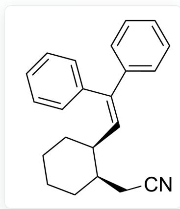
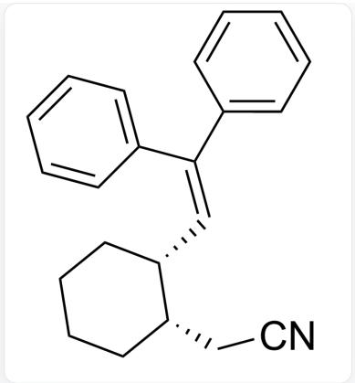
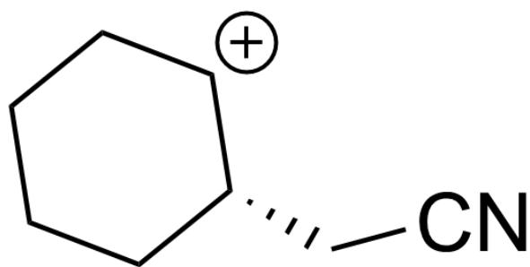
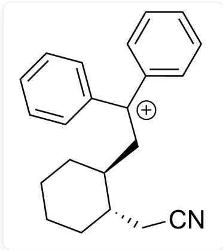

# 题目

  
[H][C@@]1(CCCC2)[C@@]2([H])C/C1=N\OC(C3=CC=CC=C3)=O.C=C(C1=CC=CC=C1)C2=CC=CC=C2>Cu(OTf)2 (10 mol%),

请选出最合适的产物A，并预测碳氮双键的Z/E构型是否会对反应选择性产生影响

A.

  
1,4-Dioxane/PhCF3(1:1)>[A]  
N#CC[C@@H]1[C@H](CCCCC1)/C=C(C2=CC=CC=C2)/C3=CC=CC=C3

不会

B.

  
N#CC[C@@H]1[C@@H](CCCCC1)/C=C(C2=CC=CC=C2)/C3=CC=CC=C3

不会

C.

N#CC[C@H]1[C@H](CCCCC1)/C=C(C2=CC=CC=C2)/C3=CC=CC=C3

会

D.

N#CC[C@H]1[C@@H](CCCCC1)/C=C(C2=CC=CC=C2)/C3=CC=CC=C3

会

E.

N#CC[C@@H]1[C@H](CCCCC1)/C=C(C2=CC=CC=C2)/C3=CC=CC=C3

会

F.

N#CC[C@@H]1[C@@H](CCCCC1)/C=C(C2=CC=CC=C2)/C3=CC=CC=C3

会

# 答案

正确答案: A

# 详细解析

该反应为自由基反应

# CHECKPOINT

该反应为自由基反应

反应体系中的  $\mathrm{Cu}$  为催化剂

# CHECKPOINT

反应体系中的  $\mathrm{Cu}$  为催化剂

$\mathrm{Cu(I)}$  首先給出一個單單電極子，使電得較弱的  $\mathrm{mathrm{thm}}[\mathrm{N - O}]$

键发生裂解,形成自由基中间体其中氮氧单键的断裂并非立体选择性的来源,因此碳氮双键的Z/E构型不会对反应选择性产生影响随后该不稳定中间体迅速\mathbf{\mu} \mathbf{m} \mathbf{a} \mathbf{h} \mathbf{r} \mathbf{m} \{\mathrm{Cu(II)}\} \mathbf{\mu} \mathbf{\mu} \mathbf{s} \text{将该自由基氧化,形成碳正离子}

N#CC[C@H]1[CH+]CCCCC1

# CHECKPOINT

接着  $\mathrm{Cu(II)}$  将该自由基氧化，形成碳正离子

由于该碳正离子上方的位阻大于下方，因此被二苯乙烯选择性地从下方捕获

1 PTS

N#CC[C@H]1[C@@H](CCCCC1)C[C+](C2=CC=CC=C2)C3=CC=CC=C3

# CHECKPOINT

1PTS

由于该碳正离子上方的位阻大于下方，因此被二苯乙烯选择性地从下方捕获

最后脱去质子形成产物A