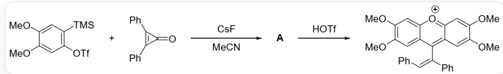
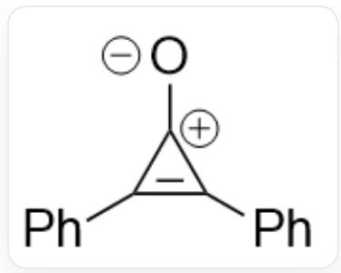
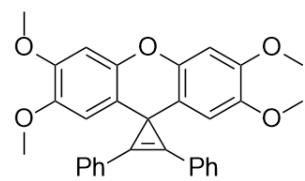
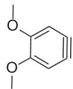
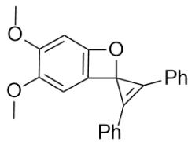
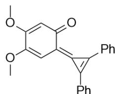

# Question

Diphenylcyclopropenone can undergo the following reaction:

$$
\mathrm {` C O C 1} = \mathrm {C C} (\mathrm {O S} (= \mathrm {O}) (\mathrm {C} (\mathrm {F}) (\mathrm {F}) \mathrm {F}) = \mathrm {O}) = \mathrm {C} ([ \mathrm {S i} ] (\mathrm {C}) (\mathrm {C}) \mathrm {C}) \mathrm {C} = \mathrm {C 1 O C} \quad \text {a n d}
$$

`O=C1C(C2=CC=CC=C2)=C1C3=CC=CC=C3` react with cesium fluoride in acetonitrile to generate A, and A generates `COC1=C(OC)C=C(C(/C(C2=CC=CC=C2)=C\C3=CC=CC=C3)=C(C=C(OC)C(OC)=C4)C4= [O+]5)C5=C1` under the action of TfOH

Examine the structural formula of  $\mathbf{A}$  and the structures of the three key intermediates B1, B2, and B3 for the generation of  $\mathbf{A}$ .

The following statements are made:

1. A contains a three-membered ring.  
2. B1 contains a benzyne structure.  
3. B2 has five rings.  
4. The number of aromatic rings in B3 is the same as that in B2.

Select the option below that contains all the correct statements:

A. All other options are incorrect  
B. 1

C. 2  
D. 3  
E. 4  
F. 1,2  
G. 1,3  
H. 1,4  
1. 2,3  
J. 2,4  
K. 3,4  
L. 1,2,3  
M. 1,2,4  
N. 1,3,4  
O. 2,3,4  
P. 1,2,3,4

# Answer

Correct Answer: L

# Detailed Explanation

The product is a positive ion, which is easily understood to be produced by protonation with  $TfOH$ . Observing the product structure, a hydrogen appears on the  $sp^2$  carbon where the exocyclic double bond is bonded to a phenyl group, which should be generated by protonation. Therefore, A: COC1=C(OC)C=C(C2(C3=CC=CC=C3)=C2C4=CC=C4)C(C=C(OC)C(OC)=C5)=C5O6)C6=C1

# CHECKPOINT

1 PTS

The

structure

of

A

is:

`COC1=C(OC)C=C(C2(C3=CC=CC=C3)=C2C4=CC=CC=C4)C(C=C(OC)C(OC)=C5)=C5O6)C6=C1` containing a three-membered ring, statement 1 is correct

To study the process of generating A, cesium fluoride first removes the silyl group from the raw material  $\mathrm{^{\backprime}COC1 = CC(OS(=O)(C(F)(F)F) = O) = C([Si](C)(C)C)C = C1OC}$  to generate a negative ion, and then  $TfO^{-}$  is removed to generate benzyne, i.e., B1:  $\mathrm{^{\backprime}COC1 = CC\#CC = C1OC}$

# CHECKPOINT

1 PTS

The structure of B1 is  $\mathrm{^{\backprime}COC1 = CC\#CC = C1OC}$  , containing benzyne, statement 2 is correct

The diphenylcyclopropenone of the raw material can be considered to have a charge-separated structure:

`[O-][C+]1C(C2=CC=CC=C2)=C1C3=CC=CC=C3`

It reacts with the generated benzyne to form a ring to obtain B2:

`COC1=CC2=C(C3(C(C4=CC=CC=C4)=C3C5=CC=CC=C5)O2)C=C1OC`

# CHECKPOINT

1 PTS

The structure of B2 is  $\mathrm{COC1 = CC2 = C(C3(C4 = CC = CC = C4) = C3C5 = CC = CC = C5)O2)C = C1OC}$ , with 5 rings, statement 3 is correct

Then the unstable benzocyclobutene ring opens to obtain B3:

`COC(C(OC)=C/C1=C2C(C3=CC=CC=C3)=C\2C4=CC=CC=C4)=CC1=O`

# CHECKPOINT

1 PTS

The structure of B3 is  $\mathrm{COC}(\mathrm{C(OC)} = \mathrm{C / C1} = \mathrm{C2C}(\mathrm{C3} = \mathrm{CC} = \mathrm{CC} = \mathrm{C3}) = \mathrm{C\backslash 2C4} = \mathrm{CC} = \mathrm{CC} = \mathrm{C4}) = \mathrm{CC1} = \mathrm{O}^{\prime}$ , which has two benzene rings and two aromatic rings, one less than in B2, statement 4 is incorrect

Then B3 undergoes a Diels-Alder reaction with another molecule of B1 to obtain A.

Statements 1, 2, and 3 are correct, choose L

  
A

  
B1

  
B2

  
B3

A:  $\mathrm{COC1 = C(OC)C = C(C2(C(C3 = CC = CC = C3) = C2C4 = CC = CC = C4)C(C = C(OC)C(OC) = C5) = C5O6)C6 = C1}$

B1: `COC1=CC#CC=C1OC`; B2:

`COC1=CC2=C(C3(C(C4=CC=CC=C4)=C3C5=CC=CC=C5)O2)C=C1OC`;B3:

`COC(C(OC)=C/C1=C2C(C3=CC=CC=C3)=C\2C4=CC=CC=C4)=CC1=O`