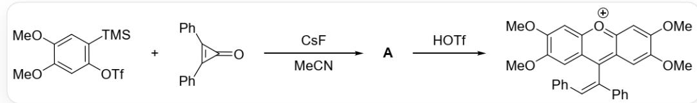
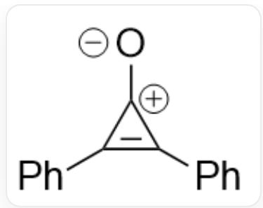
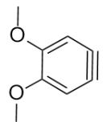

# 题目

二苯基环丙烯酮可以发生如下反应：

  
`COC1=CC(OS(=O)(C(F)(F)F)=O)=C([Si](C)(C)C)C=C10C`和  
$\mathrm{O} = \mathrm{C}1\mathrm{C}(\mathrm{C}2 = \mathrm{CC} = \mathrm{CC} = \mathrm{C}2) = \mathrm{C}1\mathrm{C}3 = \mathrm{CC} = \mathrm{CC} = \mathrm{C}3$  在乙腈中与氟化铯反应生成A，A在TfOH作用下生成 $\mathrm{COC1 = C(OC)C = C(C / C(C2 = CC = CC = C2) = C\backslash C3 = CC = CC = C3) = C(C = C(OC)C(OC) = C4)C4 = [O + ]5)C5 = C1}$

考察A的结构简式和生成A的三个关键中间体B1、B2和B3的结构。

有以下说法：

1.A中具有三元环  
2.B1 含苯炔结构  
3.B2中有五个环  
4.B3中芳香环的数量与B2中相同

选出以下选项中包含全部正确说法的一项：

A. 其他选项均不正确  
B. 1  
C. 2

D. 3  
E. 4  
F. 1,2  
G. 1,3  
H. 1,4  
1. 2,3  
J. 2,4  
K. 3,4  
L. 1,2,3  
M. 1,2,4  
N. 1,3,4  
O. 2,3,4  
P. 1,2,3,4

# 答案

正确答案: L

# 详细解析

产物为一正离子，易知是经TfOH质子化产生。观察产物结构，在环外双键与一个苯基成键的sp²碳上出现除了一个氢键，反应为质子化产生成物，则则A：

$$
\mathrm {^ {\backprime} C O C 1 = C (O C) C = C (C 2 (C (C 3 = C C = C C = C 3) = C 2 C 4 = C C = C C = C 4) C (C = C (O C) C (O C) = C 5) = C 5 O 6) C 6 = C 1 ^ {\backprime}}
$$

# CHECKPOINT

1 PTS

A

的

结

构

为

：

$$
\mathrm {^ {\backprime} C O C 1 = C (O C) C = C (C 2 (C (C 3 = C C = C C = C 3) = C 2 C 4 = C C = C C = C 4) C (C = C (O C) C (O C) = C 5) = C 5 O 6) C 6 = C 1 ^ {\prime}}
$$

含有三元环，说法1正确

研究生成A的过程，首先氟化铯使原料 $\mathrm{COC1 = CC(OS(=O)(C(F)(F)F) = O) = C([Si](C)(C)C)C = C1OC}$ 中的硅基离去产生负离子，随后再离去 $TfO^{-}$ ，产生苯炔，即B1： $\mathrm{^{\prime}COC1 = CC#CC = C1OC}$

# CHECKPOINT

1 PTS

B1的结构为`COC1=CC#CC=C1OC`，含有苯炔，说法2正确

原料的二苯基环丙烯酮可认为存在电荷分离的结构:

`[O-][C+]1C(C2=CC=CC=C2)=C1C3=CC=CC=C3`

与產生生產的鋰苯鋰炔反應應當成線環網得機到圖B2：

$\mathrm{COC1 = CC2 = C(C3(C(C4 = CC = CC = C4) = C3C5 = CC = CC = C5)O2)C = C1OC}$

# CHECKPOINT

1 PTS

B2的结构为`COC1=CC2=C(C3(C4=CC=CC=C4)=C3C5=CC=CC=C5)O2)C=C1OC`，有5个环，说法3正确

隨後后續不斷穩定的鋰苯氣并與四亞元氣環網開運環網 ，獲得達到B3級 ：

`COC(C(OC)=C/C1=C2C(C3=CC=CC=C3)=C\2C4=CC=CC=C4)=CC1=O`

# CHECKPOINT

1 PTS

B3的结构为 $\mathrm{COC}(\mathrm{C(OC)} = \mathrm{C / C1} = \mathrm{C2C(C3} = \mathrm{CC} = \mathrm{CC} = \mathrm{C3}) = \mathrm{C}\backslash 2\mathrm{C4} = \mathrm{CC} = \mathrm{CC} = \mathrm{C4}) = \mathrm{CC1} = \mathrm{O}^{\prime}$ ，其中有两个苯环，有两个芳香环，数量比B2中少一个，说法4错误

随后B3与另一分子B1发生Diels-Alder反应，得到A。

说法1，2，3正确，选L

  
A

  
B1

  
B2

  
B3

A:  $\mathrm{COC1 = C(OC)C = C(C2(C3 = CC = CC = C3) = C2C4 = CC = CC = C4)C(C = C(OC)C(OC) = C5) = C5O6)C6 = C1}$

B1: 'COC1=CC#CC=C1OC'; B2:

`COC1=CC2=C(C3(C(C4=CC=CC=C4)=C3C5=CC=CC=C5)O2)C=C1OC`; B3:

`COC(C(OC)=C/C1=C2C(C3=CC=CC=C3)=C\2C4=CC=CC=C4)=CC1=O`