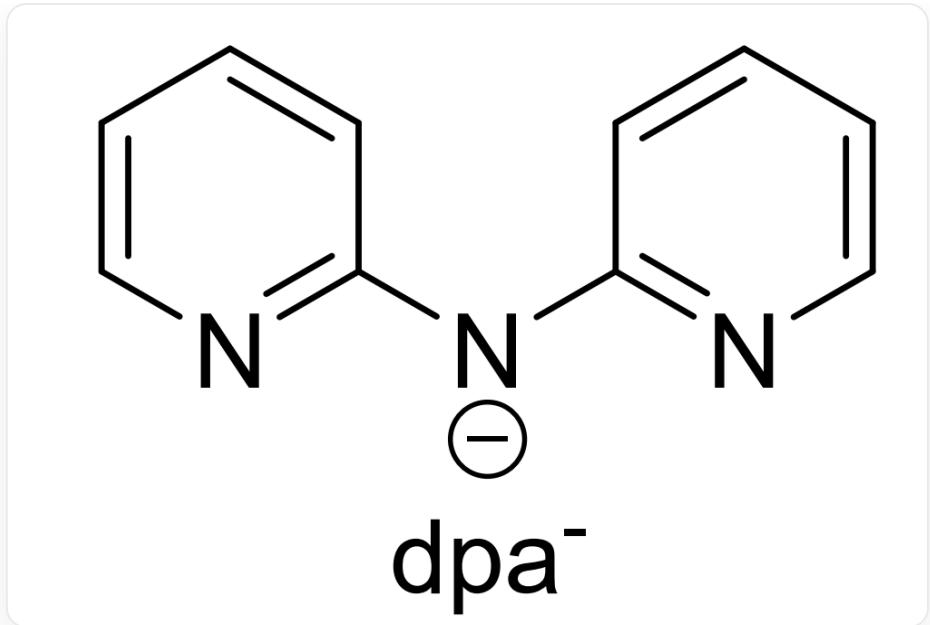

# Question

To a mixed  $\mathrm{CH}_2\mathrm{Cl}_2$  solution of  $\left[\mathrm{Au}(\mathrm{PPh}_3)_2\right]\left[\mathrm{SbF}_6\right]$  and  $\mathrm{Au} \cdot \mathbf{dpa}$  (the structure of the ligand  $\mathbf{dpa}^{-}$  is shown below), a methanol solution of  $\mathrm{CH}_3\mathrm{ONa}$  was added. The mixture was stirred at room temperature, and the system turned into a green solution. Under vigorous stirring, a freshly prepared ethanol solution of  $\mathrm{NaBH}_4$  was gradually added dropwise to the system, and the solution gradually turned light brown, and finally turned dark brown. The reaction was continued with stirring in the dark for  $20\mathrm{h}$ . The system was evaporated to dryness, washed with diethyl ether and ethanol to obtain a black solid A. Single crystals of A were obtained by recrystallization of A and studied. The following partial information about A was obtained:

(a)  $\mathbf{A}$  is a 1:2 type salt, and its cation is a cluster ion centered on the gold atom cluster  $\mathrm{Au}_{\mathrm{x}}^{\mathrm{y} + }$ ;  $\mathrm{Au}_{\mathrm{x}}^{\mathrm{y} + }$  has a double-layer nested structure in the form of  $[\mathrm{Au}_a@\mathrm{Au}_b]$ .  
(b) The main signal of the cation of  $\mathbf{A}$  in time-of-flight mass spectrometry is  $m / z = 4711.02$  
(c) A thermally decomposes at  $950^{\circ}\mathrm{C}$  with a weight loss of  $36.5\%$ , and the remaining solid residue is Au element.  
(d) Partial elemental content (mass fraction) of A: C, 24.8%; N, 2.55%; P, 2.50%

The figure shows the structure of dpa , and the smiles is expressed as:

$$
C 1 ([ N - ] C 2 = N C = C C = C 2) = N C = C C = C 1
$$

There are the following statements:

1,  $\left| \frac{x - y}{x + 2y} \right|^{\ln \left| \frac{x + y}{x - y} \right|} = 0.70$ .  
2, The molecular weight of  $\mathbf{A}$  is 9657.8.  
3,  $\left| \frac{a - b}{a + 2b} \right|^{\ln \left| \frac{a + b}{a - b} \right|} = 0.07$ .  
4, The phosphorus atoms in the cation of  $\mathbf{A}$  are coordinated to the inner gold atoms.

Then the following options contain all the correct options (the error of 1, 3 within 0.01 is considered correct):

A. All other options are incorrect  
B. 1  
C. 2

D. 3  
E. 4  
F. 1, 2  
G. 1, 3  
H. 1, 4  
1. 2,3  
J. 2,4  
K. 3, 4  
L. 1,2,3  
M. 1, 2, 4  
N. 1, 3, 4  
O. 2, 3, 4  
P. 1, 2, 3, 4

# Answer

Correct Answer: G

# Detailed Explanation

First, calculate the ratio of atoms by mass fraction:

$$
\mathrm {C}: \mathrm {N}: \mathrm {P} = \frac {24.8 \%}{12.01}: \frac {2.55 \%}{14.01}: \frac {2.50 \%}{30.97} \approx 11.35: 1: 0.4435
$$

The nitrogen atoms in  $\mathbf{A}$  only come from the ligand  $\mathbf{dpa}^{-}$ , so it is a multiple of 3. Thus, the above formula is transformed into:

$$
1 1. 3 5: 1: 0. 4 4 3 5 \approx 3 4. 0 5: 3: 1. 3 3 1 \approx 1 0 2: 9: 4
$$

Therefore,  $\mathrm{C} : \mathrm{N} : \mathrm{P} = 102 : 9 : 4$ . The total number of carbon atoms in 4 PPh $_3$  and 3 dpa $^-$  is  $4 \times 18 + 3 \times 10 = 102$ , which matches the calculation.

# CHECKPOINT

Atomic ratio of A C: N: P = 102:9:4

# 1 PTS

# CHECKPOINT

The carbon-containing ligands of  $\mathbf{A}$  are only  $\mathrm{PPh}_3$  and  $\mathbf{dpa}^{-}$  with a ratio of 4:3

# 2 PTS

The total molecular weight of  $4\mathrm{PPh}_3$  and  $3\mathbf{dpa}^{-}$  is  $4\times 262.3 + 3\times 170.192 = 1559.8$

A is a 1:2 type salt. Here, the anion can only be  $\mathrm{SbF}_6^-$ , so the cation carries two positive charges.

# CHECKPOINT

1 PTS

The cation of A carries two positive charges

Therefore, the mass spectrometry signal  $\mathrm{m / z} = \mathrm{M / 2}$ , from which the molecular weight of the cation can be obtained as  $2 \times 4711.02 = 9422.04$ .

If the cation contains  $4\mathrm{PPh}_3$  and  $3\mathrm{dpa}^{-}$ , the number of Au is  $\frac{9422.04 - 1559.8}{197} = 39.90$ , which means the gold content is too high, inconsistent with the thermogravimetric results.

If the cation contains  $8\mathrm{PPh}_3$  and  $6\mathrm{dpa}^{-}$ , the number of  $\mathrm{Au}$  is  $\frac{9422.04 - 1559.8\times 2}{197} = 32.00$ , which is consistent with the question. Therefore, the cation is  $[\mathrm{Au}_{32}(\mathrm{PPh}_3)_8(\mathrm{dpa})_6]^{2 + }$ ,  $x = 32$ ,  $y = 8$ .

# CHECKPOINT

2 PTS

The cation of  $\mathbf{A}$  is  $[\mathrm{Au}_{32}(\mathrm{PPh}_3)_8(\mathrm{dpa})_6]^{2+}$

# CHECKPOINT

0.5 PTS

$$
x = 3 2, y = 8
$$

Thus, the chemical formula of  $\mathbf{A}$  is  $[\mathrm{Au}_{32}(\mathrm{PPh}_3)_8(\mathrm{dpa})_6][\mathrm{SbF}_6]_2$ , and the molecular weight is 9893.56.

# CHECKPOINT

1 PTS

The molecular weight of  $\mathbf{A}$  is 9893.56

$\mathrm{Au}_{32}^{8+}$  has a double-layer nested structure in the form of  $[\mathrm{Au}_a@\mathrm{Au}_b]$ . It is speculated that it is a nesting of two polyhedra. Considering the simplest polyhedron, i.e., a regular polyhedron, then 32 atoms can be exactly divided into  $20 + 12$ , which is exactly a regular dodecahedron plus a regular icosahedron.

# CHECKPOINT

1 PTS

32 atoms form a regular dodecahedron and a regular icosahedron

The inside is a regular icosahedron with fewer atoms, and the outside is a regular dodecahedron with more atoms. Therefore,  $a = 12, b = 20$ .

# CHECKPOINT

1 PTS

$$
a = 1 2, b = 2 0
$$

Since the space inside the cage is very small, and  $\mathrm{PPh}_3$  has a large volume, it can only coordinate on the outside. Therefore, phosphorus atoms coordinate with the outer gold atoms.

# CHECKPOINT

1 PTS

$\mathrm{PPh}_3$  has a large volume, and phosphorus atoms coordinate with the outer gold atoms

The following is an analysis of the options:

1,  $\left| \frac{x - y}{x + 2y} \right|^{\ln \left| \frac{x + y}{x - y} \right|} = 0.70$ . Correct.  
2, The molecular weight of  $\mathbf{A}$  is 9893.56. Incorrect.  
3,  $\left| \frac{a - b}{a + 2b} \right|^{\ln \left| \frac{a + b}{a - b} \right|} = 0.07$ . Correct.  
4, In the cation of  $\mathbf{A}$ , phosphorus atoms coordinate with the outer gold atoms. Incorrect.

Choose G