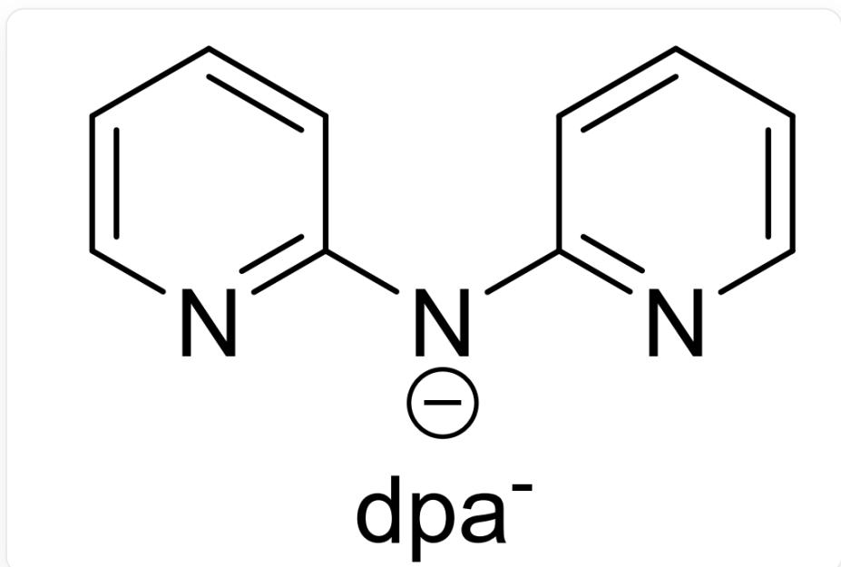

# 题目

向  $\left[\mathrm{Au}\left(\mathrm{PPh}_{3}\right)_{2}\right]\left[\mathrm{SbF}_{6}\right]$  和  $\mathrm{Au} \cdot \mathrm{dpa}$  (配体  $\mathrm{dpa}^{-}$ 的结构如下所示)的混合  $\mathrm{CH}_{2} \mathrm{Cl}_{2}$  溶液中, 加入  $\mathrm{CH}_{3} \mathrm{ONa}$  的甲醇溶液, 室温搅拌, 体系变为绿色溶液。在剧烈搅拌下, 向体系中逐渐滴加新制的  $\mathrm{NaBH}_{4}$  的乙醇溶液, 溶液逐渐变为淡棕色, 最后变为深棕色。继续避光搅拌反应  $20 \mathrm{~h}$ , 将体系蒸发干燥, 经乙醚和乙醇洗涤后, 得到一种黑色固体  $\mathbf{A}$ ; 对  $\mathbf{A}$  进行重结晶可得到  $\mathbf{A}$  的单晶并进行研究; 得出  $\mathbf{A}$  的部分信息如下:

(a) A 为 1:2 型盐, 其阳离子为以金原子簇  $\mathrm{Au}_{\mathrm{x}}^{\mathrm{y} +}$  为中心的簇离子;  $\mathrm{Au}_{\mathrm{x}}^{\mathrm{y} +}$  具有形如  $[\mathrm{Au}_{a}@\mathrm{Au}_{b}]$  的双层嵌套结构。  
(b)  $\mathbf{A}$  的阳离子在飞行时间质谱中的主要信号的  $m / z = 4711.02$  
(c) A 在  $950^{\circ} \mathrm{C}$  下热分解, 失重  $36.5 \%$ , 剩余固体残渣为  $\mathrm{Au}$  单质。  
(d) A 中部分元素含量(质量分数): C, 24.8%; N, 2.55%; P, 2.50%

  
图中展示了  $\mathbf{dpa}^{-}$  的结构，smiles表示为：C1([N-]C2=NC=CC=C2)=NC=CC=C1

有下列说法：

1,  $\left| \frac{x - y}{x + 2y} \right|^{\ln \left| \frac{x + y}{x - y} \right|} = 0.70$ 。  
2, A 的分子量为9657.8。  
3,  $\left| \frac{a - b}{a + 2b} \right|^{\ln \left| \frac{a + b}{a - b} \right|} = 0.07$ 。  
4. A 的阳离子中磷原子与内层金原子配位。

则下列选项中包含所有正确选项的是（1，3结果误差在0.01内视为正确）：

A. 其他选项均不正确  
B. 1  
C. 2  
D. 3

E. 4

F. 1,2  
G. 1, 3  
H. 1, 4  
1. 2,3  
J. 2,4

K. 3, 4  
L. 1,2,3  
M. 1, 2, 4  
N. 1,3,4  
O. 2, 3, 4  
P. 1, 2, 3, 4

# 答案

正确答案: G

# 详细解析

先通过质量分数计算原子数之比:

$$
\mathrm {C}: \mathrm {N}: \mathrm {P} = \frac {24.8 \%}{12.01}: \frac {2.55 \%}{14.01}: \frac {2.50 \%}{30.97} \approx 11.35: 1: 0.4435
$$

A中的氮原子仅来源于配体  $\mathbf{dpa}^{-}$  ，因此为3的倍数，于是上式化为：

$$
1 1. 3 5: 1: 0. 4 4 3 5 \approx 3 4. 0 5: 3: 1. 3 3 1 \approx 1 0 2: 9: 4
$$

于是  $\mathrm{C}:\mathrm{N}:\mathrm{P} = 102:9:4$  ，4个  $\mathrm{PPh}_3$  和3个  $\mathbf{dpa}^{-}$  的碳原子总数为  $4\times 18 + 3\times 10 = 102$  ,符合计算。

# CHECKPOINT

1 PTS

A原子数之比C：N：P=102：9：4

# CHECKPOINT

2 PTS

A 的含碳配体只有  $\mathrm{PPh}_{3}$  和  $\mathrm{dpa}^{-}$  且比例为  $4: 3$

4个  $\mathrm{PPh}_3$  和3个  $\mathbf{dpa}^{-}$  的总分子量为  $4\times 262.3 + 3\times 170.192 = 1559.8$  。

A 为 1:2 型盐, 此处阴离子只可能为  $\mathrm{SbF}_{6}^{-}$ , 因此阳离子带两个正电荷。

# CHECKPOINT

1 PTS

A的阳离子带两个正电荷

因此质谱信号  $\mathrm{m / z = M / 2}$  ，由此可得阳离子的分子量为  $2\times 4711.02 = 9422.04$  。

若阳离子中为4个  $\mathrm{PPh}_3$  和3个  $\mathbf{dpa}^{-}$ ，则  $\mathrm{Au}$  的数目为  $\frac{9422.04 - 1559.8}{197} = 39.90$ ，含金量过大，不符合热重结果。

若阳离子中为8个  $\mathrm{PPh}_3$  和6个  $\mathbf{dpa}^{-}$  ，则Au的数目为  $\frac{9422.04 - 1559.8\times 2}{197} = 32.00$  ，符合题意。因此阳离子为 $[\mathrm{Au}_{32}(\mathrm{PPh}_3)_8(\mathrm{dpa})_6]^{2 + }$  ，  $x = 32,y = 8$  。

# CHECKPOINT

2 PTS

A 的阳离子为  $\left[\mathrm{Au}_{32}\left(\mathrm{PPh}_{3}\right)_{8}(\mathrm{dpa})_{6}\right]^{2+}$

# CHECKPOINT

0.5 PTS

$$
x = 3 2, y = 8
$$

从而  $\mathbf{A}$  的化学式为  $\left[\mathrm{Au}_{32}(\mathrm{PPh}_{3})_{8}(\mathrm{dpa})_{6}\right]\left[\mathrm{SbF}_{6}\right]_{2}$ , 分子量为  $9893.56$  。

# CHECKPOINT

1 PTS

A的分子量为9893.56

$\mathrm{Au}_{32}^{8+}$  具有形如  $[\mathrm{Au}_a@\mathrm{Au}_b]$  的双层嵌套结构，推测其为两个多面体进行嵌套，考虑最简单的多面体即正多面体，则32个原子恰好可以分为  $20 + 12$  个，刚好为正十二面体加上正二十面体，

# CHECKPOINT

1 PTS

32个原子组成了正十二面体和正二十面体

内部为原子数较少的正二十面体，外部为原子数较多的正十二面体，因此  $a = 12, b = 20$ 。

# CHECKPOINT

1 PTS

$$
a = 1 2, b = 2 0
$$

由于笼内部的空间非常小，而  $\mathrm{PPh}_3$  体积较大，因此只能在外部配位，因此磷原子与外层金原子配位。

# CHECKPOINT

1 PTS

$\mathrm{PPh}_{3}$  体积较大，磷原子与外层金原子配位

下面进行选项分析：

1,  $\left| \frac{x - y}{x + 2y} \right|^{\ln \left| \frac{x + y}{x - y} \right|} = 0.70$  。正确。  
2，A的分子量为9893.56。错误。  
3,  $\left| \frac{a - b}{a + 2b} \right|^{\ln \left| \frac{a + b}{a - b} \right|} = 0.07$  。正确。

4. A 的阳离子中磷原子与外层金原子配位。错误。

选G