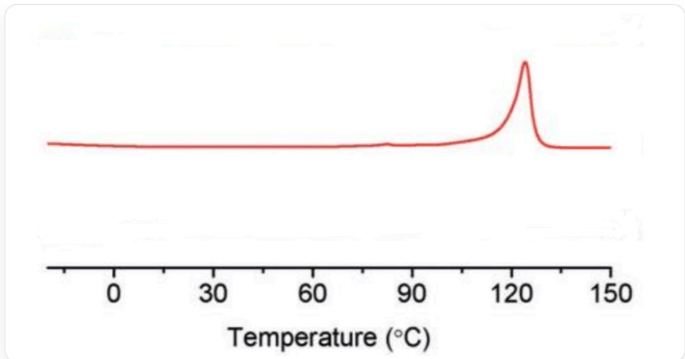
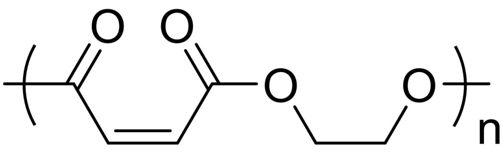

# Question

Polymer A can be synthesized from ethylene oxide and maleic anhydride in 1 hour at room temperature under the action of catalysts salcyCo $^{\mathrm{III}}$ NO $_3$  and PPN - NO $_3$ .

A undergoes condition X to obtain B.

B undergoes condition Y to obtain C; C undergoes condition X to obtain B.

It is known that the following figure shows the differential scanning calorimetry test data of one of A, B, C. Condition X and condition Y are selected from (a) reaction with  $10\%$  benzophenone at room temperature under  $365~\mathrm{nm}$  light for 5 hours; (b) reaction with  $10\%$ $\mathrm{Et}_2\mathrm{NH}$  at room temperature for 16 hours.

There are the following statements:

1. The nuclear magnetic resonance hydrogen spectrum of B has 3 peaks (excluding solvent peaks and impurity peaks such as reference substance peaks).  
2. The role of benzophenone is to initiate interchain crosslinking of the polymer.  
3. Condition X is (a), and condition Y is (b).  
4. The following figure is the differential scanning calorimetry test data of B.

The image is a scientific line graph showing a red curve. The horizontal axis is labeled "Temperature  $(^{\circ}C)$ " with values ranging from 0 to 150, with major ticks at 0, 30, 60, 90, 120, 150, and smaller ticks in between. The vertical axis is unlabeled and does not display any values. The red curve is roughly flat in the left half of the image, then exhibits a significant, sharp, upward peak at approximately  $120^{\circ}C$ . After the peak, the curve rapidly declines and flattens out again. There is no other text or legends on the image other than the axis labels and values.

What is the sum of the numbers of all correct statements?

A. 1  
B. 2  
C. 4  
D. 5  
E. 6  
F. 7

G. 9  
H. All of the above options are incorrect.

# Answer

Correct Answer: C

# Detailed Explanation

Cyclic anhydrides and ethylene oxide are very reactive. A is the product of their ring-opening polymerization, i.e.,

polymer, the repeating unit is  $\mathrm{O} = [\mathrm{C}] / \mathrm{C} = \mathrm{C} \backslash \mathrm{C}(\mathrm{OCC}[\mathrm{O}]) = \mathrm{O}$ , with unknown end groups.

All carbon-carbon double bonds in A are cis.

# CHECKPOINT

1 PTS

All carbon-carbon double bonds in A are cis.

Analyze the reaction caused by photochemical conditions: If it is interchain crosslinking, its irreversibility does not match the interconversion of B and C, which is excluded. Another possibility is the cis-trans isomerization of carbon-carbon double bonds. Trans carbon-carbon double bonds are more stable than cis carbon-carbon double bonds due to smaller steric hindrance. Condition (b) is the reversible 1,4-addition of amine to unsaturated ester, which can realize the conversion of carbon-carbon double bonds from cis to trans (more stable). Therefore,

condition X is (b), and condition Y is (a), (a) leads to the conversion of trans olefins to cis olefins. Statement 3 is incorrect.

# CHECKPOINT

1 PTS

The irreversibility of interchain crosslinking does not match the interconversion of B and C, which is excluded.

# CHECKPOINT

1 PTS

Condition X is (b), and condition Y is (a).

It is inferred that all carbon-carbon double bonds in B are trans, and the carbon-carbon double bonds in C are a mixture of cis and trans.

# CHECKPOINT

1 PTS

All carbon-carbon double bonds in B are trans.

# CHECKPOINT

1 PTS

The carbon-carbon double bonds in C are a mixture of cis and trans.

B has 2 kinds of hydrogen in different chemical environments, and there are 2 peaks in the nuclear magnetic resonance hydrogen spectrum. Statement 1 is incorrect.

# CHECKPOINT

1 PTS

The nuclear magnetic resonance hydrogen spectrum of B has 2 peaks.

Benzophenone is a photosensitizer, which easily absorbs ultraviolet light to reach the triplet excited state, and then transfers the triplet energy to the carbon-carbon double bond, catalyzing trans-cis isomerization. Statement 2 is incorrect.

# CHECKPOINT

1 PTS

Benzophenone is a photosensitizer, transfers energy to the carbon-carbon double bond, and catalyzes trans-cis isomerization.

The substance with differential scanning calorimetry data in the figure has a clear melting point and is crystalline. The carbon-carbon double bonds in polymer B are all in the trans configuration, and the polymer chains can be regularly and closely arranged to form a highly ordered crystal lattice. The double bonds of polymer A are all in the cis configuration, and the regularity of arrangement is worse than that of trans. Polymer C is randomly arranged in cis and trans, and the regularity of the chain is poor, so statement 4 is correct.

# CHECKPOINT

0.5 PTS

The carbon-carbon double bonds in B are all in the trans configuration, and the polymer chains can be regularly and closely arranged to form a highly ordered crystal lattice.

# CHECKPOINT

0.5 PTS

The regularity of A and C chains is poor, neither is crystalline, and there is no clear melting point.

In summary, the correct statement number is 4, select option C.