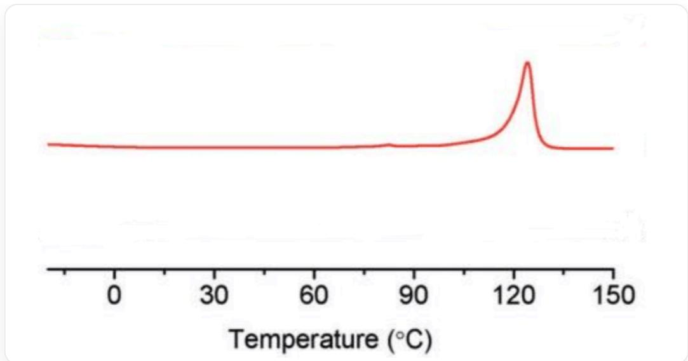
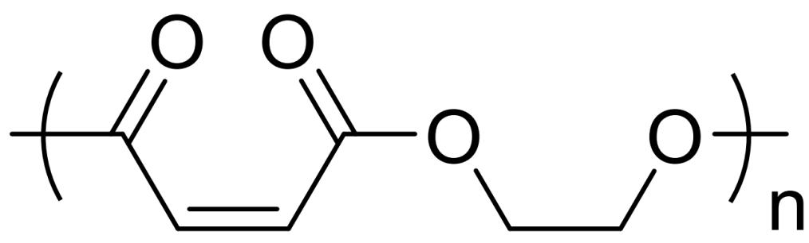

# 题目

以环氧乙烷和马来酸酐为原料，在催化剂  $\mathrm{salcyCo}^{\mathrm{III}}\mathrm{NO}_3$  和  $\mathrm{PPN - NO_3}$  的作用下常温下反应1小时可合成聚合物A。

A 经历条件 X 得到 B。  
B 经历条件 Y 得到 C；C 经历条件 X 得到 B。

已知，下图展示了 A, B, C 中一者的差示扫描量热测试数据。条件 X 和条件 Y 在 (a) 在  $365 \mathrm{~nm}$  光照下与  $10 \%$  二苯甲酮在室温反应5小时；(b) 与  $10 \%$  的  $\mathrm{Et}_{2} \mathrm{NH}$  在常温反应16小时当中选择。

有如下说法

1. B 的核磁共振氢谱有3个峰（不含溶剂峰和基准物质峰等杂峰）。  
2. 二苯甲酮的作用是引发聚合物链间交联。  
3. 条件 X 是 (a)，条件 Y 是 (b)。  
4. 下图是 B 的差示扫描量热测试数据。

该图像是一个科学线图，展示了一条红色的曲线。水平轴的标签是“Temperature  $(^{\circ}C)$ ”，其数值范围从0到150，主要刻度位于0,30,60,90,120,150处，其间还有较小的刻度线。垂直轴没有标签，也没有显示任何数值。红色的曲线在图像的左半部分大致保持平坦，然后在大约  $120^{\circ}C$  处出现一个显著的、尖锐的、向上的峰值。峰值过后，曲线迅速下降并再次趋于平坦。图像上除了轴标签和数值外，没有其他文字或图例。

所有正确说法编号之和为多少？

A. 1  
B. 2  
C. 4  
D. 5  
E. 6  
F. 7

G. 9  
H. 以上选项均不对

# 答案

正确答案: C

# 详细解析

环状酸酐和环氧乙烷非常活泼，A 为二者开环聚合的产物，即

  
聚合物，重复单元为  $O = [C] / C = C \backslash C(OCC[O]) = 0$  ，端基不明

A 中碳碳双键全为顺式。

# CHECKPOINT

1 PTS

A 中碳碳双键全为顺式。

分析光化学条件导致的反应：若为链间交联，其不可逆性与B和C的相互转化不匹配，排除。另一种可能是碳碳双键的顺反转化。反式碳碳双键由于位阻更小，比顺式碳碳双键更稳定。条件(b)是胺对不饱和酯的可逆1,4-进攻，可以实现碳碳双键由顺到反（更稳定）的转化，所以条件X是(b)，条件Y则是(a)，(a)导致反式烯烃到顺式烯烃的转化。说法3错误。

# CHECKPOINT

1 PTS

链间交联的不可逆性与 B 和 C 的相互转化不匹配，排除。

# CHECKPOINT

1 PTS

条件X是(b)，条件Y是(a)。

由此推断 B 中碳碳双键全为反式，C 中碳碳双键是顺式和反式的混合。

# CHECKPOINT

1 PTS

B 中碳碳双键全为反式。

# CHECKPOINT

1 PTS

C 中碳碳双键是顺式和反式的混合。

B 有2种不同化学环境的氢，核磁氢谱有2个峰，说法1错误。

# CHECKPOINT

1 PTS

B 的核磁氢谱有2个峰。

二苯甲酮为光敏剂，易吸收紫外光激发到达三重激发态，进而传递三重态能量到碳碳双键，催化反式-顺式异构化。说法2错误。

# CHECKPOINT

1 PTS

二苯甲酮为光敏剂，传递能量到碳碳双键，催化反式-顺式异构化。

得到图中差示扫描量热测试数据的物质有明确熔点，有结晶性。聚合物B中碳碳双键为全反式构型，高分子链可以规整紧密排列，形成高度有序的晶格。聚合物A的双键为全顺式构型，排列规整性较反式差，聚合物C为顺式和反式无规排列的，链的规整性差，故说法4正确。

# CHECKPOINT

0.5 PTS

B 中碳碳双键为全反式构型，高分子链可以规整紧密排列，形成高度有序的晶格。

# CHECKPOINT

0.5 PTS

A 和 C 链的规整性差，均不结晶，没有明确熔点。

综上所述，正确说法编号为4，选C选项。