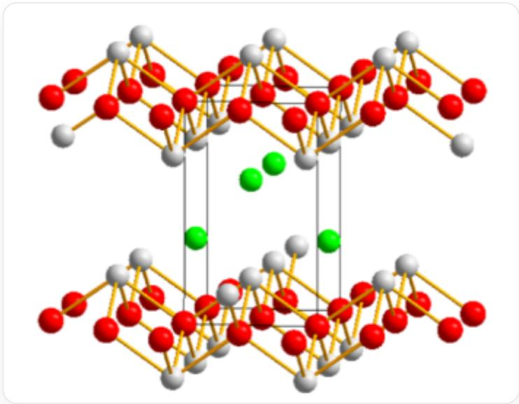
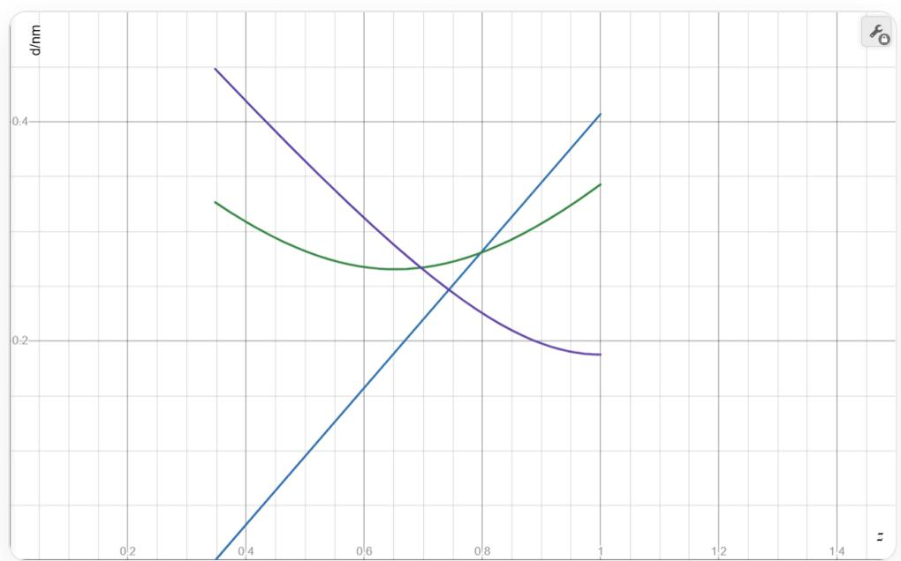
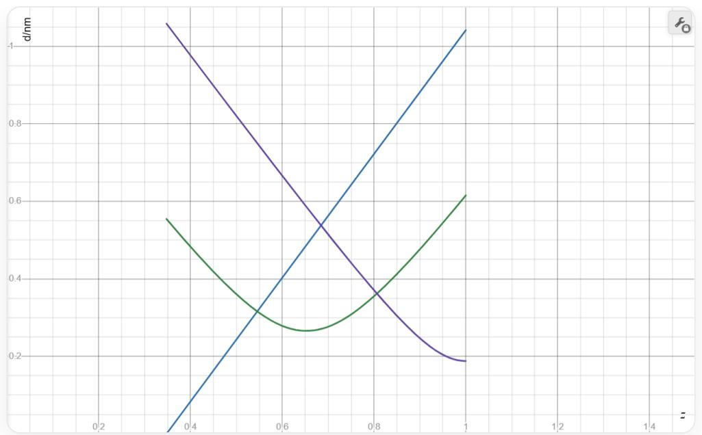

# Question

A metallic element  $\mathbf{M}$  can form a  $1:1:1$  compound crystal with fluorine and oxygen. The structure of this crystal is as follows: O atoms are arranged in an ordered manner, forming parallel stacked oxygen layers; a group of M atoms and F atoms together fill the elongated cubic voids formed by the O atoms, with M adopting a mono-capped square antiprismatic coordination. If the O atoms are taken as the vertices of the unit cell, the coordinates of one F atom are  $\left(\frac{1}{2},0,0.3476\right)$ , and the F atoms form a distorted tetrahedron within this unit cell. In this crystal, the distance between adjacent oxygen atoms is  $d_{\mathrm{O - O}} = 265.6~\mathrm{pm}$ , and the lattice parameter  $a = 375.6~\mathrm{pm}$ .

If the distorted tetrahedron formed by the F atoms exhibits two types of  $\angle \mathrm{F} - \mathrm{F} - \mathrm{F}$  angles, the larger of which is  $70.2^{\circ}$ , calculate the value of the lattice parameter  $c$ .

A.  $316.8 \mathrm{pm}$  
B.  $623.6 \mathrm{pm}$  
C.  $1247.2 \mathrm{pm}$  
D.  $2594 \mathrm{pm}$  
E.  $399.2 \mathrm{pm}$  
F.  $798.3 \mathrm{pm}$  
G.  $1596.6 \mathrm{pm}$  
H.  $3193 \mathrm{pm}$

I. All other options are incorrect.

# Answer

Correct Answer: B

# Detailed Explanation

Since  $\frac{d_{\mathrm{O - O}}}{a} = \frac{1}{\sqrt{2}}$ , it can be reasonably inferred that when one  $\mathrm{O}$  atom is located at the vertex of the unit cell, there is another  $\mathrm{O}$  atom located at the face center of the bottom face, with coordinates  $\left(\frac{1}{2}, \frac{1}{2}, 0\right)$ .

# CHECKPOINT

1 PTS

$$
\frac {d _ {\mathrm {O - O}}}{a} = \frac {1}{\sqrt {2}}
$$

# CHECKPOINT

1 PTS

There is an O atom located at  $\left(\frac{1}{2},\frac{1}{2},0\right)$

Therefore, the number of formula units in this unit cell is at least 2, and the crystal has tetragonal symmetry.

# CHECKPOINT

1 PTS

The crystal has tetragonal symmetry

The coordinates of one  $\mathbf{F}$  atom are  $\left(\frac{1}{2},0,0.3476\right)$ . Considering that the 9 vertices of the monocapped square antiprism can be divided into 3 layers, including two squares staggered by  $45^{\circ}$  and a single vertex located in the  $z$

direction. Therefore, the coordinates of one  $\mathbf{M}$  atom can be set as  $\left(\frac{1}{2},0,z\right)$ , which is located on the midline of one side of the unit cell, aligned with the known coordinates of one  $\mathbf{F}$  atom.  $\mathbf{F}$  forms the single vertex of the monocapped square antiprism, and 4 O atoms constitute one square layer of the monocapped square antiprism, with the direction of the remaining square layer differing by  $45^{\circ}$ .

# CHECKPOINT

1 PTS

One  $\mathbf{M}$  is located at  $\left(\frac{1}{2},0,z\right)$

# CHECKPOINT

2 PTS

The single vertex of the monocapped square antiprism is F , and one square layer is composed of O

Now consider the other square layer of the monocapped square antiprism. Since the coordinates of two O atoms in the unit cell are already known, if both the upper and lower layers are composed of O, then an  $\mathrm{O} - \mathrm{F} - \mathrm{F} - \mathrm{O}$  layer will inevitably exist. Continuous stacking of four layers of anions is very unstable, and it is difficult to satisfy the  $1:1:1$  ratio if both the upper and lower layers are O. Therefore, consider using F to construct the other square layer.

# CHECKPOINT

1 PTS

The other square layer of the monocapped square antiprism is composed of F

Since the directions of the two square layers in the monocapped square antiprism differ by  $45^{\circ}$ , and the O square is  $(0,0,0)$ ,  $(1,0,0)$ ,  $\left(\frac{1}{2},\frac{1}{2},0\right)$ ,  $\left(\frac{1}{2}, - \frac{1}{2},0\right)$ , with its sides along the face diagonal direction, the sides of the square composed of F atoms should be along the coordinate axis direction.

In order to maintain a formula unit number of 2, only one additional F atom can be introduced into a unit cell, with a reasonable position being  $x = 0, y = \frac{1}{2}$ . Since F forms a distorted tetrahedron in the unit cell with O as the vertex, its  $z$  coordinate cannot be the same as the known 0.3476. Due to tetragonal symmetry, a reasonable coordinate is  $z = 1 - 0.3476 = 0.6524$ , i.e., the coordinates of the other F atom are  $(0, \frac{1}{2}, 0.6524)$ .

# CHECKPOINT

1 PTS

The coordinates of the other F atom are  $(0, \frac{1}{2}, 0.6534)$

In this way, two monocapped square antiprisms are formed in the unit cell, one with a single vertex facing up and the other facing down, which exactly accommodates 2 M atoms, satisfying the  $1:1:1$  atomic ratio.

# CHECKPOINT

1 PTS

There are 2 monocapped square antiprisms in the unit cell

The specific unit cell structure is as follows, where the red spheres are O, the green spheres are F, and the gray spheres are M.

图中有一个由灰色线描绘的长方体，其高度大于水平方向的长宽，图中还有红色、灰色、绿色三种球以及连接的黄色线段。其中，大量红色球和灰色球按1:1的数量比构成两个相同的、上下起伏的层，分别位于长方体的顶面和底面，同一层的红色球高度一致，占据长方体的顶点以及相应顶面或底面的面心，灰色球位于红色球形成的平面上下两侧，每对相邻的灰色球与红色球之间通过一条黄色线段相连，每个灰色球与4个红色球相连，每个红色球与4个灰色球相连，以长方体的侧面为参照，位于前后侧面的灰色球位置高于所连接的红色球，位于左右侧面的灰色球低于所连接的红色球。图中画出了4个绿色球分别位于前后侧面的中部偏上和左右侧面的中部偏下。

In this unit cell, the tetrahedron formed by  $\mathbf{F}$  consists of 4 congruent isosceles triangles, belonging to the  $D_{2\mathrm{d}}$  point group. The  $\angle \mathrm{F} - \mathrm{F} - \mathrm{F}$  bond angles are of two types, namely the apex angle and the base angle of the isosceles triangle.

# CHECKPOINT

1 PTS

There are two types of  $\angle \mathrm{F} - \mathrm{F} - \mathrm{F}$  bond angles, namely the apex angle and the base angle of the isosceles triangle

In this tetrahedron, there is a pair of mutually perpendicular edges with a length of  $a$ . The other 4 oblique edge lengths are  $\sqrt{\left(\frac{a}{\sqrt{2}}\right)^2 + ((1 - 2 \times 0.3476)c)^2} = \sqrt{\frac{a^2}{2} + (0.3048c)^2}$ .

# CHECKPOINT

1 PTS

The two types of edge lengths of the tetrahedron are  $a$  and  $\sqrt{\frac{a^2}{2} + (0.3048c)^2}$ .

From geometric relationships, if the apex angle of the isosceles triangle is  $70.2^{\circ}$ , then  $\sin \frac{70.2^{\circ}}{2} = \frac{\frac{a}{2}}{\sqrt{\frac{a^{2}}{2} + (0.3048c)^{2}}}$ . Substituting and solving gives  $c = 623.6\mathrm{pm}$ .

# CHECKPOINT

1 PTS

If the apex angle is  $70.2^{\circ}$ , then  $c = 623.6 \, \mathrm{pm}$

If the base angle of the isosceles triangle is  $70.2^{\circ}$ , then  $\cos 70.2^{\circ} = \frac{\frac{a}{2}}{\sqrt{\frac{a^{2}}{2} + (0.3048c)^{2}}}$ . Substituting and solving gives  $c = 1596.6$  pm.

# CHECKPOINT

1 PTS

If the base angle is  $70.2^{\circ}$ , then  $c = 1596.6 \, \mathrm{pm}$

Observing the options, it can be seen that the correct option should be one of  $\mathbf{B}, \mathbf{G}$ . To determine which of the above classifications is physically realistic, consider the distance between each vertex in the coordination polyhedron and  $\mathbf{M}$ . It has been previously assumed that the coordinates of one  $\mathbf{M}$  atom are  $\left(\frac{1}{2}, 0, z\right)$ . From the previous discussion, it is known that in order to satisfy the structure of the 9-coordinate monocapped square antiprism, it is necessary that  $0.3476 \leq z \leq 1$ , but the specific coordinates cannot be deduced.

# CHECKPOINT

1 PTS

$$
0. 3 4 7 6 \leq z \leq 1
$$

From the atomic coordinates in the crystal, there are two types of  $\mathbf{M} - \mathbf{F}$  bond lengths (axial and non-axial) and one type of  $\mathbf{M} - \mathbf{O}$  bond length, which are  $(z - 0.3476)c$  (axial  $\mathbf{M} - \mathbf{F}$ ),  $\sqrt{\frac{a^2}{2} + ((z - 0.6524)c)^2}$  (non-axial  $\mathbf{M} - \mathbf{F}$ ) and  $\sqrt{\left(\frac{a}{2}\right)^2 + ((1 - z)c)^2}$  ( $\mathbf{M} - \mathbf{O}$ ).

# CHECKPOINT

1 PTS

There are two types of  $\mathbf{M} - \mathbf{F}$  bond lengths (axial and non-axial) and one type of  $\mathbf{M} - \mathbf{O}$  bond length

# CHECKPOINT

1 PTS

The axial  $\mathbf{M} - \mathbf{F}$  bond length is  $(z - 0.3476)c$

# CHECKPOINT

1 PTS

The non-axial  $\mathbf{M} - \mathbf{F}$  bond length is  $\sqrt{\frac{a^2}{2} + ((z - 0.6524)c)^2}$ .

# CHECKPOINT

3 PTS

The  $\mathbf{M} - \mathbf{O}$  bond length is  $\sqrt{\left(\frac{a}{2}\right)^2 + \left((1 - z)c\right)^2}$

Let  $c = 623.6 \, \mathrm{pm}$  and  $c = 1596.6 \, \mathrm{pm}$  respectively, and plot the three bond lengths against  $z$ .

For the case of  $c = 623.6 \, \mathrm{pm}$ , we have:

该图为二维坐标图。横坐标标签为z，范围0~1.5，每0.2有一深灰线并附带坐标，每0.05有一浅灰线；纵坐标标签为d/nm，范围为0~0.5，在0.2和0.4处有一深灰线并附带坐标，每0.05有一浅灰线。图中有蓝、绿、紫三条彩色线，三条线的左端均位于横坐标0.375附近且略向左超出，右端均位于横坐标1处。从左往右看，蓝色线为上升的直线段，左端纵坐标为0，右端纵坐标略高于0.4。绿色线先降后升，两个端点均位于纵坐标0.3~0.35之间，右端点略高，绿色线在横坐标0.65附近达到最低点，其纵坐标略高于0.25。紫色线先直线下降后向右弯曲至水平，左端点纵坐标约为0.45，右端点纵坐标略低于0.2。三条彩色线在横坐标约0.7~0.8，纵坐标约0.25至0.3范围内形成3个交点，蓝-紫两线的交点位于绿色线下方。

For the case of  $c = 1596.6$  pm, we have:

该图为二维坐标图。横坐标标签为z，范围0~1.5，每0.2有一深灰线并附带坐标，每0.05有一浅灰线；纵坐标标签为d/nm，范围为0~1.1，每0.2有一深灰线并附带坐标，每0.05有一浅灰线。图中有蓝、绿、紫三条彩色线，三条线的左端均位于横坐标0.375附近且略向左超出，右端均位于横坐标1处。从左往右看，蓝色线为上升的直线段，左端纵坐标为0，右端纵坐标略低于1.05。绿色线先降后升，左端点纵坐标略高于0.55，右端点纵坐标略高于0.6，绿色线在横坐标0.65附近达到最低点，其纵坐标略高于0.25。紫色线先直线下降后向右弯曲至水平，直线下降段斜率与蓝色线斜率的负值相近，左端点纵坐标略高于1.05，右端点纵坐标略低于0.2。三条彩色线在横坐标略低于0.45至略高于0.8，纵坐标约0.3至0.55范围内形成3个交点，蓝-紫两线的交点位于绿色线相应横坐标处上方。

In the two figures, the blue line is the axial  $\mathbf{M} - \mathbf{F}$  bond length, the green line is the non-axial  $\mathbf{M} - \mathbf{F}$  bond length, and the purple line is the  $\mathbf{M} - \mathbf{O}$  bond length.

From the figures, it can be seen that when  $c = 623.6$  pm, a suitable  $z$  value can be found such that the bond lengths are in the range of  $0.25$  nm to  $0.3$  nm and the bond length difference is small, which is consistent with the general bond length range of actual ionic crystals formed by F, O. However, when  $c = 1596.6$  pm, regardless of the value of  $z$  within the range, the difference in bond lengths reaches 1.7 to 1.8 times, which is inconsistent with objective facts. Therefore, the only correct option is B.

# CHECKPOINT

1 PTS

When  $c = 623.6 \, \mathrm{pm}$ , the bond length range is suitable

# CHECKPOINT

1 PTS

When  $c = 1596.6 \, \mathrm{pm}$ , the bond length difference is too large