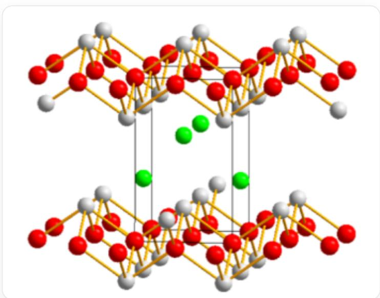
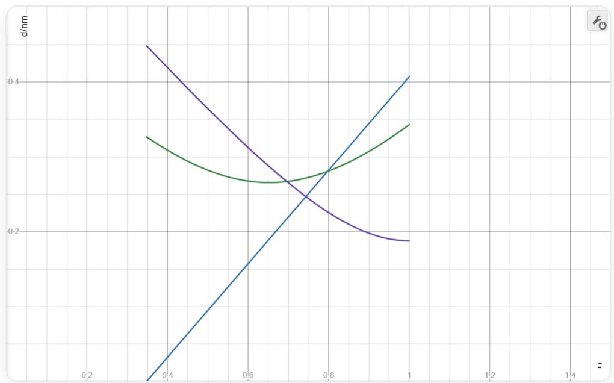
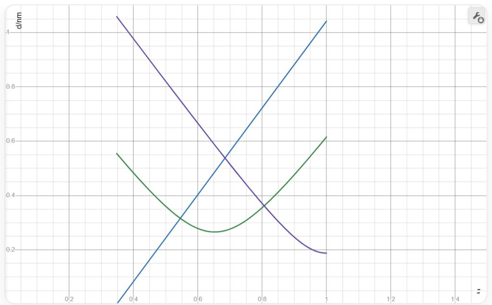

# 题目

某金属元素M可与氟、氧两种元素构成1:1:1化合物晶体。该晶体的结构为：O原子有序排布，形成平行堆积的氧原子层；一组M原子与F原子共同填入O原子形成的拉长立方体空隙中，M为单帽四方反棱柱配位；若以O原子为晶胞顶点，其中一个F原子的坐标为  $\left(\frac{1}{2},0,0.3476\right)$ ，F在该晶胞中构成变形四面体。该晶体中，相邻氧原子间的距离为  $d_{\mathrm{O - O}} = 265.6\mathrm{pm}$ ，晶胞参数  $a = 375.6\mathrm{pm}$ 。

若F原子构成的变形四面体中存在两种  $\angle \mathrm{F} - \mathrm{F} - \mathrm{F}$  角度，较大的一个为  $70.2^{\circ}$ ，求晶胞参数  $c$  的值。

A.  $316.8 \mathrm{pm}$  
B.  $623.6 \mathrm{pm}$  
C.  $1247.2 \mathrm{pm}$  
D.  $2594 \mathrm{pm}$  
E.  $399.2 \mathrm{pm}$  
F.  $798.3 \mathrm{pm}$  
G.  $1596.6 \mathrm{pm}$  
H.  $3193 \mathrm{pm}$

I. 其他选项均不正确

# 答案

正确答案: B

# 详细解析

由于  $\frac{d_{\mathrm{O - O}}}{a} = \frac{1}{\sqrt{2}}$  ，可合理推断，当一个O原子位于晶胞顶点时，存在另一个O原子位于底面面心，坐标为 $\left(\frac{1}{2},\frac{1}{2},0\right)$  。

# CHECKPOINT

1 PTS

$$
\frac {d _ {\mathrm {O - O}}}{a} = \frac {1}{\sqrt {2}}
$$

# CHECKPOINT

1 PTS

存在O原子位于  $\left(\frac{1}{2},\frac{1}{2},0\right)$

故该晶胞的式量数至少为2，晶体具有四方对称性。

# CHECKPOINT

1 PTS

晶体具有四方对称性

一个F原子的坐标为  $\left(\frac{1}{2},0,0.3476\right)$  ，考虑到单帽四方反棱柱的9个顶点可分为3层，包含两个相互错开  $45^{\circ}$  的正方形和位于  $z$  方向的单个顶点。因此，可以设一个M原子的坐标为  $\left(\frac{1}{2},0,z\right)$  ，其位于晶胞的一个侧面

的中线上，与已知的1个F原子坐标对齐，F形成单帽四方反棱柱的单个顶点，4个O原子构成单帽四方反棱柱的一个正方形层，剩下一个正方形层的方向与之相差  $45^{\circ}$  。

# CHECKPOINT

1 PTS

一个  $\mathbf{M}$  位于  $\left(\frac{1}{2},0,z\right)$

# CHECKPOINT

2 PTS

单帽四方反棱柱的单个顶点为F，一个正方形层由O构成

现在考虑单帽四方反棱柱的另一个正方形层，由于晶胞中已有2个O原子的坐标已知，如果上下层都由O构成，那么不可避免的会存在O-F-F-O层，四层阴离子连续堆积很不稳定，并且如果上下层都是O很难满足比例为  $1:1:1$  ，因此考虑用F来构建另一个正方形层。

# CHECKPOINT

1 PTS

单帽四方反棱柱的另一个正方形层由F构成

由于单帽四方反棱柱中的两个正方形层方向相差  $45^{\circ}$ ，而O正方形为  $(0,0,0),(1,0,0),\left(\frac{1}{2},\frac{1}{2},0\right),\left(\frac{1}{2}, - \frac{1}{2},0\right)$ ，其边为面对角线方向，这个由F原子构成的正方形的边应当沿坐标轴方向。

为了保持式量数为2，一个晶胞中只能额外引入1个F原子，合理的位置为  $x = 0, y = \frac{1}{2}$  。由于F在以O为顶点的晶胞中构成变形四面体，其  $z$  坐标不能与已知的0.3476相同，由四方对称性，合理的坐标是  $z = 1 - 0.3476 = 0.6524$  ，即另一个F原子的坐标为  $\left(0, \frac{1}{2}, 0.6524\right)$  。

# CHECKPOINT

1 PTS

另一个F原子的坐标为  $\left(0,\frac{1}{2},0.6534\right)$

这样，晶胞中就形成了两个单帽四方反棱柱，一个单顶点朝上，另一个朝下，其恰好容纳2个M原子，满足  $1:1:1$  原子比。

# CHECKPOINT

1 PTS

晶胞中有2个单帽四方反棱柱

具体的晶胞结构如下，其中红色球为O，绿色球为F，灰色球为M。

图中有一个由灰色线描绘的长方体，其高度大于水平方向的长宽，图中还有红色、灰色、绿色三种球以及连接的黄色线段。其中，大量红色球和灰色球按1:1的数量比构成两个相同的、上下起伏的层，分别位于长方体的顶面和底面，同一层的红色球高度一致，占据长方体的顶点以及相应顶面或底面的面心，灰色球位于红色球形成的平面上下两侧，每对相邻的灰色球与红色球之间通过一条黄色线段相连，每个灰色球与4个红色球相连，每个红色球与4个灰色球相连，以长方体的侧面为参照，位于前后侧面的灰色球位置高于所连接的红色球，位于左右侧面的灰色球低于所连接的红色球。图中画出了4个绿色球分别位于前后侧面的中部偏上和左右侧面的中部偏下。

在该晶胞中，F形成的四面体由4个全等的等腰三角形构成，属  $D_{2\mathrm{d}}$  点群，其  $\angle \mathbf{F} - \mathbf{F} - \mathbf{F}$  夹角有两种，分别为等腰三角形的顶角和底角。

# CHECKPOINT

1 PTS

$\angle \mathrm{F} - \mathrm{F} - \mathrm{F}$  夹角有两种，分别为等腰三角形的顶角和底角

在这个四面体中，存在一对相互垂直的棱，其长度为  $a$  ，另外4条斜向棱长为  $\sqrt{\left(\frac{a}{\sqrt{2}}\right)^2 + \left((1 - 2\times 0.3476)c\right)^2} = \sqrt{\frac{a^2}{2} + (0.3048c)^2}$  。

# CHECKPOINT

1 PTS

四面体的两种棱长分别为  $a$  和  $\sqrt{\frac{a^2}{2} + (0.3048c)^2}$

由几何关系，若等腰三角形的顶角为  $70.2^{\circ}$ ，则  $\sin \frac{70.2^{\circ}}{2} = \frac{\frac{a}{2}}{\sqrt{\frac{a^{2}}{2} + (0.3048c)^{2}}}$ ，代入解得  $c = 623.6\mathrm{pm}$ 。

# CHECKPOINT

1 PTS

若顶角为  $70.2^{\circ}$  ，则  $c = 623.6\mathrm{pm}$

若等腰三角形的底角为  $70.2^{\circ}$ ，则  $\cos 70.2^{\circ} = \frac{\frac{a}{2}}{\sqrt{\frac{a^{2}}{2} + (0.3048c)^{2}}}$ ，代入解得  $c = 1596.6\mathrm{pm}$ 。

# CHECKPOINT

1 PTS

若底角为  $70.2^{\circ}$  ，则  $c = 1596.6 \mathrm{pm}$

观察选项，可知正确选项应为B,G之一。为了确定上述分类讨论中，哪一种是符合物理实际的。考虑配位多面体中各顶点与M的距离。前面已设一个M原子的坐标为  $\left(\frac{1}{2},0,z\right)$  ，由前述讨论可知为了满足9配位单帽四方反棱柱的结构，需要  $0.3476\leq z\leq 1$  ，但具体坐标无法推算。

# CHECKPOINT

1 PTS

$$
0. 3 4 7 6 \leq z \leq 1
$$

由晶体中的原子坐标，有两种  $\mathbf{M} - \mathbf{F}$  键长（轴向和非轴向）和一种  $\mathbf{M} - \mathbf{O}$  键长，分别为  $(z - 0.3476)c$  （轴向  $\mathbf{M} - \mathbf{F}$  ）， $\sqrt{\frac{a^2}{2} + ((z - 0.6524)c)^2}$  （非轴向  $\mathbf{M} - \mathbf{F}$  ）和  $\sqrt{\left(\frac{a}{2}\right)^2 + ((1 - z)c)^2}$  （ $\mathbf{M} - \mathbf{O}$ ）。

# CHECKPOINT

1 PTS

有两种M-F键长（轴向和非轴向）和一种M-O键长

# CHECKPOINT

1 PTS

轴向  $\mathbf{M} - \mathbf{F}$  键长为  $(z - 0.3476)c$

# CHECKPOINT

1 PTS

非轴向  $\mathbf{M} - \mathbf{F}$  键长为  $\sqrt{\frac{a^2}{2} + \left((z - 0.6524)c\right)^2}$

# CHECKPOINT

3 PTS

$\mathbf{M} - \mathbf{O}$  键长为  $\sqrt{\left(\frac{a}{2}\right)^2 + \left((1 - z)c\right)^2}$

分别取  $c = 623.6 \mathrm{pm}$  和  $c = 1596.6 \mathrm{pm}$ ，将三种键长对z作图。

对于  $c = 623.6 \mathrm{pm}$  的情形，有：

该图为二维坐标图。横坐标标签为z，范围0~1.5，每0.2有一深灰线并附带坐标，每0.05有一浅灰线；纵坐标标签为d/nm，范围为0~0.5，在0.2和0.4处有一深灰线并附带坐标，每0.05有一浅灰线。图中有蓝、绿、紫三条彩色线，三条线的左端均位于横坐标0.375附近且略向左超出，右端均位于横坐标1处。从左往右看，蓝色线为上升的直线段，左端纵坐标为0，右端纵坐标略高于0.4。绿色线先降后升，两个端点均位于纵坐标0.3~0.35之间，右端点略高，绿色线在横坐标0.65附近达到最低点，其纵坐标略高于0.25。紫色线先直线下降后向右弯曲至水平，左端点纵坐标约为0.45，右端点纵坐标略低于0.2。三条彩色线在横坐标约0.7~0.8，纵坐标约0.25至0.3范围内形成3个交点，蓝-紫两线的交点位于绿色线下方。

对于  $c = 1596.6 \mathrm{pm}$  的情形，有：

该图为二维坐标图。横坐标标签为z，范围0~1.5，每0.2有一深灰线并附带坐标，每0.05有一浅灰线；纵坐标标签为d/nm，范围为0~1.1，每0.2有一深灰线并附带坐标，每0.05有一浅灰线。图中有蓝、绿、紫三条彩色线，三条线的左端均位于横坐标0.375附近且略向左超出，右端均位于横坐标1处。从左往右看，蓝色线为上升的直线段，左端纵坐标为0，右端纵坐标略低于1.05。绿色线先降后升，左端点纵坐标略高于0.55，右端点纵坐标略高于0.6，绿色线在横坐标0.65附近达到最低点，其纵坐标略高于0.25。紫色线先直线下降后向右弯曲至水平，直线下降段斜率与蓝色线斜率的负值相近，左端点纵坐标略高于1.05，右端点纵坐标略低于0.2。三条彩色线在横坐标略低于0.45至略高于0.8，纵坐标约0.3至0.55范围内形成3个交点，蓝-紫两线的交点位于绿色线相应横坐标处上方。

两图中蓝色线为轴向  $\mathbf{M} - \mathbf{F}$  键长，绿色线为非轴向  $\mathbf{M} - \mathbf{F}$  键长，紫色线为  $\mathbf{M} - \mathbf{O}$  键长。

由图中可以看出，当  $c = 623.6 \mathrm{pm}$  时，可以找到合适的  $z$  值，使得键长在  $0.25 \mathrm{~nm}$  至  $0.3 \mathrm{~nm}$  范围且键长差距不大，符合 F, O 参与形成的实际离子晶体的一般键长范围。而当  $c = 1596.6 \mathrm{pm}$  时，无论  $z$  在范围内如何取值，键长的差距都达到了 1.7 至 1.8 倍，不符合客观事实。故唯一正确的选项是 B。

# CHECKPOINT

1 PTS

$c = 623.6 \mathrm{pm}$  时，键长范围合适

# CHECKPOINT

1 PTS

$c = 1596.6 \mathrm{pm}$  时，键长差距过大