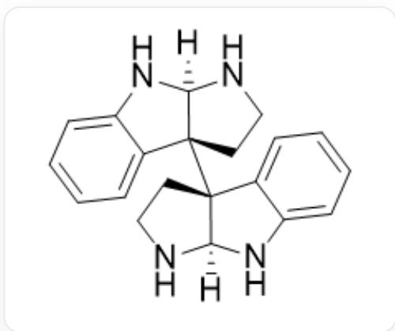
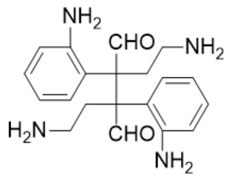
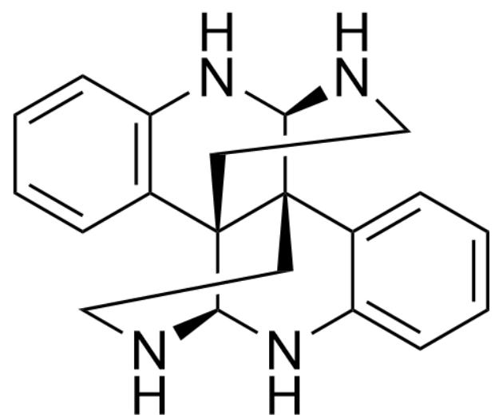
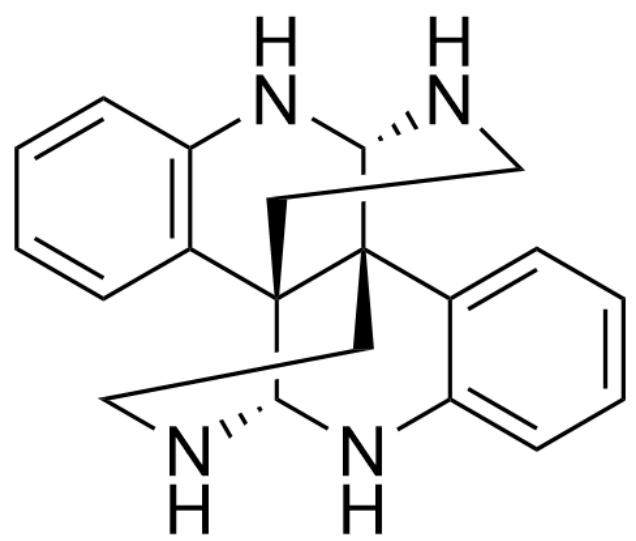
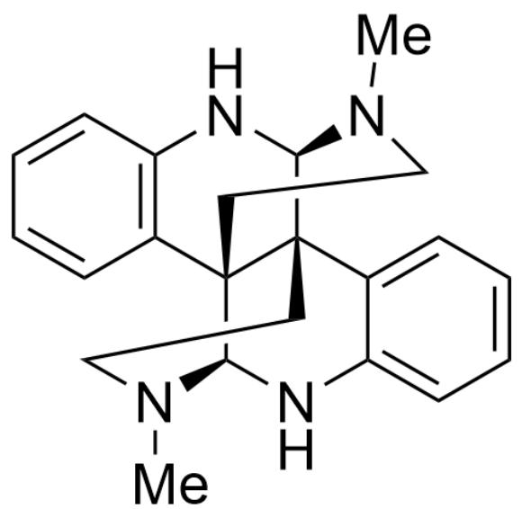

# 题目

某合成中间体 A 在 KOH-EtOH 封管加热条件下可以可逆地转化为其更稳定的同分异构体 B，A 的结构如下所示：

[H][C@@]12NC3=CC=CC=C3[C@]1([C@@]45[C@@](NC6=CC=CC=C64)(NCC5)[H])CCN2

B 在  $K_{2}CO_{3}$  作碱的条件下与过量的碘甲烷反应可以在亲核性最强的两个氮原子上分别发生一次甲基化，生成产物  $\mathbf{X}$ ，其化学式为  $C_{22}H_{26}N_{4}$ 。已知  $\mathbf{B}$  和  $\mathbf{X}$  的环数和  $\mathbf{A}$  相同，且整个转化过程中没有发生氧化还原反应， $\mathbf{X}$  中有两个绝对构型相同的、与氮原子直接连接的手性碳原子。试指出  $\mathbf{X}$  中六元环的数量，以及与氮原子直接连接的手性碳原子的绝对构型（R或S）。

A. 其他选项均不完全正确。  
B. 0, S  
C. 1, S  
D. 2, S  
E. 3, S

F. 4, S  
G. 5, S  
H. 6, S  
I. 7, S  
J. 8, S  
K. 0, R  
L. 1, R  
M. 2, R  
N. 3, R  
O. 4, R  
P. 5, R  
Q. 6, R  
R. 7, R  
S. 8, R

# 答案

正确答案: H

# 详细解析

化合物A可以看作一个高度取代的丁二醛与取代基上的胺分子内缩合的产物，其性质应当类似于缩醛（或半缩醛）。

# CHECKPOINT

2 PTS

丁二醛分子内缩合产物

# CHECKPOINT

2 PTS

性质应当类似缩醛（或半缩醛）

如果画出假想的A的未缩合形体，则其结构如下（Fischer投影式）：

NC(C=CC=C1)=C1[C@@](CCN)([C@](CCN)(C2=C(N)C=CC=C2)C=O)C=O

由题干条件，由于A到B的转化仅仅是发生了同分异构化反应，整个过程不涉及氧化还原，且反应可逆，因此很可能是发生了逆缩合（水解）-重新缩合反应交换了缩醛的氨基，使所有五元环均转化为六元环。这一过程能量有利，故平衡向产物B转化。

# CHECKPOINT

3 PTS

发生了逆缩合（水解）-重新缩合反应交换了缩醛的氨基

由于构象限制，每个烷基胺在缩合时都只能生成一种桥环结构。

# CHECKPOINT

3 PTS

由于构象限制，每个烷基胺在缩合时都只能生成一种桥环结构

因此，可以推出  $\mathbf{B}$  的结构如下：

C12=CC=CC=C1[C@]34[C@@]5(C(C=CC=C6)=C6N[C@H]3NCC5)[C@H](NCC4)N2

而不是下面这个张力太大的结构：

C12=CC=CC=C1[C@]34[C@@]5(C(C=CC=C6)=C6N[C@@H]3NCC5)[C@@H](NCC4)N2

# CHECKPOINT

3 PTS

B 的结构为C12=CC=CC=C1[C@]34[C@@]5(C(C=CC=C6)=C6N[C@H]3NCC5)[C@H](NCC4)N2

对于接下来的甲基化，由于碳酸钾碱性较低，因此B的氨基在体系中都是处于未脱质子状态。

# CHECKPOINT

2 PTS

碳酸钾碱性较低，因此B的氨基在体系中都是处于未脱质子状态

显然，此时烷基胺亲核性强于芳胺。

# CHECKPOINT

1 PTS

此时烷基胺亲核性强于芳胺

因此甲基化发生在两个烷基胺的氮上。

# CHECKPOINT

1 PTS

甲基化发生在两个烷基胺的氮上

所以  $\mathbf{X}$  结构如下：

CN(CC1)[C@@H]2NC3=C(C=CC=C3)[C@@]41[C@H]5NC6=CC=CC=C6[C@]42CCN5C

# CHECKPOINT

2 PTS

推出X的结构

由于烷基胺被甲基化，该氮原子连有两个含碳官能团，而芳胺只有一个，故X中的烷基胺官能团在手性判断的优先级上高于芳胺，因此该手性中心的记号为S。

# CHECKPOINT

2 PTS

X中的烷基胺官能团在手性判断的优先级上高于芳胺

与此同时，由于X有六个六元环，因此最终选择H。

# CHECKPOINT

2 PTS

X有六个六元环