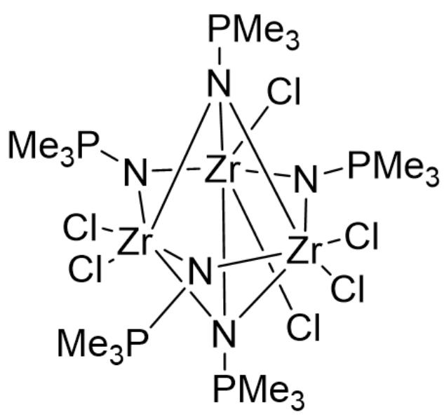
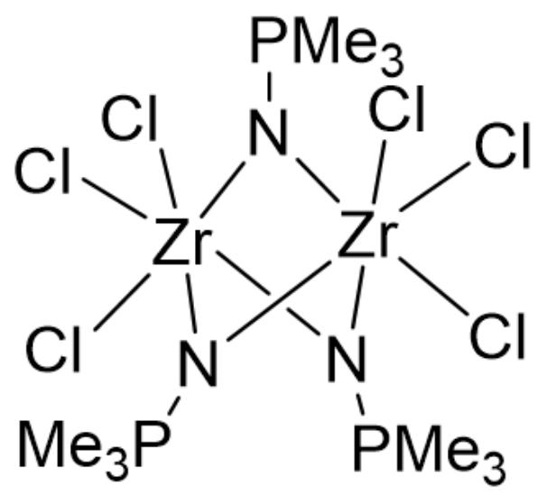

# Question

The researchers reacted  $\mathrm{ZrCl}_4$ ,  $\mathrm{Me}_3\mathrm{PNSiMe}_3$ , and  $\mathrm{NaF}$  at  $220^{\circ}\mathrm{C}$ , followed by crystallization in dichloromethane, to obtain a  $\mathrm{Zr(IV)}$  complex. The chemical formula of the crystal can be written as Double subscripts: use braces to clarify (all unknowns are integers). The unit cell parameters are:  $a = 1797\mathrm{pm}$ ,  $b = 1183\mathrm{pm}$ ,  $c = 3488\mathrm{pm}$ ,  $\beta = 99.02^\circ$ ;  $\rho = 1.685\mathrm{g} \cdot \mathrm{cm}^{-3}$ ;  $Z = 4$ . Elemental analysis indicates that the mass fractions of C and Cl in the crystal are  $17.5\%$  and  $34.4\%$ , respectively.

It is known that the complex in the crystal is actually a 1:1-type salt, with equal numbers of Cl atoms in the cation and anion, identical ideal point groups (ignoring  $\mathrm{PMe}_3$  orientations), and the same coordination number for Zr. Dichloromethane does not participate in coordination.

Deduce the chemical formula of the complex and the structures of the cation and anion, and determine which of the following options are correct:

1. The mass fraction of H in the crystal is  $4.2\%$ .  
2. After balancing the high-temperature reaction equation and simplifying to the smallest integer ratio, the sum of the reactant coefficients is 21.  
3. Both the cation and anion of the complex carry two charges.  
4. The point group of the cation and anion of the complex is  $\mathrm{D}_{3\mathrm{h}}$

A. 1,2  
B. 2,3  
C. 3,4  
D. 1,3  
E. 1,4

F. 2,4  
G. 1,2,3  
H. 1,2,4  
1,3,4  
J. 2,3,4  
K. 1,2,3,4  
L. None of the above options are correct

# Answer

Correct Answer: H

# Detailed Explanation

$$
M = \rho V N _ {A} / Z = 1 8 5 7 g \cdot m o l ^ {- 1}
$$

# CHECKPOINT

0.5 PTS

The relative molecular mass of the crystal is  $1857g\cdot mol^{-1}$

Thus, there are approximately  $27 \quad C$  atoms ( $1857 \times 0.175 / 12.01 \approx 27$ ) and  $18 \quad Cl$  atoms ( $1857 \times 0.344 / 35.45 \approx 18$ ).

Setting up the equations gives:

$$
y + 2 m = 1 8
$$

$$
3 z + m = 2 7
$$

Since  $z$  must be an integer,  $m$  must be a multiple of 3. Additionally, since  $y > 0$ ,  $18 - 2m > 0$ , so  $m \leq 6$ , meaning  $m$  is either 3 or 6.

# CHECKPOINT

0.5 PTS

$m$  is 3 or 6

Given that  $Zr$  has a  $+4$  oxidation state,  $y + z$  must be a multiple of 4.

When  $m = 3$ ,  $y = 12$ ,  $z = 8$ , and  $x = 5$ , which is reasonable.

When  $m = 6$ ,  $y = 6$ ,  $z = 7$ , and  $y + z = 17$ , which is not a multiple of 4.

In conclusion, the chemical formula of the crystal is  $Zr_{5}Cl_{12}(NPMe_{3})_{8} \cdot 3CH_{2}Cl_{2}$ , with a molecular weight of  $1856.95g \cdot mol^{-1}$ .

# CHECKPOINT

2 PTS

The chemical formula of the crystal is  $Zr_{5}Cl_{12}(NPMe_{3})_{8}\cdot 3CH_{2}Cl_{2}$

The mass fraction of  $H$  is  $78 \times 1.008 / 1856.95 = 4.234\%$ , so statement 1 is correct.

The balanced high-temperature reaction equation is:

$$
5 Z r C l _ {4} + 8 M e _ {3} P N S i M e _ {3} + 8 N a F = Z r _ {5} C l _ {1 2} \left(N P M e _ {3}\right) _ {8} \cdot 3 C H _ {2} C l _ {2} + 8 M e _ {3} S i F + 8 N a C l
$$

# CHECKPOINT

1 PTS

The

balanced

equation

is

$$
5 Z r C l _ {4} + 8 M e _ {3} P N S i M e _ {3} + 8 N a F = Z r _ {5} C l _ {1 2} \left(N P M e _ {3}\right) _ {8} \cdot 3 C H _ {2} C l _ {2} + 8 M e _ {3} S i F + 8 N a C l
$$

The sum of the reaction coefficients is  $5 + 8 + 8 = 21$ , so statement 2 is correct.

Considering the number of  $Zr$  in the cation and anion:

If the ratio is 1:4, the anion would be  $[ZrCl_6]^{2-}$ , but the cation cannot achieve such high symmetry.

Thus, the ratio of  $Zr$  counts in the cation and anion is 2:3, meaning the ions consist of 3  $ZrCl_{2}$  units and 2  $ZrCl_{3}$  units, respectively. With  $Zr$  in octahedral coordination and  $NPMe_{3}$  as a bridge, the structures of the ions are as follows:

Cation  $\left[Zr_{3}Cl_{6}(NPMe_{3})_{5}\right]^{+}$

Cl[Zr]12(Cl)([N]34[P](C)(C)C)[N]([Zr]3(N5[P](C)(C)C)(Cl)(Cl)N1[P](C)(C)C)([Zr]45(Cl)(Cl)N2[P](C)(C)C)[P](C)(C)C

# CHECKPOINT

1 PTS

The cation is  $\left[Zr_{3}Cl_{6}(NPMe_{3})_{5}\right]^{+}$

Anion  $\left[Zr_{2}Cl_{6}(NPMe_{3})_{3}\right]^{-}$

Cl[Zr](N1[P](C)(C)C)(N2[P](C)(C)C)(Cl)(Cl)N([P](C)(C)C)[Zr]12(Cl)(Cl)Cl

# CHECKPOINT

1 PTS

The anion is  $[Zr_{2}Cl_{6}(NPMe_{3})_{3}]^{-}$

Thus, the cation and anion each carry a single charge, so statement 3 is incorrect. Both ions belong to the  $D_{3h}$  point group, so statement 4 is correct.

# CHECKPOINT

1 PTS

The point group of the ions is  $D_{3h}$

Choose 1, 2, 4 (Option H).