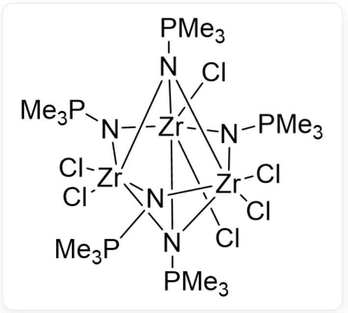

# 题目

研究人员在  $220^{\circ} \mathrm{C}$  下令  $ZrCl_{4}$  、  $Me_{3}PNSiMe_{3}$  与  $NaF$  反应，后在二氯甲烷中结晶，制得了一  $Zr(IV)$  配合物，其晶体的化学式可写作  $Zr_{x}Cl_{y}(NPMe_{3})_{z} \cdot mCH_{2}Cl_{2}$  (未知数均为整数)。晶胞参数为：  $a = 1797pm$  ，  $b = 1183pm$  ，  $c = 3488pm$  ，  $\beta = 99.02^{\circ}$  ；  $\rho = 1.685g \cdot cm^{-3}$  ；  $Z = 4$  。元素分析表明，晶体中  $C$  质量分数为  $17.5\%$  ，  $Cl$  质量分数为  $34.4\%$  。

已知晶体中该配合物实为一1:1型盐，阴阳离子中  $Cl$  原子个数相等，理想点群(忽略  $PMe_{3}$  取向)相同， $Zr$  的配位数相同。已知二氯甲烷不参与配位。

推测该配合物的化学式以及阴阳离子的结构，判断以下选项中正确的有：

1. 晶体中  $H$  的质量分数为  $4.2\%$  
2. 高温反应的方程式配平并化为最简整数比之后，反应物系数之和为21  
3. 配合物阴阳离子各含两个电荷  
4. 配合物阴阳离子所属点群为  $D_{3h}$

A. 1,2  
B. 2,3  
C. 3,4  
D. 1,3  
E. 1,4  
F. 2,4

G. 1,2,3  
H. 1,2,4  
1,3,4  
J. 2,3,4  
K. 1,2,3,4  
L. 以上没有正确选项

# 答案

正确答案: H

# 详细解析

$$
M = \rho V N _ {A} / Z = 1 8 5 7 g \cdot m o l ^ {- 1}
$$

# CHECKPOINT

0.5 PTS

晶体相对分子质量为  $1857 g \cdot m o l^{-1}$

故有  $1857 \times 0.175 / 12.01 \approx 27$  个  $C$ ,  $1857 \times 0.344 / 35.45 \approx 18$  个  $Cl$

列方程可得：

$$
y + 2 m = 1 8
$$

$$
3 z + m = 2 7
$$

由于  $z$  为整数，故  $m$  为3的倍数；又  $y > 0$  ，则  $18 - 2m > 0$  ，  $m \leq 6$  ，  $m$  为3或6

# CHECKPOINT

0.5 PTS

$m$  为3或6

由于  $Zr$  为  $+4$  价， $y + z$  应为4的倍数

$m = 3$  时  $y = 12, z = 8, x = 5$  ，合理

$m = 6$  时  $y = 6$  ，  $z = 7$  ，  $y + z = 17$  ，不为4的倍数

综上，晶体化学式为  $Zr_{5}Cl_{12}(NPMe_{3})_{8}\cdot 3CH_{2}Cl_{2}$  。其分子量为  $1856.95g\cdot mol^{-1}$

# CHECKPOINT

# 2 PTS

晶体化学式为  $Zr_{5}Cl_{12}(NPMe_{3})_{8}\cdot 3CH_{2}Cl_{2}$

$H$  的质量分数为  $78 \times 1.008 / 1856.95 = 4.234\%$  ，说法1正确。

配平的高温反应方程式为：

$$
5 Z r C l _ {4} + 8 M e _ {3} P N S i M e _ {3} + 8 N a F = Z r _ {5} C l _ {1 2} \left(N P M e _ {3}\right) _ {8} \cdot 3 C H _ {2} C l _ {2} + 8 M e _ {3} S i F + 8 N a C l
$$

# CHECKPOINT

# 1 PTS

配 平

的 方

程 式 为

$$
5 Z r C l _ {4} + 8 M e _ {3} P N S i M e _ {3} + 8 N a F = Z r _ {5} C l _ {1 2} \left(N P M e _ {3}\right) _ {8} \cdot 3 C H _ {2} C l _ {2} + 8 M e _ {3} S i F + 8 N a C l
$$

反应物系数之和为  $5 + 8 + 8 = 21$  ，说法2正确。

考虑阴阳离子中  $Zr$  的个数：

若为1:4，则阴离子为  $\left[ZrCl_{6}\right]^{2-}$ ，阳离子无法达到这么高的对称性。

因此阴阳离子的  $Zr$  个数为2:3，则两个离子分别有3个  $ZrCl_{2}$  单元和2个  $ZrCl_{3}$  单元。而  $Zr$  的配位是八面体，以  $NPMe_{3}$  做桥，可以画出阴阳离子的结构如下：

阳离子  $\left[Zr_{3}Cl_{6}(NPMe_{3})_{5}\right]^{+}$  ：

Cl[Zr]12(Cl)([N]34[P](C)(C)C)[N]([Zr]3(N5[P](C)(C)C)(Cl)(Cl)N1[P](C)(C)C)([Zr]45(Cl)(Cl)N2[P](C)(C)C)[P](C)(C)C

# CHECKPOINT

1 PTS

阳离子为  $\left[Zr_{3}Cl_{6}(NPMe_{3})_{5}\right]^{+}$

阴离子  $\left[Zr_{2}Cl_{6}(NPMe_{3})_{3}\right]^{-}$

Cl[Zr](N1[P](C)(C)C)(N2[P](C)(C)C)(Cl)(Cl)N([P](C)(C)C)[Zr]12(Cl)(Cl)Cl

# CHECKPOINT

1 PTS

阴离子为  $\left[Zr_{2}Cl_{6}(NPMe_{3})_{3}\right]^{-}$

因此阴阳离子各带一个电荷，说法3错误。阴阳离子均为  $D_{3h}$  点群，说法4正确。

# CHECKPOINT

1 PTS

阴阳离子的点群为  $D_{3h}$

选择1,2,4（H选项）