# Question

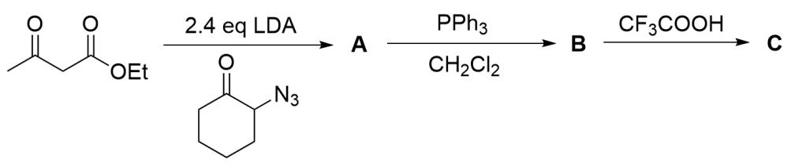

The image describes an organic tandem synthesis route. The substrate is CC(CC(OCC)=O)=O, which reacts with O=C1C(N=[N+]=[N-])CCCC1 in the presence of 2.4 equivalents of LDA to generate A. A reacts with  $PPh_{3}$ ,  $CH_{2}Cl_{2}$  to generate B. B reacts with  $CF_{3}COOH$  to generate C.

Regarding the structural formula of the final product  $\mathbf{C}$  of the organic synthesis route in the above figure, the correct option is:

A. All other options are incorrect

B.

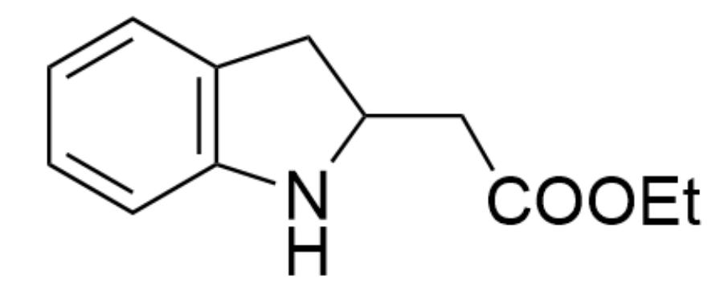

O=C(CC(C1)NC2=C1C=CC=C2)OCC

C.

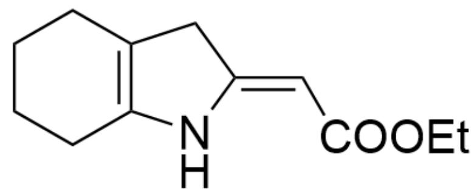

$\mathrm{O = C(/C = C(C1)\backslash NC2 = C1CCCC2)OCC}$

D.

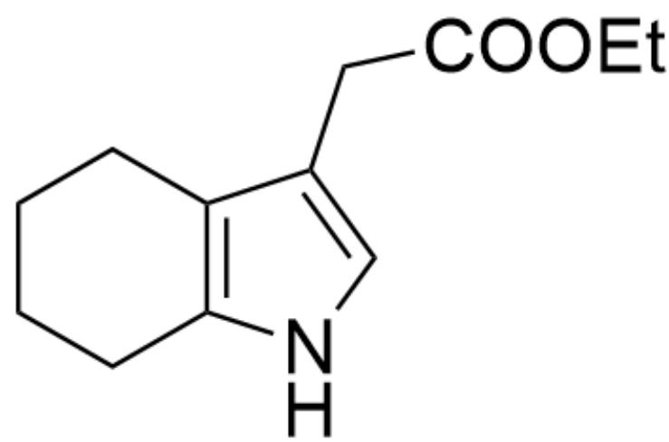

O=C(CC1=CNC2=C1CCCC2)OCC

E.

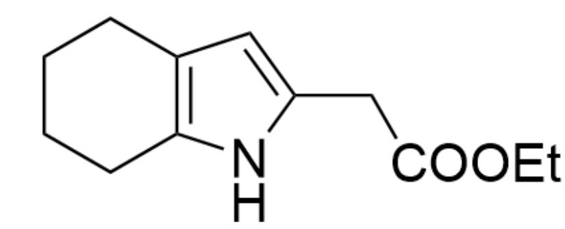

$\mathrm{O = C(CC1 = CC2 = C(N1)CCCC2)OCC}$

F.

$O = C(C1)C = CNC2 = C1CCCC2$

G.

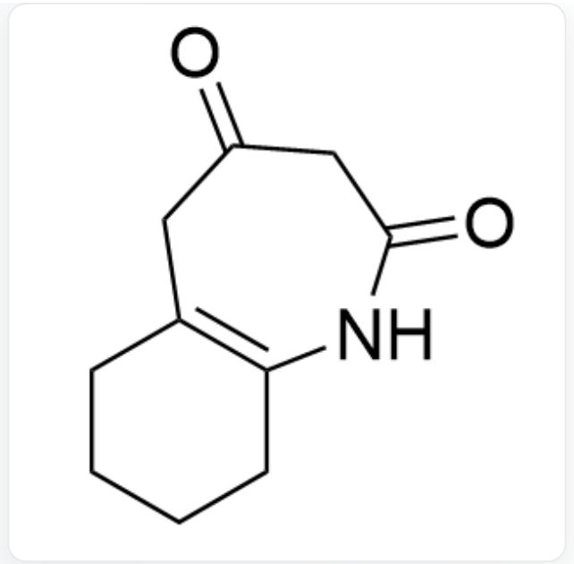  
$\mathrm{O = C(C1)CC(NC2 = C1CCCC2) = O}$

H.

  
CC(C1C(OCC)=O)NC2=C1CCCC2

1.

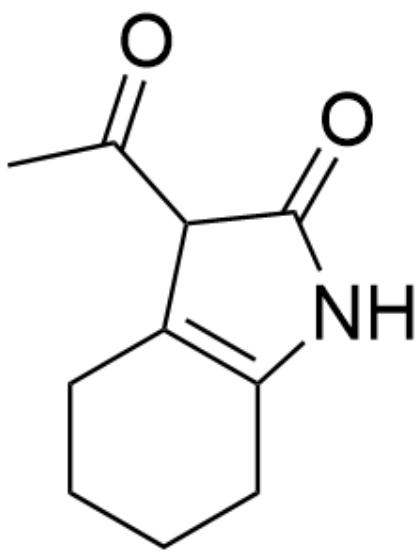

$\mathrm{O = C(C1C(C) = O)NC2 = C1CCCC2}$

# Answer

Correct Answer: E

# Detailed Explanation

The first step of the reaction involves a  $\beta$ -dicarbonyl compound as the substrate, which can form an enolate dianion intermediate under the action of two equivalents of strong base LDA, with the structure [CH2-]C([CH-]C(OCC)=O)=O.

# CHECKPOINT

1 PTS

Formation of an enolate dianion intermediate under the action of two equivalents of LDA, with the structure  $\mathrm{[CH2 - ]C([CH - ]C(OCC) = O) = O}$

This anion can obviously undergo nucleophilic addition with another substrate containing a ketone carbonyl group. At this point, there is chemoselectivity: the methyl carbanion has a smaller degree of charge delocalization and is more nucleophilic. Under the kinetic product environment of LDA, it should preferentially nucleophilically attack over the methylene carbanion, resulting in A as O=C(CC(OCC)=O)CC1(O)C(N=[N+]=[N-])CCCC1.

# CHECKPOINT

1 PTS

The methyl carbanion has stronger nucleophilicity and preferentially nucleophilically attacks over the methylene carbanion

# CHECKPOINT

1 PTS

A is  $O = C(CC(OCC) = O)CC1(O)C(N = [N + ] = [N - ])$  CCCC1

The next step is a typical Staudinger reaction. The substrate contains an azide group, which can react with triphenylphosphine to generate a phosphazene ylide. The phosphazene ylide can react with a carbonyl group. Here, chemoselectivity is also involved. The ketone carbonyl group is more electrophilic than the ester carbonyl group, and the intramolecular formation of a seven-membered ring is more difficult than the formation of a five-membered ring. Therefore, the phosphazene ylide attacks the intramolecular ketone carbonyl group, eliminating one molecule of water to form an exocyclic double bond. The structure of  $\mathbf{B}$  should be OC12C(N/C(C2)=C\C(OCC)=O)CCCCCC1.

# CHECKPOINT

1 PTS

The azide group can react with triphenylphosphine to generate a phosphazene ylide

# CHECKPOINT

1 PTS

The ketone carbonyl group is more electrophilic than the ester carbonyl group

# CHECKPOINT

1 PTS

Intramolecular formation of a seven-membered ring is more difficult than the formation of a five-membered ring

# CHECKPOINT

1 PTS

The structure of  $\mathbf{B}$  should be OC12C(N/C(C2)=C\C(OCC)=O)CCCC1

In the final step, trifluoroacetic acid is added, creating a strongly acidic environment. The intramolecular tertiary alcohol undergoes elimination, preferentially forming a fused poly-substituted double bond based on selectivity. At this point, an aza-five-membered ring olefin structure can be observed within the molecule. The acidic environment can aromatize it into pyrrole. Therefore, the final product C has the structure O=C(CC1=CC2=C(N1)CCCC2)OCC, and only option E is correct.

# CHECKPOINT

1 PTS

Alcohol elimination preferentially forms a fused poly-substituted double bond

# CHECKPOINT

1 PTS

The acidic environment can aromatize it into pyrrole

# CHECKPOINT

2 PTS

The structure of  $\mathbf{C}$  is  $O = C(CC1 = CC2 = C(N1)CCCC2)OCC$

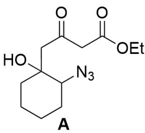

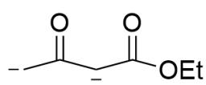

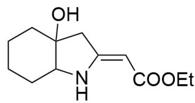  
B

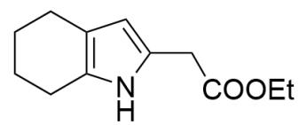  
C

This figure shows the structures of the intermediates and unknown species involved in this problem. At the top of the figure is the enolate dianion intermediate, with the structure [CH2-]C([CH-]C(OCC)=O)=O; at the bottom of the figure are the structures of the unknown species A, B, C, with SMILES O=C(CC(OCC)=O)CC1(O)C(N=[N+]=[N-])CCCC1; OC12C(N/C(C2)=C\C(OCC)=O)CCCCCC1; O=C(CC1=CC2=C(N1)CCCCCC2)OCC.