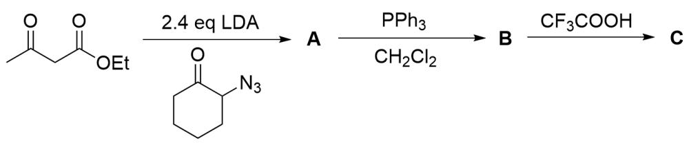
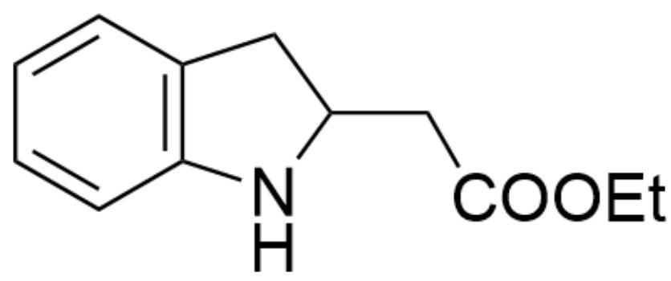
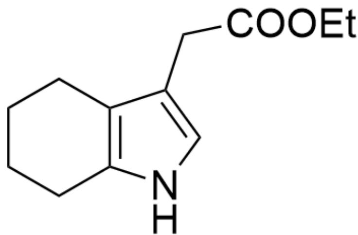
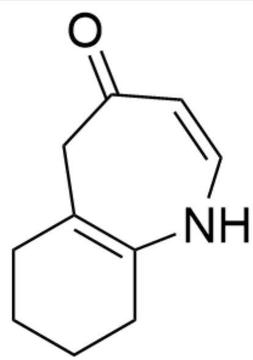
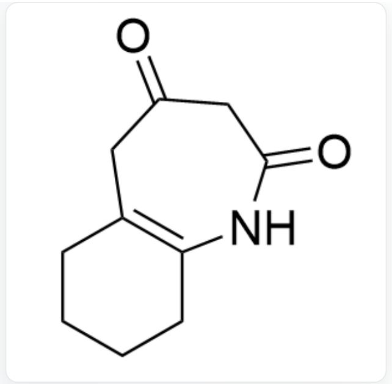
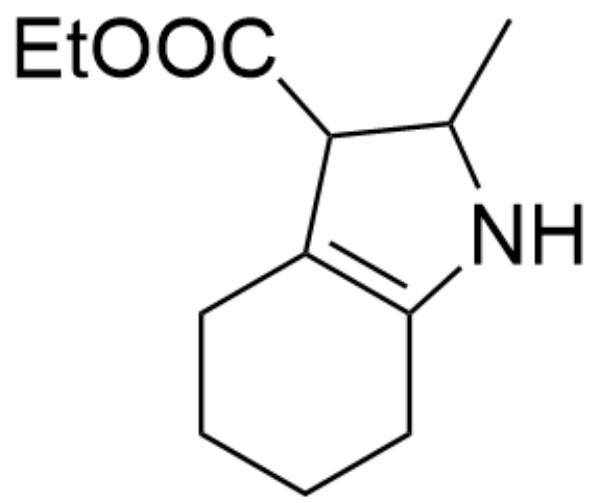
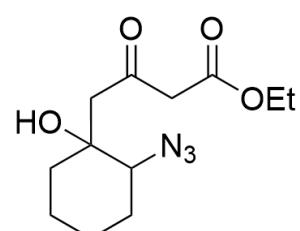
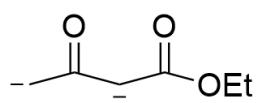
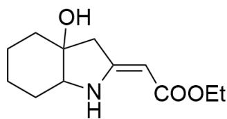
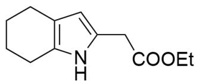

# 题目

该图片描述了一个有机串联合成路线。底物为CC(CC(OCC)=O)=O，与O=C1C(N=[N+]=[N-])CCCC1在2.4当量LDA存在下反应生成A，A与PPh3,CH2Cl2反应生成B，B与CF3COOH反应生成C。

对于上图的有机合成路线的最终产物 C 的结构式，正确的选项是：

A. 其他选项均不正确

B.

$$
O = C (C C (C 1) N C 2 = C 1 C = C C = C 2) O C C
$$

C.

$\mathrm{O = C(/C = C(C1)\backslash NC2 = C1CCCC2)OCC}$

D.

O=C(CC1=CNC2=C1CCCC2)OCC

E.

$\mathrm{O = C(CC1 = CC2 = C(N1)CCCC2)OCC}$

F.

$O = C(C1)C = CNC2 = C1CCCC2$

G.

  
$\mathrm{O = C(C1)CC(NC2 = C1CCCC2) = O}$

H.

  
CC(C1C(OCC)=O)NC2=C1CCCC2

1.

$\mathrm{O = C(C1C(C) = O)NC2 = C1CCCC2}$

# 答案

正确答案: E

# 详细解析

反应第一步，底物为  $\beta$ -二羰基化合物，在两当量强碱LDA作用下可以形成烯醇双负离子中间体，结构为[CH2-]C([CH-]C(OCC)=O)=O。

# CHECKPOINT

1 PTS

两当量LDA作用下形成烯醇双负离子中间体，结构为[CH2-]C([CH-]C(OCC)=O)=O

该负离子很显然可以与另一个酮基的底物发生亲核加成，此时存在化学选择性：甲基碳负离子的电荷离域程度小，亲核性更强，在LDA这种动力学产物环境下应当优先于亚甲基碳负离子亲核，从而产生的A为O=C(CC(OCC)=O)CC1(O)C(N=[N+]=[N-])CCCC1。

# CHECKPOINT

1 PTS

甲基碳负离子亲核能力更强，优先于亚甲基碳负离子亲核

# CHECKPOINT

1 PTS

A 为  $O = C(CC(OCC) = O)CC1(O)C(N = [N + ] = [N - ])$  CCCC1

下一步是典型的Staudinger反应，底物存在叠氮基团，可以与三苯基麟反应生成氮叶立德，氮叶立德可以与羰基反应。这里同样涉及化学选择性，酮羰基比酯羰基更加亲电，且分子内成七元环难于成五元环，因此氮叶立德进攻分子内酮羰基，脱去一分子水形成环外双键，B结构应当为OC12C(N/C(C2)=C\C(OCC)=O)CCCC1。

# CHECKPOINT

1 PTS

叠氮基可以与三苯基膦反应生成氮叶立德

# CHECKPOINT

1 PTS

酮羰基比酯羰基更加亲电

# CHECKPOINT

1 PTS

分子内成七元环难于成五元环

# CHECKPOINT

1 PTS

B结构应当为OC12C(N/C(C2)=C\C(OCC)=O)CCCC1

最后一步加入三氟乙酸，为强酸性环境，分子内的三级醇消除，根据选择性优先生成并环多取代双键。此时可以观察到分子内存在氮杂五元环烯烃结构，酸性环境可以芳构化为吡咯。因此最终产物C结构为  $O = C(CC1 = CC2 = C(N1)CCC2)OCC$  ，只有选项E正确。

# CHECKPOINT

1 PTS

醇消除优先生成并环多取代双键

# CHECKPOINT

1 PTS

酸性环境可以芳构化为吡咯

# CHECKPOINT

2 PTS

C结构为  $O = C ( C C 1 = C C 2 = C ( N 1 ) C C C C 2 ) O C C$

  
A

  
B

  
C

本图给出了本题涉及到的中间体和未知物种结构。图最上方为烯醇双负离子中间体，结构为[CH2-]C([CH-]C(OCC)=O)=O；图下方分别为未知物种A,B,C的结构，SMILES分别为 $O = C(CC(OCC) = O)CC1(O)C(N = [N + ] = [N - ])CCC1$  ；OC12C(N/C(C2)=C\C(OCC)=O)CCCC1; $O = C(CC1 = CC2 = C(N1)CCCC2)OCC_{\circ}$