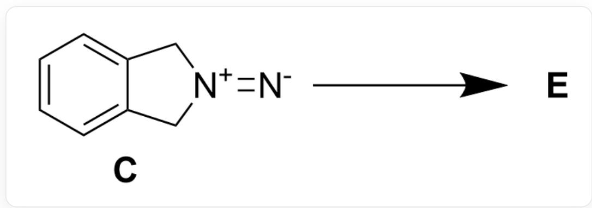
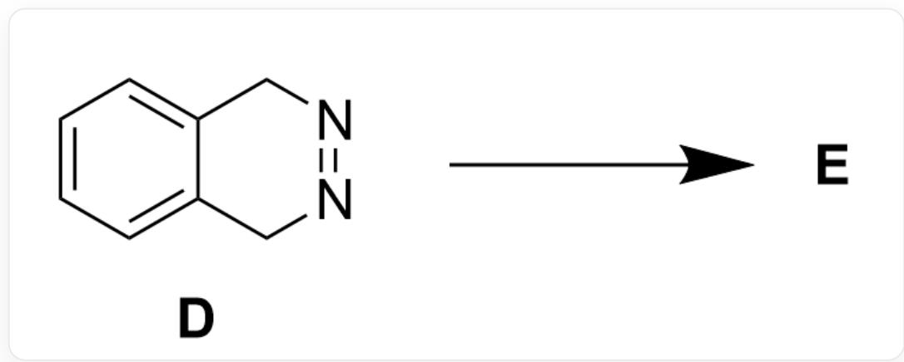
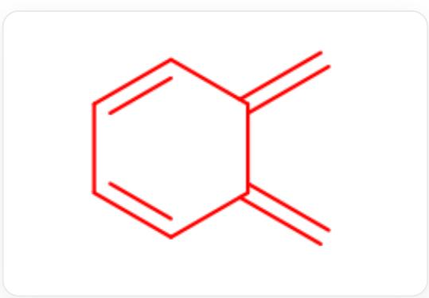
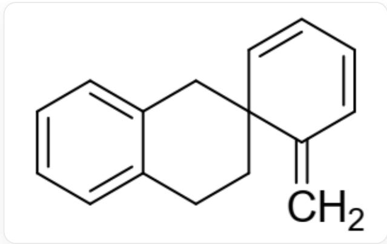

# Question

Compounds  $\mathbf{C}$  and  $\mathbf{D}$  are unstable and react to give the same product  $\mathbf{E}$  (Fig. 1, Fig. 2). It is known that  $\mathbf{E}$  is a spirocyclic compound.

Predict the structural formulas of the intermediates after the loss of nitrogen from C and D and the structure of E.

  
Fig. 1, the reaction diagram for the formation of  $\mathbf{E}$  from  $\mathbf{C}$ , described in SMILES as: [N-]= [N+]1CC2=CC=CC=C2C1>>[[E]]

  
Fig. 2, the reaction diagram for the formation of  $\mathbf{E}$  from  $\mathbf{D}$ , described in SMILES as: C12=CC=CC=C1CN=NC2>> [[E]]

The following statements are made:

1. The reaction processes of compound  $\mathbf{C}$  and compound  $\mathbf{D}$  both pass through the same intermediate belonging to the  $C_{2v}$  point group.  
2.  $\mathbf{E}$  contains two benzene rings.  
3. The process of generating  $\mathbf{E}$  is entirely a free radical mechanism.  
4. E contains three six-membered rings and contains  $4^{\prime \prime} \mathrm{CH}_2$  groups.

The following option with all correct statements and the largest number of correct statements is:

A. All other options are incorrect  
B. 1  
C. 2  
D. 3

E. 4

F. 1,2  
G. 1,3  
H. 1,4  
1. 2,3  
J. 2,4

K. 3,4  
L. 1,2,3  
M. 1,2,4  
N. 1,3,4  
O. 2,3,4  
P. 1,2,3,4

# Answer

Correct Answer: H

# Detailed Explanation

Observing the structures of  $\mathbf{C}$  and  $\mathbf{D}$ , it can be found that both have a symmetrical diazo group within the molecule, so they are unstable and easily eliminate nitrogen.

# CHECKPOINT

1 PTS

C and D easily eliminate nitrogen

Since the two carbon-carbon bonds connected to the diazo group are symmetrical, it is difficult to eliminate nitrogen through an ionic mechanism. It is most likely to eliminate nitrogen through a pericyclic reaction-like mechanism. After eliminating one molecule of nitrogen, a radical is formed on each of the two carbons originally connected to the nitrogen atom, and radical coupling may occur. However, a four-membered ring fused with the benzene ring is obtained, which has extremely high tension and is unstable. More likely, the benzene ring directly stabilizes the radical structure through conjugation, resulting in a highly reactive intermediate (as shown in Figure 3). Here, C and D generate the same intermediate structure.

  
Fig. 3, The molecule in the figure is described in SMILES as: C=C1C=CC=CC1=C

# CHECKPOINT

1 PTS

C and D eliminate nitrogen to generate the same intermediate, with the structure: C=C1C=CC=CC1=C

The intermediate has a  $C_2$  axis and two mirror planes passing through the  $C_2$  axis, belonging to the  $C_{2v}$  point group. Statement 1 is correct.

# CHECKPOINT

1 PTS

The intermediate has a  $C_2$  axis and two mirror planes passing through the  $C_2$  axis, belonging to the  $C_{2v}$  point group

According to the question,  $\mathbf{E}$  is a spirocyclic compound, indicating that the intermediate is not the final product, which is consistent with the high reactivity of the intermediate. The two intermediates can quickly dimerize and undergo a  $[4 + 2]$  cycloaddition reaction to obtain the next product.

# CHECKPOINT

1 PTS

The intermediate is highly reactive and easily dimerizes via a  $[4 + 2]$  addition reaction

One molecule of the intermediate acts as a diene, and aromaticity can be reconstructed after the reaction. The other molecule acts as a dienophile, and the reaction may occur on the bridgehead double bond or the six-membered ring. According to the information that product  $\mathbf{E}$  is a spirocyclic compound, it can be determined that the reaction occurs on the bridgehead double bond, and the structure of  $\mathbf{E}$  is shown in Figure 4:

  
Fig. 4, The molecule in the figure is described in SMILES as: C=C1C=CC=CC21CCC3=CC=CC=C3C2

# CHECKPOINT

1 PTS

The intermediate undergoes  $[4 + 2]$  cycloaddition dimerization to obtain the spirocyclic compound  $\mathbf{E}$  with the structure: C=C1C=CC=CC21CCC3=CC=CC=C3C2

$\mathbf{E}$  has only one benzene ring, so statement 2 is incorrect. The formation of  $\mathbf{E}$  involved a pericyclic reaction mechanism, so statement 3 is incorrect.  $\mathbf{E}$  contains three six-membered rings, and there are a total of 4 "CH $_2$  " groups, three on the benzo six-membered ring and one outside the ring, so statement 4 is correct.