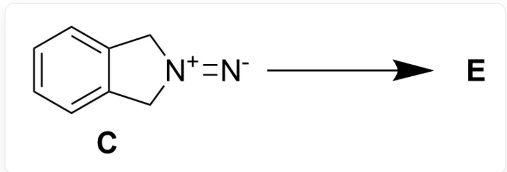
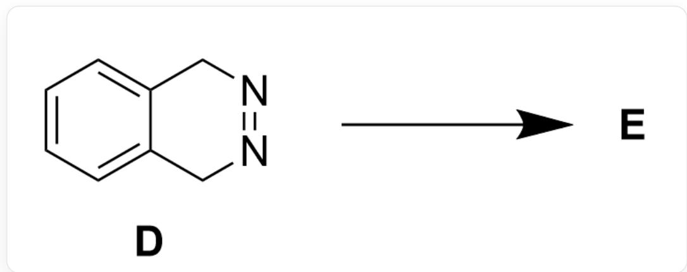
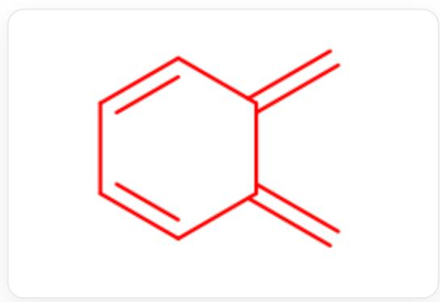
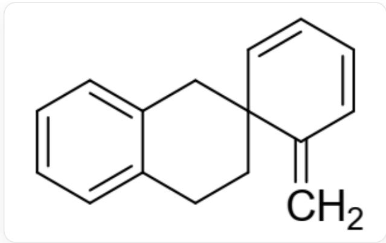

# 题目

化合物 C 和化合物 D 不稳定, 反应得到相同的产物 E (图1、图2)。已知 E 为螺环化合物。

推测 C 和 D 失氮后的中间体的结构简式和 E 的结构。

  
Fig. 1, 图反应为 C 形成 E 的反应, 以 SMILES 描述为:  $[N-] = [N+] 1 C C 2 = C C = C C = C 2 C 1 >>[[E]]$

  
Fig. 2, 图反应为 D 形成 E 的反应, 以 SMILES 描述为: C12=CC=CC=C1CN=NC2>> [[E]]

有以下说法：

1. 化合物 C 和化合物 D 反应过程中都经过了同一个属于  $C_{2v}$  点群的中间体  
2. E中含有两个苯环  
3.生成  $\mathbf{E}$  的过程完全为自由基机理

4. E中含有三个六元环，且含有4个“ $\mathrm{CH}_2$ ”基团

下列选项说法全部正确且正确说法数量最多的为：

A. 其他选项均不正确  
B. 1  
C. 2  
D. 3  
E. 4  
F. 1,2  
G. 1,3  
H. 1,4  
1. 2,3  
J. 2,4  
K. 3,4  
L. 1,2,3

M. 1,2,4  
N. 1,3,4  
O. 2,3,4  
P. 1,2,3,4

# 答案

正确答案: H

# 详细解析

观察C和D的结构可以发现，二者分子内均存在一个对称的重氮基团，所以不稳定易脱除氮气。

# CHECKPOINT

1 PTS

C和D容易脱除氮气

由于重氮基团连接的两根碳碳键对称，因此很难通过离子机理脱除氮气，最有可能通过类似周环反应脱除氮气。脱除一分钟氮气后，在原来与氮原子相连的两个碳上各形成一个自由基，可能发生自由基的偶联，但是得到与苯环并环的四元环，张力极大不稳定。更可能的是苯环直接通过共轭稳定自由基结构，得到高反应性的中间体（如图3）。这里C和D生成的中间体结构相同。

  
Fig. 3, 图中分子以SMILES描述为: C=C1C=CC=CC1=C

# CHECKPOINT

1 PTS

C和D脱除氮气，生成相同的中间体，结构为：  $\mathrm{C = C1C = CC = CC1 = C}$

该中间体有一个  $C_2$  轴和穿过  $C_2$  轴的两个镜面，属于  $C_{2v}$  点群，说法1正确。

# CHECKPOINT

1 PTS

该中间体有一个  $C_2$  轴和穿过  $C_2$  轴的两个镜面，属于  $C_{2v}$  点群

根据题干E为螺环化合物，说明该中间体还不是最终产物，这与该中间体具有高反应性符合。两个中间体可以快速二聚，发生  $[4 + 2]$  环加成反应，得到下一步产物。

# CHECKPOINT

1 PTS

中间体反应性高，易发生  $[4 + 2]$  加成反应二聚

其中一分子中间体作为二烯体，反应后可以重构芳香性。另一分子作为单烯体，反应可能发生在桥头双键或六元环上。根据产物  $\mathbf{E}$  为螺环化合物的信息，可以确定反应在桥头双键发生，得到  $\mathbf{E}$  的结构如图4：

  
Fig. 4, 图中分子以SMILES描述为: C=C1C=CC=CC21CCC3=CC=CC=C3C2

# CHECKPOINT

1 PTS

中间体发生[4+2]环加成二聚，得到螺环化合物E结构为：C=C1C=CC=CC21CCC3=CC=CC=C3C2

E 只有一个苯环，说法2错误。生成E的过程中经历了周环反应机理，说法3错误。E 含有三个六元环，且包苯并六元环上三个和环外一个共有4个“ $\mathrm{CH}_2$ ”基团，说法4正确。