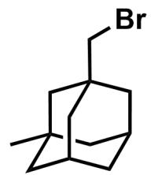
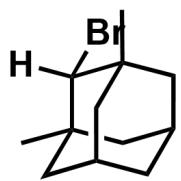
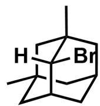
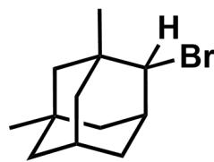
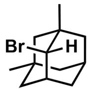
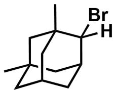
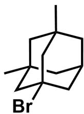
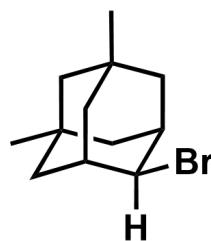
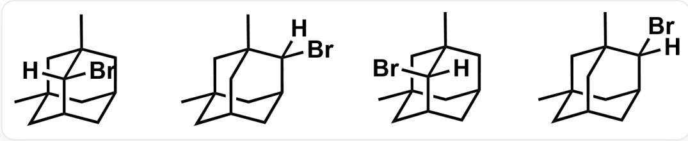
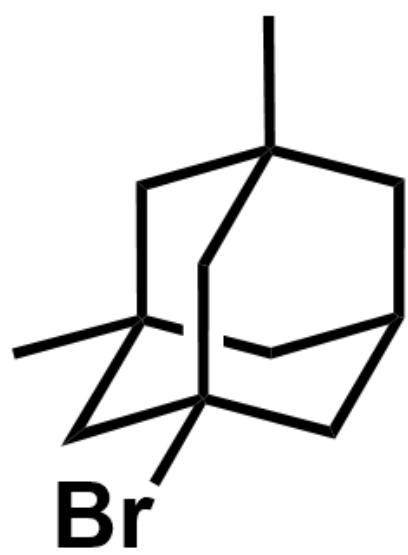

# Question

Experiments show that the photo-induced reaction of 1,3-dimethyladamantane with  $\mathrm{Br}_2$  yields only one monobrominated product (stereoisomers not considered). Select the option containing all correct statements.

1. Theoretically, if stereoisomers are considered, there are a total of 8 monobrominated products  
2. Theoretically, there are 5 monobrominated products that possess enantiomers  
3. The experimentally obtained monobrominated product possesses enantiomers

A. 1,2,3  
B. 1,2  
C. 1,3  
D. 2,3  
E. 1  
F. 2  
G. 3  
H. All of the above statements are incorrect.

# Answer

Correct Answer: E

# Detailed Explanation

First, analyze all possible monobrominated products of the alkane, considering stereoisomers. There are 8 kinds of monobrominated products as follows, statement 1 is correct.

First row from left to right: C[C@@]1(C[C@@]2(CBr)C3)C[C@H]3C[C@H](C2)C1, C[C@@]12C[C@H]3C[C@]

(C1([H])Br)(C)C[C@@H](C2)C3, C[C@@]12[C@@](Br)([H])[C@H]3C[C@](C1)(C)C[C@@H](C2)C3,

C[C@@]12C[C@H]3C[C@](C1)(C)C[C@@H](C2([H])Br)C3 ; Second row from left to right: C[C@@]12[C@](Br)

([H])[C@H]3C[C@](C1)(C)C[C@@H](C2)C3, C[C@@]12C[C@H]3C[C@](C1)(C)C[C@@H](C2([H])Br)C3,

C[C@@]12C[C@@]3(Br)C[C@@](C1)(C)C[C@@H](C2)C3，C[C@@]12C[C@H]3C[C@@](C1)(C)C[C@@H]

(C2)C3([H])Br

CHECKPOINT

1 PTS

There are 8 kinds of monobrominated products, statement 1 is correct.

The following 4 monobrominated products do not have a mirror plane and have enantiomers, statement 2 is incorrect.

  
C[C@@]12[C@@](Br)([H])[C@H]3C[C@@](C1)(C)C[C@@H](C2)C3，C[C@@]12C[C@H]3C[C@](C1)  
(C)C[C@@H](C2([H])Br)C3, C[C@@]12[C@](Br)([H])[C@H]3C[C@](C1)(C)C[C@@H](C2)C3,  
C[C@@]12C[C@H]3C[C@](C1)(C)C[C@@H](C2([H])Br)C3

# CHECKPOINT

1 PTS

There are 4 monobrominated products with enantiomers, statement 2 is incorrect

The only monobrominated product obtained is generated from the most stable free radical. The free radical should be a tertiary free radical, and the product is as follows. It has a mirror plane and no enantiomers, statement 3 is incorrect.

C[C@@]12C[C@@]3(Br)C[C@@](C1)(C)C[C@@H](C2)C3

# CHECKPOINT

0.5 PTS

The experimentally obtained monobrominated product is generated from a tertiary free radical

# CHECKPOINT

0.5 PTS

The experimentally obtained monobrominated product has no enantiomers

The answer is option E.