# 题目

实验表明，图示烷烃与  $\mathrm{Br}_{2}$  光照反应，仅检测到1种单溴代产物（不考虑立体异构）。选出包含所有正确说法的选项。

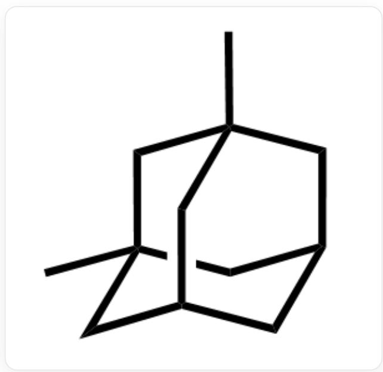  
C[C@@]12C[C@H]3C[C@](C1)(C)C[C@@H](C2)C3

1. 理论上，若考虑立体异构，共有8种单溴代物  
2. 理论上能得到的单溴代物中有5个具有对映异构体  
3. 实验得到的单溴代物有对映异构体

A. 1,2,3  
B. 1,2  
C. 1,3  
D. 2,3

E. 1  
F. 2  
G. 3  
H. 上述说法均不对

# 答案

正确答案: E

# 详细解析

先分析该烷烃所有可能的单溴代物，考虑立体异构，共有如下8种单溴代物，说法1正确。

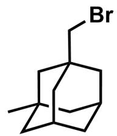

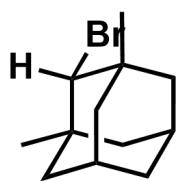

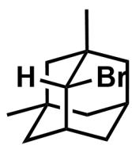

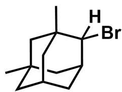

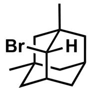

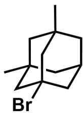

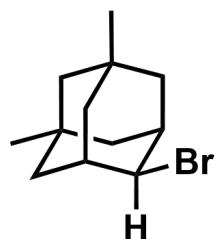

第一排从左至右依次为C[C@@]1(C[C@@]2(CBr)C3)C[C@H]3C[C@H](C2)C1，C[C@@]12C[C@H]3C[C@]

(C1([H])Br)(C)C[C@@H](C2)C3, C[C@@]12[C@@](Br)([H])[C@H]3C[C@](C1)(C)C[C@@H](C2)C3,

C[C@@]12C[C@H]3C[C@](C1)(C)C[C@@H](C2([H])Br)C3；第二排从左至右依次为C[C@@]12[C@](Br)([H])

[C@H]3C[C@](C1)(C)C[C@@H](C2)C3，C[C@@]12C[C@H]3C[C@](C1)(C)C[C@@H](C2([H])Br)C3,

C[C@@]12C[C@@]3(Br)C[C@@](C1)(C)C[C@@H](C2)C3, C[C@@]12C[C@H]3C[C@@](C1)(C)C[C@@H]

(C2)C3([H])Br

CHECKPOINT

1 PTS

共有8种单溴代物，说法1正确

单溴代物中如下4种没有镜面，有对映异构体，说法2错误。

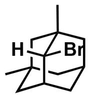

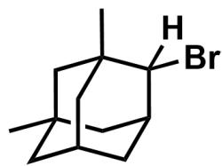

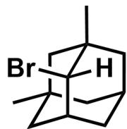

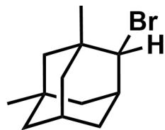

C[C@@]12[C@@](Br)([H])[C@H]3C[C@@](C1)(C)C[C@@H](C2)C3，C[C@@]12C[C@H]3C[C@](C1)

(C)C[C@@H](C2([H])Br)C3, C[C@@]12[C@](Br)([H])[C@H]3C[C@](C1)(C)C[C@@H](C2)C3,

C[C@@]12C[C@H]3C[C@](C1)(C)C[C@@H](C2([H])Br)C3

# CHECKPOINT

1 PTS

单溴代物中有4个具有对映异构体，说法2错误

得到的唯一单溴代物，由最稳定的自由基生成，该自由基应为三级自由基，产物如下。其存在镜面，没有对映异构体，说法3错误。

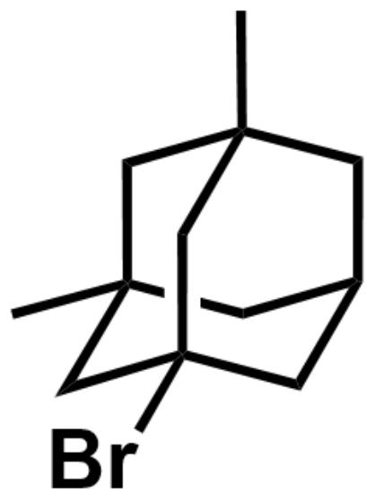

C[C@@]12C[C@@]3(Br)C[C@@](C1)(C)C[C@@H](C2)C3

# CHECKPOINT

0.5 PTS

实验得到的单溴代物由三级自由基生成

# CHECKPOINT

0.5 PTS

实验得到的单溴代物没有对映异构体

答案为E选项