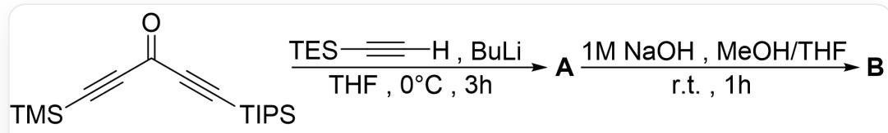
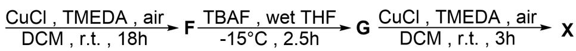
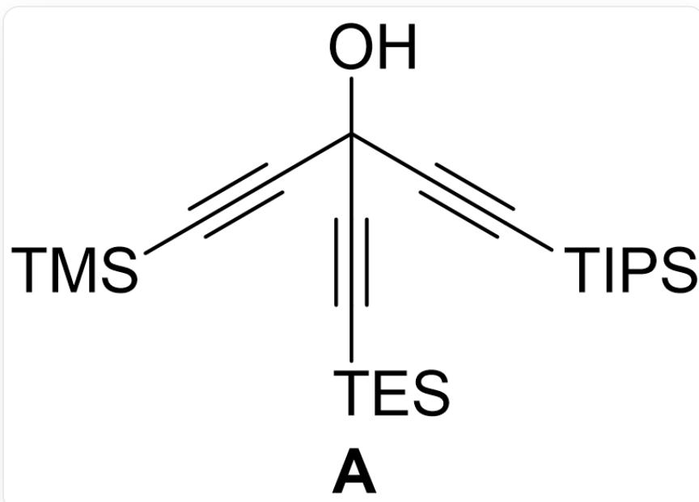
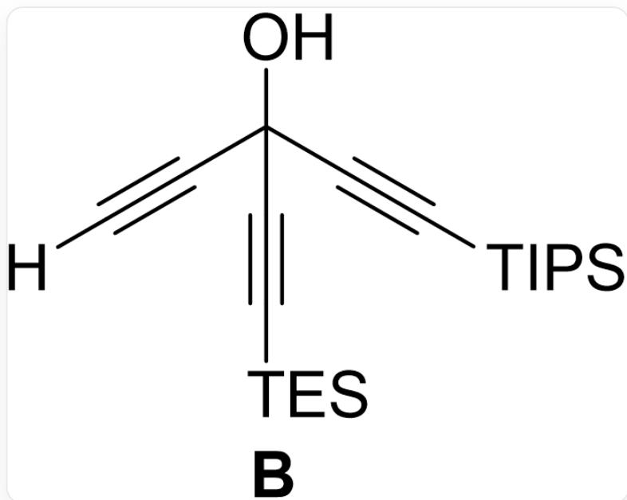
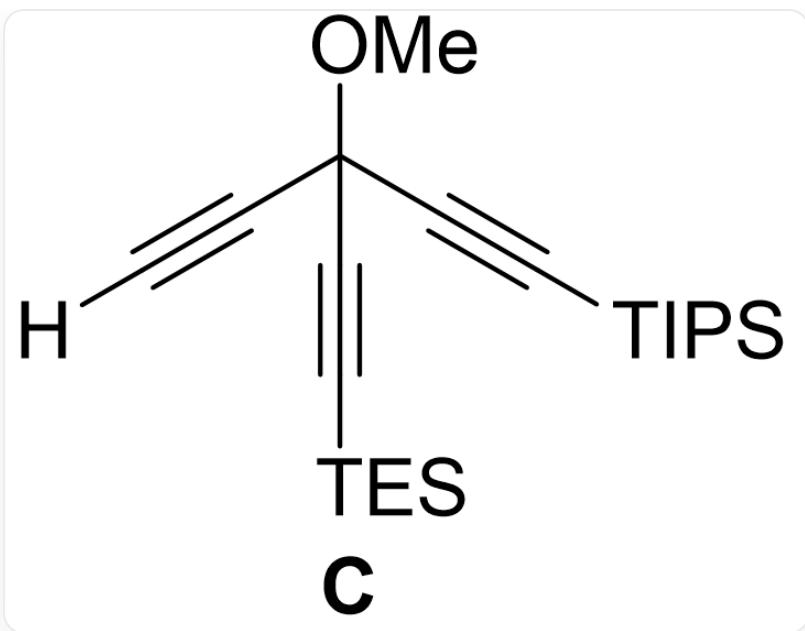
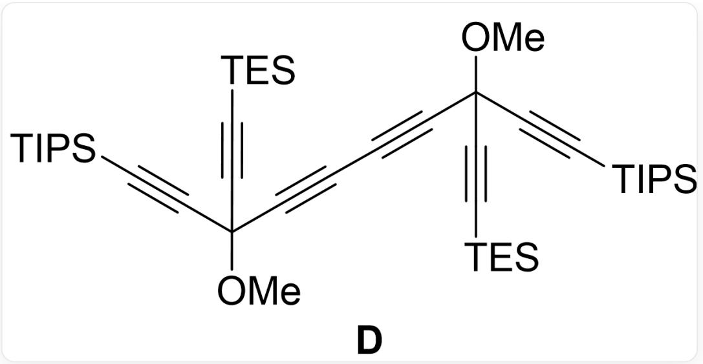
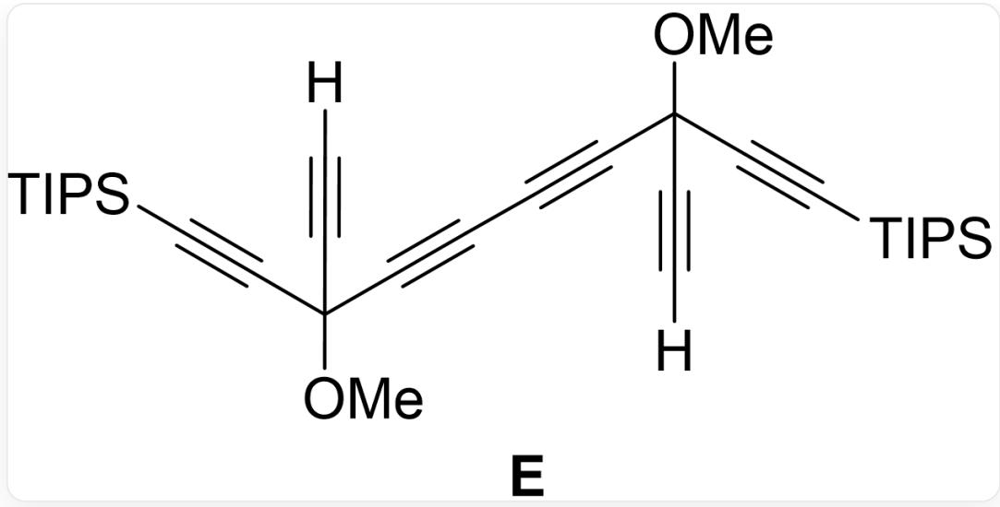
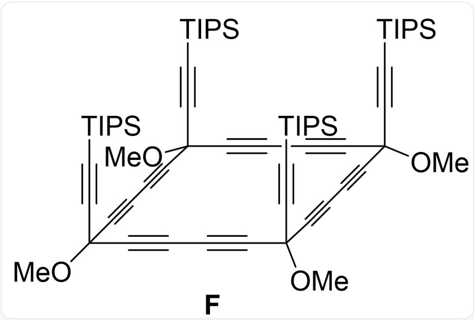
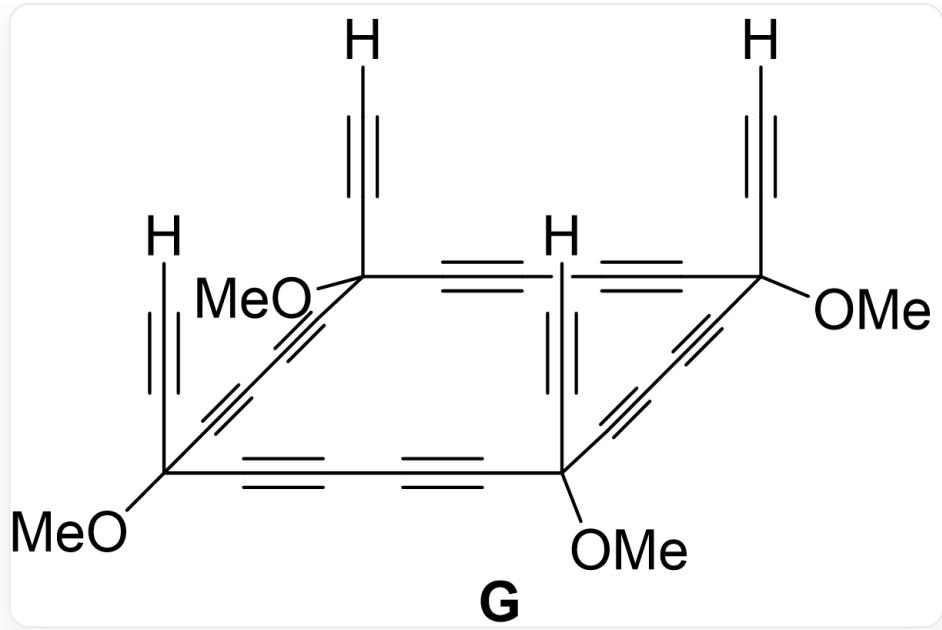
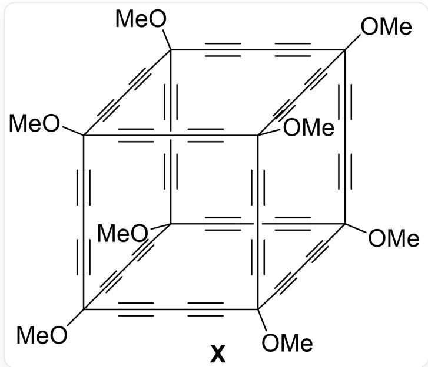

# Question

Infer the final product  $\mathbf{X}$  with higher symmetry, and calculate the quotient of its relative molecular mass (rounded to two decimal places) and its molecular point group order.

Note: Identical substituents in  $\mathbf{X}$  are regarded as spheres of the same size.

The following is the synthetic route of X: The raw material is O=C(C#C[Si](C(C)C)(C(C)C)C(C)C)C#C[Si] (C)(C)C; the first reaction condition is [H]C#C[Si](CC)(CC)CC, BuLi, THF, 0 degrees Celsius for 3 hours; the second reaction condition is 1 M NaOH, MeOH, THF, room temperature for 1 hour; the third reaction condition is BuLi, THF, -78 degrees Celsius for 10 minutes, then add Mel and gradually raise to room temperature; the fourth reaction condition is CuCl, TMEDA, DCM, exposed to air at room temperature for 5 hours; the fifth reaction condition is  $\mathrm{K}_2\mathrm{CO}_3$ , MeOH, THF, room temperature for 2.5 hours; the sixth reaction condition is CuCl, TMEDA, DCM, exposed to air at room temperature for 18 hours; the seventh reaction condition is TBAF, wet THF, -15 degrees Celsius for 2.5 hours; the eighth reaction condition is CuCl, TMEDA, DCM, exposed to air at room temperature for 3 hours

A. All other options are incorrect.  
B. 38.37  
C. 19.18

D. 7.67  
E. 65.07  
F. 65.58  
G. 37.79  
H. 136.67  
I. 47.37  
J. 16.42  
K. 28.18  
L. 86.39  
M. 68.37  
N. 9.67  
O. 12.37  
P. 97.18  
Q. 74.67

# Answer

Correct Answer: C

# Detailed Explanation

The first step is deprotonation of the terminal alkyne, followed by addition of the alkynyl anion to the carbonyl group and subsequent workup to afford a tertiary alcohol.

  
A: O[C@](C#C[Si](C(C)C)(C(C)C)C(C)C)(C#C[Si](CC)(CC)CC)C#C[Si](C)(C)C

CHECKPOINT

1 PTS

A is O[C@](C#C[Si](C(C)C)(C(C)C)C(C)C)(C#C[Si](CC)(CC)CC)C#C[Si](C)(C)C

The second step involves relatively mild conditions for the removal of the silyl group. Since there is a stronger deprotection step later, only -TMS is removed in this step.

  
B: O[C@](C#C[Si](C(C)C)(C(C)C)C(C)C)(C#C[Si](CC)(CC)CC)C#C[H]

# CHECKPOINT

1 PTS

B is O[C@](C#C[Si](C(C)C)(C(C)C)C(C)C)(C#C[Si](CC)(CC)CC)C#C[H]

In the third step, BuLi deprotonates the compound. Since the next step is a typical oxidative coupling of alkynes, and the acidity of the alcohol hydroxyl group is stronger than that of the alkynyl hydrogen, the alcohol hydroxyl group is preferentially deprotonated and undergoes substitution with -Me, and the alkyne does not undergo substitution.

C: [H]C#C[C@@](C#C[Si](CC)(CC)CC)(OC)C#C[Si](C(C)C)(C(C)C)C(C)C

# CHECKPOINT

1 PTS

C is [H]C#C[C@@](C#C[Si](CC)(CC)CC)(OC)C#C[Si](C(C)C)(C(C)C)C(C)C

In the fourth step, two molecules of  $\mathbf{C}$  undergo oxidative coupling.

  
D: CO[C@](C#C[Si](C(C)C)(C(C)C)C(C)C)(C#C[Si](CC)(CC)CC)C#CC#C[C@@](C#C[Si](CC)(CC)CC) (OC)C#C[Si](C(C)C)(C(C)C)C(C)C

# CHECKPOINT

1 PTS

D is CO[C@](C#C[Si](C(C)C)(C(C)C)C(C)C)(C#C[Si](CC)(CC)CC)C#CC#C[C@@](C#C[Si](CC) CC)CC)(OC)C#C[Si](C(C)C)(C(C)C)C(C)C

In the fifth step, the more difficult to remove TES group is removed with a longer reaction time.

  
E: [H]C#C[C@@](C#C[Si](C(C)C)(C(C)C)C(C)C)(OC)C#CC#C[C@@](C#C[H])(OC)C#C[Si](C(C)C)  
(C(C)C)C(C)C

# CHECKPOINT

1 PTS

E is [H]C#C[C@@](C#C[Si](C(C)C)(C(C)C)C(C)C)(OC)C#CC#C[C@@](C#C[H])(OC)C#C[Si](C(C)C)

(C(C)C)C(C)C

In the sixth step, two molecules of  $\mathbf{E}$  undergo oxidative coupling to form the square  $\mathbf{F}$ .

  
F: CC([Si](C#CC(C#CC#CC(C#CC#CC1(OC)C#C[Si](C(C)C)(C(C)C)C(C)C)(OC)C#C[Si](C(C)C)(C(C)C)C(C)C) (OC)C#CC#CC(C#CC#C1)(OC)C#C[Si](C(C)C)(C(C)C)C(C)C)(C(C)C)C

# CHECKPOINT

1 PTS

F is CC([Si](C#CC(C#CC#CC(C#CC#CC1(OC)C#C[Si](C(C)C)(C(C)C)C(C)C)(OC)C#C[Si](C(C)C)  
(C(C)C)C(C)C)(OC)C#CC#CC(C#CC#C1)(OC)C#C[Si](C(C)C)(C(C)C)C(C)C)(C(C)C)C

In the seventh step, the most difficult to remove TIPS group is removed under the action of TBAF.

  
G: [H]C#CC(C#CC#CC(C#CC#CC1(OC)C#C[H])(OC)C#C[H])(OC)C#CC#CC(C#CC#C1)(OC)C#C[H]

# CHECKPOINT

1 PTS

G is [H]C#CC(C#CC#CC(C#CC#CC1(OC)C#C[H])(OC)C#C[H])(OC)C#CC#CC(C#CC#C1)(OC)C#C[H]

The eighth step is oxidative coupling to form the expanded cubane  $\mathbf{X}$ .

X的结构可以看作立方烷的每条边由三根碳碳单键和两根三键交替连接替代，每个顶点上的氢原子由甲氧基替代而成

# CHECKPOINT

1 PTS

X has a structure similar to cubane

The molecular formula of  $\mathbf{X}$  is  $\mathrm{C_{64}H_{24}O_8}$ , the molecular weight is 920.91, belongs to the  $\mathrm{Oh}$  point group, is a group of order 48, the quotient is 19.18, choose C.

# CHECKPOINT

1 PTS

The quotient of the molecular weight of  $\mathbf{X}$  and the group order is 19.18