# 题目

推断具有较高对称性的最终产物X，计算其相对分子质量（保留至小数点后第二位）与其分子点群阶数之商。

注意：X中相同的取代基视作大小一致的小球。

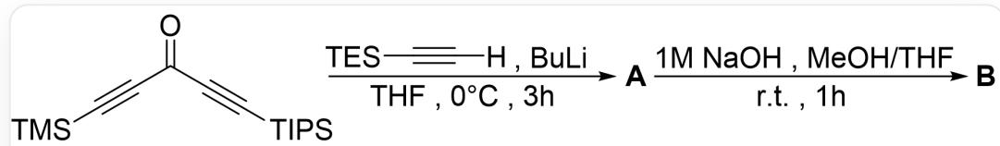

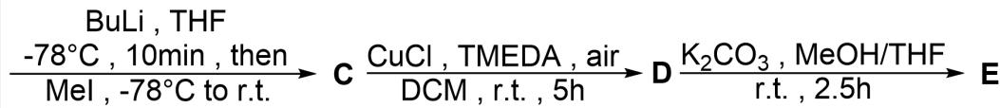

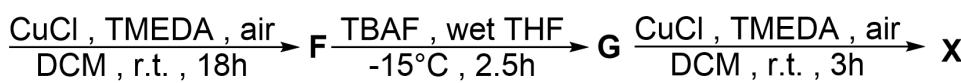

以下为X的合成路线：原料为O=C(C#C[Si](C(C)C)(C(C)C)C(C)C)C#C[Si](C)(C)C；第一步反应条件为[H]C#C[Si](CC)(CC)CC、BuLi、THF、0摄氏度反应3小时；第二步反应条件为1M NaOH、MeOH、THF、室温反应1小时；第三步反应条件为BuLi、THF、-78摄氏度反应10分钟，然后加入Mel逐渐升至室温；第四步反应条件为CuCl、TMEDA、DCM、暴露于空气中室温反应5小时；第五步反应条件为  $\mathrm{K_2CO_3}$  、MeOH、THF、室温反应2.5小时；第六步反应条件为CuCl、TMEDA、DCM、暴露于空气中室温反应18小时；第七步反应条件为TBAF、湿的THF、-15摄氏度反应2.5小时；第八步反应条件为CuCl、TMEDA、DCM、暴露于空气中室温反应3小时

A. 其他选项均不正确  
B. 38.37  
C. 19.18  
D. 7.67

E. 65.07  
F. 65.58  
G. 37.79  
H. 136.67  
I. 47.37  
J. 16.42  
K. 28.18  
L. 86.39  
M. 68.37  
N. 9.67  
O. 12.37  
P. 97.18  
Q. 74.67

# 答案

正确答案: C

# 详细解析

第一步为端炔被攫氢，炔基负离子对羰基进行加成后处理得到叔醇。

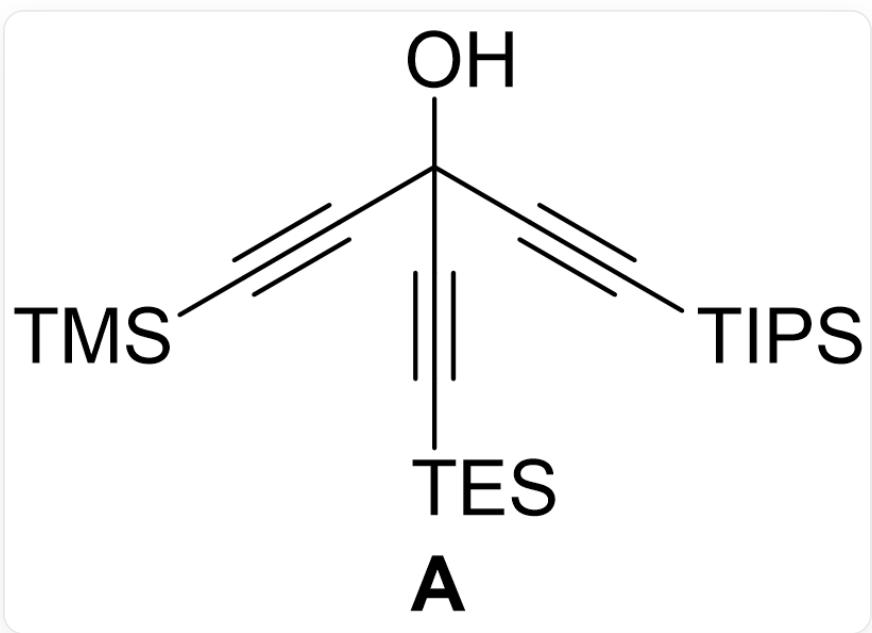  
A: O[C@](C#C[Si](C(C)C)(C(C)C)C(C)C)(C#C[Si](CC)(CC)CC)C#C[Si](C)(C)C

# CHECKPOINT

1 PTS

A 为O[C@](C#C[Si](C(C)C)(C(C)C)C(C)C)(C#C[Si](CC)(CC)CC)C#C[Si](C)(C)C

第二步为比较弱的脱去硅基的条件，由于后续还有更强的脱除步骤，故这一步仅脱去-TMS。

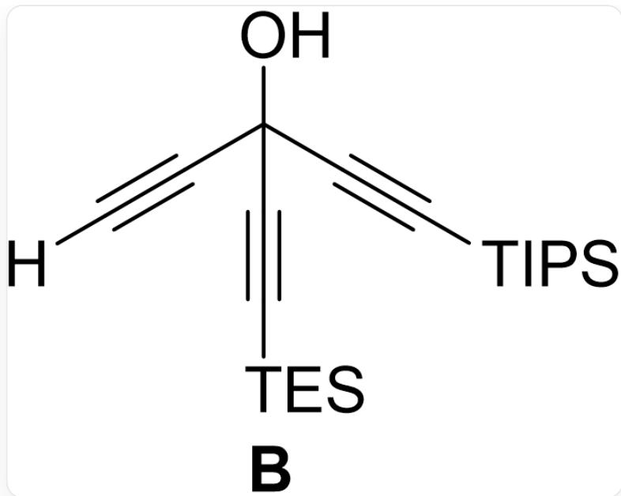  
B: O[C@](C#C[Si](C(C)C)(C(C)C)C(C)C)(C#C[Si](CC)(CC)CC)C#C[H]

# CHECKPOINT

1 PTS

B 为O[C@](C#C[Si](C(C)C)(C(C)C)C(C)C)(C#C[Si](CC)(CC)CC)C#C[H]

第三步BuLi攫氢，由于下一步是典型的炔烃的氧化偶联，醇羟基酸性强于炔基氢，故醇羟基优先被攫氢并发生取代上- Me，炔烃不发生取代。

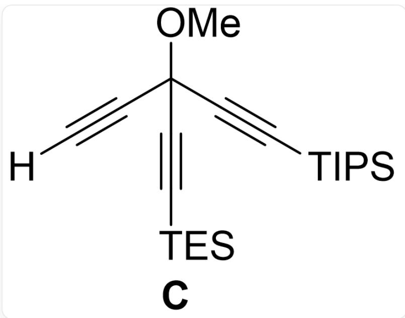

C: [H]C#C[C@@](C#C[Si](CC)(CC)CC)(OC)C#C[Si](C(C)C)(C(C)C)C(C)C

# CHECKPOINT

1 PTS

C为[H]C#C[C@@](C#C[Si](CC)(CC)CC)(OC)C#C[Si](C(C)C)(C(C)C)C(C)C

第四步两分子的C发生氧化偶联。

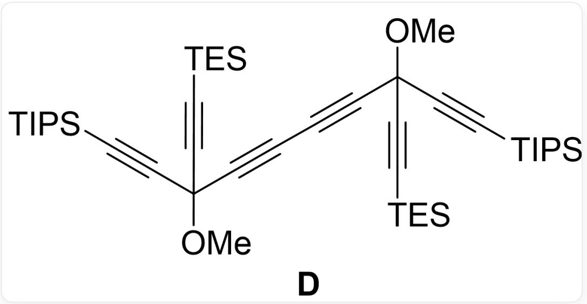  
D: CO[C@](C#C[Si](C(C)C)(C(C)C)C(C)C)(C#C[Si](CC)(CC)CC)C#CC#C[C@@](C#C[Si](CC)(CC)CC) (OC)C#C[Si](C(C)C)(C(C)C)C(C)C

# CHECKPOINT

1 PTS

D 为 CO[C@](C#C[Si](C(C)C)(C(C)C)C(C)C)(C#C[Si](CC)(CC)CC)C#CC#C[C@@](C#C[Si](CC) (CC)CC)(OC)C#C[Si](C(C)C)(C(C)C)C(C)C

第五步在更长的反应时间下脱去更难脱的TES基团。

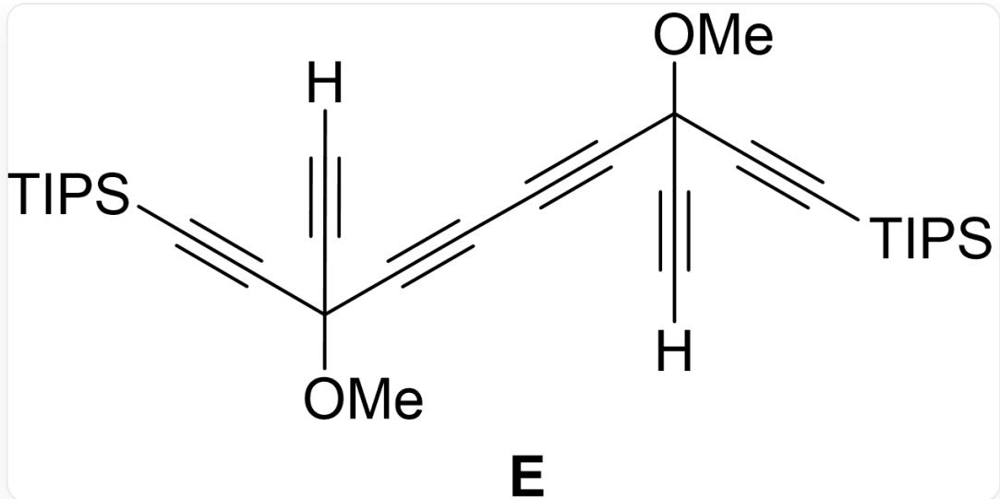  
E: [H]C#C[C@@](C#C[Si](C(C)C)(C(C)C)C(C)C)(OC)C#CC#C[C@@](C#C[H])(OC)C#C[Si](C(C)C)  
(C(C)C)C(C)C

# CHECKPOINT

1 PTS

E 为 [H]C#C[C@@](C#C[Si](C(C)C)(C(C)C)C(C)C)(OC)C#CC#C[C@@](C#C[H])(OC)C#C[Si](C(C)C)

(C(C)C)C(C)C

第六步两分子的E发生氧化偶联形成正方形的F。

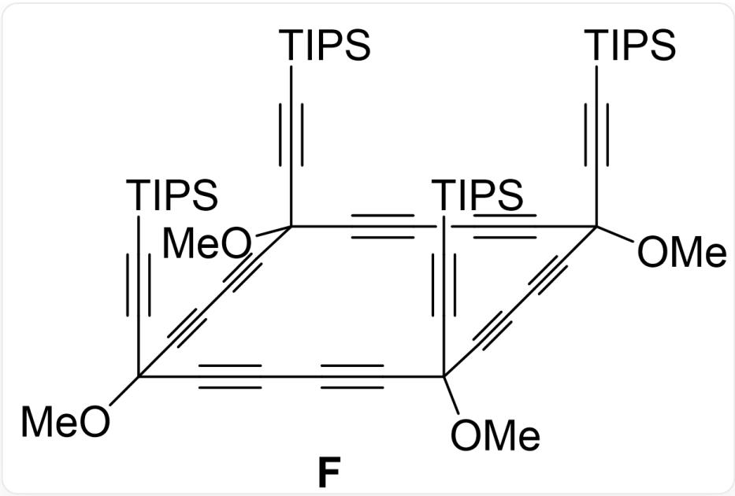  
F: CC([Si](C#CC(C#CC#CC(C#CC#CC1(OC)C#C[Si](C(C)C)(C(C)C)C(C)C)(OC)C#C[Si](C(C)C)(C(C)C)C(C)C) (OC)C#CC#CC(C#CC#C1)(OC)C#C[Si](C(C)C)(C(C)C)C(C)C)(C(C)C)C

# CHECKPOINT

1 PTS

F 为 CC([Si](C#CC(C#CC#CC(C#CC#CC1(OC)C#C[Si](C(C)C)(C(C)C)C(C)C)(OC)C#C[Si](C(C)C)  
(C(C)C)C(C)C)(OC)C#CC#CC(C#CC#C1)(OC)C#C[Si](C(C)C)(C(C)C)C(C)C)(C(C)C)C(C)C

第七步在TBAF作用下脱去最难脱的TIPS基团。

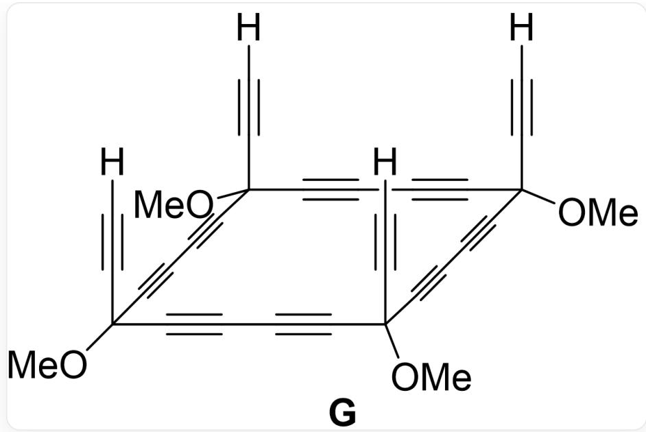  
G: [H]C#CC(C#CC#CC(C#CC#CC1(OC)C#C[H])(OC)C#C[H])(OC)C#CC#CC(C#CC#C1)(OC)C#C[H]

# CHECKPOINT

1 PTS

G为[H]C#CC(C#CC#CC(C#CC#CC1(OC)C#C[H])(OC)C#C[H])(OC)C#CC#CC(C#CC#C1)(OC)C#C[H]

第八步氧化偶联形成扩张立方烷X。

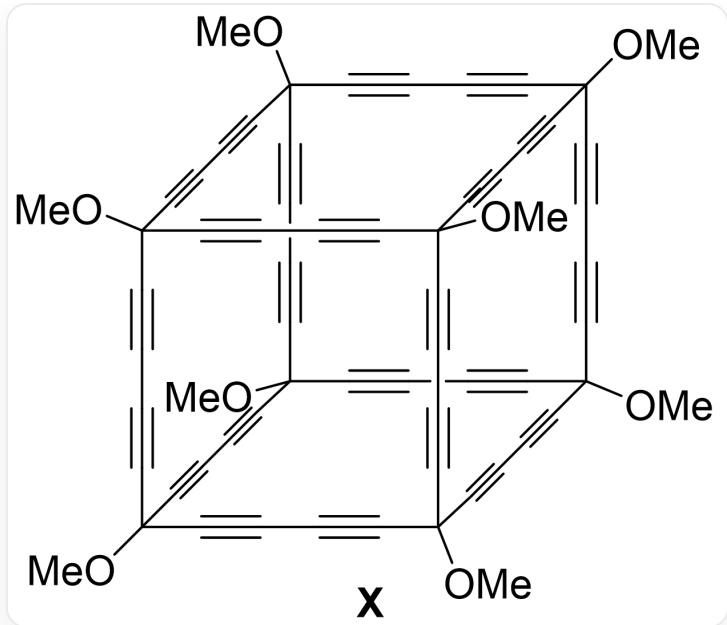

X的结构可以看作立方烷的每条边由三根碳碳单键和两根三键交替连接替代，每个顶点上的氢原子由甲氧基替代而成

# CHECKPOINT

1 PTS

X具有类似立方烷的结构

$\mathbf{X}$  的分子式为  $\mathrm{C_{64}H_{24}O_8}$ ，分子量为920.91，属  $\mathrm{O_h}$  点群，为48阶群，商为19.18，选C。

# CHECKPOINT

1 PTS

X的分子量与群阶数之商为19.18