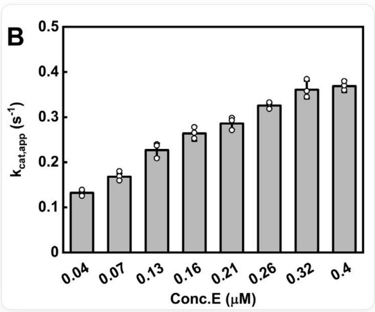

# Question

The figure shows the experimental results obtained from an experiment on a specific enzyme. Based on this figure, determine which of the following statements is correct.

This is a bar chart labeled with the letter "B" in the upper left corner, with no other title. The x-axis label is "Conc. E (μM)", with eight data points below it corresponding to "0.04", "0.07", "0.13", "0.16", "0.21", "0.26", "0.32", and "0.4". The y-axis label is "ksubcat,app/sub>", with units of s-1-1/sup>; the y-axis values range from 0 to 0.5, with tick intervals of 0.1. Above each x-axis tick is a vertical gray rectangular bar, with individual data points represented by open circles—almost every bar has three circles. All bars increase in height from left to right: the shortest bar appears at "0.04" μM, with a height of approximately 0.1, while the tallest bar is at "0.4" μM, with a height of approximately 0.4. The bar at "0.32" μM has a height of about 0.35, and the bar at "0.07" μM is around 0.15. The heights of the remaining bars gradually increase between these two points. The data points show slight vertical fluctuations but are generally clustered near the top of each bar. The top edges of the bars are black. The figure contains no additional text, legends, or annotations.

A. As the enzyme concentration increases, the binding of the enzyme to the substrate is enhanced.  
B. The enzyme cannot be pyruvate kinase PKM2

C. This enzyme might be phosphoglycerate dehydrogenase PHGDH  
D. The experimental results indicate that this enzyme can form oligomers with a stable structure.

# Answer

Correct Answer: C

# Detailed Explanation

From the question, it is clear that as the enzyme concentration increases, the apparent  $k_{\mathrm{cat}}$  of the enzyme increases, indicating higher enzyme activity. Possible reasons for this phenomenon include dimerization of the enzyme to enhance activity, phase separation of the enzyme under specific experimental conditions to improve activity, or reduced apparent activity at low concentrations due to decreased stability caused by surface adsorption, among others. For metabolic enzymes, the most common possibility is the formation of structures such as dimers or tetramers, and it is highly likely that these oligomers exhibit higher activity. However, this is not the only possibility. For example, some enzymes can form condensates through phase separation and increase activity, and such aggregates may not have a stable structure. Additionally, processes like enzyme autoactivation may also affect the apparent  $k_{\mathrm{cat}}$  results.

Therefore, option A— $k_{\mathrm{cat}}$  represents the number of substrate molecules converted per unit time by the enzyme, while substrate binding is characterized by  $K_{\mathrm{M}}$ , making it impossible to determine whether the two are directly related—is incorrect.

# CHECKPOINT

1 PTS

$k_{\mathrm{cat}}$  characterizes catalytic rate and is unrelated to substrate binding

Option B—the tetramer of PKM2 has high glycolytic activity, while the dimer has low activity, which aligns with the implication of the question, so PKM2 is a possible candidate—is incorrect.

# CHECKPOINT

1 PTS

PKM2 can form tetramers, and tetramers exhibit higher activity than dimers

Option C—the dimer formed by the dimerization of the catalytic domain of PHGDH has higher activity than the monomer, which matches the content suggested by the figure, so PHGDH is a possible candidate—is correct.

# CHECKPOINT

1 PTS

PHGDH can form dimers or tetramers, and this is essential for catalytic activity

Option D—under specific experimental conditions or systems, changes such as phase separation in the enzyme may also lead to increased activity without the formation of traditionally stable complexes. Additionally, since the physical quantity in the figure reflects the apparent kcat, calculated as  $V_{\mathrm{max}} / [E]$ , for enzymes with autoactivation effects (e.g., protease self-cleavage activation), the apparent  $k_{\mathrm{cat}}$  will also increase with enzyme concentration, even though the true  $k_{\mathrm{cat}}$  is unaffected. Therefore, this data alone cannot confirm the formation of stable multimeric structures. Further validation would require additional experiments such as SEC or DLS, so D is incorrect.

# CHECKPOINT

1 PTS

Phase separation, autoactivation, and other processes may also produce results as shown in the figure, but they do not involve stable multimeric structures