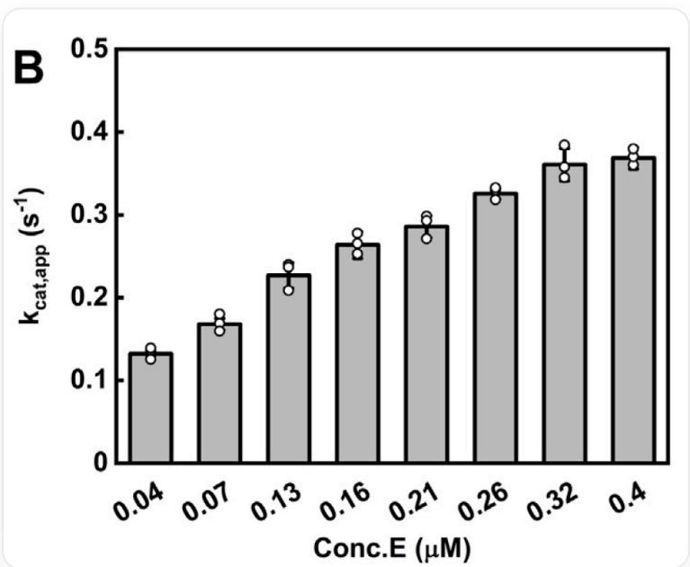

# 题目

如图是针对某个酶进行实验时得到的实验结果。根据此图，判断以下的说法中正确的是

这是一张条形图，左上方标有字母“B”，无其它标题。横坐标标签为“Conc.E(μM)”，其下方依次有八个数据点，分别对应“0.04”、“0.07”、“0.13”、“0.16”、“0.21”、“0.26”、“0.32”和“0.4”；纵坐标标签为“k cat,app”，单位为秒(s)的-1次；纵坐标的数值从0到0.5，刻度间隔为0.1。每个横坐标刻度上方有一根灰色直立矩形条形，条形上方有开口圆点符号表示的单独数据点，几乎每处条形上方有三个圆点。所有条形自左向右高度递增，最低的条形出现在“0.04”μM处，高度约为0.1，最高的条形出现在“0.4”μM处，高度约为0.4；“0.32”μM处的高度约为0.35，“0.07”μM处的高度约为0.15，两者之间其余各条形的高度随横坐标的增加而逐步上升；，每组圆点均稍有上下浮动但整体集中在条形顶端附近，条的顶端边缘为黑色。图中没有其它文字、图例或额外标注。

A. 随着酶浓度的升高, 该酶与底物的结合增强  
B. 该酶不可能是丙酮酸激酶PKM2  
C. 该酶有可能是磷酸甘油酸脱氢酶PHGDH  
D. 实验结果表明该酶能形成具有稳定结构的寡聚体

# 答案

正确答案: C

# 详细解析

读题可知，随着该酶浓度上升，酶的表观kcat变大，证明酶的活性变高。造成这种现象的原因可能包括酶发生二聚化等提高活性、酶特定实验条件下发生相分离提高活性、低浓度下酶由于表面吸附等原因造成稳定性较差导致表观上观测到的活性下降等。其中代谢酶而言，最常见的可能性是形成了二聚、四聚等结构，并且很有可能这些寡聚体的活性是更高的。然而这并非唯一可能，例如一些酶可以通过相分离形成凝聚体并提高活性，这种聚集体可能并不是具有稳定结构的。此外，酶的自激活等过程也可能会影响表观kcat的结果。

因此选项A，kcat表征的是酶单位时间转化的底物数目，而表征底物结合的是KM，无法判断两者是否有直接关联，因此错误；

# CHECKPOINT

1 PTS

kcat表征催化速率，与底物结合无关

选项B，PKM2的四聚体具有高糖酵解活性，二聚体具有低活性，符合题意，故有可能是PKM2，因此错误；

# CHECKPOINT

1 PTS

PKM2能够形成四聚体，且四聚体比二聚体活性更高

选项C，PHGDH催化结构域发生二聚化形成的二聚体具有比单体更高的活性，符合图片所暗示内容，故有可能是PHGDH，因此正确；

# CHECKPOINT

1 PTS

PHGDH能够形成二聚或四聚体，且是催化活性必需

选项D，在特定实验条件或体系下，酶发生相分离等变化也可能导致活性提升，而非形成传统意义上的稳定复合物；此外，由于图中的物理量体现的是表观（appearance）kcat，其计算方法为Vmax/[E]，对于存在自激活效应的酶（例如蛋白酶自酶切激活等），其表观kcat也会随酶浓度上升而变大，尽管真实kcat不受影响。因此仅凭该数据尚不能得出能够形成稳定结构的多聚体，若要进一步确证，需要结合SEC、DLS等其他实验，故D不正确。

# CHECKPOINT

1 PTS

相分离、自激活等过程也可能得到如图结果，但并非稳定的多聚体结构