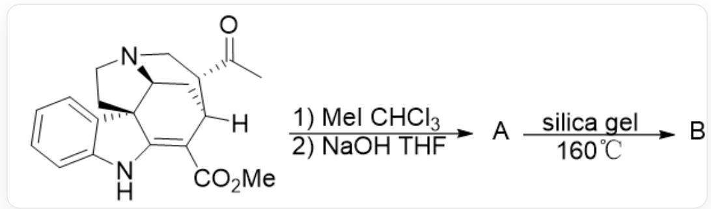
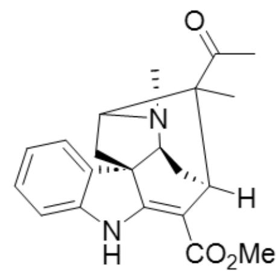
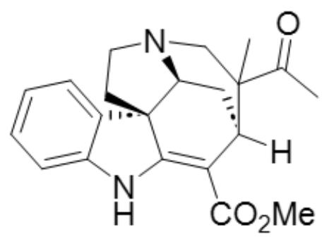
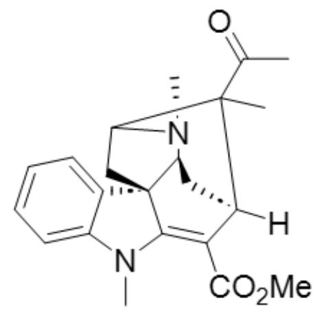
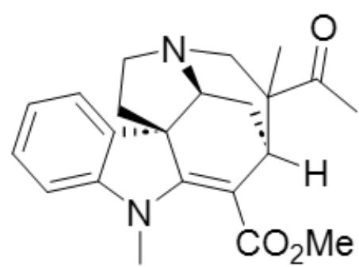
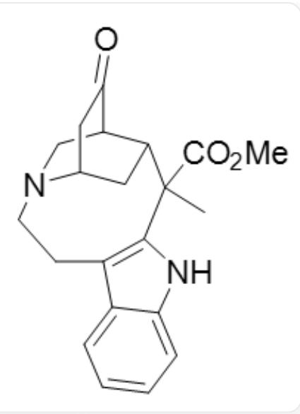
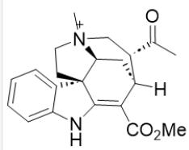
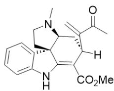
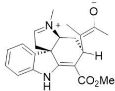
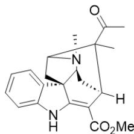

# Question

Traditional C-H bond activation involves inducing a transition metal to perform oxidative addition on a C-H bond via an inductive group. However, removing the H atom as a hydride to obtain a positive charge center is also a long-standing and very practical activation strategy. Some researchers have used this approach to complete the reconstruction of natural product skeletons.

  
CC([C@H]1CN2[C@H]3C[C@]1([H])C(C(OC)=O)=C4NC5=CC=CC=C5[C@@]43CC2)=O first reacts in CHCl₃ and MeI, and then is treated with NaOH in THF solution to obtain A. A is added to silica gel and can be converted to B at 160°C.

Give a reasonable structure for product  $\mathbf{B}$ .

A. All other options are incorrect

B.

  
C.

CC1(C(C)=O)[C@@]2([H])C(C(OC)=O)=C3NC4=CC=CC=C4[C@]3(CC1N5C)[C@@H]5C2

  
D.

CC1(C(C)=O)[C@@]2([H])C(C(OC)=O)=C3NC4=CC=CC=C4[C@]3(CCN5C1)[C@@H]5C2

  
E.

CC1(C(C)=O)[C@@]2([H])C(C(OC)=O)=C3N(C)C4=CC=CC=C4[C@]3(CC1N5C)[C@@H]5C2

  
F.

CC1(C(C)=O)[C@@]2([H])C(C(OC)=O)=C3N(C)C4=CC=CC=C4[C@]3(CCN5C1)[C@@H]5C2

O=C1[C@@H]2C[N@@](CCC3=C4NC5=CC=CC=C35)[C@H](C1)C[C@H]2C4(C(OC)=O)C

# Answer

Correct Answer: B

# Detailed Explanation

The raw material first undergoes nitrogen methylation to obtain a quaternary ammonium salt, yielding intermediate 1

# CHECKPOINT

1 PTS

原料首先发生氮甲基化得到季铵盐得到中间体1

The

structure

of

1

is:

CC([C@H]1C[N@@+]2(C)

[C@H]3C[C@]1([H])C(C(OC)=O)=C4NC5=CC=CC=C5[C@@]43CC2)=O

# CHECKPOINT

1 PTS

1

的

结

构

为

：

CC([C@H]1C[N@@+]2(C)

[ \mathrm{[C@H]3C[C@]1([H])C(C(OC)=O)=C4NC5=CC=CC=C5[C@@]43CC2)=O} ]

Subsequently, intermediate 1 undergoes elimination under the action of NaOH to obtain A

# CHECKPOINT

1 PTS

此后中间体1在  $\mathrm{NaOH}$  的作用下消除得到A

A: C=C(C(C)=O)[C@@]1([H])C(C(OC)=O)=C2NC3=CC=CC=C3[C@]2(CCN4C)[C@@H]4C1

# CHECKPOINT

1 PTS

A: C=C(C(C)=O)[C@@]1([H])C(C(OC)=O)=C2NC3=CC=CC=C3[C@]2(CCN4C)[C@@H]4C1

A can undergo intramolecular hydride shift, experiencing intermediate 2

# CHECKPOINT

1 PTS

A 可以发生分子内的负氢迁移, 经历中间体 2

Intermediate 2 undergoes intramolecular cyclization to obtain B:CC1(C(C)=O) [C@@]2([H])C(C(OC)=O)=C3NC4=CC=C4[C@]3(CC1N5C)[C@@H]5C2。

# CHECKPOINT

1 PTS

中间体 2 发生分子内关环得到 B:CC1(C(C)=O) [C@@]2([H])C(C(OC)=O)=C3NC4=CC=CC=C4[C@]3(CC1N5C)[C@@H]5C2。

The structure of 2:C/C([C@@]1([H])C(C(OC)=O)=C2NC3=CC=CC=C3[C@]2(CC=[N+]4C)

[ \text{[C@@H]4C1)} = \text{C([O-])/C} ]

# CHECKPOINT

1 PTS

2:C/C([C@@]1([H])C(C(OC)=O)=C2NC3=CC=CC=C3[C@]2(CC=[N+]4C)[C@@H]4C1)=C([O-])/C

Because the BDE on the secondary carbon is smaller and it is also spatially closer, the hydrogen migration on the secondary carbon is selected.

Therefore, B is correct

  
1

  
A

  
2

  
B

1:CC([C@H]1C[N@@+]2(C)[C@H]3C[C@]1([H])C(C(OC)=O)=C4NC5=CC=CC=C5[C@@]43CC2)=O A:

$\mathrm{C = C(C(C) = O)[C@]1([H])C(C(OC) = O) = C2NC3 = CC = CC = C3[C@]2(CCN4C)[C@@H]4C12}$

:C/C([C@@]1([H])C(C(OC)=O)=C2NC3=CC=CC=C3[C@]2(CC=[N+]4C)[C@@H]4C1)=C([O-])/CB:

CC1(C(C)=O)[C@@]2([H])C(C(OC)=O)=C3NC4=CC=CC=C4[C@]3(CC1N5C)[C@@H]5C2