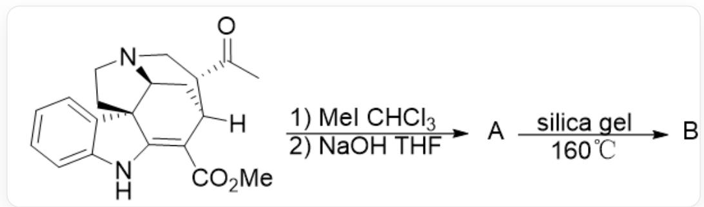
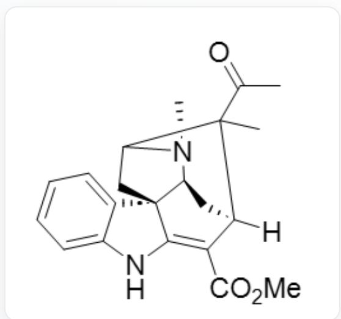
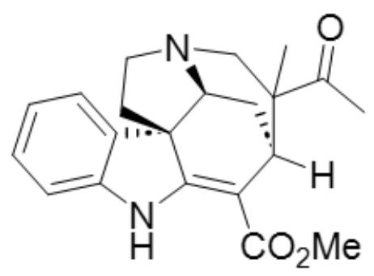
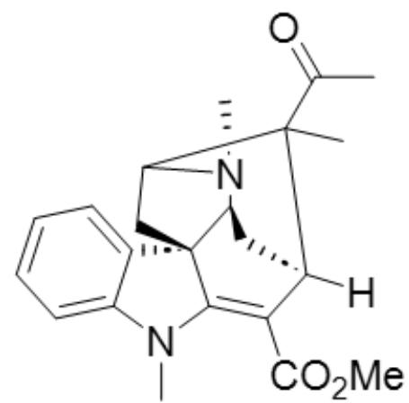
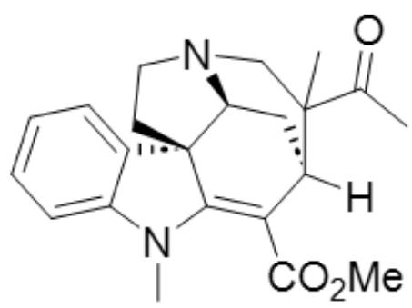
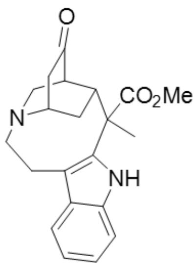
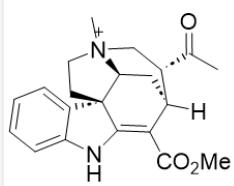
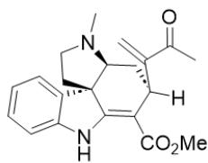
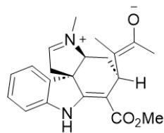
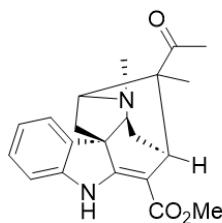

# 题目

传统的 C-H 键活化是将一根 C-H 键通过诱导基团促使过渡金属对该 C-H 键实现氧化加成，而将这个 H 原子以氢负离子的形式离去得到正电中心其实也是一种存在已久且十分实用的活化思路。有研究者利用这一思路完成了天然产物骨架的重构。

  
CC([C@H]1CN2[C@H]3C[C@]1([H])C(C(OC)=O)=C4NC5=CC=CC=C5[C@@]43CC2)=O先在CHCl3和MeI反应，此后经过NaOH的THF溶液处理得到A。A加入硅胶在  $160^{\circ} \mathrm{C}$  下可以转化为B。

给出合理的产物B的结构。

A. 其他选项均不正确  
B.

  
CC1(C(C)=O)[C@@]2([H])C(C(OC)=O)=C3NC4=CC=CC=C4[C@]3(CC1N5C)[C@@H]5C2

C.  
  
CC1(C(C)=O)[C@@]2([H])C(C(OC)=O)=C3NC4=CC=CC=C4[C@]3(CCN5C1)[C@@H]5C2

D.  
E.  
  
CC1(C(C)=O)[C@@]2([H])C(C(OC)=O)=C3N(C)C4=CC=CC=C4[C@]3(CC1N5C)[C@@H]5C2

  
F.

CC1(C(C)=O)[C@@]2([H])C(C(OC)=O)=C3N(C)C4=CC=CC=C4[C@]3(CCN5C1)[C@@H]5C2

O=C1[C@@H]2C[N@@](CCC3=C4NC5=CC=CC=C35)[C@H](C1)C[C@H]2C4(C(OC)=O)C

# 答案

正确答案: B

# 详细解析

原料首先发生氮甲基化得到季铵盐得到中间体1

# CHECKPOINT

1 PTS

原料首先发生氮甲基化得到季铵盐得到中间体1

1 的 结 构 为 CC([C@H]1C[N@@+]2(C)

[ \mathrm{[C@H]3C[C@]1([H])C(C(OC)=O)=C4NC5=CC=CC=C5[C@@]43CC2)=O} ]

# CHECKPOINT

1 PTS

1 的 结 构 为 CC([C@H]1C[N@@+]2(C)

[ \mathrm{C@H} ] 3 \mathrm{C}[\mathrm{C} @]1([ \mathrm{H} ]) \mathrm{C}(\mathrm{C} (\mathrm{OC}) = \mathrm{O}) = \mathrm{C4NC5} = \mathrm{CC} = \mathrm{CC} = \mathrm{C5} [\mathrm{C} @ @]43 \mathrm{CC}2) = \mathrm{O} ]

此后中间体 1 在  $\mathrm{NaOH}$  的作用下消除得到 A

# CHECKPOINT

1 PTS

此后中间体 1 在  $\mathrm{NaOH}$  的作用下消除得到 A

A: C=C(C(C)=O)[C@@]1([H])C(C(OC)=O)=C2NC3=CC=CC=C3[C@]2(CCN4C)[C@@H]4C1

# CHECKPOINT

1 PTS

A: C=C(C(C)=O)[C@@]1([H])C(C(OC)=O)=C2NC3=CC=CC=C3[C@]2(CCN4C)[C@@H]4C1

A 可以发生分子内的负氢迁移, 经历中间体 2

# CHECKPOINT

1 PTS

A 可以发生分子内的负氢迁移, 经历中间体 2

中间体 2 发生分子内关环得到 B:CC1(C(C)=O) [C@@]2([H])C(C(OC)=O)=C3NC4=CC=C4[C@]3(CC1N5C)[C@@H]5C2。

# CHECKPOINT

1 PTS

中间体 2 发生分子内关环得到  $\mathbf{B}: \mathrm{CC}1(\mathrm{C}(\mathrm{C}) = \mathrm{O})$  [C@@]2([H])C(C(OC)=O)=C3NC4=CC=CC=C4[C@]3(CC1N5C)[C@@H]5C2。

2的结构：C/C([C@@]1([H])C(C(OC)=O)=C2NC3=CC=CC=C3[C@]2(CC=[N+]4C)[C@@H]4C1)=C([O-])/C

# CHECKPOINT

1 PTS

2:C/C([C@@]1([H])C(C(OC)=O)=C2NC3=CC=CC=C3[C@]2(CC=[N+]4C)[C@@H]4C1)=C([O-])/C

因为二级碳上的BDE更小，同时空间上也更靠近，因此选择二级碳上的氢迁移。

因此B是正确的

  
1

  
A

  
2

  
B

1: CC([C@H]1C[N@@+]2(C)[C@H]3C[C@]1([H])C(C(OC)=O)=C4NC5=CC=CC=C5[C@@]43CC2)=O A:

$\mathrm{C = C(C(C) = O)[C@]1([H])C(C(OC) = O) = C2NC3 = CC = CC = C3[C@]2(CCN4C)[C@@H]4C12}$

:C/C([C@@]1([H])C(C(OC)=O)=C2NC3=CC=CC=C3[C@]2(CC=[N+]4C)[C@@H]4C1)=C([O-])/CB:

CC1(C(C)=O)[C@@]2([H])C(C(OC)=O)=C3NC4=CC=CC=C4[C@]3(CC1N5C)[C@@H]5C2