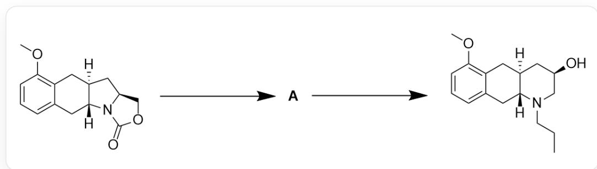
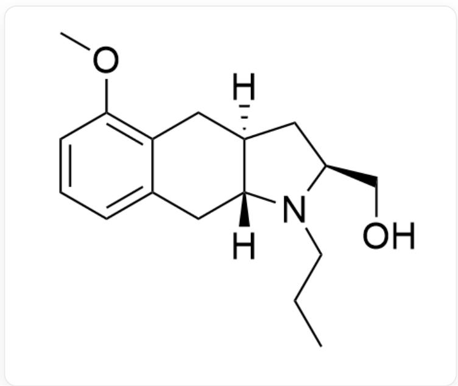
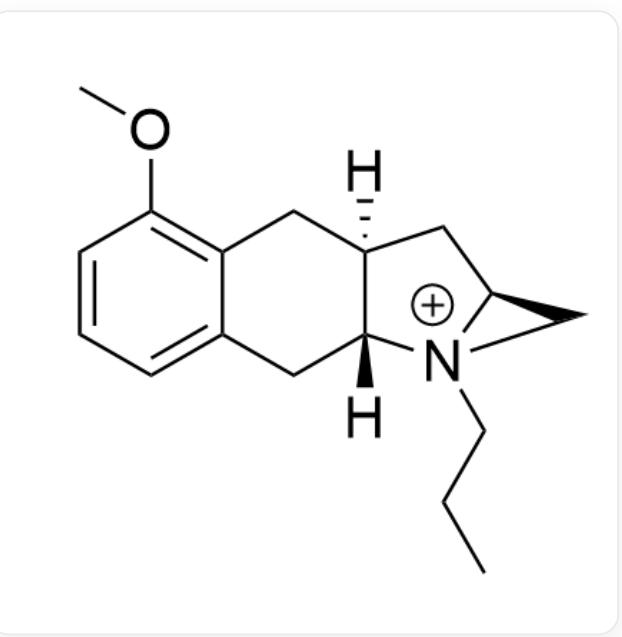

# Question

As shown in Figure 1, the reaction conditions for the first step are: 1) KOH, CH₃OH, reflux, 1h; 2) a, K₂CO₃, CH₃CN, 0°C to r. t., 3h.

The reaction conditions for the second step are:

1)  $(\mathrm{CF}_3\mathrm{CO})_2\mathrm{O}, \mathrm{Et}_3\mathrm{N}, \mathrm{THF}, -78^{\circ}\mathrm{C}, 1.5\mathrm{h}; 2)$  120°C, sealed tube, 24h; 3) NaOH(5M), r.t., 1h.

Propose the reaction mechanism of Figure 1 and the structures of reagent a and intermediate A.

  
Fig. 1, the figure shows two consecutive steps of reaction, the first step reaction is described by SMILES as: COC1=C2C[C@@]3([H])C[C@H]4COC(N4[C@]3([H])CC2=CC=C1)=O>>[[A]], the second step reaction is described by SMILES as: [[A]]>>CCCN1C[C@H](O)C[C@]2([H])CC3=C(OC)C=CC=C3C[C@]21[H]

There are the following statements:

1. Reagent a can be used in catalytic amount  
2. In the process of generating  $\mathbf{A}$ , the net number of carbon atoms within the reactant molecule increases by 3  
3. A high-strain intermediate with positive charge is formed during the reaction  
4. A total of 2 carbon-nitrogen single bonds are broken and 2 carbon-nitrogen single bonds are formed during the reaction

The following option contains all correct statements and the largest number of correct statements:

A. All other options are incorrect

B. 1  
C. 2  
D. 3  
E. 4  
F. 1,2  
G. 1,3  
H. 1,4  
1. 2,3  
J. 2,4  
K. 3,4  
L. 1,2,3  
M. 1,2,4  
N. 1,3,4  
O. 2,3,4

P. 1,2,3,4

# Answer

Correct Answer: K

# Detailed Explanation

Observing the structures of the reactants and products, it can be found that the ester group connected to the nitrogen atom disappears, forming a new six-membered ring, and the relative position of the hydroxyl group on the six-membered ring compared to other groups within the molecule has migrated from the reactant to the position of the two fused five-membered ring carbon-nitrogen bonds. These changes suggest that the reactant may have undergone decarboxylation, substitution of the carbon-nitrogen bond by a hydroxyl group, and conversion of the five-membered ring to a six-membered ring.

In the first step, under condition 1), the ester group of the reactant undergoes alkaline hydrolysis, yielding an unstable carboxyl group connected to the amino group, which rapidly undergoes decarboxylation, resulting in a secondary amine and an alcohol hydroxyl group.

# CHECKPOINT

1 PTS

Alkaline hydrolysis and decarboxylation of reactant ester group

Under condition 2), the intermediate continues to react with reagent a. Based on the product structure and subsequent reaction conditions, there are no conditions in the subsequent reactions to introduce a propyl group at the amino position. Therefore, it is very likely that the role of reagent a is to introduce a propyl group at the amino position. Condition 2) is a base-catalyzed nucleophilic substitution reaction of the amino group, and reagent a can be an alkylating reagent such as bromopropane or iodopropane.

# CHECKPOINT

1 PTS

Reagent a can be an alkylating reagent such as bromopropane or iodopropane

At least one equivalent of reagent a must be charged to completely alkylate the reactant, so statement 1 is incorrect.

The structure of intermediate  $\mathbf{A}$  is shown in Figure 2:

  
Fig. 2, the molecule in the figure is described by SMILES as: COC1=C2C[C@@]3([H])C[C@H](N(CCC) [C@]3([H])CC2=CC=C1)CO

One molecule of carboxyl group is removed and one molecule of propyl group is introduced during the formation of A, resulting in a net increase of 2 carbons, so statement 2 is incorrect.

# CHECKPOINT

1 PTS

The structure of  $\mathbf{A}$  is described by SMILES as: COC1=C2C[C@@]3([H])C[C@H](N(CCC)

$$
[ \mathrm {C} @ ] 3 ([ \mathrm {H} ]) \mathrm {C C} 2 = \mathrm {C C} = \mathrm {C} 1) \mathrm {C O}
$$

Condition 1) in the second step is a typical trifluoroacetylation condition, which can acylate the hydroxyl group to activate it. Condition 2) raises the system temperature from  $-78^{\circ}\mathrm{C}$  to  $120^{\circ}\mathrm{C}$  for the reaction, and the activated trifluoroacetate ion leaves. Considering that the final product undergoes a ring expansion from a five-membered ring to a six-membered ring, this step is likely the nucleophilic attack of the nitrogen atom on the five-membered ring on the carbon where the trifluoroacetate group is located, replacing the trifluoroacetate group to obtain an unstable azatrimethylenimine intermediate as shown in Figure 3:

  
Fig. 3, the molecule in the figure is described by SMILES as: COC1=C2C[C@@]3([H])C[C@H]4C[N+]4(CCC)

[C@]3([H])CC2=CC=C1

# CHECKPOINT

1 PTS

The hydroxyl group is activated and substituted by an amino group, forming a three-membered ring aziridinium ion intermediate

This positively charged intermediate has high ring strain and is unstable, so statement 3 is correct.

In 3), under concentrated alkali conditions, hydroxide replaces the aziridinium ion, unraveling the unstable three-membered ring structure, resulting in the ring-expanded final product.

# CHECKPOINT

1 PTS

Hydroxyl group replaces amino group, ring-opening to obtain a six-membered ring system

During the entire reaction process, decarboxylation breaks one carbon-nitrogen bond, alkylation forms one carbon-nitrogen bond, formation of the three-membered ring forms one carbon-nitrogen bond, and unraveling the three-membered ring breaks one carbon-nitrogen bond, so statement 4 is correct.