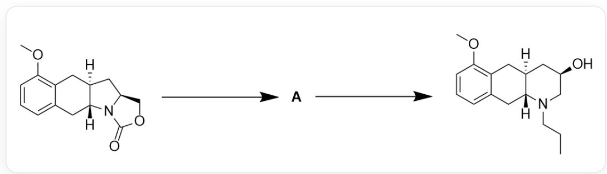
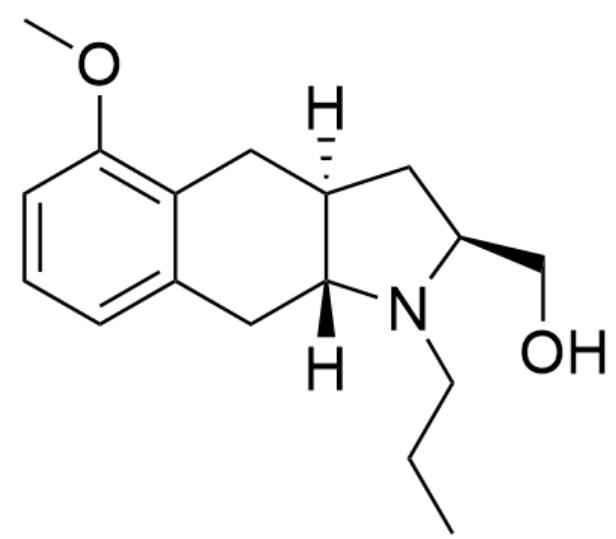
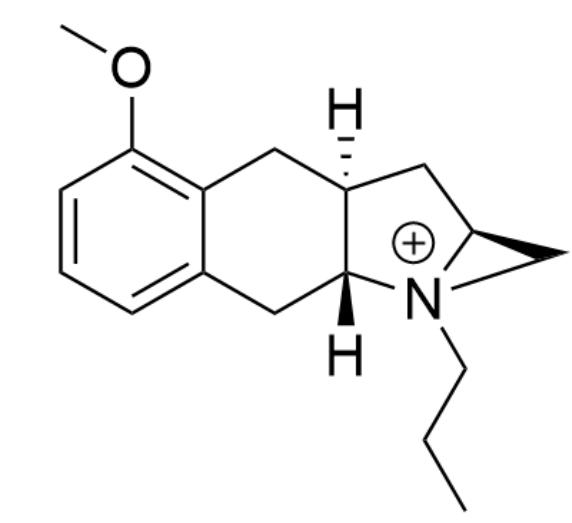

# 题目

如图1反应，其中第一步反应条件为：1)KOH,CH3OH,reflux,1h;2) a $\mathrm{K_2CO_3}$  ,CH3CN,  $0^{\circ}\mathrm{C}$  to r.t.,3h。

第 二 步 反 应 条 件 为 ：

1)  $(\mathrm{CF}_3\mathrm{CO})_2\mathrm{O}, \mathrm{Et}_3\mathrm{N}, \mathrm{THF}, -78^{\circ}\mathrm{C}, 1.5\mathrm{h}; 2)$  120°C, sealed tube, 24h; 3) NaOH(5M), r. t., 1h

推测图1反应机理和试剂 a、中间体 A 的结构。

Fig. 1, 图中为连续两步反应，第一步反应以SMILES描述为：  
  
COC1=C2C[C@@]3([H])C[C@H]4COC(N4[C@]3([H])CC2=CC=C1)=O>>[[A]], 第二步反应以SMILES描述  
为：[[A]]>>CCCN1C[C@H](O)C[C@]2([H])CC3=C(OC)C=CC=C3C[C@]21[H]

# 有以下说法：

1. 试剂 a 使用催化量即可  
2.生成A的过程中反应物分子内碳原子数净增加了3  
3. 反应过程中形成了带正电荷的大张力中间体  
4. 反应过程中总共断裂了2个碳氮单键，形成了2个碳氮单键

下列选项说法全部正确且正确说法数量最多的为：

A. 其他选项均不正确

B. 1  
C. 2  
D. 3  
E. 4  
F. 1,2  
G. 1,3  
H. 1,4  
1. 2,3  
J. 2,4  
K. 3,4  
L. 1,2,3  
M. 1,2,4  
N. 1,3,4  
O. 2,3,4

P. 1,2,3,4

# 答案

正确答案: K

# 详细解析

观察反应物和产物的结构，可以发现与氮原子连接的酯基消失，形成了一个新的六元环，且该六元环上羟基与分子内其他基团的的相对位置相比反应物迁移到了两个五元并环原碳氮键位置。以上变化暗示反应物可能经过了脱羧、碳氮键被羟基取代、以及五元环向六元环的转化。

第一步1)条件下反应物酯基碱性水解，得到不稳定与氨基连接的羧基，快速发生脱羧，得到二级胺和一个醇羟基。

# CHECKPOINT

1 PTS

反应物酯基碱性水解，脱羧

在2)条件下，中间体继续与试剂a反应。根据产物结构和后续的反应条件，后续反应中并没有条件可以在氨基位引入丙基，因此很有可能试剂a的作用即为在氨基位引入丙基。2)条件为碱性催化氨基的亲核取代反应，试剂a可以是溴丙烷、碘丙烷等烷基化试剂。

# CHECKPOINT

1 PTS

试剂a可以是溴丙烷、碘丙烷等烷基化试剂

试剂a至少投料一当量才能完全烷基化反应物，说法1错误。

得到中间体A结构如图2：

  
Fig. 2, 图中分子以SMILES描述为: COC1=C2C[C@@]3([H])C[C@H](N(CCC)[C@]3([H])CC2=CC=C1)CO

生成  $\mathbf{A}$  的过程中脱去了一分子羧基, 引入了一分子丙基, 净碳数增加 2 , 说法 2 错误。

# CHECKPOINT

1 PTS

A结构以SMILES描述为：COC1=C2C[C@@]3([H])C[C@H](N(CCC)[C@]3([H])CC2=CC=C1)CO

第二步条件1)为典型三氟乙酰化条件，可以酰化羟基使其活化。条件2）将体系从-78°C升温至120°C反应，被活化的三氟乙酸根离去。考虑到最终产物发生了五元环到六元环的扩环，该步很可能是五元环上氮原子亲核进攻三氟乙酸根所在碳，取代三氟乙酸根得到一个不稳定的氮杂三元环中间体如图3：

  
Fig. 3, 图中分子以SMILES描述为: COC1=C2C[C@@]3([H])C[C@H]4C[N+]4(CCC)[C@]3([H])CC2=CC=C1

# CHECKPOINT

1 PTS

羟基被活化后被氨基取代，形成三元环鎘离子中间体，以SMILES描述为： $\mathrm{COC1 = C2C[C@@]3([H)]C[C@H]4C[N + ]4(CCC)[C@]3([H])CC2 = CC = C1}$

该带正电荷中间体张力大不稳定，说法3正确。

3)中浓碱下氢氧根取代氮鎘离子，解开不稳定的三元环结构，得到扩环后的最终产物。

# CHECKPOINT

1 PTS

羟基取代氨基，开环得到六元环体系

整个反应过程中脱羧断开一根碳氮键，烷基化形成一根碳氮键，形成三元环形成一根碳氮键，解开三元环断开一根碳氮键，说法4正确。