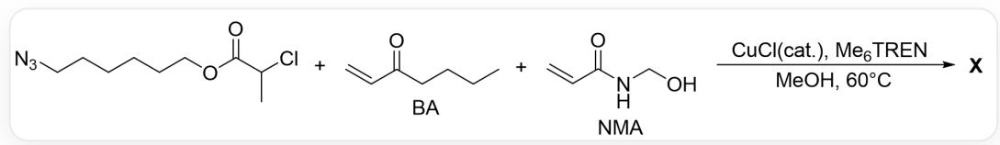

# Question

Self-healing materials refer to a class of materials that can spontaneously repair cracks and restore to some extent their original state after cracks appear in the material. Not long ago, the synthesis of a copolymer  $\mathbf{X}$  ( $\mathrm{PBA}_{\mathrm{x}} - \mathrm{co} - \mathrm{PNMA}_{\mathrm{y}}$ ,  $co$  represents copolymerization) with self-healing properties was reported:

  
This is a copolymerization reaction, represented in SMILES format as:  $\mathrm{O} = \mathrm{C}(\mathrm{C}(\mathrm{C})\mathrm{Cl})\mathrm{O}\mathrm{CCCC}\mathrm{CCN} = [\mathrm{N} + ] =$  [N-]. C=CC(CCCC)=O.C=CC(NCO)=O>>X. The reaction conditions are catalytic amount of CuCl,  $\mathrm{Me}_6\mathrm{TREN}$  (tris(2-dimethylaminoethyl)amine), MeOH, 60 degrees Celsius.

Which of the following statements are incorrect (if statement 1 and statement 2 are incorrect, use "12" to represent it):

1. This is coordination polymerization  
2. The only dynamic covalent bonds during the self-healing of  $\mathbf{X}$  are ether bonds formed by hydroxyl dehydration  
3. In the self-healing process, the role of the BA segment is to act as a flexible group to promote the movement of broken chains towards nearby chains, thereby generating dynamic and static hydrogen bonds to heal the damage  
4. After the polymer X self-heals in water, the shape and morphology remain unchanged even after soaking in water for 24 hours, because there are a large number of hydrogen bonds in X  
5. Polymer elasticity  $\mathrm{PBA}_{0.7} - \mathrm{co} - \mathrm{PNMA}_{0.3} > \mathrm{PBA}_{0.8} - \mathrm{co} - \mathrm{PNMA}_{0.2}$  
6. If AIBN is used to replace CuCl for copolymerization to obtain a new polymer  $\mathbf{X}'$ . Compared with  $\mathbf{X}$ , the distribution of BA fragments and NMA fragments in  $\mathbf{X}'$  is more random.

A. All other options are incorrect  
B. 134  
C. 1346  
D. 236  
E. 345  
F. 256  
G. 14  
H. 23456  
1. 126  
J. 23  
K. 45  
L. 145  
M. 46  
N. 3

O. 25  
P. 4

# Answer

Correct Answer: L

# Detailed Explanation

Statement 1: The reaction is initiated by CuCl capturing Cl to generate free radicals. The polymerization process does not involve coordination reactions and belongs to (living) free radical polymerization. Incorrect.

# CHECKPOINT

1 PTS

The reaction is free radical polymerization, statement 1 is incorrect.

Statement 2: The self-healing ability of X comes from the dynamic covalent bonds and hydrogen bonds between polymer chains. Their existence allows the polymer to continuously interact between chains after fracture, gradually reaching the potential well of deep cross-linking between chains. Among them, the dynamic covalent bond is only the ether bond formed by hydroxyl dehydration. Statement 2 is correct.

# CHECKPOINT

1 PTS

The dynamic covalent bond is only the ether bond formed by hydroxyl dehydration. Statement 2 is correct

Statement 3: The roles of the two segments in the self-healing process are: BA acts as a flexible group to promote the movement of broken chains to nearby chains, thereby generating dynamic and static hydrogen bonds to heal the damage; NMA provides hydrogen bonds and dynamic covalent bonds to promote chain cross-linking. Statement 3 is correct.

# CHECKPOINT

1 PTS

BA acts as a flexible group to promote the movement of broken chains to nearby chains, thereby generating dynamic and static hydrogen bonds to heal the damage. Statement 3 is correct

Statement 4: The shape remains unchanged after prolonged immersion in water, which is related to the hydrophobic effect of the BA segment, which can protect the hydrogen bonds between chains from being destroyed, so it will not break again. Statement 4 is incorrect.

# CHECKPOINT

1 PTS

The shape remains unchanged after prolonged immersion in water is related to the hydrophobic effect of the BA segment. Statement 4 is incorrect

Statement 5: The more flexible BA segments are, the greater the polymer elasticity,  $\mathrm{PBA}_{0.7} - \mathrm{co} - \mathrm{PNMA}_{0.3} < \mathrm{PBA}_{0.8} - \mathrm{co} - \mathrm{PNMA}_{0.2}$ . Statement 5 is incorrect.

# CHECKPOINT

1 PTS

$\mathrm{PBA}_{0.7} - \mathrm{co} - \mathrm{PNMA}_{0.3} < \mathrm{PBA}_{0.8} - \mathrm{co} - \mathrm{PNMA}_{0.2}$ . Statement 5 is incorrect

Statement 6: When CuCl is used to catalyze the polymerization, NMA has a certain coordination effect with the Cu salt in the system, resulting in a large difference in the reaction rates of the two monomers, so the arrangement will be more ordered; when copolymerized under AIBN catalysis, the two monomers are basically randomly distributed. Statement 6 is correct.

# CHECKPOINT

1 PTS

Compared to  $\mathbf{X}$ , the distribution of BA and NMA segments in  $\mathbf{X}'$  is more random. Statement 6 is correct