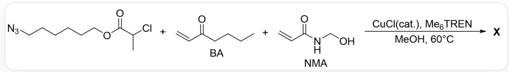

# 题目

自愈材料是指在材料出现裂缝之后，能够自发修补裂缝并在一定程度上恢复原状的一类材料。前不久报道了一种具有自愈性能的共聚物X（ $\mathrm{PBA}_{\mathrm{x}} - \mathrm{co} - \mathrm{PNMA}_{\mathrm{y}}$ ，co表示共聚）的合成：

  
这是一个共聚反应，以SMILES格式表示为：  $O = C(C(C)Cl)OCCCCCN = [N + ] =$  
[N-].C=CC(CCCC)=O.C=CC(NCO)=O>>X。反应条件为催化量CuCl、Me6TREN(三(2-二甲氨基乙基)胺、MeOH、60摄氏度。

下列说法错误的有（若说法1和说法2错误则用“12”表示）：

1. 这是配位聚合  
2. X自愈时的动态共价键仅有羟基脱水形成的醚键  
3. 在自愈过程中，BA片段的作用为作为柔性基团促进破裂链向附近的链的移动，进而产生动态和静态氢键以愈合损伤  
4. 聚合物  $\mathbf{X}$  在水中自愈后, 即使在水中浸泡 24 小时后的形状和形态仍保持不变, 这是因为  $\mathbf{X}$  中存在大量氢键  
5. 聚合物弹性  $\mathrm{PBA}_{0.7} - \mathrm{co} - \mathrm{PNMA}_{0.3} > \mathrm{PBA}_{0.8} - \mathrm{co} - \mathrm{PNMA}_{0.2}$  
6. 若用 AIBN 取代 CuCl 进行共聚得到新的聚合物  $\mathbf{X}^{\prime}$  。相比  $\mathbf{X}$ ,  $\mathbf{X}^{\prime}$  中 BA 片段和 NMA 片段的分布更加随机。

A. 其他选项均不正确  
B. 134

C. 1346  
D. 236  
E. 345  
F. 256  
G. 14  
H. 23456  
1. 126  
J. 23  
K. 45  
L. 145  
M. 46  
N. 3  
O. 25  
P. 4

# 答案

正确答案: L

# 详细解析

说法1：该反应为  $\mathrm{CuCl}$  攫取  $\mathrm{Cl}$  产生自由基启动，聚合过程不涉及配位反应，属（活性）自由基聚合，错误

# CHECKPOINT

1 PTS

该反应为自由基聚合，说法1错误

说法2：X的自愈能力来源于聚合物链间的动态共价键和氢键，它们的存在使聚合物在断裂后链间可以不断发生作用，逐渐到达链间深度交联的势阱。其中动态共价键仅有羟基脱水形成的醚键，说法2正确

# CHECKPOINT

1 PTS

动态共价键仅有羟基脱水形成的醚键，说法2正确

说法3：自愈过程中两种片段的作用分别为：BA作为柔性基团促进破裂链向附近的链的移动，进而产生动态和静态氢键以愈合损伤；NMA提供氢键和动态共价键以促进链的交联。说法3正确

# CHECKPOINT

1 PTS

BA作为柔性基团促进破裂链向附近的链的移动，进而产生动态和静态氢键以愈合损伤，说法3正确

说法4：在水中长时间浸泡形态不变，这与BA片段的疏水作用有关，可以保护链间的氢键不被破坏因此不会重新断裂，说法4错误

# CHECKPOINT

1 PTS

在水中长时间浸泡形态不变与BA片段的疏水作用有关，说法4错误

说法5：柔性的BA片段占比越多，聚合物弹性越大， $\mathrm{PBA}_{0.7} - \mathrm{co} - \mathrm{PNMA}_{0.3} < \mathrm{PBA}_{0.8} - \mathrm{co} - \mathrm{PNMA}_{0.2}$ ，说法5错误

# CHECKPOINT

1 PTS

$\mathrm{PBA}_{0.7} - \mathrm{co} - \mathrm{PNMA}_{0.3} < \mathrm{PBA}_{0.8} - \mathrm{co} - \mathrm{PNMA}_{0.2}$ , 说法5错误

说法6：用CuCl催化聚合时，NMA与体系中的Cu盐有一定的配位作用，导致两种单体的反应速率有较大的差异，因此排布会更加有序；AIBN催化下共聚时，两种单体基本上随机分布。说法6正确

# CHECKPOINT

1 PTS

相比X，X'中BA片段和NMA片段的分布更加随机，说法6正确