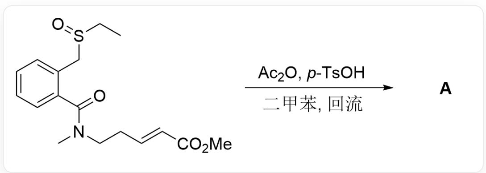
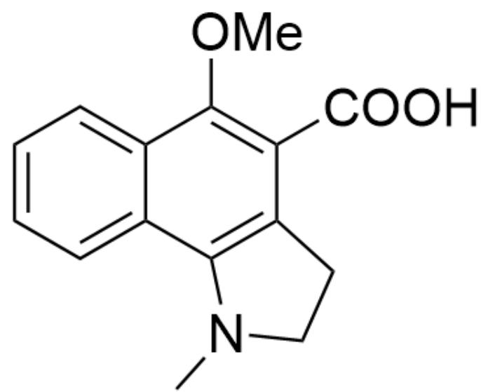
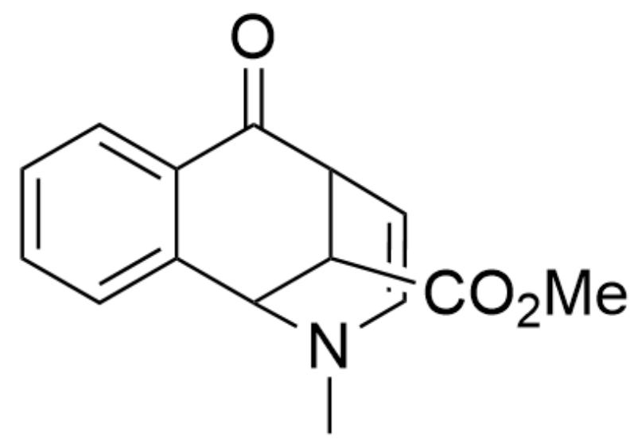
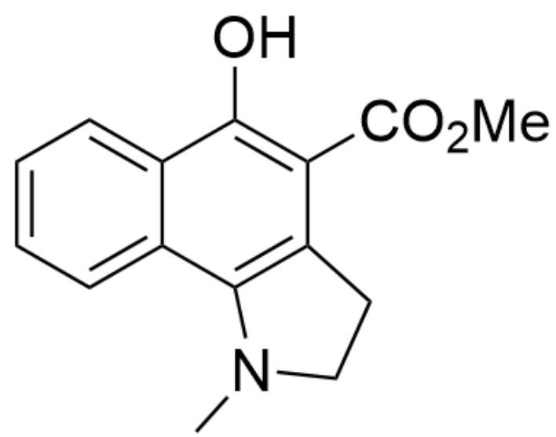
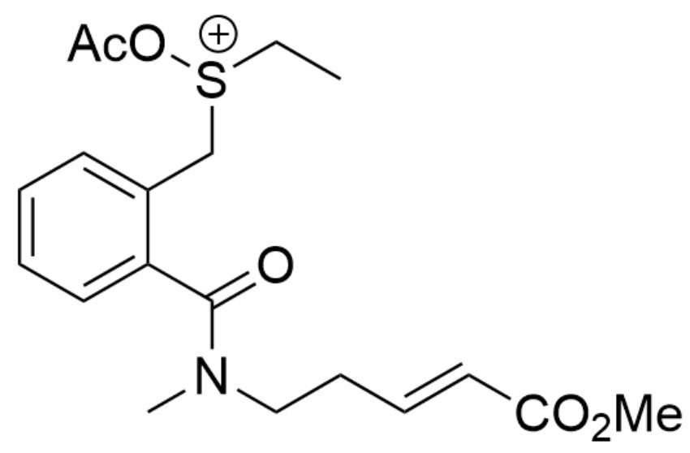
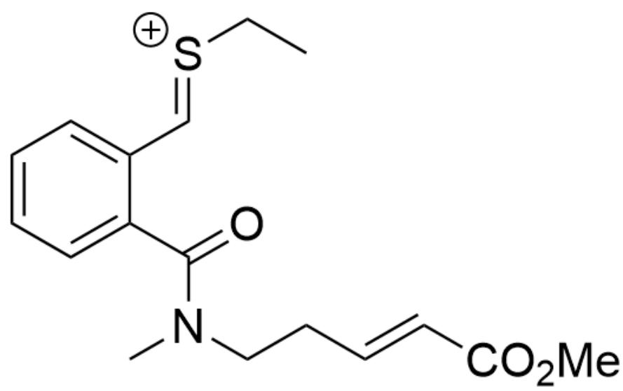
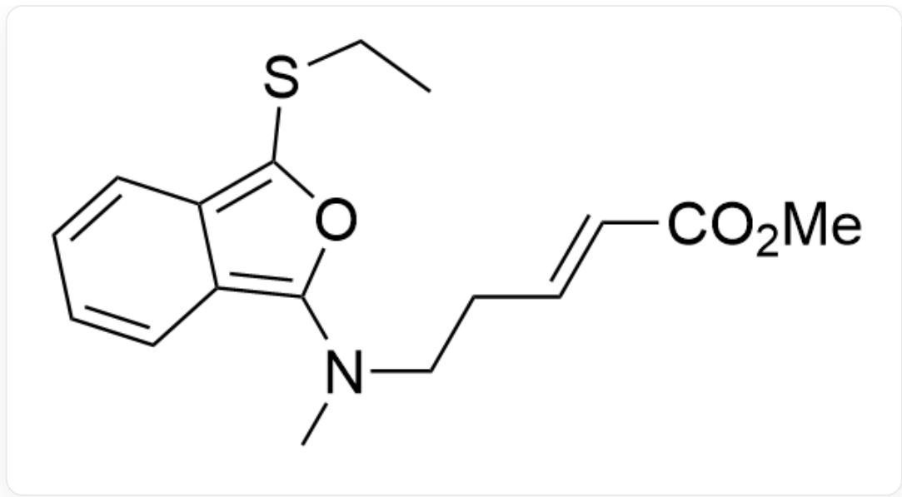
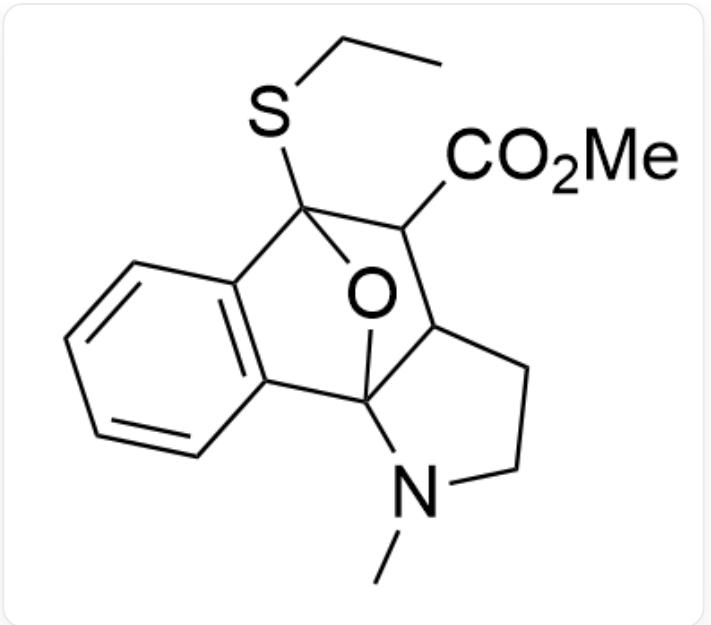
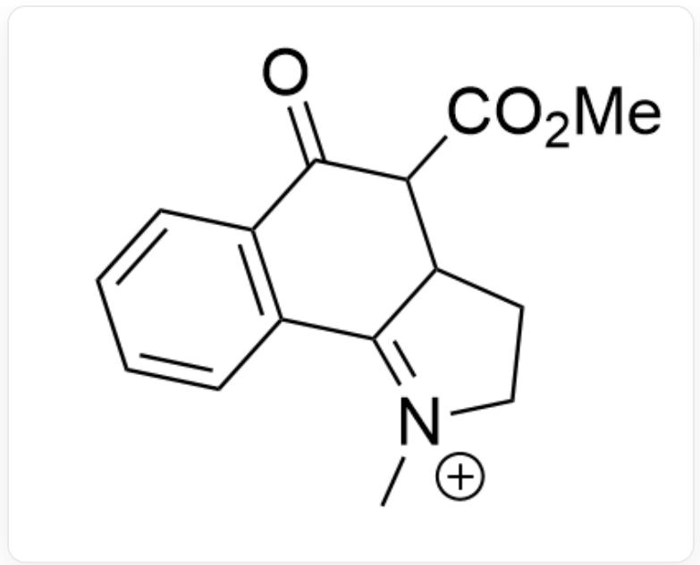
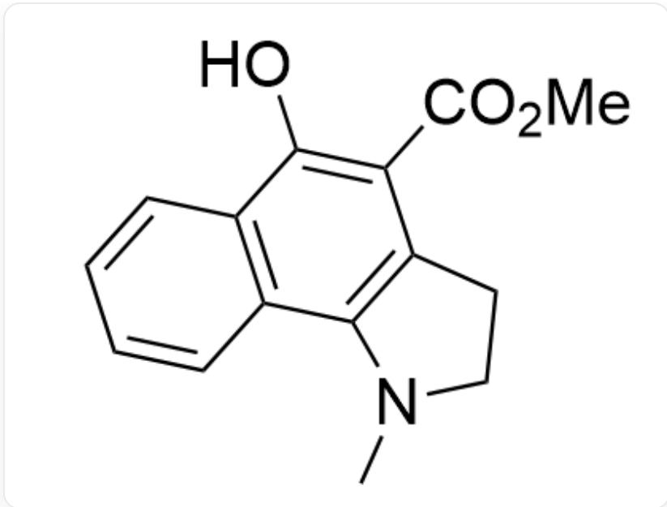

# Question

$$
\begin{array}{l} \mathrm {C C S} (\mathrm {C C 1} = \mathrm {C C} = \mathrm {C C} = \mathrm {C 1 C} (\mathrm {N} (\mathrm {C C / C} = \mathrm {C / C} (\mathrm {O C}) = \mathrm {O}) \mathrm {C}) = \mathrm {O}) = \mathrm {O} > \mathrm {C C 1} = \mathrm {C C} = \mathrm {C} (\mathrm {S} (= \mathrm {O}) \\ (O) = O) C = C 1. C C (O C (C) = O) = O, x y l e n e, r e f l u x > [ \mathbf {A} ], \mathbf {A} i s t h e p r o d u c t \\ \end{array}
$$

Given that the molecular formula of the reaction product  $\mathbf{A}$  is  $\mathrm{C_{15}H_{15}NO_3}$ , and  $\mathbf{A}$  contains three rings, provide the structural formula of  $\mathbf{A}$ .

A. All other options are incorrect

B.

$$
C N (C C 1) C 2 = C 1 C (C (O) = O) = C (O C) C 3 = C C = C C = C 3 2
$$

  
C.

CN1C(C2=CC=CC=C2CO3)=C(C(OC)=O)C3C=C1

  
D.  
E.

CN1C(C2=CC=CC=C2C3=O)=C(C(OC)=O)C3CC1

  
F.

CN(C=CC1C2C(OC)=O)C2C3=CC=CC=C3C1=O

OC1=C(C(OC)=O)C2=C(N(C)CC2)C3=CC=CC=C31

# Answer

Correct Answer: F

# Detailed Explanation

First, the oxygen atom in the sulfoxide is acetylated to obtain intermediate 1

Intermediate 1:CC[S+](OC(C)=O)CC1=CC=CC=C1C(N(CC/C=C/C(OC)=O)C)=O

# CHECKPOINT

1 PTS

Intermediate 1:CC[S+](OC(C)=O)CC1=CC=C=CC=C1C(N(CC/C=C/C(OC)=O)C)=O

Next, elimination of one molecule of acetic acid yields the reaction intermediate 2

Intermediate 2:CC/[S+]=C/C1=CC=CC=C1C(N(CC/C=C/C(OC)=O)C)=O

# CHECKPOINT

1 PTS

Intermediate 2:CC/[S+]=C/C1=CC=C=CC=C1C(N(CC/C=C/C(OC)=O)C)=O

The adjacent oxygen atom nucleophilically attacks the carbocation to form a five-membered ring, yielding intermediate 3

Intermediate 3:CCSC1C2=CC=CC=C2C(N(CC/C=C/C(OC)=O)C)=[O]+1

# CHECKPOINT

1 PTS

Intermediate 3:CCSC1C2=CC=CC=C2C(N(CC/C=C/C(OC)=O)C)=[O+]1

Next, deprotonation and aromatization yields intermediate 4

Intermediate 4:CCSC1=C2C(C=CC=C2)=C(O1)N(CC/C=C/C(OC)=O)C

# CHECKPOINT

1 PTS

Intermediate 4:CCSC1=C2C(C=CC=C2)=C(O1)N(CC/C=C/C(OC)=O)C

Next, an intramolecular DA reaction occurs to give intermediate 5

Intermediate 5:CCSC12C3=C(C4(O1)N(CCC4C2C(OC)=O)C)C=CC=C3

# CHECKPOINT

1 PTS

Intermediate 5:CCSC12C3=C(C4(O1)N(CCC4C2C(OC)=O)C)C=CC=C3

Then, elimination of one molecule of thiolate anion yields intermediate 6

Intermediate 6:O=C1C2=C(C3=[N]+)(CCC3C1C(OC)=O)C)C=CC=C2

# CHECKPOINT

1 PTS

Intermediate  $6:O = C1C2 = C(C3 = [N + ](CCC3C1C(OC) = O)C)C = CC = C2$

Finally, intermediate 6 undergoes aromatization to yield product A

OC1=C(C(OC)=O)C2=C(N(CC2)C)C3=C1C=CC=C3