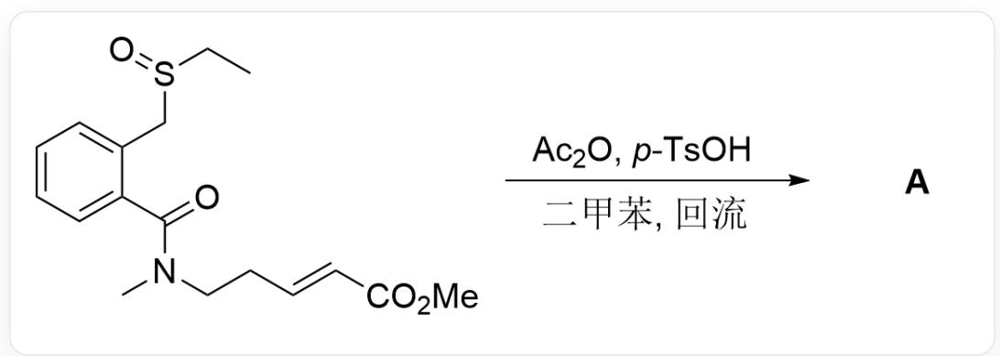
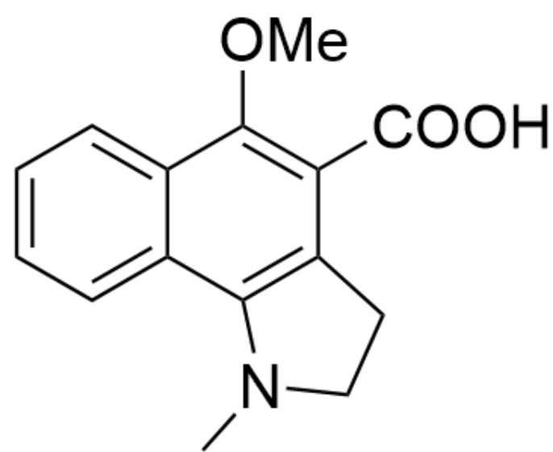
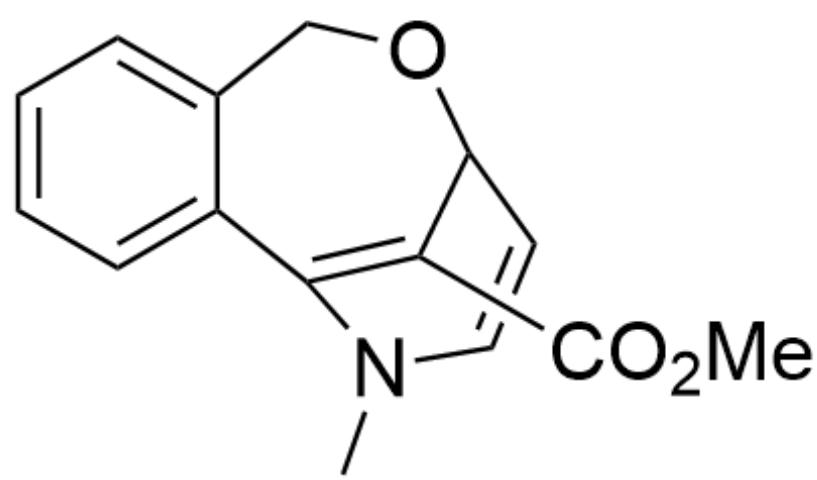
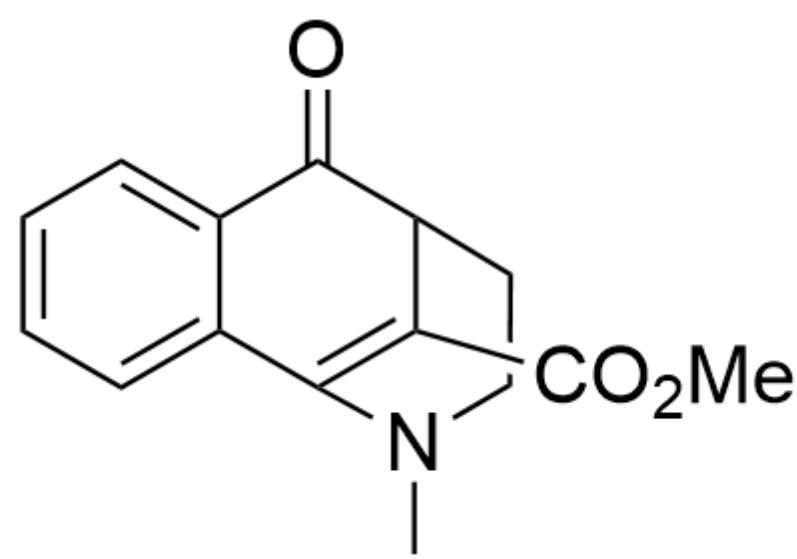
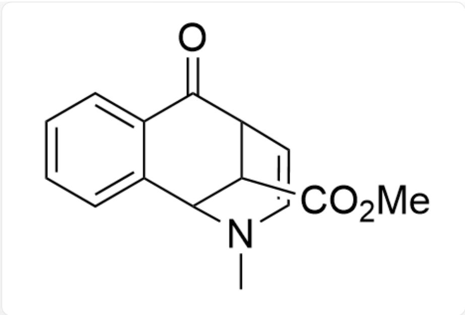
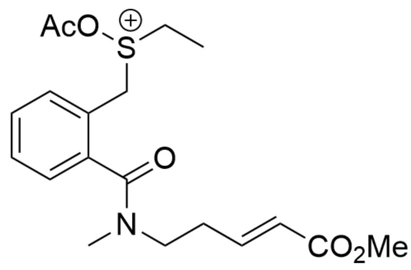
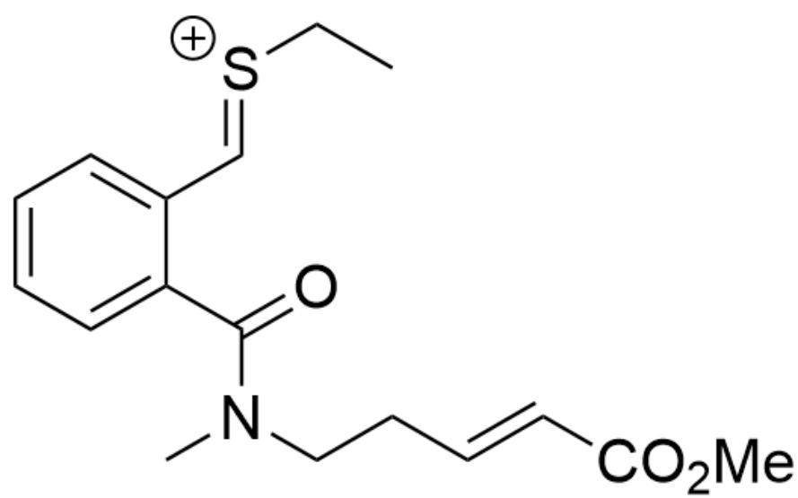
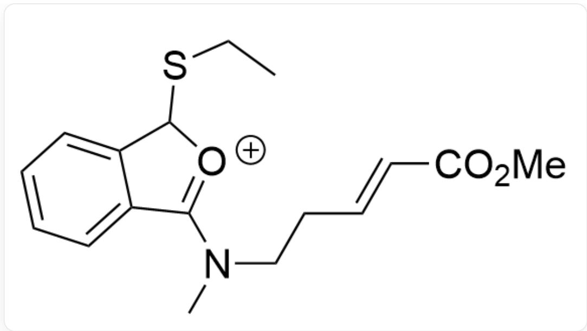
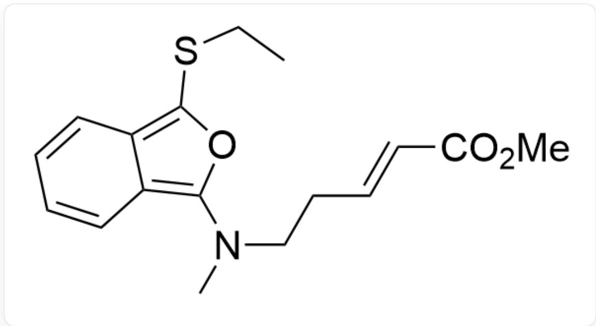
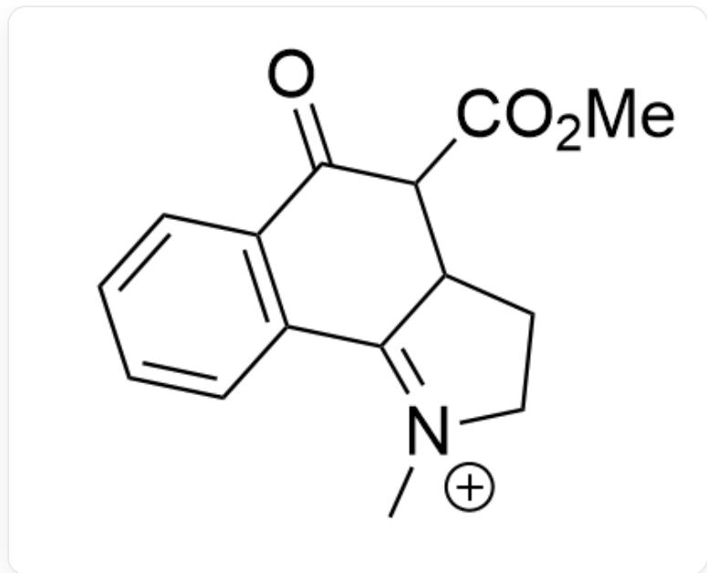

# 题目

$$
\mathrm {C C S} (\mathrm {C C 1} = \mathrm {C C} = \mathrm {C C} = \mathrm {C 1 C} (\mathrm {N} (\mathrm {C C / C} = \mathrm {C / C} (\mathrm {O C}) = \mathrm {O}) \mathrm {C}) = \mathrm {O}) = \mathrm {O} > \mathrm {C C 1} = \mathrm {C C} = \mathrm {C} (\mathrm {S} (= \mathrm {O})
$$

$(\mathsf{O}) = \mathsf{O})\mathsf{C} = \mathsf{C}1.\mathsf{CC}(\mathsf{OC}(\mathsf{C}) = \mathsf{O}) = \mathsf{O},$  二甲苯，回流  $\text{>}\left[\mathbf{A}\right],\mathbf{A}$  是产物

已知反应产物  $\mathrm{A}$  的分子式为  $\mathrm{C}_{15} \mathrm{H}_{15} \mathrm{NO}_3$  ， $\mathrm{A}$  中含有三个环，试给出  $\mathrm{A}$  的结构式

A. 其他选项均不正确  
B.

$$
C N (C C 1) C 2 = C 1 C (C (O) = O) = C (O C) C 3 = C C = C C = C 3 2
$$

  
C.

CN1C(C2=CC=CC=C2CO3)=C(C(OC)=O)C3C=C1

  
D.  
E.

CN1C(C2=CC=CC=C2C3=O)=C(C(OC)=O)C3CC1

  
F.

CN(C=CC1C2C(OC)=O)C2C3=CC=CC=C3C1=O

OC1=C(C(OC)=O)C2=C(N(C)CC2)C3=CC=CC=C31

# 答案

正确答案: F

# 详细解析

首先，亚砜中的氧原子被乙酰化，得到中间体1

  
中间体1：CC[S+](OC(C)=O)CC1=CC=CC=C1C(N(CC/C=C/C(OC)=O)C)=O

# CHECKPOINT

# 1 PTS

中间体1：CC[S+](OC(C)=O)CC1=CC=C=CC=C1C(N(CC/C=C/C(OC)=O)C)=O

接着，消除一分子乙酸得到反应中间体2

中间体2：CC/[S+]=C/C1=CC=CC=C1C(N(CC/C=C/C(OC)=O)C)=O

# CHECKPOINT

1 PTS

中间体2：CC/[S+]=C/C1=CC=CC=C1C(N(CC/C=C/C(OC)=O)C)=O

临近的氧原子亲核进攻碳正离子形成五元环，得到中间体3

  
中间体3：CCSC1C2=CC=CC=C2C(N(CC/C=C/C(OC)=O)C)=[O+]1

# CHECKPOINT

1 PTS

中间体3：CCSC1C2=CC=CC=C2C(N(CC/C=C/C(OC)=O)C)=[O+]1

接着去质子芳构化得到中间体4

  
中间体4：CCSC1=C2C(C=CC=C2)=C(O1)N(CC/C=C/C(OC)=O)C

# CHECKPOINT

1 PTS

中间体4：CCSC1=C2C(C=CC=C2)=C(O1)N(CC/C=C/C(OC)=O)C

接着发生分子内DA反应，得到中间体5

中间体5：CCSC12C3=C(C4(O1)N(CCC4C2C(OC)=O)C)C=CC=C3

# CHECKPOINT

1 PTS

中间体5：CCSC12C3=C(C4(O1)N(CCC4C2C(OC)=O)C)C=CC=C3

然后脱去一分子硫醇阴离子得到中间体6

中间体6：O=C1C2=C(C3=[N]+)(CCC3C1C(OC)=O)C=C=CC=

# CHECKPOINT

1 PTS

中间体6：O=C1C2=C(C3=[N+](CCC3C1C(OC)=O)C)C=CC=C2

最后中间体6进行芳构化得到产物A

OC1=C(C(OC)=O)C2=C(N(CC2)C)C3=C1C=CC=C3