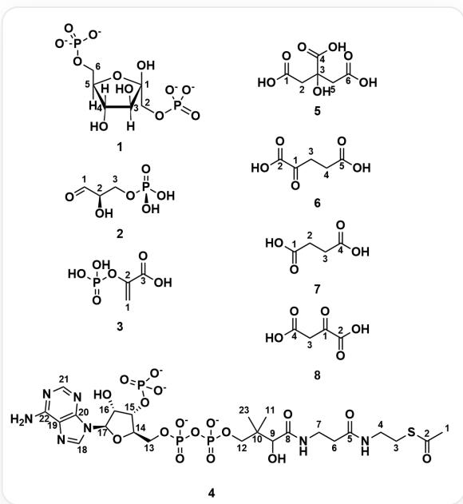

# 题目

现有一份  $\left[1 - ^{14}\mathrm{C}\right]$  葡萄糖样品，其中  $\mathrm{C} - 1$  为  $^{14}\mathrm{C}$  同位素标记。在其中加入细菌培养液，一段时间后分离得到如下代谢中间产物  $i = 1\sim 8$  （带原子编号）：

中间产物的编号及其对应的SMILES: 1. O[C@@:1]1([C:2]P([O-])([O-]=O)[C@@:3]([H])(O)[C@@:4](O)([H])

[C@:5]([C:6]OP([O-])([O-])=O)([H])O1 2. O=[C:1][C@H:2](O)[C:3]OP(O)(O)=O 3. [C:1]=[C:2](OP(O)(O)=O)

\[ \mathrm{C}:3](\mathrm{O}) = \mathrm{O} 4. \quad [\mathrm{C}:1][\mathrm{C}:2](\mathrm{S}[\mathrm{C}:3][\mathrm{C}:4]\mathrm{N}[\mathrm{C}:5]([\mathrm{C}:6][\mathrm{C}:7]\mathrm{N}[\mathrm{C}:8]([\mathrm{C}:9]([\mathrm{C}:10]([\mathrm{C}:11])([\mathrm{C}:12]\mathrm{OP}(\mathrm{OP}(\mathrm{O}[\mathrm{C}:13]

[C@@H:14]1[C@@H:15](OP([O-])([O-]=O)[C@@H:16](O)[C@H:17](N2[C:18]=N[C:19]3=[C:20]2N=

[C:21]N=[C:22]3N)O1)([O-])=O)([O-])=O)[C:23])O)=O)=O 5. O=[C:1](O)[C:2][C:3][[C:4](O)=O)(O)[C:5]

[C:6](O)=O 6. O=[C:1]([C:2](O)=O)[C:3][C:4][C:5](O)=O 7. O=[C:1](O)[C:2][C:3][C:4](O)=O 8. O=[C:1]([C:2]

$(\mathrm{O}) = \mathrm{O})[\mathrm{C}:3][\mathrm{C}:4](\mathrm{O}) = \mathrm{O}$

对于每个代谢的中间产物  $i$ ，根据你对于葡萄糖代谢通路的理解，找出  ${}^{14}\mathrm{C}$  标记可能出现的位点的原子编号，定义一个集合  $P_{i}$ ，它代表在第  $i$  个代谢中间产物中，所有可能被  ${}^{14}\mathrm{C}$  标记的碳原子的原子编号所构成的集合。

* 例如：如果在产物  $i$  中，标记可能出现在2号和3号碳原子上，则  $P_{i} = \{2,3\}$ 。

$z_{i}$  的计算规则根据集合  $P_{i}$  的大小（即可能标记位的数量）分两种情况：

$$
z _ {i} = \left\{ \begin{array}{l l} \frac {p}{i ^ {2} + 1} & \text {如 果 只 有 一 个 可 能 标 记 位 (即} | P _ {i} | = 1, \text {且} P _ {i} = \{p \}) \\ \frac {\prod_ {p \in P _ {i}} p}{i ^ {2}} & \text {如 果 有 多 个 可 能 标 记 位 (即} | P _ {i} | > 1) \end{array} \right.
$$

* 在第二个情况中， $\prod_{p \in P_i} p$  表示将集合  $P_i$  中所有的原子编号相乘。

最终计算所有  $z_{i}$  值的总和  $S$  ：

$$
S = \sum_ {i = 1} ^ {8} z _ {i}
$$

从以下选项中选择正确的选项，最终结果保留小数点后四位，选择与你的计算结果偏差在  $1\%$  以内的选项，否则选择选项 A: 其他选项均不正确。

A. 其他选项均不正确  
B. 1.836  
C. 2.100  
D. 2.210  
E. 2.276  
F. 2.311

G. 2.353  
H. 2.418  
I. 2.436  
J. 2.670  
K. 3.604

# 答案

# 正确答案: I

# 详细解析

本题的核心是追踪来自  $\left[1-{}^{14} \mathrm{C}\right]$  葡萄糖的  ${ }^{14} \mathrm{C}$  标记在主要代谢通路（细胞质中进行的糖酵解、线粒体基质中的三羧酸循环）中的去向。首先，需要识别出图片中8个中间产物的名称，并理解其在代谢通路中的反应：

1. 果糖-1,6-二磷酸：这是糖酵解途径中的一个关键中间产物。在消耗了两分子ATP后，葡萄糖被转化为这个高度活化的6碳糖分子。它的生成是糖酵解途径中一个重要的、不可逆的调控点。

# CHECKPOINT

0.5 PTS

中间产物1是果糖-1,6-二磷酸

2.3-磷酸甘油醛（G3P）：果糖-1,6-二磷酸被醛缩酶裂解成两个3碳分子，其中一个就是3-磷酸甘油醛。它是糖酵解后续反应的直接底物，标志着3碳阶段的开始。

# CHECKPOINT

0.5 PTS

中间产物2是3-磷酸甘油醛（G3P）

3. 磷酸烯醇式丙酮酸（PEP）：糖酵解途径末端的一个高能中间产物。它通过将高能磷酸基团转移给ADP来生成一分子ATP（底物水平磷酸化），自身则转化为丙酮酸，这是糖酵解的最终产物。

# CHECKPOINT

0.5 PTS

中间产物3是磷酸烯醇式丙酮酸（PEP）

4. 乙酰辅酶A：糖酵解产生的丙酮酸进入线粒体，在线粒体基质中被丙酮酸脱氢酶复合体催化，脱去一个碳原子（以  $\mathrm{CO}_{2}$  形式释放），并与辅酶A结合，形成2碳的乙酰辅酶A。这是连接糖酵解和三羧酸循环的关键桥梁分子。

# CHECKPOINT

0.5 PTS

中间产物4是乙酰辅酶A

5. 柠檬酸：三羧酸循环的第一步。乙酰辅酶A（2碳）将其乙酰基转移给草酰乙酸（4碳），缩合形成一个6碳的柠檬酸分子，循环由此开始。

# CHECKPOINT

0.5 PTS

中间产物5是柠檬酸

6. α-酮戊二酸：柠檬酸经过一系列反应（包括两次脱羧，即释放两分子  $\mathrm{CO}_{2}$ ），转变成这个5碳的中间产物。它不仅是循环的一部分，也是合成谷氨酸等氨基酸的重要前体。

# CHECKPOINT

0.5 PTS

中间产物6是  $\alpha$ -酮戊二酸

7. 琥珀酸：α-酮戊二酸再次脱羧，生成4碳的琥珀酸。这一步伴随着一分子GTP（或ATP）的生成，是三羧酸循环中又一次底物水平磷酸化。

# CHECKPOINT

0.5 PTS

中间产物7是琥珀酸

8. 草酰乙酸（OAA）：琥珀酸经过几步氧化反应，最终再生为4碳的草酰乙酸。草酰乙酸作为循环的终点，同时也是下一次循环的起点，它会再次与新的乙酰辅酶A结合，启动新一轮循环。

# CHECKPOINT

0.5 PTS

中间产物8是草酰乙酸 (OAA)

这些中间产物构成了一个连续的生化反应链：葡萄糖  $\rightarrow$  [糖酵解]  $\rightarrow$  果糖-1,6-二磷酸  $\rightarrow$  3-磷酸甘油醛  $\rightarrow$  磷酸烯醇式丙酮酸  $\rightarrow$  丙酮酸  $\rightarrow$  [连接反应]  $\rightarrow$  乙酰辅酶A+草酰乙酸  $\rightarrow$  [三羧酸循环]  $\rightarrow$  柠檬酸  $\rightarrow$  α-酮戊二酸  $\rightarrow$  琥珀酸  $\rightarrow$  ...  $\rightarrow$  (再生)草酰乙酸。

根据图片中的原子标记，结合葡萄糖的代谢通路，可以推断每个中间产物中可能存在同位素标记的碳原子序号：

1. 果糖-1,6-二磷酸：标记位于1,6-二磷酸中果糖的1号位的碳上，即图中的2号碳原子。

$$
z _ {1} = \frac {p}{i ^ {2} + 1} = \frac {2}{1 ^ {2} + 1} = \frac {2}{2} = 1
$$

# CHECKPOINT

1 PTS

果糖-1,6-二磷酸的标记位于2号碳原子上，  $z_{1} = 1$

2.3-磷酸甘油醛：标记位于与磷酸相连的3号碳原子上。

$$
z _ {2} = \frac {p}{i ^ {2} + 1} = \frac {3}{2 ^ {2} + 1} = \frac {3}{5} = 0. 6
$$

# CHECKPOINT

1 PTS

3-磷酸甘油醛的标记位于3号碳原子上，  $z_{2} = 0.6$

3. 磷酸烯醇式丙酮酸 (PEP)：标记位于不饱和酮的  $\beta$  位，即图中1号碳原子。

$$
z _ {3} = \frac {p}{i ^ {2} + 1} = \frac {1}{3 ^ {2} + 1} = \frac {1}{1 0} = 0. 1
$$

# CHECKPOINT

1 PTS

磷酸烯醇式丙酮酸(PEP)的标记位于1号碳原子上，  $z_{3} = 0.1$

4. 乙酰辅酶A：标记位于乙酰基的甲基上，即图中的1号碳原子。

$$
z _ {4} = \frac {p}{i ^ {2} + 1} = \frac {1}{4 ^ {2} + 1} = \frac {1}{1 7}
$$

# CHECKPOINT

1 PTS

乙酰辅酶A的标记位于1号碳原子上，  $z_{4} = \frac{1}{17}$

5. 柠檬酸：标记位于羧酸  $\alpha$  位为两个亚甲基的碳，即图中2号和5号碳原子。

$$
z _ {5} = \frac {\prod_ {p \in P _ {5}} p}{i ^ {2}} = \frac {2 \times 5}{5 ^ {2}} = \frac {1 0}{2 5} = 0. 4
$$

# CHECKPOINT

1 PTS

柠檬酸的标记位于2号和5号碳原子上，  $z_{5} = 0.4$

6.  $\alpha$ -酮戊二酸：标记位于羧酸  $\alpha$  位为亚甲基的碳，即图中的4号碳原子。

$$
z _ {6} = \frac {p}{i ^ {2} + 1} = \frac {4}{6 ^ {2} + 1} = \frac {4}{3 7}
$$

# CHECKPOINT

1 PTS

α-酮戊二酸的标记位于4号碳原子上，  $z_{6} = \frac{4}{37}$

7. 琥珀酸：标记位于羧酸  $\alpha$  位两个亚甲基的碳，即图中的2号和3号碳原子。

$$
z _ {7} = \frac {\prod_ {p \in P _ {7}} p}{i ^ {2}} = \frac {2 \times 3}{7 ^ {2}} = \frac {6}{4 9}
$$

# CHECKPOINT

1 PTS

琥珀酸的标记位于2号和3号碳原子上，  $z_{7} = \frac{6}{49}$

8. 草酰乙酸：标记位于碳链的中间两个碳上，即图中的1号和3号碳原子。

$$
z _ {8} = \frac {\prod_ {p \in P _ {8}} p}{i ^ {2}} = \frac {1 \times 3}{8 ^ {2}} = \frac {3}{6 4}
$$

# CHECKPOINT

1 PTS

草酰乙酸的标记位于1号和3号碳原子上，  $z_{8} = \frac{3}{64}$

最终，我们将所有计算出的z_i值相加，得到总和S。

$$
S = \sum_ {i = 1} ^ {8} z _ {i} = z _ {1} + z _ {2} + z _ {3} + z _ {4} + z _ {5} + z _ {6} + z _ {7} + z _ {8}
$$

$$
S = 1 + 0. 6 + 0. 1 + \frac {1}{1 7} + 0. 4 + \frac {4}{3 7} + \frac {6}{4 9} + \frac {3}{6 4}
$$

$$
S \approx 1 + 0. 6 + 0. 1 + 0. 0 5 8 8 + 0. 4 + 0. 1 0 8 1 + 0. 1 2 2 4 + 0. 0 4 6 9
$$

$$
S \approx 2. 4 3 6 2
$$

因此，所有中间产物的z_i之和S约为2.4362。

# CHECKPOINT

1 PTS

所有中间产物的  $\mathrm{z_i}$  之和  $S\approx 2.4362$