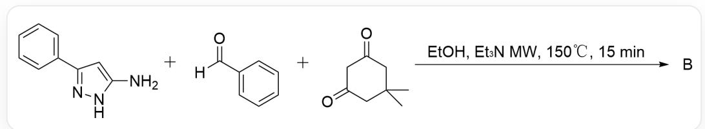
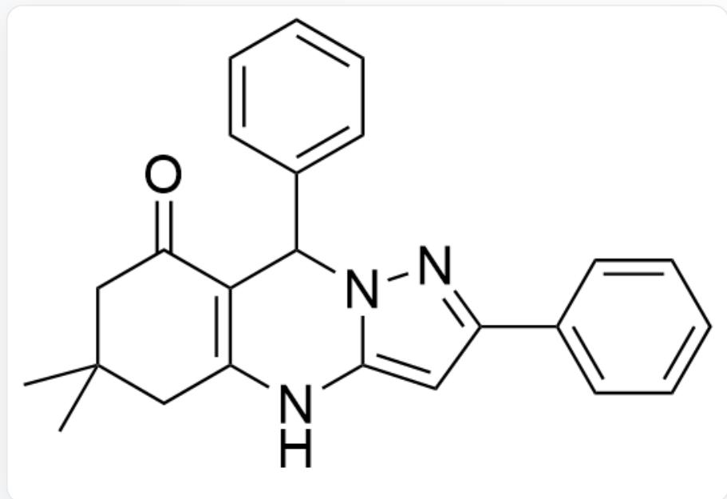
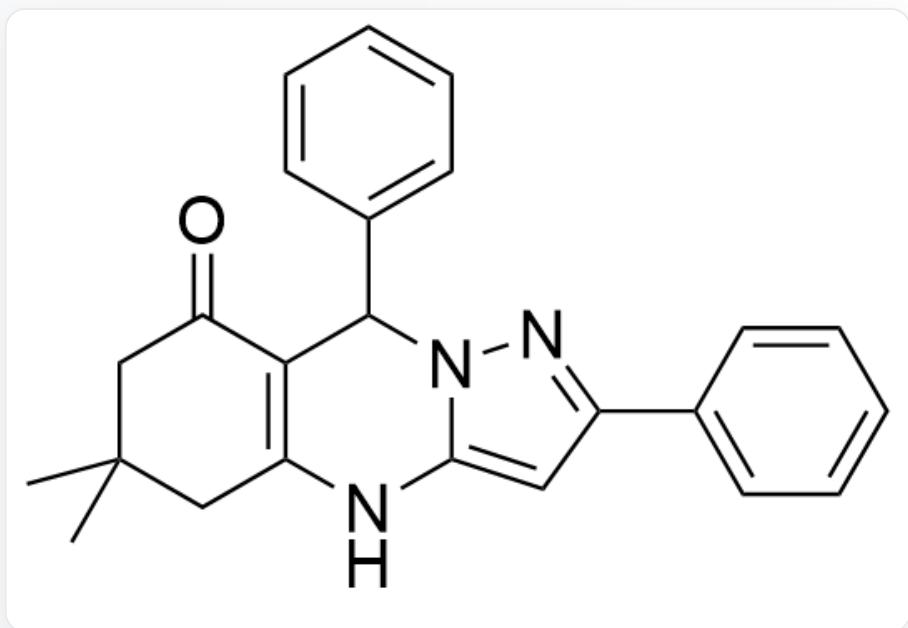
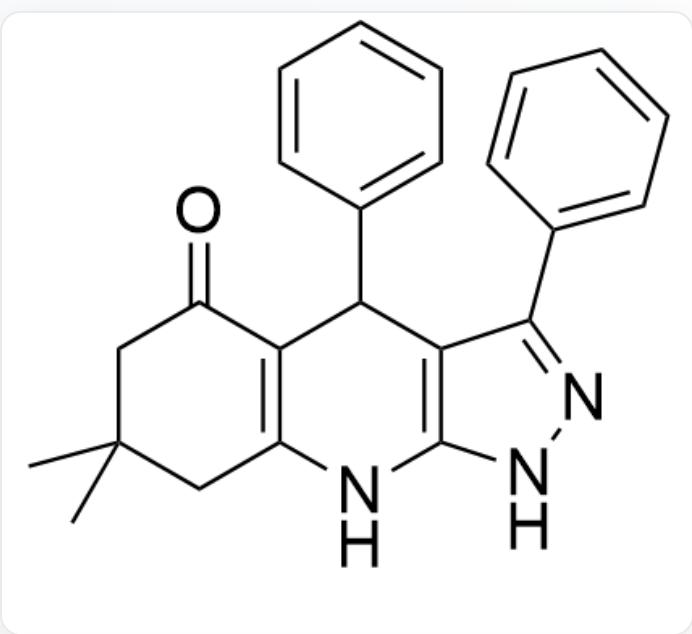
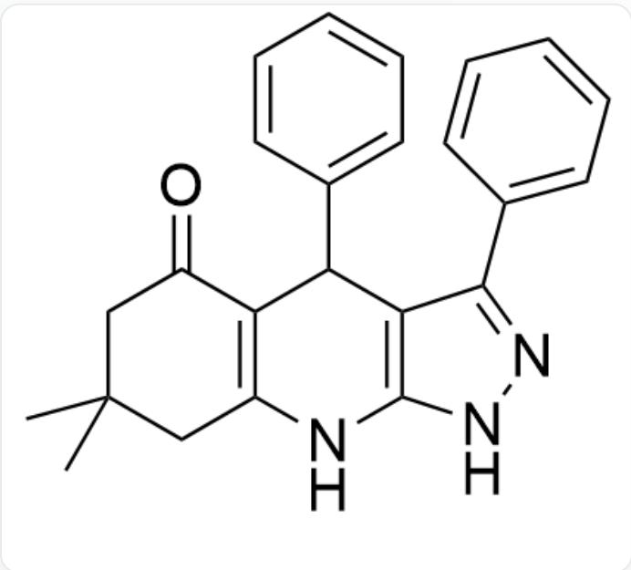
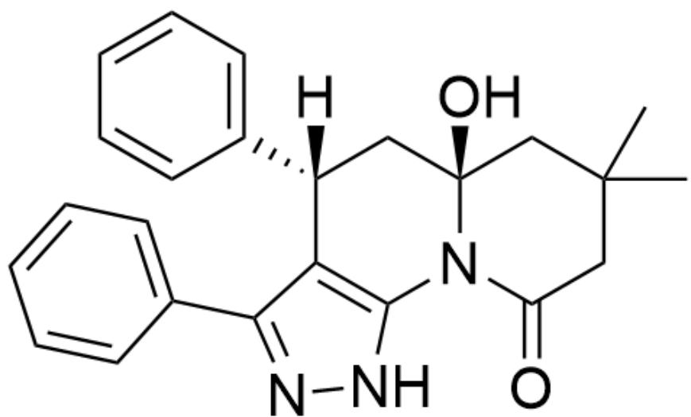
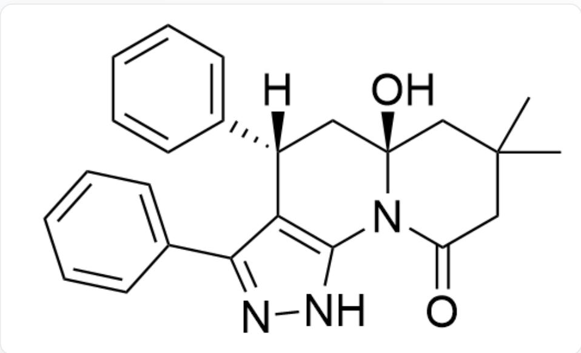
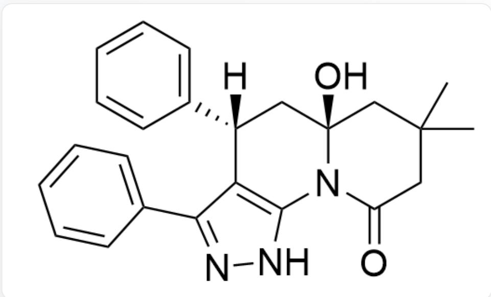
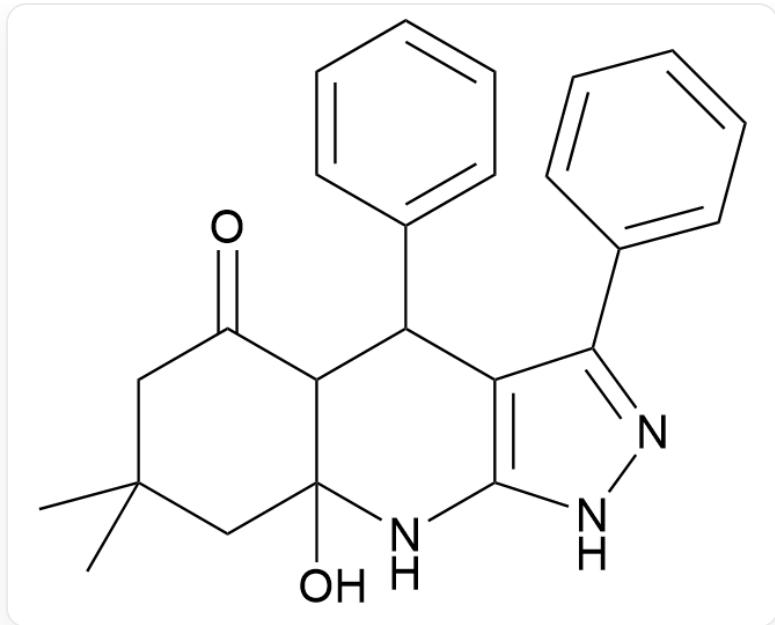

# Question

Microwave catalysis is based on the unique thermal effects generated by the principle of dielectric heating, which can lead to a significant increase in reaction rates.

A.  
  
NC1=CC(C2=CC=CC=C2)=NN1.O=C(C1=CC=CC=C1)[H].O=C1CC(C)(C)CC(C1)=O>EtOH,  $E t_{3}N$  MW,  $150^{\circ}\mathrm{C}$ , 15 min>B

Please attempt to predict the product B of the above reaction and indicate how many stereocenters the product possesses.

  
O=C1C2=C(NC3=CC(C4=CC=CC=C4)=NN3C2C5=CC=CC=C5)CC(C)(C)C1

There are 2 chiral centers

B.  
  
O=C1C2=C(NC3=CC(C4=CC=CC=C4)=NN3C2C5=CC=CC=C5)CC(C)(C)C1

There is 1 chiral center

C.  
  
O=C1C2=C(NC3=CC(C4=CC=CC=C4)=NN3C2C5=CC=CC=C5)CC(C)(C)C1

There are 0 chiral centers

D.  
  
$\mathrm{O = C1C2 = C(NC(NN = C3C4 = CC = CC = C4) = C3C2C5 = CC = CC = C5)CC(C)(C)C1}$

There are 2 chiral centers

E.  
  
O=C1C2=C(NC(NN=C3C4=CC=CC=C4)=C3C2C5=CC=CC=C5)CC(C)(C)C1

There is 1 chiral center

F.  
  
$\mathrm{O = C1C2 = C(NC(NN = C3C4 = CC = CC = C4) = C3C2C5 = CC = CC = C5)CC(C)(C)C1}$

There are 0 chiral centers

G.  
  
O=C1N2C3=C(C(C4=CC=CC=C4)=NN3)[C@]([H])(C5=CC=CC=C5)C[C@]2(O)CC(C)(C)C1

There are 2 chiral centers

H.  
  
$\mathrm{O = C1N2C3 = C(C(C4 = CC = CC = C4) = NN3)[C@]([H])(C5 = CC = CC = C5)C[C@]2(O)CC(C)(C)C1}$

There is 1 chiral center

1.  
J.  
  
$\mathrm{O = C1N2C3 = C(C(C4 = CC = CC = C4) = NN3)[C@]([H])(C5 = CC = CC = C5)C[C@]2(O)CC(C)(C)C1}$

There are 0 chiral centers

  
K.

O=C1N2C3=C(C(C4=CC=CC=C4)=NN3)[C@@]([H])(C5=CC=CC=C5)C[C@]2(O)CC(C)(C)C1

There are 2 chiral centers

O=C1N2C3=C(C(C4=CC=CC=C4)=NN3)[C@@]([H])(C5=CC=CC=C5)C[C@]2(O)CC(C)(C)C1

There is 1 chiral center

O=C1N2C3=C(C(C4=CC=CC=C4)=NN3)[C@@]([H])(C5=CC=CC=C5)C[C@]2(O)CC(C)(C)C1

There are 0 chiral centers

# Answer

Correct Answer: E

# Detailed Explanation

Under the conditions of adding triethylamine and a reaction temperature of  $150^{\circ}\mathrm{C}$ , the reaction yields the thermodynamic product.

# CHECKPOINT

1 PTS

The reaction yields the thermodynamic product

The formation of a carbon-carbon single bond during ring closure is thermodynamically more stable than the formation of a carbon-nitrogen single bond.

# CHECKPOINT

1 PTS

The formation of a carbon-carbon single bond during ring closure is thermodynamically more stable than the formation of a carbon-nitrogen single bond

First, the condensation reaction intermediate is obtained

O=C1C2C(NC(NN=C3C4=CC=CC=C4)=C3C2C5=CC=CC=C5)(O)CC(C)(C)C1

# CHECKPOINT

1 PTS

First, the condensation reaction intermediate is obtained

O=C1C2C(NC(NN=C3C4=CC=CC=C4)=C3C2C5=CC=CC=C5)(O)CC(C)(C)C1

Finally, a molecule of water is lost to yield the final product E.

Clearly, this product has only one stereocenter.