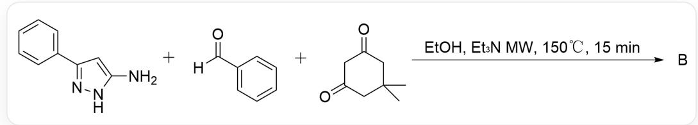
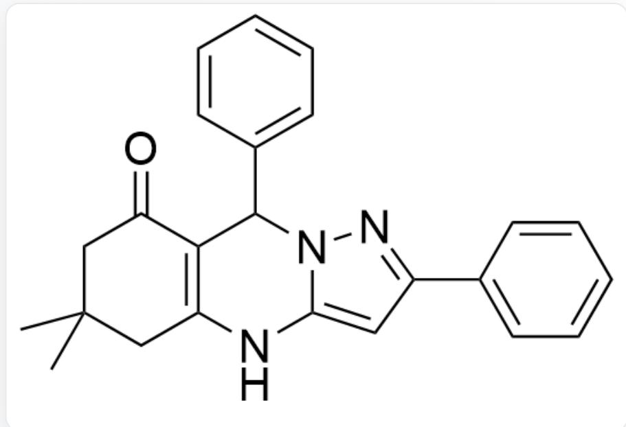
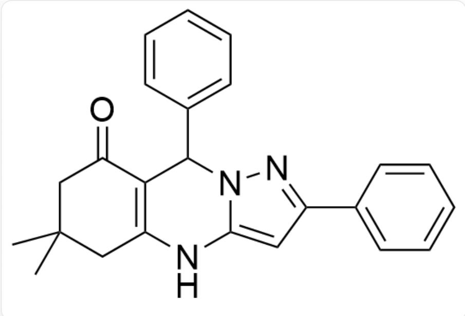
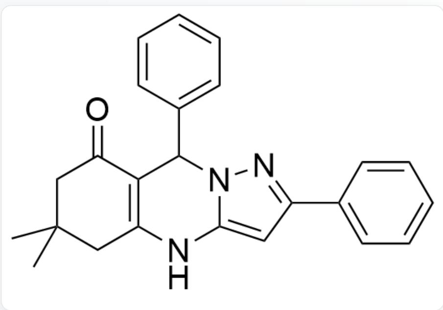
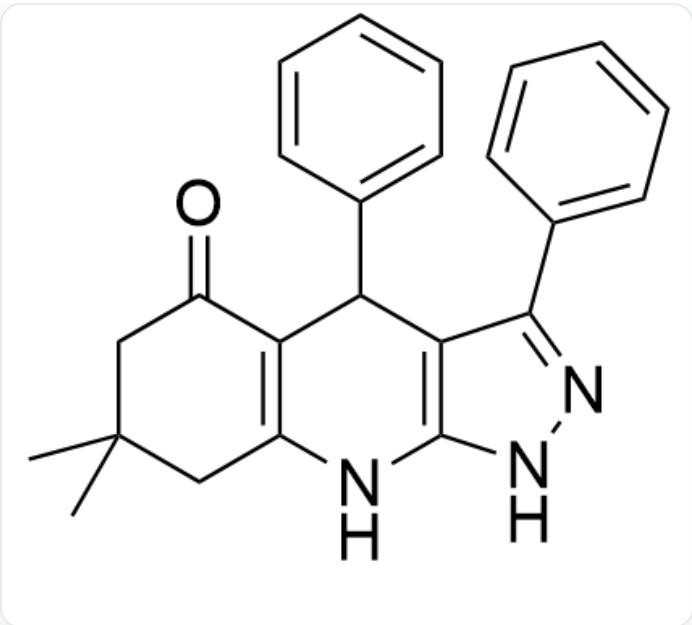
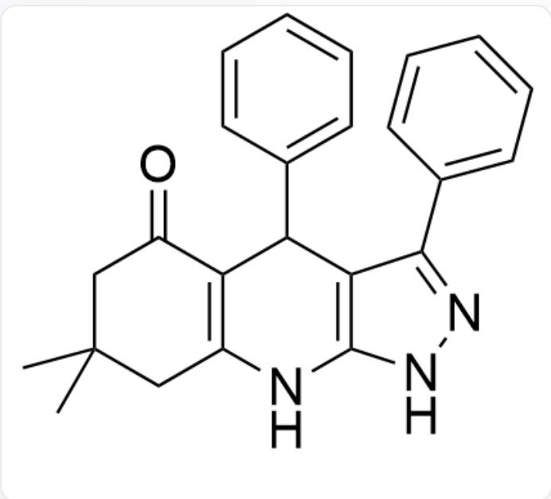
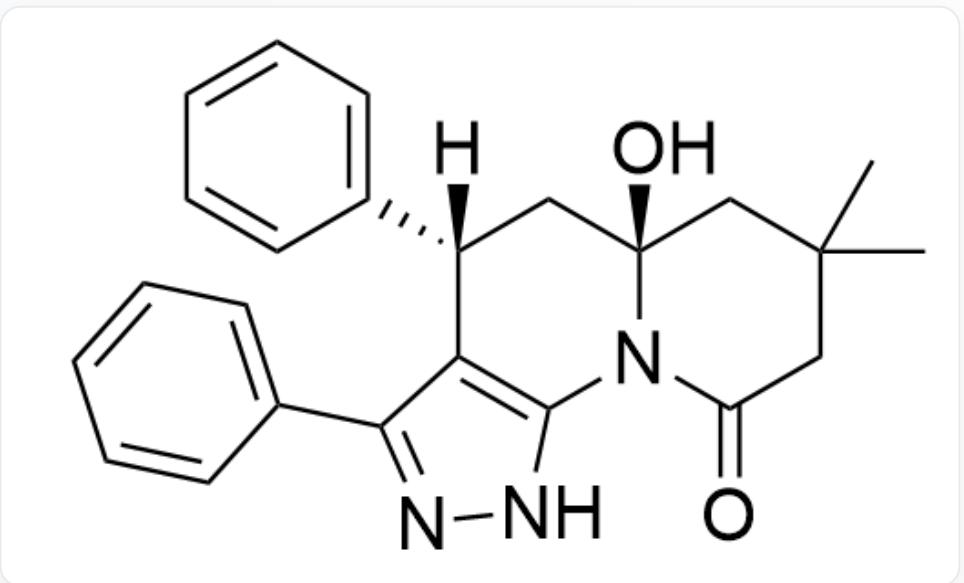
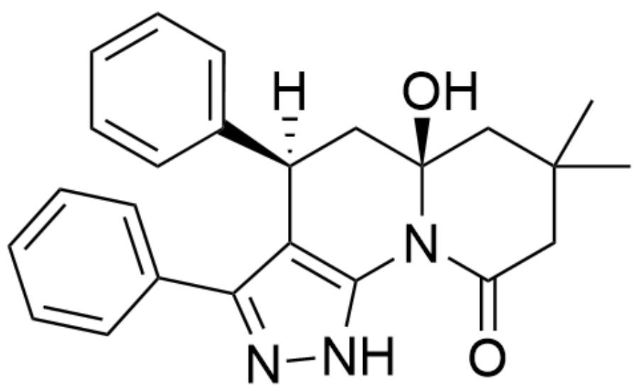
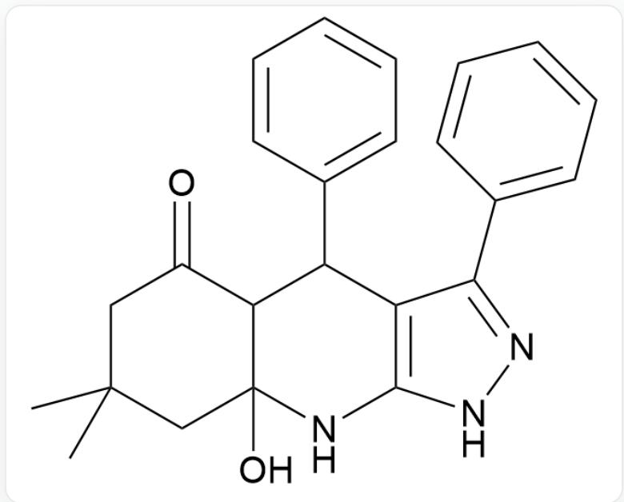

# 题目

微波催化是基于介电加热原理产生的独特热效应，可以导致反应速率的显著提升。

  
A.

NC1=CC(C2=CC=CC=C2)=NN1.O=C(C1=CC=CC=C1)[H].O=C1CC(C)(C)CC(C1)=O>EtOH,  $E t_{3}N$  MW,  $150^{\circ}\mathrm{C}, 15\mathrm{min}>\mathrm{B}$

请尝试预测上述反应的产物B，并指出该产物具有几种手性中心

  
B.

O=C1C2=C(NC3=CC(C4=CC=CC=C4)=NN3C2C5=CC=CC=C5)CC(C)(C)C1

有2个手性中心

C.  
  
O=C1C2=C(NC3=CC(C4=CC=CC=C4)=NN3C2C5=CC=CC=C5)CC(C)(C)C1

有1个手性中心

D.  
  
O=C1C2=C(NC3=CC(C4=CC=CC=C4)=NN3C2C5=CC=CC=C5)CC(C)(C)C1

有0个手性中心

E.  
  
O=C1C2=C(NC(NN=C3C4=CC=CC=C4)=C3C2C5=CC=CC=C5)CC(C)(C)C1

有2个手性中心

  
O=C1C2=C(NC(NN=C3C4=CC=CC=C4)=C3C2C5=CC=CC=C5)CC(C)(C)C1

有1个手性中心

F.  
  
$\mathrm{O = C1C2 = C(NC(NN = C3C4 = CC = CC = C4) = C3C2C5 = CC = CC = C5)CC(C)(C)C1}$

有0个手性中心

G.  
  
O=C1N2C3=C(C(C4=CC=CC=C4)=NN3)[C@]([H])(C5=CC=CC=C5)C[C@]2(O)CC(C)(C)C1

有2个手性中心

H.  
  
O=C1N2C3=C(C(C4=CC=CC=C4)=NN3)[C@]([H])(C5=CC=CC=C5)C[C@]2(O)CC(C)(C)C1

有1个手性中心

1.  
J.  
  
O=C1N2C3=C(C(C4=CC=CC=C4)=NN3)[C@]([H])(C5=CC=CC=C5)C[C@]2(O)CC(C)(C)C1

有0个手性中心

  
K.

O=C1N2C3=C(C(C4=CC=CC=C4)=NN3)[C@@]([H])(C5=CC=CC=C5)C[C@]2(O)CC(C)(C)C1

有2个手性中心

  
L.

O=C1N2C3=C(C(C4=CC=CC=C4)=NN3)[C@@]([H])(C5=CC=CC=C5)C[C@]2(O)CC(C)(C)C1

有1个手性中心

O=C1N2C3=C(C(C4=CC=CC=C4)=NN3)[C@@]([H])(C5=CC=CC=C5)C[C@]2(O)CC(C)(C)C1

有0个手性中心

# 答案

正确答案: E

# 详细解析

在加入三乙胺以及反应温度为  $150^{\circ} \mathrm{C}$  的条件下, 反应会得到热力学产物

# CHECKPOINT

1 PTS

反应会得到热力学产物

成环时生成碳碳单键比生成碳氮单键更具有热力学稳定性

# CHECKPOINT

1 PTS

成环时生成碳碳单键比生成碳氮单键更具有热力学稳定性

首先得到缩合反应中间体

O=C1C2C(NC(NN=C3C4=CC=CC=C4)=C3C2C5=CC=CC=C5)(O)CC(C)(C)C1

# CHECKPOINT

1 PTS

首先得到缩合反应中间体

O=C1C2C(NC(NN=C3C4=CC=CC=C4)=C3C2C5=CC=CC=C5)(O)CC(C)(C)C1

最后失去一分子水得到最终产物E

显然该产物只有1个手性中心