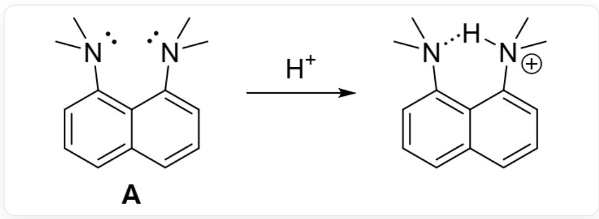
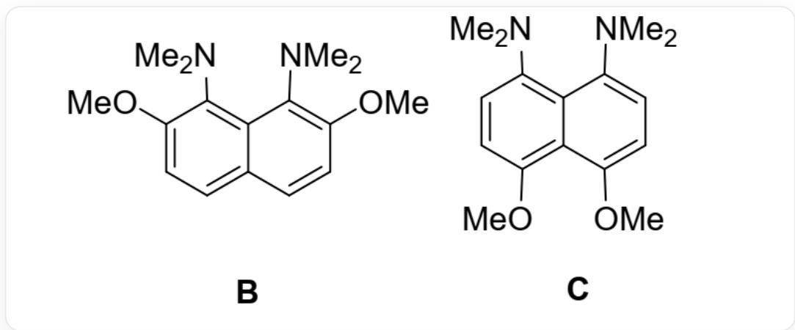

# Question

The following compound  $\mathbf{A}$  can alleviate the repulsion between lone pair electrons of nitrogen atoms when binding to a proton, and simultaneously form intramolecular hydrogen bonds. Therefore,  $\mathbf{A}$  has a strong basicity (the  $\mathrm{p}K_{\mathrm{a}}$  of its conjugate acid is 12.1), and is called a "proton sponge":

  
Fig 1: The SMILES code of this reaction is: CN(C)C1=CC=CC2=C1C(N(C)C)=CC=C2>

$$
[ H + ] > C N (C) C 3 = C C = C C 4 = C 3 C ([ N + ] (C) ([ H ]) C) = C C = C 4
$$

Further studies have found that the introduction of methoxy groups at the ortho position of dimethylamino can greatly enhance its basicity. For example, the  $\mathrm{pK}_{\mathrm{a}}$  of the conjugate acid of  $\mathbf{B}$  in the following compounds is 16.1, while the  $\mathrm{pK}_{\mathrm{a}}$  of the conjugate acid of  $\mathbf{C}$  is 13.9:

  
The SMILES code of B is: CN(C)C1=C(OC)C=CC2=C1C(N(C)C)=C(OC)C=C2, C is :

$$
C N (C) C 1 = C C = C (O C) C 2 = C 1 C (N (C) C) = C C = C 2 O C
$$

Which of the following statements are correct:

1. The nitrogen atom in  $\mathbf{B}$  is close to  $sp^2$  hybridization.  
2. The methoxy group has an electron-donating inductive effect, which increases the electron cloud density on the nitrogen atom, making the nitrogen atom easier to bind to a proton.  
3. In the comparison of the basicity of  $\mathbf{A}$  and  $\mathbf{B}$ , the electronic effect is a more important factor affecting the basicity of  $\mathbf{B}$  than the steric effect.  
4. The difference in basicity between  $\mathbf{B}$  and  $\mathbf{C}$  mainly comes from the steric hindrance effect provided by the methoxy group. The methoxy group and dimethylamino group are relatively crowded, resulting in the two dimethylamino groups of  $\mathbf{B}$  being closer, the repulsion of lone pair electrons on the nitrogen atom being greater, and the combination with a proton can alleviate more repulsion.

A. All other options are incorrect  
B. 1.  
C. 2.  
D. 3.  
E. 4.  
F.  $1 \cdot 2$ .  
G. 1:3.  
H.  $1 \cdot 4$ .

1. 2·3.  
J. 2·4.  
K.  $3 \div 4$ .  
L.  $1 \cdot 2 \cdot 3$ .  
M.  $1 \cdot 2 \cdot 4$ .  
N.  $1 \cdot 3 \cdot 4$ .  
O.  $2: 3: 4$ .  
P.  $1 \cdot 2 \cdot 3 \cdot 4$ .

# Answer

Correct Answer: H

# Detailed Explanation

The conjugate acid of compound A has a  $\mathrm{p}K_{\mathrm{a}} = 12.1$ , while the conjugate acid of C has a  $\mathrm{p}K_{\mathrm{a}} = 13.9$ .

The difference between the two arises from the para-methoxy group to the dimethylamino group. Since the para-methoxy group cannot produce steric hindrance to the dimethylamino group, the difference in  $\mathrm{p}K_{\mathrm{a}}$  of its conjugate acid is entirely due to the electron-donating resonance effect of the methoxy group, which is approximately 1.8 orders of magnitude in the  $\mathrm{p}K_{\mathrm{a}}$  of the conjugate acid.

# CHECKPOINT

1 PTS

The difference in basicity between A and C arises from the electron-donating resonance effect of the methoxy group.

For a conjugated system, adding one or a few double bonds does not significantly weaken the resonance effect of the substituent. Therefore, the electron-donating resonance effect of the methoxy group in  $\mathbf{B}$  and  $\mathbf{C}$  is somewhat reduced when it is in the para position compared to the ortho position, but the impact is not significant.

The conjugate acid of compound B has a  $\mathrm{p}K_{\mathrm{a}} = 16.1$ , while the conjugate acid of C has a  $\mathrm{p}K_{\mathrm{a}} = 13.9$ . Therefore, the difference in basicity between B and C can be largely attributed to the steric hindrance effect brought about by the ortho-methoxy group.

# CHECKPOINT

1 PTS

The position of the methoxy group, whether ortho or para, has little effect on the electron-donating resonance effect.

# CHECKPOINT

1 PTS

The difference in basicity between  $\mathbf{B}$  and  $\mathbf{C}$  can be largely attributed to the steric hindrance effect brought about by the ortho-methoxy group.

The methoxy group and the dimethylamino group are relatively crowded, resulting in the two dimethylamino groups of  $\mathbf{B}$  being closer to each other, and the repulsion of lone pair electrons on the nitrogen atom being greater, which can alleviate more repulsion when binding to a proton.

# CHECKPOINT

1 PTS

Binding a proton can alleviate more repulsion, 4 is correct.

At the same time, due to this repulsive effect, the two methyl groups of the dimethylamino group, when the nitrogen atom adopts  $sp^3$  hybridization, will be repelled by the ortho substituent or another dimethylamino group regardless of the conformation. Therefore, in this case, it will tend to  $sp^2$  hybridization to some extent.

# CHECKPOINT

1 PTS

When the nitrogen atom adopts  $sp^3$  hybridization, the two methyl groups of the dimethylamino group will be repelled by the ortho substituent or another dimethylamino group. 1 is correct.

Methoxy group has an electron-donating resonance effect. Among them, oxygen has an electron-withdrawing inductive effect due to its large electronegativity, but the overall electron-donating resonance is greater than the electron-withdrawing inductive effect and dominates.

# CHECKPOINT

1 PTS

The electron-donating resonance effect of the methoxy group is greater than the electron-withdrawing inductive effect, 2 is incorrect.

Returning to the comparison of  $\mathbf{A}$  and  $\mathbf{B}$ , it is not difficult to know that the magnitude of the effect of the electron-donating resonance effect on the conjugate acid  $\mathrm{p}K_{\mathrm{a}}$  is slightly greater than 1.8, and the rest are the effects of steric hindrance. Therefore, the steric hindrance effect is greater than the electronic effect.

# CHECKPOINT

1 PTS

The steric hindrance effect is greater than the electronic effect, 3 is incorrect.

In summary, the answers are 1, 4.