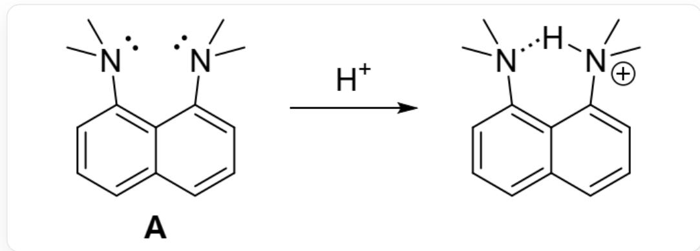
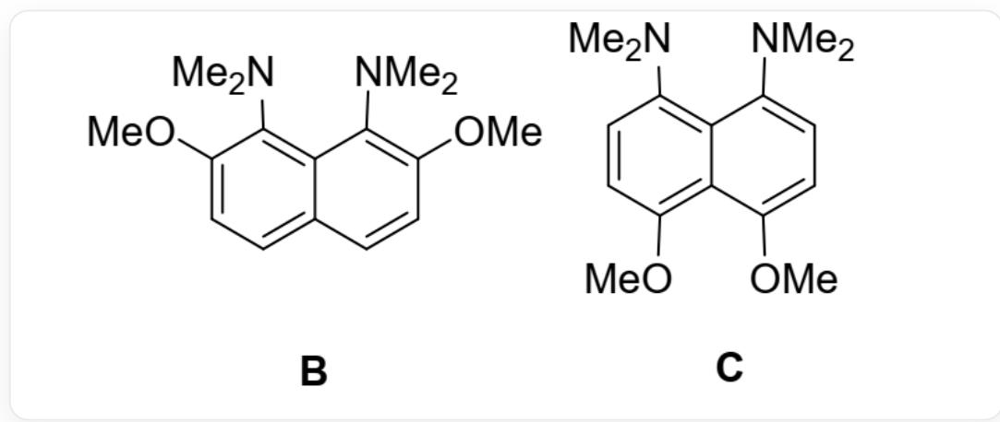

# 题目

以下化合物 A 结合质子时能够缓解氮原子孤对电子之间的排斥力, 同时形成分子内氢键, 因此 A 具有很强的碱性(其共轭酸的  $\mathrm{p} K_{\mathrm{a}} = 12.1$  ), 被称为 “质子海绵”:

  
Fig 1: 该反应的SMILES编码为：CN(C)C1=CC=CC2=C1C(N(C)C)=CC=C2> [H+]>CN(C)C3=CC=CC4=C3C([N+](C)([H])C)=CC=C4

进一步研究发现，在二甲氨基邻位引入甲氧基能使得其碱性大大增强，如以下化合物中B的共轭酸的  $\mathrm{pK_{a}} = 16.1$  ，而C的共轭酸的  $\mathrm{pK_{a}} = 13.9$  ：

  
B 的SMILES编码为：CN(C)C1=C(OC)C=CC2=C1C(N(C)C)=C(OC)C=C2，C为：CN(C)C1=CC=C(OC)C2=C1C(N(C)C)=CC=C2OC

下列说法正确的有：

1.B中的氮原子接近于  $sp^2$  杂化。  
2.甲氧基具有给电子诱导效应，增大了氮原子上的电子云密度，使得氮原子更易结合质子。

3. A、B 碱性对比而言，电子效应是比空间效应更主要的影响 B 碱性的因素。  
4. B、C 碱性差异主要来源于甲氧基提供的位阻效应，甲氧基与二甲氨基之间较为拥挤,导致 B 的两个二甲氨基距离更近,氮原子上孤对电子排斥力更大,结合质子能缓解更多的排斥力。

A. 其他选项均不正确  
B. 1.  
C. 2.  
D. 3.  
E. 4.

F. 1、2.  
G. 1、3.  
H. 1、4.  
1. 2、3.  
J. 2、4.

K. 3、4.  
L. 1、2、3.  
M. 1、2、4.  
N. 1、3、4.  
O. 2、3、4.  
P. 1、2、3、4.

# 答案

正确答案: H

# 详细解析

化合物A

的共轭酸的  $\mathrm{p}K_{\mathrm{a}} = 12.1$  ，而C的共轭酸的  $\mathrm{p}K_{\mathrm{a}} = 13.9$

二者的差异来源于二甲氨基对位的甲氧基。而对位甲氧基无法对二甲氨基产生位阻效应，故其共轭酸的  $\mathrm{pK}_{\mathrm{a}}$  差异完全由甲氧基的给电子共轭效应给出，大概对共轭酸  $\mathrm{pK}_{\mathrm{a}}$  的影响是1.8个数量级。

# CHECKPOINT

1 PTS

A、C碱性差异来源于甲氧基给电子共轭效应。

对于共轭体系而言，增加一个或少数几个双键对于取代基的共轭效应削弱影响不大，故B、C中甲氧基位于对位相较于位于邻位，给电子共轭效应有所减小但影响不大。

化合物B

的共轭酸的  $\mathrm{pK}_{\mathrm{a}} = 16.1$  ，而C的共轭酸的  $\mathrm{pK}_{\mathrm{a}} = 13.9$  .故B、C碱性差异可基本归结于邻位甲氧基带来的位阻效应。

# CHECKPOINT

1 PTS

甲氧基处于邻位或对位对于给电子共轭效应影响不大

# CHECKPOINT

1 PTS

B、C碱性差异可基本归结于邻位甲氧基带来的位阻效应。

甲氧基与二甲氨基之间较为拥挤,导致B的两个二甲氨基距离更近,氮原子上孤对电子排斥力更大,结合质子能缓解更多的排斥力。

# CHECKPOINT

1 PTS

结合质子能缓解更多的排斥力，4 正确。

同时，由于该排斥作用，导致二甲氨基的两个甲基在氮原子采取  $sp^3$  杂化时，不管处于怎样的构象都会与邻位取代基或另一个二甲氨基有所排斥，故在此情况下，会一定偏向于  $sp^2$  杂化。

# CHECKPOINT

1 PTS

氮原子采取  $sp^3$  杂化时，二甲氨基的两个甲基会与邻位取代基或另一个二甲氨基有所排斥。1 正确。

甲氧基为给电子共轭效应，其中氧由于电负性大，具有吸电子诱导效应，但总体给电子共轭大于吸电子诱导效应，占主导。

# CHECKPOINT

1 PTS

甲氧基给电子共轭大于吸电子诱导效应，2 错误。

再次回到A、B的比较，不难知道给电子共轭效应对共轭酸  $\mathrm{p}K_{\mathrm{a}}$  的影响的量级略大于1.8，剩下均为位阻效应的影响，故位阻效应大于电子效应。

# CHECKPOINT

1 PTS

位阻效应大于电子效应，3 错误。

综上，答案为1、4