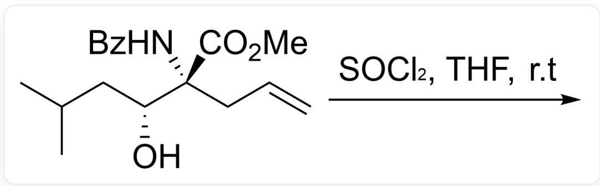
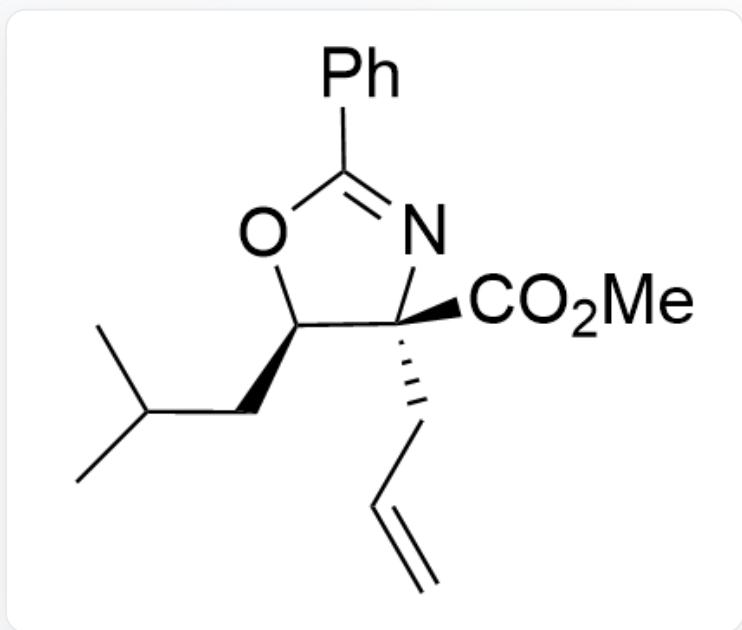
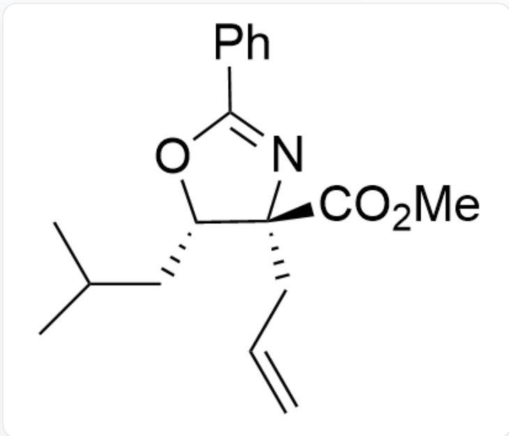
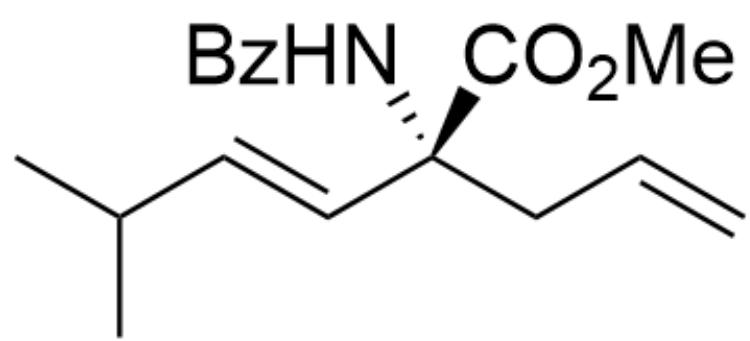
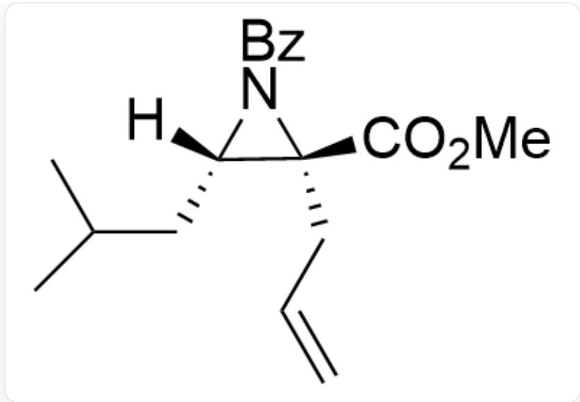
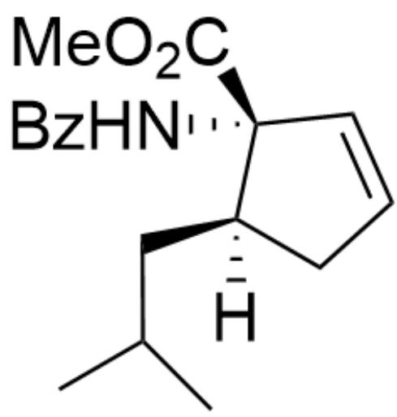
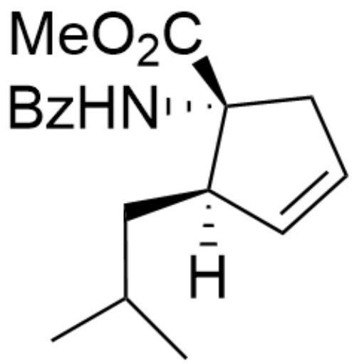

# Question

The main product of the following reaction is:

A.  
  
CC(C)C[C@@H](O)[C@@](NC(C1=CC=CC=C1)=O)(C(OC)=O)CC=C reacts with  $SOCl_2$  in THF solvent at room temperature

Several options are given showing the structures of reaction substrates and the absolute configurations of carbon atoms. Select the correct one.

  
C=CC[C@]1(C(OC)=O)[C@@H](CC(C)C)OC(C2=CC=CC=C2)=N1

The carbon connected to O is in the R configuration, and the carbon connected to N is in the R configuration.

B.  
  
C=CC[C@]1(C(OC)=O)[C@H](CC(C)C)OC(C2=CC=CC=C2)=N1

The carbon connected to O is in the S configuration, and the carbon connected to N is in the R configuration.

C.  
D.  
  
CC(C)/C=C/[C@@](NC(C1=CC=CC=C1)=O)(C(OC)=O)CC=C

The carbon is of R configuration

$\mathrm{C = CC[C@]1(C(OC) = O)[C@@]([H])(N1C(C2 = CC = CC = C2) = O)CC(C)C}$

The carbon bonded to the hydrogen atom has an S configuration, while the other carbon has an R configuration.

# E.

CC(C)C[C@]1([H])CC=C[C@]1(NC(C2=CC=CC=C2)=O)C(OC)=O

The carbon connected to the nitrogen atom is in the R configuration, and the carbon connected to the hydrogen atom is in the R configuration

  
F.

CC(C)C[C@]1([H])C=CC[C@]1(NC(C2=CC=CC=C2)=O)C(OC)=O

The carbon bonded to the nitrogen atom has an R configuration, and the carbon bonded to the hydrogen atom has an R configuration.

# Answer

Correct Answer: B

# Detailed Explanation

$SOCl_2$  as a dehydrating agent first reacts with the hydroxyl group to form a chlorosulfite ester intermediate

  
CC(C)C[C@@H](OS(Cl)=O)[C@@](NC(C1=CC=CC=C1)=O)(C(OC)=O)CC=C

# CHECKPOINT

1 PTS

$SOCl_2$  as a dehydrating agent first reacts with the hydroxyl group to form a chlorosulfite ester intermediate

The formation of a five-membered ring is more favorable than a three-membered ring. The oxygen atom in the amide group can act as a nucleophile to attack the adjacent carbon atom, undergoing a nucleophilic substitution reaction and eliminating a molecule of  $SO_2$  to form a five-membered ring structure.

# CHECKPOINT

1 PTS

The oxygen atom in the amide group can act as a nucleophile to attack the adjacent carbon atom, undergoing a nucleophilic substitution reaction and eliminating a molecule of  $SO_2$  to form a five-membered ring structure

The carbon atom bonded to oxygen undergoes inversion of configuration during the reaction.

# CHECKPOINT

1 PTS

The carbon atom bonded to oxygen undergoes inversion of configuration during the reaction