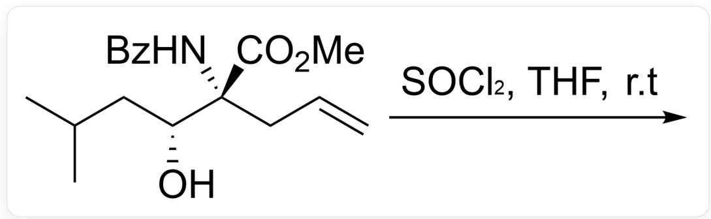
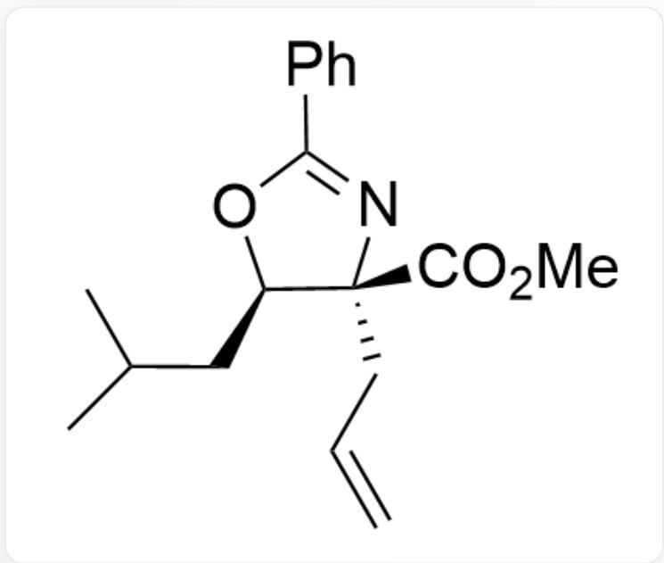
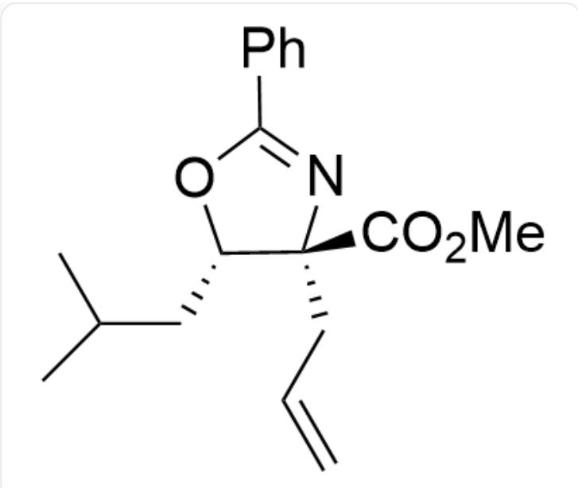
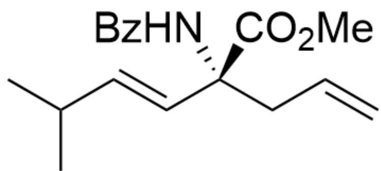
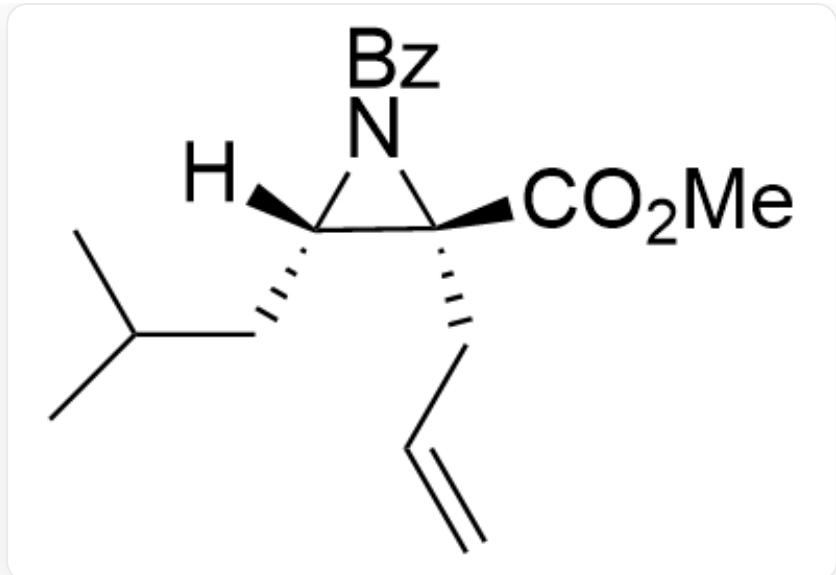
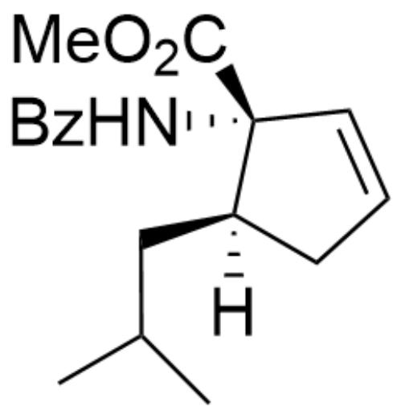
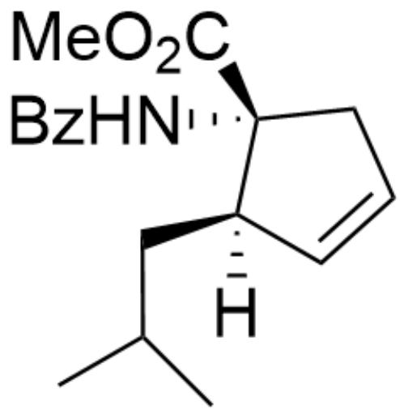
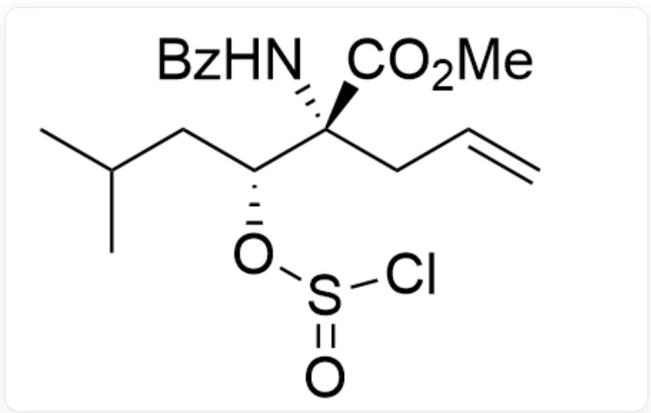

# 题目

下列反应的主产物为：

A.  
  
CC(C)C[C@@H](O)[C@@](NC(C1=CC=CC=C1)=O)(C(OC)=O)CC=C在THF溶剂中与SOCl2在室温下发生反应

选项给出了几个反应底物的结构和碳原子绝对构型，选择正确的一项。

B.  
  
C=CC[C@]1(C(OC)=O)[C@@H](CC(C)C)OC(C2=CC=CC=C2)=N1

与氧原子相连的碳是R构型,与氮原子相连的碳是R构型

  
C.

$$
C = C C [ C @ ] 1 (C (O C) = O) [ C @ H ] (C C (C) C) O C (C 2 = C C = C C = C 2) = N 1
$$

与氧原子相连的碳是S构型,与氮原子相连的碳是R构型

  
D.

$$
C C (C) / C = C / [ C @ @ ] (N C (C 1 = C C = C C = C 1) = O) (C (O C) = O) C C = C
$$

碳是R构型

  
E.

$\mathrm{C = CC[C@]1(C(OC) = O)[C@@]([H])(N1C(C2 = CC = CC = C2) = O)CC(C)C}$

与氢原子相连的碳是S构型,另一个碳是R构型

  
F.

CC(C)C[C@]1([H])CC=C[C@]1(NC(C2=CC=CC=C2)=O)C(OC)=O

与氮原子相连的碳是R构型,与氢原子相连的碳是R构型

CC(C)C[C@]1([H])C=CC[C@]1(NC(C2=CC=CC=C2)=O)C(OC)=O

与氮原子相连的碳是R构型,与氢原子相连的碳是R构型

# 答案

正确答案: B

# 详细解析

$S O C l_{2}$  作为脱水剂首先与羟基反应, 形成氯代亚硫酸酯中间体

  
CC(C)C[C@@H](OS(Cl)=O)[C@@](NC(C1=CC=CC=C1)=O)(C(OC)=O)CC=C

# CHECKPOINT

1 PTS

$SOCl_{2}$  作为脱水剂首先与羟基反应，形成氯代亚硫酸酯中间体

形成五元环比三元环更有利，酰胺基团中的氧原子可以作为亲核试剂攻击邻近的碳原子发生亲核取代反应，脱去一分子  $SO_2$  形成五元环结构

# CHECKPOINT

1 PTS

酰胺基团中的氧原子可以作为亲核试剂攻击邻近的碳原子发生亲核取代反应，脱去一分子  $SO_2$  形成五元环结构

反应过程中与氧相连的碳原子会发生构型翻转

# CHECKPOINT

1 PTS

反应过程中与氧相连的碳原子会发生构型翻转