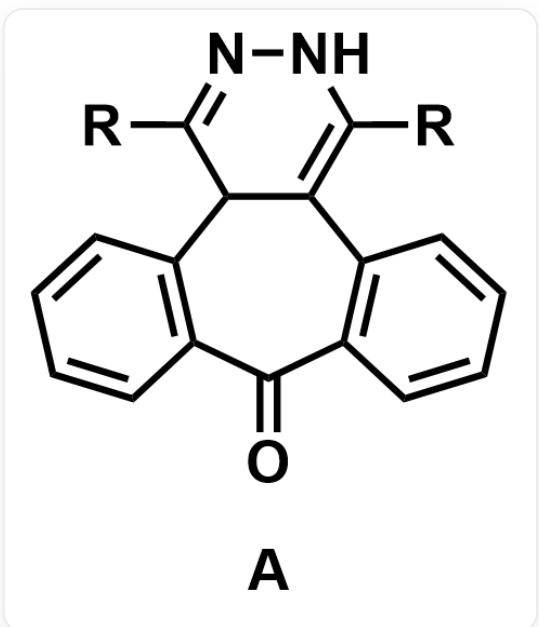
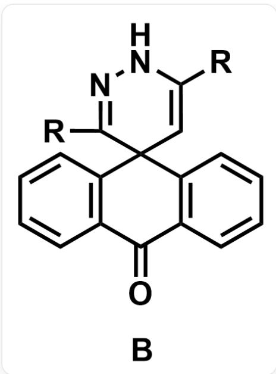
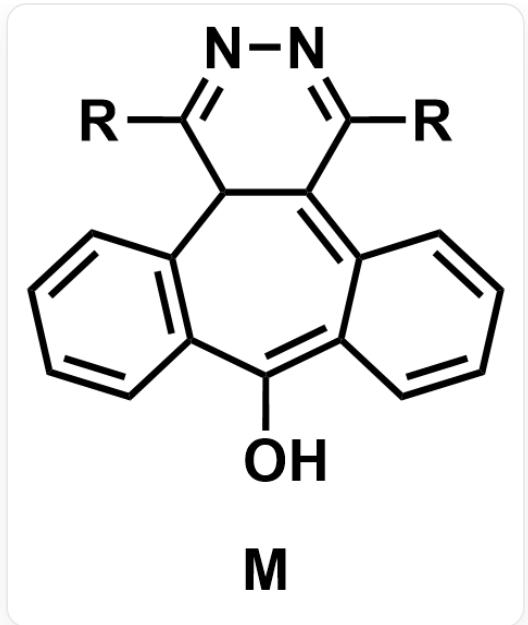
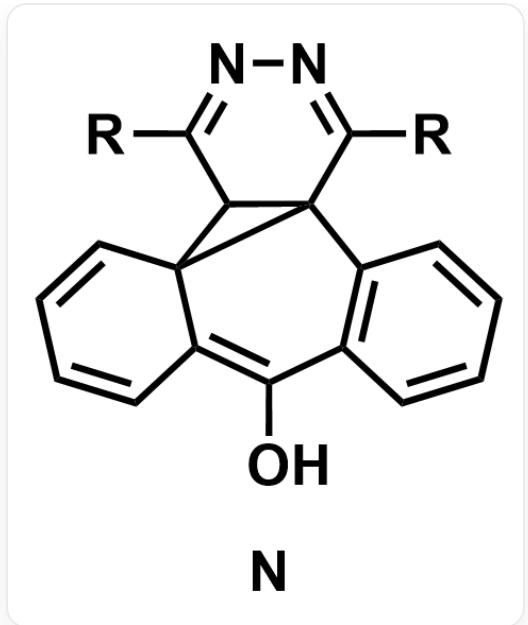

# Question

The following two substances can interconvert under certain conditions. A can be converted to B under condition X, and B can be converted to A under condition Y. Conditions X, Y are one of (a) heating or visible light irradiation; (b) ultraviolet light irradiation. The transformation from A to B has two intermediates, successively M, N, one of which contains a three-membered ring.

[R]C1=NNC([R])=C2C1C(C=CC=C3)=C3C(C4=C2C=CC=C4)=O, substance code is A

$\mathrm{O = C1C2 = C(C = CC = C2)C3(C = C([R])NN = C3[R])C4 = C1C = CC = C4}$  , substance code is  $\mathbf{B}$

The following statements are made:

1. The one containing a three-membered ring among  $\mathbf{M},\mathbf{N}$  is  $\mathbf{N}$ .  
2. At least one of  $\mathbf{M},\mathbf{N}$  contains a  $\mathbf{N} - \mathbf{H}$  bond.  
3. Condition  $\mathbf{X}$  is (a), and condition  $\mathbf{Y}$  is (b).

Select all the correct statements.

A. 1,2,3  
B. 1,2  
C. 1,3  
D. 2,3

E. 1  
F. 2  
G. 3  
H. All other statements are incorrect.

# Answer

Correct Answer: C

# Detailed Explanation

The conjugation range of  $\mathbf{A}$  is larger than that of  $\mathbf{B}$ , and the LUMO-HOMO energy gap of  $\mathbf{A}$  is smaller than that of  $\mathbf{B}$ , absorbing light with a longer wavelength. Therefore, condition  $\mathbf{X}$  is (a) heating or visible light irradiation, and condition  $\mathbf{Y}$  is (b) ultraviolet light irradiation. Statement 3 is correct.

# CHECKPOINT

1 PTS

The conjugation range of  $\mathbf{A}$  is larger than that of  $\mathbf{B}$

# CHECKPOINT

1 PTS

Condition  $\mathbf{X}$  is (a), condition  $\mathbf{Y}$  is (b)

A to B undergoes two intermediates M, N. If M contains a three-membered ring, the three-membered ring of M will open directly to obtain B in the next step, and there will be no other intermediate. In addition, the direct formation of a three-membered ring from A requires enamine to attack the carbonyl-linked aromatic ring. The nucleophilicity and electrophilicity of the two are not strong, and it is difficult to occur under heating or visible light irradiation. Therefore, the first step of the reaction from A to B is to prepare a suitable structure for the formation of a three-membered ring.

According to this idea, it can be deduced that under the electron-donating and electron-withdrawing effects of enamine and ketone, A tautomerizes to form  $\mathbf{M}$ , and the structure is as follows.

[R]C1=NN=C([R])C2=C3C(C=CC=C3)=C(O)C4=C(C=CC=C4)C12，物质代号为M

# CHECKPOINT

1 PTS

Under the electron-donating and electron-withdrawing effects of enamine and ketone, A tautomerizes to form M

$\mathbf{M}$  to  $\mathbf{N}$  undergoes  $6\pi$  electrocyclization, changing the seven-membered ring into a hexa-fused structure, and the structure of  $\mathbf{N}$  is as follows.

[R]C1=NN=C([R])C23C1C(C=CC=C4)2C4=C(O)C5=C3C=CC=C5，物质代号为N

# CHECKPOINT

1 PTS

$\mathbf{M}$  to  $\mathbf{N}$  undergoes  $6\pi$  electrocyclization

Under the electron-donating and electron-withdrawing effects of enol and imine,  $\mathbf{N}$  tautomerizes to form B.

# CHECKPOINT

1 PTS

Under the electron-donating and electron-withdrawing effects of enol and imine,  $\mathbf{N}$  tautomerizes to form  $\mathbf{B}$

Therefore,  $\mathbf{N}$  contains a three-membered ring in  $\mathbf{M},\mathbf{N}$ , and statement 1 is correct. Both  $\mathbf{M},\mathbf{N}$  have an azo structure and no  $\mathbf{N} - \mathbf{H}$  bond, statement 2 is wrong.

# CHECKPOINT

1 PTS

$\mathbf{N}$  contains a three-membered ring,  $\mathbf{M}$  does not contain a three-membered ring

# CHECKPOINT

1 PTS

Neither M nor N contains an  $\mathbf{N} - \mathbf{H}$  bond

In summary, the correct statements are 1 and 3, and the answer is option C.